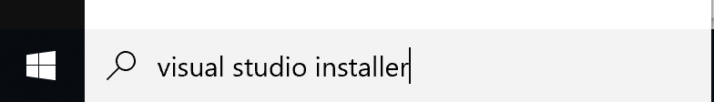
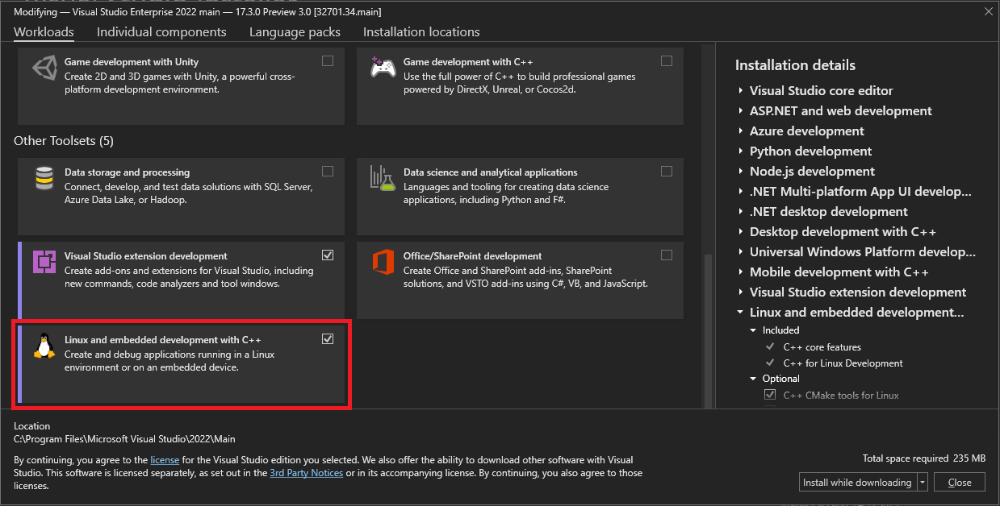
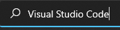
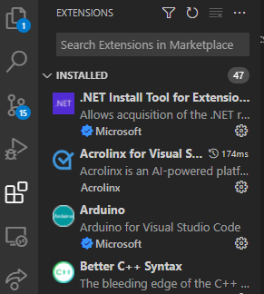
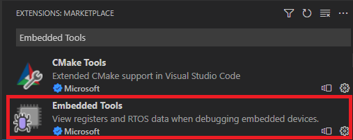
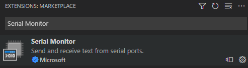

# Download and install the Embedded tooling

# [Visual Studio](#tab/visual-studio)

In Visual Studio 2022 and later versions, you can use the Visual Studio IDE on Windows to edit and debug embedded projects. Use tools such as the [Peripheral View](./peripheral-view.md), [RTOS View](./rtos-view.md), and the [Serial Monitor](./serial-monitor.md) to help interact with and debug your embedded projects.

To use the embedded development tools in Visual Studio, you must install the required **Linux and embedded development with C++** workload.

## To install the Linux and embedded development with C++ workload

1. Enter "Visual Studio Installer" in the Windows search box:

   

1. Open the Visual Studio Installer. In Visual Studio Installer, choose **Modify** next to your installation of Visual Studio, and then select the **Workloads** tab. Scroll down to **Other toolsets** and select the **Linux and embedded development with C++** workload.

   

1. Choose **Modify** to continue with the installation.

When installation completes, you're ready to use Visual Studio for embedded development.

# [Visual Studio Code](#tab/visual-studio-code)

## Install the Embedded extensions in Visual Studio Code

Microsoft provides an extension to Visual Studio Code that lets you use embedded tools such as a [Peripheral View](./peripheral-view.md), [RTOS View](./rtos-view.md), and a [Serial Monitor](./serial-monitor.md). Now you can use Microsoft tools to help debug your Linux-based embedded applications.

## To install the embedded extensions for Visual Studio Code

1. Enter "Visual Studio Code" in the Windows search box:

    

1. Open Visual Studio Code. In Visual Studio Code, open the **Extensions Pane**.

    

1. Search for and install the [Embedded Tools](https://marketplace.visualstudio.com/items?itemName=ms-vscode.vscode-embedded-tools) extension.

    

1. Search for and install the [Serial Monitor](https://marketplace.visualstudio.com/items?itemName=ms-vscode.vscode-serial-monitor) extension.

    

When installation completes, you're ready to use Visual Studio Code for embedded development.

---
