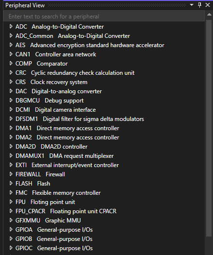
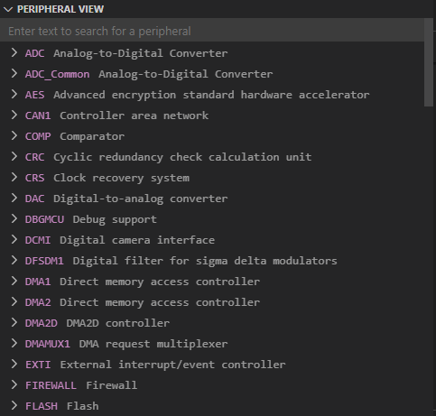

# Peripheral View

## Overview

The Peripheral View allows embedded developers to view and manipulate registers and peripherals defined in SVD (System View Description) files while debugging.

# [Visual Studio](#tab/visual-studio)

# [Visual Studio Code](#tab/visual-studio-code)

---

## Capabilities

| Capability | Description | Instructions | Keyboard shortcuts |
|--|--|--|--|
| Navigate peripherals | Navigate the peripheral tree view by collapsing and expanding components in the tree view. | Scroll to view all of the peripherals. Select the caret on each item to expand or collapse the view. | Use the **Up** or **Down** arrow keys to scroll. Use the **Left** and **Right** arrow keys to expand or collapse the view. |
| Edit peripheral values | Modify writeable peripheral values. | Select the peripheral value to edit. Use the **Enter** key to submit that value. | Use the **F2** key to edit, **Esc** to cancel editing, and **Enter** to submit edits. |
| Access memory | View the memory locations of peripherals. | Select the linked memory addresses to view. | Use **Tab** to select the link, and **Enter** to navigate to the link. |
| Pin peripherals | Pin important peripherals to the top of the view. | Select the pin icon to pin or unpin peripherals. | Use **Tab** to select the pin icon, and **Enter** to pin or unpin it. |
| Search for peripherals | Search for peripherals that you have specific interest in | Type text into the search bar. | See **Instructions** column. |
