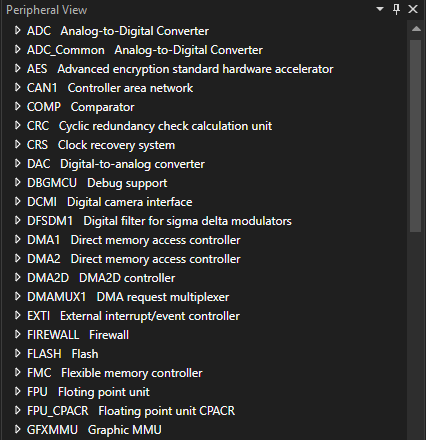
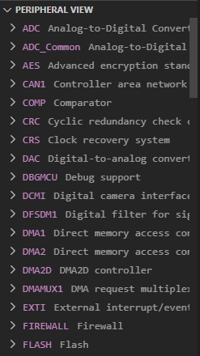

# Peripheral View

## Overview

The Peripheral View allows embedded developers to view and manipulate registers and peripherals defined SVD (System View Description) files.

# [Visual Studio](#tab/visual-studio)

# [Visual Studio Code](#tab/visual-studio-code)

---

## Capabilities

|Capabilities|Description|Instructions|Keyboard shortcuts|
|:-:|:-:|:-:|:-:|
|Navigation|Navigate the peripheral tree view by collapsing and expanding components in the tree view|Scroll to view all of the peripherals. Press the caret on each item to expand or collapses|Arrow-Up/Arrow-Down to scroll. Arrow-Left/Arrow-Right to expand/collapse.
|Editing|Modify writeable peripheral values|Double click on the peripheral value to edit and press Enter to submit that value|F2 to edit. Esc to cancel editing. Enter to submit edits.|
|Accessing memory|View the memory locations of peripherals|Click on the linked memory addresses|Tab to the link, Enter to navigate to the link.|
|Pinning|Pin important peripherals to the top of the view|Click the pin icon to pin or unpin peripherals|Tab to the pin icon, Enter to pin/unpin|
