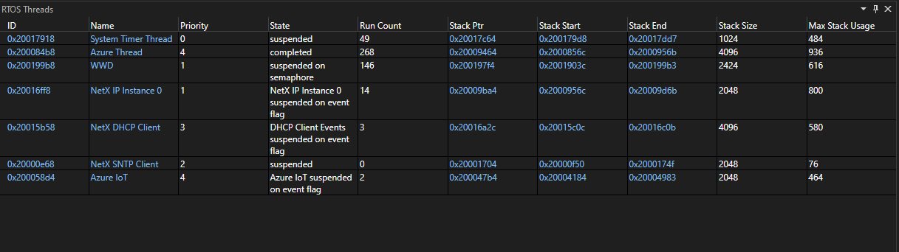
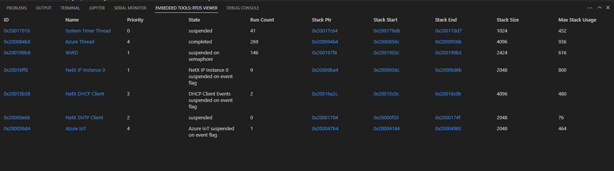

# RTOS (Real time operating system) Object View

## Overview

The RTOS Object View allows users to view various components of an RTOS while debugging their application.

# [Visual Studio](#tab/visual-studio)

# [Visual Studio Code](#tab/visual-studio-code)

---

## Supported RTOSes and their supported object types

- Azure RTOS (ThreadX)
  - Block pools
  - Byte pools
  - Event flags
  - Mutexes
  - Queues
  - Semaphores
  - Threads
  - Timers
- FreeRTOS
  - Queues
  - Threads
- Zephyr
  - Mailboxes
  - Memory slabs
  - Message queues
  - Mutexes
  - Pipes
  - Queues
  - Semaphores
  - Stacks
  - Threads
  - Timers

## Usage

Use the RTOS Object View to:

- Access memory locations of various objects.
- Access thread variables or various objects in the Watch view.

Use the arrow keys to select objects within the view. Use the **Enter** key to navigate to the linked content.

## Configuring an embedded application for the RTOS view

The RTOS Object View will attempt to automatically display information, but setting certain build flags can allow the RTOS Object View to display additional details. The build flags are specific to the RTOS being used. The exact mechanism used to set these flags varies depending on the build system used by the project. Consult your RTOS and build system documentation for more details.

### Azure RTOS (ThreadX)

All features should work by default.

### FreeRTOS

- Thread base priority is only available if `configUSE_MUTEXES` is enabled.
- Thread run count is only available if `configGENERATE_RUN_TIME_STATS` is enabled.
- The end address of a thread's stack space is only available if `portSTACK_GROWTH` or `configRECORD_STACK_HIGH_ADDRESS` are enabled.
- The thread list will be retrieved faster if `configMAX_PRIORITIES` is set to the lowest possible value that still satisfies the application's requirements.

### Zephyr

- All thread information is only available if `CONFIG_DEBUG_THREAD_INFO` is enabled.
- Thread stack usage is only availabe if `CONFIG_INIT_STACKS` and `CONFIG_THREAD_STACK_INFO` are enabled.
- For all object types other than threads, information is only available if `CONFIG_TRACING` and `CONFIG_TRACING_OBJECT_TRACKING` are enabled.
- The maximum usage of a memory slab is only available if `CONFIG_MEM_SLAB_TRACE_MAX_UTILIZATION` is enabled.
- The list of threads waiting on an object is only available if `CONFIG_WAITQ_SCALABLE` is disabled.
