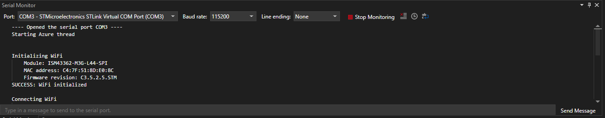

# Serial Monitor

## Overview

The Serial Monitor allows users to configure, monitor, and communicate with serial ports.

# [Visual Studio](#tab/visual-studio)

# [Visual Studio Code](#tab/visual-studio-code)

---

## Capabilities

- `Monitor a serial port`: Press the "Start Monitoring" or "Stop Monitoring button to begin monitoring data coming from the port.
- `Send data to a serial port`: Input text into the text field at the bottom of the view. Press Enter or the "Send Message" button to send the data.
- `Clear the Serial Monitor output`: Press the clear output button to clear the incoming data text field.
- `Configure Serial Monitor and port connection settings`: See the following table to learn about the settings that the Serial Monitor provides.

## Configurable settings

|Settings|Description|Usage|Available options|
|:------:|:---------:|:-:|:-:|
|Port|Ports that are actively connected to a device|Use the `Port` dropdown|Serial port compatible devices connected to the machine|
|Baud Rate|Frequency at which the monitor will attempt to communicate with the connected device|Use the `Baud Rate` dropdown|300, 1200, 2400, 4800, 9600, 19200, 38400, 57600, 74880, 115200, 230000, 250000|
|Line ending|Appended line ending on messages sent to the connected device|Use the `Line Ending` dropdown|None, LF, CR, CRLF|
|Timestamp|Ability to add timestamps to the output of data received from the connected port|Use the `timestamp` toggle button|On/Off|
|Auto-scrolling|Ability to "auto-scroll" with new content coming from the connected port|Use the `auto-scroll` toggle button|On/Off|
