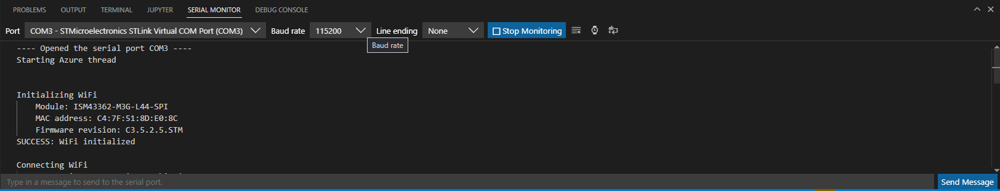

# Serial Monitor

## Overview

The Serial Monitor allows users to configure, monitor, and communicate with serial ports.

# [Visual Studio](#tab/visual-studio)

## Capabilities

- **Monitor a serial port**: Choose the **Start Monitoring** or **Stop Monitoring** button to control whether to monitor data coming from the port.
- **Send data to a serial port**: Enter text into the text field at the bottom of the view. Use the **Enter** key or choose the **Send Message** arrow button to send the data.
- **Clear the Serial Monitor output**: Choose the **Clear Output** button to clear the incoming data text field.
- **Send preset control signals**: Use the split-button next to the input field to send preset control signals (Ctrl+C, Ctrl+D, Ctrl+X, and Ctrl+Z).
- **Configure Serial Monitor and port connection settings**: See the following table to learn about the settings that the Serial Monitor provides.

## Configurable settings

| Settings | Description | Usage | Available options |
|--|--|--|--|
| **Port** | Ports that are actively connected to a device | Use the **Port** dropdown | Serial port compatible devices connected to the machine |
| **Baud Rate** | Frequency at which the monitor attempts to communicate with the connected device | Use the **Baud Rate** dropdown | 300, 1200, 2400, 4800, 9600, 19200, 38400, 57600, 74880, 115200, 230000, 250000 |
| **Line Ending** | The line ending to use in messages sent to the connected device | Use the **Line Ending** dropdown | None, LF, CR, CRLF |
| **Timestamp** | Adds timestamps to the output of data received from the connected port | Use the **timestamp** toggle button | On/Off |
| **Autoscroll** | Whether to auto-scroll new content that comes from the connected port | Use the **autoscroll** toggle button | On/Off |
| **Automatic Reconnection** | Allows for automatic reconnection and monitoring of disconnected selected ports | Use the **automatic reconnection** toggle button in **Serial** mode | On/Off |
| **Message Encoding** | Can select type of encoding for messages sent to serial port | Use the **message encoding** dropdown in **Serial** mode | Text (utf8), Hex, Binary |
| **Data bits** | Can select how many data bits are used for the serial port connection | Use the **Data bits** dropdown in the **additional settings** | 5, 6, 7, 8 |
| **Stop bits** | Can select how many stop bits are used for the serial port connection | Use the **Stop bits** dropdown in the **additional settings** | 1, 1.5, 2 |
| **Parity** | Can select what parity is used for the serial port connection | Use the **Parity** dropdown in the **additional settings** | None, Odd, Even, Mark, Space |
| **File Logging** | Allows the ability to log output to a file | Use the **file logging** toggle button, as well as the **Choose Log File Directory** button to choose the desired directory in the **additional settings** | On/Off |

# [Visual Studio Code](#tab/visual-studio-code)

## Capabilities

- **Toggle the serial monitor mode**: Choose **Serial** or **TCP** from the **Monitor Mode** dropdown.
- **Monitor a serial/tcp port**: Choose the **Start Monitoring** or **Stop Monitoring** button to control whether to monitor data coming from the port.
- **Monitor multiple serial/tcp ports at a time**: Press the **Open an additional Monitor** button to open another monitor.
- **Send data to a serial/tcp port**: Enter text into the text field at the bottom of the view. Use the **Enter** key or choose the **Send Message** arrow button to send the data. When sending hex or binary data, bytes are automatically separated by spaces.
- **Clear the Serial Monitor output**: Choose the **Clear Output** button to clear the incoming data text field.
- **Send preset control signals**: Use the split-button next to the input field to send preset control signals (Ctrl+C, Ctrl+D, Ctrl+X, and Ctrl+Z).
- **Configure Serial Monitor and connection settings**: See the following table to learn about the settings that the Serial Monitor provides.
- **Clear the Serial Monitor output**: Choose the **Clear Output** button to clear the incoming data text field.
- **Send preset control signals**: Use the split-button next to the input field to send preset control signals (Ctrl+C, Ctrl+D, Ctrl+X, and Ctrl+Z).

## Configurable settings

| Settings | Description | Usage | Available options |
|--|--|--|--|
| **Port** | Ports that are actively connected to a device | Use the **Port** dropdown in **Serial** mode | Serial port compatible devices connected to the machine |
| **Baud Rate** | Frequency at which the monitor attempts to communicate with the connected device | Use the **Baud Rate** dropdown in **Serial** mode | 300, 1200, 2400, 4800, 9600, 19200, 38400, 57600, 74880, 115200, 230000, 250000 |
| **Host** | Name of your host address | Use the **Host** text box to enter your host name in **TCP** mode | Any string that matches a valid host |
| **Port** | The port number of your address | Use the **Port** text box in **TCP** mode | Any valid TCP port |
| **Line Ending** | The line ending to use in messages sent to the connected device | Use the **Line Ending** dropdown in **Serial** mode | None, LF, CR, CRLF |
| **DTR** | Allows the DTR COM output line to be manually set | Use the **DTR** checkbox | True/False |
| **RTS** | Allows the RTS COM output line to be manually set | Use the **RTS** checkbox | True/False |
| **Timestamp** | Adds timestamps to the output of data received from the connected port | Use the **timestamp** toggle button | On/Off |
| **Autoscroll** | Whether to auto-scroll new content that comes from the connected port | Use the **autoscroll** toggle button | On/Off |
| **Automatic Reconnection** | Allows for automatic reconnection and monitoring of disconnected selected ports | Use the **automatic reconnection** toggle button | On/Off|
| **Message Echoing** | Allows the ability to echo/not echo messages you send | Use the **message echoing** toggle button | On/Off |
| **Message Encoding** | Can select type of encoding for messages sent to serial port | Use the **message encoding** dropdown | Text (utf8), Hex, Binary |
| **Data bits** | Can select how many data bits are used for the serial port connection | Use the **Data bits** dropdown in the **additional settings** | 5, 6, 7, 8 |
| **Stop bits** | Can select how many stop bits are used for the serial port connection | Use the **Stop bits** dropdown in the **additional settings** | 1, 1.5, 2 |
| **Parity** | Can select what parity is used for the serial port connection | Use the **Parity** dropdown in the **additional settings** | None, Odd, Even, Mark, Space |
| **File Logging** | Allows the ability to log output to a file | Use the **file logging** toggle button, as well as the **Choose Log File Directory** button to choose the desired directory in the **additional settings** | On/Off |
| **Serial Wire Output (SWO)** | Can enable Serial Wire Output (SWO) decoding | Use the **Serial Wire Output** toggle in the **additional settings** in **TCP** mode | On/Off |

---
