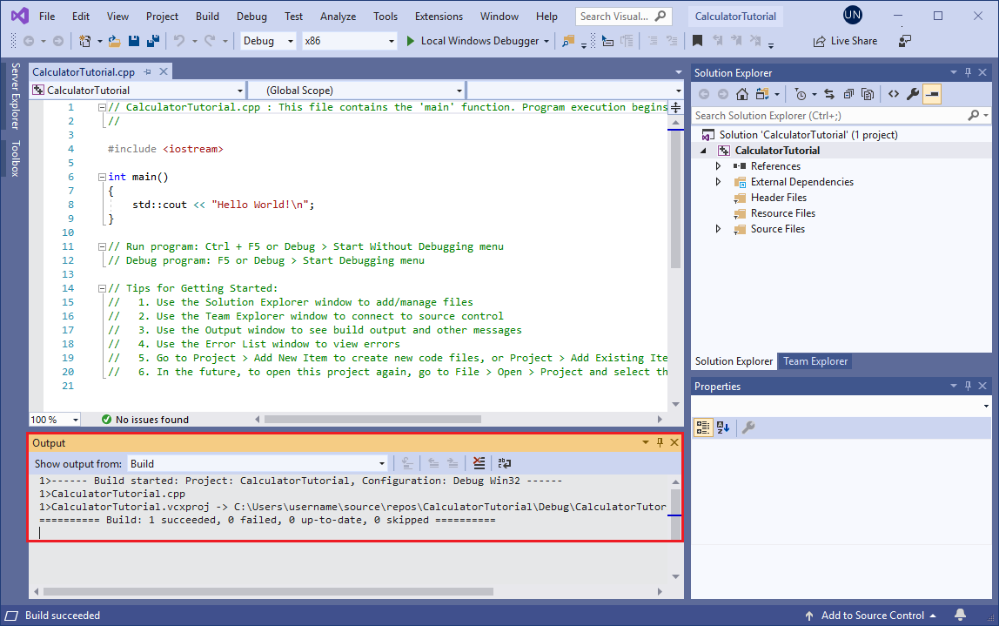
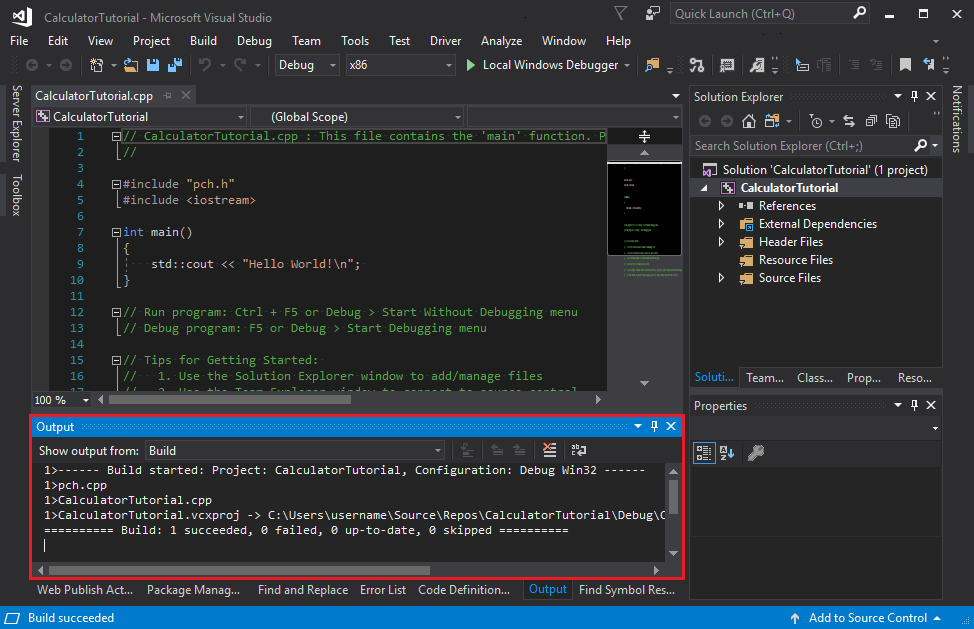

# Create a console calculator in C++

::: moniker range=">=msvc-160"

The usual starting point for a C++ programmer is a "Hello, world!" application that runs on the command line. That's what you create first in Visual Studio in this article, and then we move on to something more challenging: a calculator app.

## Prerequisites

- Have Visual Studio with the **Desktop development with C++** workload installed and running on your computer. If it's not installed yet, see [Install C++ support in Visual Studio](../build/vscpp-step-0-installation.md).
- This tutorial demonstrates a feature called edit and continue which allows you to make changes to your code while the app is running. To ensure that edit and continue can function for this article, from the main menu choose **Tools** > **Options** > **Debugging** > **General** and ensure that **Require source files to exactly match the original version** is checked.

## Create your app project

Visual Studio uses *projects* to organize the code for an app, and *solutions* to organize your projects. A project contains all the options, configurations, and rules used to build your apps. It also manages the relationship between all the project's files and any external files. To create your app, first, create a new project and solution.

1. If you've started Visual Studio, the Visual Studio Start dialog box appears. Choose **Create a new project** to get started.

   

   Otherwise, on the menubar in Visual Studio, choose **File** > **New** > **Project**. The **Create a new project** window opens.

1. In the list of project templates, choose **Console App**, then choose **Next**.

   

   > [!Important]
   > Make sure you choose the C++ version of the **Console App** template. It has the **C++**, **Windows**, and **Console** tags, and the icon has "++" in the corner.

1. In the **Configure your new project** dialog box, select the **Project name** edit box, name your new project *CalculatorTutorial*, then choose **Create**.

   

   An empty C++ Windows console application gets created. Console applications use a Windows console window to display output and accept user input. In Visual Studio, an editor window opens and shows the generated code:

    ```cpp
    // CalculatorTutorial.cpp : This file contains the 'main' function. Program execution begins and ends there.
    //

    #include <iostream>

    int main()
    {
        std::cout << "Hello World!\n";
    }

    // Run program: Ctrl + F5 or Debug > Start Without Debugging menu
    // Debug program: F5 or Debug > Start Debugging menu

    // Tips for Getting Started:
    //   1. Use the Solution Explorer window to add/manage files
    //   2. Use the Team Explorer window to connect to source control
    //   3. Use the Output window to see build output and other messages
    //   4. Use the Error List window to view errors
    //   5. Go to Project > Add New Item to create new code files, or Project > Add Existing Item to add existing code files to the project
    //   6. In the future, to open this project again, go to File > Open > Project and select the .sln file
    ```

## Verify that your new app builds and runs

The template for a new Windows console application creates a simple C++ "Hello World" app. At this point, you can see how Visual Studio builds and runs the apps you create right from the IDE.

1. To build your project, choose **Build Solution** from the **Build** menu. The **Output** window shows the results of the build process.

   

1. To run the code, on the menu bar, choose **Debug**, **Start without debugging**.

   

   A console window opens and then runs your app. When you start a console app in Visual Studio, it runs your code, then prints "Press any key to close this window . . ." to give you a chance to see the output. Congratulations! You've created your first "Hello, world!" console app in Visual Studio!

1. Press a key to dismiss the console window and return to Visual Studio.

You now have the tools to build and run your app after every change, to verify that the code still works as you expect. Later, we show you how to debug it if it doesn't.

## Edit the code

Now let's turn the code in this template into a calculator app.

1. Replace the contents of the *`CalculatorTutorial.cpp`* file with the following code so that it matches this example:

    ```cpp
    // CalculatorTutorial.cpp : This file contains the 'main' function. Program execution begins and ends there.
    //

    #include <iostream>

    using namespace std;

    int main()
    {
        cout << "Calculator Console Application" << endl << endl;
        cout << "Please enter the operation to perform. Format: a+b | a-b | a*b | a/b"
            << endl;
        return 0;
    }

    // Run program: Ctrl + F5 or Debug > Start Without Debugging menu
    // Debug program: F5 or Debug > Start Debugging menu
    // Tips for Getting Started:
    //   1. Use the Solution Explorer window to add/manage files
    //   2. Use the Team Explorer window to connect to source control
    //   3. Use the Output window to see build output and other messages
    //   4. Use the Error List window to view errors
    //   5. Go to Project > Add New Item to create new code files, or Project > Add Existing Item to add existing code files to the project
    //   6. In the future, to open this project again, go to File > Open > Project and select the .sln file
    ```

   > Understanding the code:
   >
   > - The `#include` statements allow you to reference code located in other files. Sometimes, you may see a filename surrounded by angle brackets (**\<\>**); other times, it's surrounded by quotes (**" "**). In general, angle brackets are used when referencing the C++ Standard Library, while quotes are used for other files.
   > - The `using namespace std;` line tells the compiler to expect stuff from the C++ Standard Library to be used in this file. Without this line, each keyword from the library would have to be preceded with `std::` to denote its scope. For instance, without that line, each reference to `cout` would have to be written as `std::cout`. The **`using`** statement is added to make the code look more clean.
   > - The `cout` keyword is used to print to standard output in C++. The **\<\<** operator tells the compiler to send whatever is to the right of it to the standard output.
   > - The `endl` keyword is like the Enter key; it ends the line and moves the cursor to the next line. It is a better practice to put a `\n` inside the string (contained by `""`) to do the same thing because `endl` always flushes the buffer which can hurt the performance of the program. But since this is a very small app, `endl` is used instead for better readability.
   > - All C++ statements must end with semicolons and all C++ applications must contain a `main()` function. This function is what the program runs at the start. All code must be accessible from `main()` in order to be used.

1. To save the file, press **Ctrl+S**, or choose the **Save** icon near the top of the IDE, the floppy disk icon in the toolbar under the menu bar.

1. To run the application, press **Ctrl+F5** or go to the **Debug** menu and choose **Start Without Debugging**. You should see a console window appear that displays the text specified in the code.

1. Close the console window when you're done.

## Add code to do some math

It's time to add some math logic.

### To add a Calculator class

1. Go to the **Project** menu and choose **Add Class**. In the **Class Name** edit box, enter *Calculator*. Choose **OK**. Two new files get added to your project. To save all your changed files at once, press **Ctrl+Shift+S**. It's a keyboard shortcut for **File** > **Save All**. There's also a toolbar button for **Save All**, an icon of two floppy disks, found beside the **Save** button. In general, it's good practice to do **Save All** frequently, so you don't miss any files when you save.

   

   A class is like a blueprint for an object that does something. In this case, we define a calculator and how it should work.

   The **Add Class** wizard you used previously created `.h` and `.cpp` files that have the same name as the class. You can see a full list of your project files in the **Solution Explorer** window, visible on the side of the IDE. If the window isn't visible, you can open it from the menu bar: choose **View** > **Solution Explorer**.

   

   You should now have three tabs open in the editor: *`CalculatorTutorial.cpp`*, *`Calculator.h`*, and *`Calculator.cpp`*. If you accidentally close one of them, you can reopen it by double-clicking it in the **Solution Explorer** window.

1. Replace the contents of **`Calculator.h`** with the following code so that the file now looks like this:

    ```cpp
    #pragma once
    class Calculator
    {
    public:
        double Calculate(double x, char oper, double y);
    };
    ```

   > Understanding the code
   >
   > - This code declares a new function called `Calculate`, which we use to run math operations for addition, subtraction, multiplication, and division.
   > - C++ code is organized into *header* (`.h`) files and *source* (`.cpp`) files. Several other file extensions are supported by various compilers, but these are the main ones to know about. Functions and variables are normally *declared*, that is, given a name and a type, in header files, and *implemented*, or given a definition, in source files. To access code defined in another file, you can use `#include "filename.h"`, where `filename.h` is the name of the file that declares the variables or functions you want to use.
   > - It's good practice to organize your code into different files based on what it does, so it's easy to find the code you need later. In our case, we define the `Calculator` class separately from the file containing the `main()` function, but we plan to reference the `Calculator` class in `main()`.

1. A green squiggle appears under `Calculate` because we haven't defined the `Calculate` function in the `.cpp` file. Hover over `Calculate`, click the down arrow on the screwdriver that appears, and choose **Create definition of 'Calculate' in `Calculator.cpp`**.

   

   A pop-up appears that gives you a peek of the code change that was made in the other file. The code was added to *`Calculator.cpp`*.

   

   Currently, it just returns 0.0. Let's change that. Press **Esc** to close the pop-up.

1. Switch to the *`Calculator.cpp`* file in the editor window. Remove the `Calculator()` and `~Calculator()` sections (as you did in the `.h` file) and add the following code to `Calculate()`:

    ```cpp
    #include "Calculator.h"

    double Calculator::Calculate(double x, char oper, double y)
    {
        switch(oper)
        {
            case '+':
                return x + y;
            case '-':
                return x - y;
            case '*':
                return x * y;
            case '/':
                return x / y;
            default:
                return 0.0;
        }
    }
    ```

   > Understanding the code
   >
   > - The function `Calculate` consumes a number, an operator, and a second number, then performs the requested operation on the numbers.
   > - The switch statement checks which operator was provided, and only executes the case corresponding to that operation. The default: case is a fallback in case the user types an operator that isn't accepted, so the program doesn't break. In general, it's best to handle invalid user input in a more elegant way, but this is beyond the scope of this tutorial.
   > - The **`double`** keyword denotes a type of number that supports decimals. This way, the calculator can handle both decimal math and integer math. The `Calculate` function is required to always return such a number due to the **`double`** at the very start of the code (this denotes the function's return type), which is why we return 0.0 even in the default case.
   > - The `.h` file declares the function *prototype*, which tells the compiler upfront what parameters it requires, and what return type to expect from it. The `.cpp` file has all the implementation details of the function.

If you build and run the code again at this point, it will still exit after asking which operation to perform. Next, modify the `main` function to do some calculations.

### To call the `Calculator` class member functions

1. Now let's update the `main` function in *`CalculatorTutorial.cpp`*:

    ```cpp
    // CalculatorTutorial.cpp : This file contains the 'main' function. Program execution begins and ends there.
    //

    #include <iostream>
    #include "Calculator.h"

    using namespace std;

    int main()
    {
        double x = 0.0;
        double y = 0.0;
        double result = 0.0;
        char oper = '+';

        cout << "Calculator Console Application" << endl << endl;
        cout << "Please enter the operation to perform. Format: a+b | a-b | a*b | a/b"
             << endl;

        Calculator c;
        while (true)
        {
            cin >> x >> oper >> y;
            result = c.Calculate(x, oper, y);
            cout << "Result " << "of " << x << oper << y << " is: " << result << endl;
        }

        return 0;
    }
    ```

   > Understanding the code
   >
   > - Since C++ programs always start at the `main()` function, we need to call our other code from there, so a `#include` statement is needed.
   > - Some initial variables `x`, `y`, `oper`, and `result` are declared to store the first number, second number, operator, and final result, respectively. It is always good practice to give them some initial values to avoid undefined behavior, which is what is done here.
   > - The `Calculator c;` line declares an object named 'c' as an instance of the `Calculator` class. The class itself is just a blueprint for how calculators work; the object is the specific calculator that does the math.
   > - The `while (true)` statement is a loop. The code inside the loop continues to execute over and over again as long as the condition inside the `()` holds true. Since the condition is simply listed as **`true`**, it's always true, so the loop runs forever. To close the program, the user must manually close the console window. Otherwise, the program always waits for new input.
   > - The `cin` keyword is used to accept input from the user. This input stream is smart enough to process a line of text entered in the console window and place it inside each of the variables listed, in order, assuming the user input matches the required specification. You can modify this line to accept different types of input such as more than two numbers--though the `Calculate()` function would also need to be updated to handle this.
   > - The `c.Calculate(x, oper, y);` expression calls the `Calculate` function defined earlier, and supplies the entered input values. The function then returns a number that gets stored in `result`.
   > - Finally, `result` is printed to the console, so the user sees the result of the calculation.

### Build and test the code again

Now it's time to test the program again to make sure everything works properly.

1. Press **Ctrl+F5** to rebuild and start the app.

1. Enter `5+5`, and press **Enter**. Verify that the result is 10.

   

## Debug the app

Since the user is free to type anything into the console window, let's make sure the calculator handles some input as expected. Instead of running the program, let's debug it instead, so we can inspect what it's doing in detail, step-by-step.

### To run the app in the debugger

1. Set a breakpoint on the `result = c.Calculate(x, oper, y);` line. To set the breakpoint, click next to the line in the gray vertical bar along the left edge of the editor window. A red dot appears.

   

   Now when we debug the program, it always pauses execution at that line. We already have a rough idea that the program works for simple cases. Since we don't want to pause execution every time, let's make the breakpoint conditional.

1. Right-click the red dot that represents the breakpoint, and choose **Conditions**. In the edit box for the condition, enter `(y == 0) && (oper == '/')`. Choose the **Close** button when you're done to save the breakpoint condition.

   

   Now we pause execution at the breakpoint specifically if a division by 0 is attempted.

1. To debug the program, press **F5**, or choose the **Local Windows Debugger** toolbar button that has the green arrow icon. In your console app, if you enter something like "5 - 0", the program behaves normally and keeps running. However, if you type "10 / 0", it pauses at the breakpoint. You can even put any number of spaces between the operator and numbers: `cin` is smart enough to parse the input appropriately.

   

### Useful windows in the debugger

Whenever you debug your code, you may notice that some new windows appear. These windows can assist your debugging experience. Take a look at the **Autos** window. The **Autos** window shows you the current values of variables used at least three lines before and up to the current line. To see all of the variables from that function, switch to the **Locals** window. You can modify the values of these variables while debugging, to see what effect they would have on the program. In this case, we leave them alone.

   

You can also just hover over variables in the code itself to see their current values where the execution is currently paused. Make sure the editor window is in focus by clicking on it first.

   

### To continue debugging

1. The yellow arrow on the left shows the current point of execution. The current line calls `Calculate`, so press **F11** to **Step Into** the function. Now you're executing code in the body of the `Calculate` function. Be careful with **Step Into** because it steps into any functions on the line you're on, including standard library functions. It's fine to step into the standard library, but you may be more interested in focusing on your code instead of library code.

1. Now that the point of execution is at the start of the `Calculate` function, press **F10** to move to the next line in the program's execution. **F10** is also known as **Step Over**. You can use **Step Over** to move from line to line, without delving into the details of what is occurring in each part of the line. In general, you should use **Step Over** instead of **Step Into** unless you want to dive more deeply into code that is being called from elsewhere (as you did to reach the body of `Calculate`).

1. Continue using **F10** to **Step Over** each line until you get back to the `main()` function in the other file, and stop on the `cout` line.

   It looks like the program is doing what is expected: it takes the first number, and divides it by the second. On the `cout` line, hover over the `result` variable or take a look at `result` in the **Autos** window. Its value `inf`, which doesn't look right, so let's fix it. The `cout` line just outputs whatever value is stored in `result`, so when you step one more line forward using **F10**, the console window displays:

   

   This result happens because division by zero is undefined, so the program doesn't have a numerical answer to the requested operation.

### To fix the "divide by zero" error

Let's handle division by zero more gracefully so that it's easier for the user to understand the problem.

1. Make the following changes in *`CalculatorTutorial.cpp`*. (You can leave the program running as you edit, thanks to a debugger feature called **Edit and Continue**). The change is to add an `if` statement following `cin >> x >> oper >> y;` to check for division by zero and output a message to the user if it happens. Otherwise, the result is printed.

    ```cpp
    // CalculatorTutorial.cpp : This file contains the 'main' function. Program execution begins and ends there.
    //

    #include <iostream>
    #include "Calculator.h"

    using namespace std;

    int main()
    {
        double x = 0.0;
        double y = 0.0;
        double result = 0.0;
        char oper = '+';

        cout << "Calculator Console Application" << endl << endl;
        cout << "Please enter the operation to perform. Format: a+b | a-b | a*b | a/b" << endl;

        Calculator c;
        while (true)
        {
            cin >> x >> oper >> y;
            if (oper == '/' && y == 0)
            {
                cout << "Attempted to divide by zero!" << endl;
                continue;
            }
            else
            {
                result = c.Calculate(x, oper, y);
            }
            cout << "Result " << "of " << x << oper << y << " is: " << result << endl;
        }

        return 0;
    }
    ```

1. Now press **F5** once. Program execution continues all the way until it has to pause to ask for user input. Enter `10 / 0` again. Now, a more helpful message is printed. The user is asked for more input, and the program continues executing normally.

   :::image type="complex" source="./media/calc-vs2019-final-verification.png" alt-text="Screenshot of the Visual Studio Debug Console showing the final result after changes":::
    The console window displays two lines: 10 / 0 Result is: inf, followed by, 10 / 0 Division by 0 exception.
    :::image-end:::

   > [!Note]
   > When you edit code while in debugging mode, there is a risk of code becoming stale. This happens when the debugger is still running your old code, and has not yet updated it with your changes. The debugger displays a dialog to inform you when this happens. Sometimes, you may need to press **F5** to refresh the code being executed. In particular, if you make a change inside a function while the point of execution is inside that function, you need to step out of the function, then back into it again to get the updated code. If that doesn't work for some reason and you see an error message, you can stop debugging by clicking on the red square in the toolbar under the menus at the top of the IDE, then start debugging again by entering **F5** or by choosing the green "play" arrow beside the stop button on the toolbar.
   >
   > Another reason edit and continue may fail is if you see a message that says "The Require source files to exactly match the original version setting under Debug->Options->General needs to be enabled..." To fix this, from the main menu choose **Tools** > **Options** > **Debugging** > **General** and ensure that **Require source files to exactly match the original version** is checked.

   > Understanding the Run and Debug shortcuts
   >
   > - **F5** (or **Debug** > **Start Debugging**) starts a debugging session if one isn't already active, and runs the program until a breakpoint is hit or the program needs user input. If no user input is needed and no breakpoint is available to hit, the program terminates and the console window closes itself when the program finishes running. If you have something like a "Hello World" program to run, use **Ctrl+F5** or set a breakpoint before you press **F5** to keep the window open.
   > - **Ctrl+F5** (or **Debug** > **Start Without Debugging**) runs the application without going into debug mode. This is slightly faster than debugging, and the console window stays open after the program finishes executing.
   > - **F10** (known as **Step Over**) lets you iterate through code, line-by-line, and visualize how the code is run and what variable values are at each step of execution.
   > - **F11** (known as **Step Into**) works similarly to **Step Over**, except it steps into any functions called on the line of execution. For example, if the line being executed calls a function, pressing **F11** moves the pointer into the body of the function, so you can follow the function's code being run before coming back to the line you started at. Pressing **F10** steps over the function call and just moves to the next line; the function call still happens, but the program doesn't pause to show you what it's doing.

### Close the app

- If it's still running, close the console window for the calculator app.

[!INCLUDE[includes/git-source-control.md](includes/git-source-control.md)]

## The finished app

Congratulations! You've completed the code for the calculator app, built and debugged it, and added it to a repo, all in Visual Studio.

## Next steps

[Learn more about Visual Studio for C++](https://devblogs.microsoft.com/cppblog/getting-started-with-visual-studio-for-c-and-cpp-development/)

::: moniker-end

::: moniker range="<msvc-160"

The usual starting point for a C++ programmer is a "Hello, world!" application that runs on the command line. That's what you create in Visual Studio in this article, and then we move on to something more challenging: a calculator app.

## Prerequisites

- Have Visual Studio with the **Desktop development with C++** workload installed and running on your computer. If it's not installed yet, see [Install C++ support in Visual Studio](../build/vscpp-step-0-installation.md).

## Create your app project

Visual Studio uses *projects* to organize the code for an app, and *solutions* to organize your projects. A project contains all the options, configurations, and rules used to build your apps. It also manages the relationship between all the project's files and any external files. To create your app, first, you create a new project and solution.

1. On the menubar in Visual Studio, choose **File** > **New** > **Project**. The **New Project** window opens.

2. On the left sidebar, make sure **Visual C++** is selected. In the center, choose **Windows Console Application**.

3. In the **Name** edit box at the bottom, name the new project *CalculatorTutorial*, then choose **OK**.

   

   An empty C++ Windows console application gets created. Console applications use a Windows console window to display output and accept user input. In Visual Studio, an editor window opens and shows the generated code:

    ```cpp
    // CalculatorTutorial.cpp : This file contains the 'main' function. Program execution begins and ends there.
    //

    #include <iostream>

    int main()
    {
        std::cout << "Hello World!\n";
    }

    // Run program: Ctrl + F5 or Debug > Start Without Debugging menu
    // Debug program: F5 or Debug > Start Debugging menu

    // Tips for Getting Started:
    //   1. Use the Solution Explorer window to add/manage files
    //   2. Use the Team Explorer window to connect to source control
    //   3. Use the Output window to see build output and other messages
    //   4. Use the Error List window to view errors
    //   5. Go to Project > Add New Item to create new code files, or Project > Add Existing Item to add existing code files to the project
    //   6. In the future, to open this project again, go to File > Open > Project and select the .sln file
    ```

## Verify that your new app builds and runs

The template for a new windows console application creates a simple C++ "Hello World" app. At this point, you can see how Visual Studio builds and runs the apps you create right from the IDE.

1. To build your project, choose **Build Solution** from the **Build** menu. The **Output** window shows the results of the build process.

   

1. To run the code, on the menu bar, choose **Debug**, **Start without debugging**.

   

   A console window opens and then runs your app. When you start a console app in Visual Studio, it runs your code, then prints "Press any key to continue . . ." to give you a chance to see the output. Congratulations! You've created your first "Hello, world!" console app in Visual Studio!

1. Press a key to dismiss the console window and return to Visual Studio.

You now have the tools to build and run your app after every change, to verify that the code still works as you expect. Later, we show you how to debug it if it doesn't.

## Edit the code

Now let's turn the code in this template into a calculator app.

1. Replace the contents of the *`CalculatorTutorial.cpp`* file with the following code so that it matches this example:

    ```cpp
    // CalculatorTutorial.cpp : This file contains the 'main' function. Program execution begins and ends there.
    //

    #include <iostream>

    using namespace std;

    int main()
    {
        cout << "Calculator Console Application" << endl << endl;
        cout << "Please enter the operation to perform. Format: a+b | a-b | a*b | a/b" << endl;
        return 0;
    }

    // Run program: Ctrl + F5 or Debug > Start Without Debugging menu
    // Debug program: F5 or Debug > Start Debugging menu
    // Tips for Getting Started:
    //   1. Use the Solution Explorer window to add/manage files
    //   2. Use the Team Explorer window to connect to source control
    //   3. Use the Output window to see build output and other messages
    //   4. Use the Error List window to view errors
    //   5. Go to Project > Add New Item to create new code files, or Project > Add Existing Item to add existing code files to the project
    //   6. In the future, to open this project again, go to File > Open > Project and select the .sln file
    ```

   > Understanding the code:
   >
   > - The `#include` statements allow you to reference code located in other files. Sometimes, you may see a filename surrounded by angle brackets (**\<\>**); other times, it's surrounded by quotes (**" "**). In general, angle brackets are used when referencing the C++ Standard Library, while quotes are used for other files.
   > - The `using namespace std;` line tells the compiler to expect stuff from the C++ Standard Library to be used in this file. Without this line, each keyword from the library would have to be preceded with `std::` to denote its scope. For instance, without that line, each reference to `cout` would have to be written as `std::cout`. The **`using`** statement is added to make the code look more clean.
   > - The `cout` keyword is used to print to standard output in C++. The **`<<`* operator tells the compiler to send whatever is to the right of it to the standard output.
   > - The `endl` keyword is like the Enter key; it ends the line and moves the cursor to the next line. It is a better practice to put a `\n` inside the string (contained by `""`) to do the same thing because `endl` always flushes the buffer and can hurt the performance of the program. But since this is a very small app, `endl` is used instead for better readability.
   > - All C++ statements must end with semicolons and all C++ applications must contain a `main()` function. This function is what the program runs at the start. All code must be accessible from `main()` in order to be used.

1. To save the file, press **Ctrl+S**, or choose the **Save** icon near the top of the IDE, the floppy disk icon in the toolbar under the menu bar.

1. To run the application, press **Ctrl+F5** or go to the **Debug** menu and choose **Start Without Debugging**. If you get a pop-up that says **This project is out of date**, you may select **Do not show this dialog again**, and then choose **Yes** to build your application. You should see a console window appear that displays the text specified in the code.

   :::image type="complex" source="./media/calculator-first-launch.gif" alt-text="Short video of running the calculator app.":::
   Short video showing Debug > Start without debugging. A dialog is visible that asks whether to build because the project is out of date. The checkbox for 'Do not show this dialog again' is selected. 'Yes' is selected to build the project, the calculator project builds, and then launches in a Windows console window.
   :::image-end:::

1. Close the console window when you're done.

## Add code to do some math

It's time to add some math logic.

### To add a Calculator class

1. Go to the **Project** menu and choose **Add Class**. In the **Class Name** edit box, enter *Calculator*. Choose **OK**. Two new files get added to your project. To save all your changed files at once, press **Ctrl+Shift+S**. It's a keyboard shortcut for **File** > **Save All**. There's also a toolbar button for **Save All**, an icon of two floppy disks, found beside the **Save** button. In general, it's good practice to do **Save All** frequently, so you don't miss any files when you save.

   

   A class is like a blueprint for an object that does something. In this case, we define a calculator and how it should work.

   The **Add Class** wizard you used previously created `.h` and `.cpp` files that have the same name as the class. You can see a full list of your project files in the **Solution Explorer** window, visible on the side of the IDE. If the window isn't visible, you can open it from the menu bar: choose **View** > **Solution Explorer**.

   

   You should now have three tabs open in the editor: *`CalculatorTutorial.cpp`*, *`Calculator.h`*, and *`Calculator.cpp`*. If you accidentally close one of them, you can reopen it by double-clicking it in the **Solution Explorer** window.

1. Replace the contents of **`Calculator.h`** with the following code so that the file now looks like this:

    ```cpp
    #pragma once
    class Calculator
    {
    public:
        double Calculate(double x, char oper, double y);
    };
    ```

   > Understanding the code
   >
   > - This code declares a new function called `Calculate`, which we use to run math operations for addition, subtraction, multiplication, and division.
   > - C++ code is organized into *header* (`.h`) files and *source* (`.cpp`) files. Several other file extensions are supported by various compilers, but these are the main ones to know about. Functions and variables are normally *declared*, that is, given a name and a type, in header files, and *implemented*, or given a definition, in source files. To access code defined in another file, you can use `#include "filename.h"`, where `filename.h` is the name of the file that declares the variables or functions you want to use.
   > - It's good practice to organize your code into different files based on what it does, so it's easy to find the code you need later. In our case, we define the `Calculator` class separately from the file containing the `main()` function, but we plan to reference the `Calculator` class in `main()`.

1. A green squiggle appears under `Calculate` because we haven't defined the `Calculate` function in the `.cpp` file. Hover over `Calculate`, click the down arrow on the light bulb that appears, and choose **Create definition of 'Calculate' in `Calculator.cpp`**. A pop-up appears that gives you a peek of the code change that was made in the other file. The code was added to *`Calculator.cpp`*.

   

   Currently, it just returns 0.0. Let's change that. Press **Esc** to close the pop-up.

1. Switch to the *`Calculator.cpp`* file in the editor window. Replace the contents of the file with the following code:

    ```cpp
    #include "Calculator.h"

    double Calculator::Calculate(double x, char oper, double y)
    {
        switch(oper)
        {
            case '+':
                return x + y;
            case '-':
                return x - y;
            case '*':
                return x * y;
            case '/':
                return x / y;
            default:
                return 0.0;
        }
    }
    ```

   > Understanding the code
   >
   > - The function `Calculate` consumes a number, an operator, and a second number, then performs the requested operation on the numbers.
   > - The switch statement checks which operator was provided, and only executes the case corresponding to that operation. The default: case is a fallback in case the user types an operator that isn't accepted, so the program doesn't break. In general, it's best to handle invalid user input in a more elegant way, but this is beyond the scope of this tutorial.
   > - The **`double`** keyword denotes a type of number that supports decimals. This way, the calculator can handle both decimal math and integer math. The `Calculate` function is required to always return such a number due to the **`double`** at the very start of the code (this denotes the function's return type), which is why we return 0.0 even in the default case.
   > - The `.h` file declares the function *prototype*, which tells the compiler upfront what parameters it requires, and what return type to expect from it. The `.cpp` file has all the implementation details of the function.

If you build and run the code again at this point, it will still exit after asking which operation to perform. Next, modify the `main` function to do some calculations.

### To call the Calculator class member functions

1. Now let's update the `main` function in *`CalculatorTutorial.cpp`*:

    ```cpp
    // CalculatorTutorial.cpp : This file contains the 'main' function. Program execution begins and ends there.
    //

    #include <iostream>
    #include "Calculator.h"

    using namespace std;

    int main()
    {
        double x = 0.0;
        double y = 0.0;
        double result = 0.0;
        char oper = '+';

        cout << "Calculator Console Application" << endl << endl;
        cout << "Please enter the operation to perform. Format: a+b | a-b | a*b | a/b" << endl;

        Calculator c;
        while (true)
        {
            cin >> x >> oper >> y;
            result = c.Calculate(x, oper, y);
            cout << "Result is: " << result << endl;
        }

        return 0;
    }
    ```

   > Understanding the code
   >
   > - Since C++ programs always start at the `main()` function, we need to call our other code from there, so a `#include` statement is needed.
   > - Some initial variables `x`, `y`, `oper`, and `result` are declared to store the first number, second number, operator, and final result, respectively. It is always good practice to give them some initial values to avoid undefined behavior, which is what is done here.
   > - The `Calculator c;` line declares an object named 'c' as an instance of the `Calculator` class. The class itself is just a blueprint for how calculators work; the object is the specific calculator that does the math.
   > - The `while (true)` statement is a loop. The code inside the loop continues to execute over and over again as long as the condition inside the `()` holds true. Since the condition is simply listed as **`true`**, it's always true, so the loop runs forever. To close the program, the user must manually close the console window. Otherwise, the program always waits for new input.
   > - The `cin` keyword is used to accept input from the user. This input stream is smart enough to process a line of text entered in the console window and place it inside each of the variables listed, in order, assuming the user input matches the required specification. You can modify this line to accept different types of input such as more than two numbers--though the `Calculate()` function would also need to be updated to handle this.
   > - The `c.Calculate(x, oper, y);` expression calls the `Calculate` function defined earlier, and supplies the entered input values. The function then returns a number that gets stored in `result`.
   > - Finally, `result` is printed to the console, so the user sees the result of the calculation.

### Build and test the code again

Now it's time to test the program again to make sure everything works properly.

1. Press **Ctrl+F5** to rebuild and start the app.

1. Enter `5+5`, and press **Enter**. Verify that the result is 10.

   

## Debug the app

Since the user is free to type anything into the console window, let's make sure the calculator handles some input as expected. Instead of running the program, let's debug it instead, so we can inspect what it's doing in detail, step-by-step.

### To run the app in the debugger

1. Set a breakpoint on the `result = c.Calculate(x, oper, y);` line. To set the breakpoint, click next to the line in the gray vertical bar along the left edge of the editor window. A red dot appears.

   

   Now when we debug the program, it always pauses execution at that line. We already have a rough idea that the program works for simple cases. Since we don't want to pause execution every time, let's make the breakpoint conditional.

1. Right-click the red dot that represents the breakpoint, and choose **Conditions**. In the edit box for the condition, enter `(y == 0) && (oper == '/')`. Choose the **Close** button when you're done to save the breakpoint condition.

   :::image type="complex" source="./media/calculator-conditional-breakpoint.gif" alt-text="Set a conditional breakpoint":::
    Short video showing a right-click on the breakpoint. The breakpoint is on the line of code that reads result = c dot Calculate ( x, oper, y). 'Conditions...' is selected in the dropdown, which opens the breakpoint settings window. In the text box following the Conditional Expression and Is true dropdowns, the user enters y == 0 && oper == '/', and then selects close to set the conditional breakpoint.
    :::image-end:::

   Now we pause execution at the breakpoint specifically if a division by 0 is attempted.

1. To debug the program, press **F5**, or choose the **Local Windows Debugger** toolbar button that has the green arrow icon. In your console app, if you enter something like "5 - 0", the program behaves normally and keeps running. However, if you type "10 / 0", it pauses at the breakpoint. You can even put any number of spaces between the operator and numbers; `cin` is smart enough to parse the input appropriately.

   

### Useful windows in the debugger

Whenever you debug your code, you may notice that some new windows appear. These windows can assist your debugging experience. Take a look at the **Autos** window. The **Autos** window shows you the current values of variables used at least three lines before and up to the current line.

   

To see all of the variables from that function, switch to the **Locals** window. You can modify the values of these variables while debugging, to see what effect they would have on the program. In this case, we leave them alone.

   

You can also just hover over variables in the code itself to see their current values where the execution is currently paused. Make sure the editor window is in focus by clicking on it first.

   

### To continue debugging

1. The yellow arrow on the left shows the current point of execution. The current line calls `Calculate`, so press **F11** to **Step Into** the function, which takes you into the body of the `Calculate` function. Be careful with **Step Into** because it steps into any functions on the line you're on, including standard library functions. It's fine to step into the standard library, but you may be more interested in focusing on your code instead of library code.

1. Now that the point of execution is at the start of the `Calculate` function, press **F10** to move to the next line in the program's execution. **F10** is also known as **Step Over**. You can use **Step Over** to move from line to line, without delving into the details of what is occurring in each part of the line. In general you should use **Step Over** instead of **Step Into**, unless you want to dive more deeply into code that is being called from elsewhere (as you did to reach the body of `Calculate`).

1. Continue using **F10** to **Step Over** each line until you get back to the `main()` function in the other file, and stop on the `cout` line.

   

   It looks like the program is doing what is expected: it takes the first number, and divides it by the second. On the `cout` line, hover over the `result` variable or take a look at `result` in the **Autos** window. Its value is `inf`, which doesn't look right, so let's fix it. The `cout` line just outputs whatever value is stored in `result`, so when you step one more line forward using **F10**, the console window displays:

   

   This result happens because division by zero is undefined, so the program doesn't have a numerical answer to the requested operation.

### To fix the "divide by zero" error

Let's handle division by zero more gracefully, so a user can understand the problem.

1. Make the following changes in *`CalculatorTutorial.cpp`*. (You can leave the program running as you edit, thanks to a debugger feature called **Edit and Continue**). The change is to add an `if` statement following `cin >> x >> oper >> y;` to check for division by zero and output a message to the user if it happens. Otherwise, the result is printed:

    ```cpp
    // CalculatorTutorial.cpp : This file contains the 'main' function. Program execution begins and ends there.
    //

    #include <iostream>
    #include "Calculator.h"

    using namespace std;

    int main()
    {
        double x = 0.0;
        double y = 0.0;
        double result = 0.0;
        char oper = '+';

        cout << "Calculator Console Application" << endl << endl;
        cout << "Please enter the operation to perform. Format: a+b | a-b | a*b | a/b" << endl;

        Calculator c;
        while (true)
        {
            cin >> x >> oper >> y;
            if (oper == '/' && y == 0)
            {
                cout << "Division by 0 exception" << endl;
                continue;
            }
            else
            {
                result = c.Calculate(x, oper, y);
            }
            cout << "Result is: " << result << endl;
        }

        return 0;
    }
    ```

1. Now press **F5** once. Program execution continues all the way until it has to pause to ask for user input. Enter `10 / 0` again. Now, a more helpful message is printed. The user is asked for more input, and the program continues executing normally.

   

   > [!Note]
   > When you edit code while in debugging mode, there is a risk of code becoming stale. This happens when the debugger is still running your old code, and has not yet updated it with your changes. The debugger pops up a dialog to inform you when this happens. Sometimes, you may need to press **F5** to refresh the code being executed. In particular, if you make a change inside a function while the point of execution is inside that function, step out of the function, then back into it again to get the updated code. If that doesn't work for some reason and you see an error message, you can stop debugging by clicking on the red square in the toolbar under the menus at the top of the IDE, then start debugging again by entering **F5** or by choosing the green "play" arrow beside the stop button on the toolbar.
   >
   > Another reason edit and continue may fail is that you need to go to the main menu and choose **Tools** > **Options** > **Debugging** > **General** and ensure that **Require source files to exactly match the original version** is checked.

   > Understanding the Run and Debug shortcuts
   >
   > - **F5** (or **Debug** > **Start Debugging**) starts a debugging session if one isn't already active, and runs the program until a breakpoint is hit or the program needs user input. If no user input is needed and no breakpoint is available to hit, the program terminates and the console window closes itself when the program finishes running. If you have something like a "Hello World" program to run, use **Ctrl+F5** or set a breakpoint before you press **F5** to keep the window open.
   > - **Ctrl+F5** (or **Debug** > **Start Without Debugging**) runs the application without going into debug mode. This is slightly faster than debugging, and the console window stays open after the program finishes executing.
   > - **F10** (known as **Step Over**) lets you iterate through code, line-by-line, and visualize how the code is run and what variable values are at each step of execution.
   > - **F11** (known as **Step Into**) works similarly to **Step Over**, except it steps into any functions called on the line of execution. For example, if the line being executed calls a function, pressing **F11** moves the pointer into the body of the function, so you can follow the function's code being run before coming back to the line you started at. Pressing **F10** steps over the function call and just moves to the next line; the function call still happens, but the program doesn't pause to show you what it's doing.

### Close the app

- If it's still running, close the console window for the calculator app.

Congratulations! You've completed the code for the calculator app, and built and debugged it in Visual Studio.

## Next steps

[Learn more about Visual Studio for C++](https://devblogs.microsoft.com/cppblog/getting-started-with-visual-studio-for-c-and-cpp-development/)

::: moniker-end
