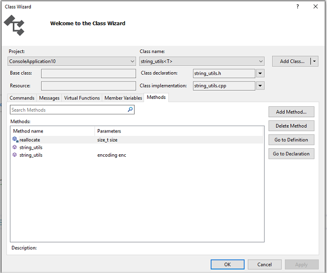

# Add a class

To add a class in a Visual Studio C++ project, in **Solution Explorer**, right-click the project, choose **Add**, and then choose **Class**. This command opens the [Add Class dialog box](#add-class-dialog-box).

When you add a class, you must specify a name that is different from classes that already exist in MFC or ATL. If you specify a name that already exists in either library, the IDE shows an error message.

If your project naming convention requires you to use an existing name, then you can just change the case of one or more letters in the name because C++ is case-sensitive. For example, although you can't name a class `CDocument`, you can name it `cdocument`.

::: moniker range="msvc-140"

## In this section

- [What kind of class do you want to add?](#what-kind-of-class-do-you-want-to-add)
- [Add Class dialog box](#add-class-dialog-box)

## What kind of class do you want to add?

In the **Add Class** dialog box, when you expand the **Visual C++** node in the left pane several groupings of installed templates are displayed. The groups include **CLR**, **ATL**, **MFC**, and **C++**. When you select a group, a list of the available templates in that group is displayed in the middle pane. Each template contains the files and source code that are required for a class.

To generate a new class, select a template in the middle pane, type a name for the class in the **Name** box, and choose **Add**. This button opens the **Add Class Wizard** so that you can specify options for the class.

- For more information about how to create MFC classes, see [MFC class](../mfc/reference/adding-an-mfc-class.md).

- For more information about how to create ATL classes, see [ATL simple object](../atl/reference/adding-an-atl-simple-object.md).

> [!NOTE]
> The template **Add ATL Support to MFC** doesn't create a class, but instead configures the project to use ATL. For more information, see [ATL support in an MFC project](../mfc/reference/adding-atl-support-to-your-mfc-project.md).

To make a C++ class that doesn't use MFC, ATL, or CLR, use the **C++ Class** template in the **C++** group of installed templates. For more information, see [Add a generic C++ class](../ide/adding-a-generic-cpp-class.md).

Two kinds of form-based C++ classes are available. The first one, [CFormView class](../mfc/reference/cformview-class.md), creates an MFC class. The second one creates a CLR Windows Forms class.

::: moniker-end

##  Add Class dialog box

::: moniker range="msvc-140"

In Visual Studio 2015, the **Add Class** dialog box contains templates that allow you to:

- Open a corresponding code wizard, if one is available. For more information, see [Add functionality with code wizards](../ide/adding-functionality-with-code-wizards-cpp.md).

   \- or -

- Automatically create your new class by adding the appropriate files and source code to your project.

You can access the **Add Class** dialog box from the **Project** menu, **Solution Explorer**, or [Class View](/visualstudio/ide/viewing-the-structure-of-code).

> [!NOTE]
> When you attempt to add a class that is not suited to your current project, you will receive an error message. Select **OK** to return to the **Add Class** dialog box.

::: moniker-end

::: moniker range=">=msvc-150"

In Visual Studio 2017 and later versions, the **Add Class** dialog is the generic C++ Class dialog. For more information, see [Add a generic C++ class](adding-a-generic-cpp-class.md).

## Class Wizard dialog box

You can create a class from installed templates in the **Class Wizard** dialog. To use the Class Wizard, right-click on your project in **Solution Explorer** and choose **Class Wizard** from the shortcut menu. The **Add Class** button on the dialog has a drop-down control for choosing a template.

You can also use Class Wizard to modify or examine an existing class.

::: moniker-end

### Add Class templates

There are four categories of **Add Class** templates: .NET, ATL, MFC, and Generic.

#### .NET

|Template|Wizard|
|--------------|------------|
|ASP.NET Web Service|Not available|
|Component Class (.NET)|Not available|
|Installer Class (.NET)|Not available|
|User Control (.NET)|Not available|
|Windows Form (.NET)|Not available|

#### ATL

|Template|Wizard|
|--------------|------------|
|Add ATL Support to MFC|Not available|
|ATL Control|[ATL control wizard](../atl/reference/atl-control-wizard.md)|
|ATL Dialog|[ATL dialog wizard](../atl/reference/atl-dialog-wizard.md)|
|ATL Simple Object|[ATL simple object wizard](../atl/reference/atl-simple-object-wizard.md)|
|WMI Event Provider|WMI event provider wizard|
|WMI Instance Provider|WMI instance provider wizard|

#### MFC

|Template|Wizard|
|--------------|------------|
|MFC Class|[MFC add class wizard](../mfc/reference/mfc-add-class-wizard.md)|

#### Generic classes

|Template|Wizard|
|--------------|------------|
|Generic C++ Class|[Generic C++ class wizard](./adding-a-generic-cpp-class.md#generic-c-class-wizard)|
