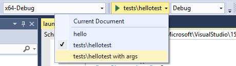

# CMake Projects in Visual C++
CMake is a cross-platform, open-source tool for defining build processes that run on multiple platforms. Until recently, Visual Studio users could use CMake to generate MSBuild project files, which the IDE then consumed for Intellisense, browsing and compilation. Starting in Visual Studio 2017, the Visual C++ tools for CMake component enables the IDE to consume CMake project files (such as CMakeLists.txt) directly for the purposes of Intellisense and browsing. 

Beginning in Visual Studio Update 15.3, support is provided for  both Ninja and Visual Studio generators. If you use a Visual Studio generator, a temporary project file is generated and passed to msbuild.exe, but is never loaded for Intellisense or browsing purposes. 

## Installing
Visual C++ tools for CMake is installed by default as part of the Desktop development with C++ workload.


 
## IDE Integration
When you choose **File | Open | Folder** to open a folder containing a CMakeLists.txt file, the following things happen :
- Visual Studio adds a **CMake** menu item to the main menu, with commands for viewing and editing CMake scripts. 
- Solution Explorer displays the folder structure and files. 
- Visual Studio runs CMake.exe and generates the CMake cache for the default x-86 Debug configuration. The CMake command line is displayed in the Output Window, along with additional output from CMake.
- In the background, Visual Studio starts to index the source files to enable Intellisense, browsing information, refactoring, and so on. As you work, Visual Studio monitors changes in the editor and also on disk to keep its index in sync with the sources. 
You can open folders containing any number of CMake projects. Visual Studio detects and configures all the “root” CMakeLists.txt files in your workspace. CMake operations (configure, build, debug) as well as C++ IntelliSense and browsing are available to all CMake projects in your workspace.

 

## Building CMake projects
To build a CMake project you have two choices:
1.	Right click on the CMakeLists.txt and select Build from the context menu. If you have multiple targets in your folder structure, you can choose to build all or only one specific target, or
  
2. From the main menu, select **Build | Build Solution** (F7 or Ctrl+Shift+B) (for this to work, make sure that a CMake target is already selected in the Startup Item dropdown in the General toolbar).

 
 
When a Visual Studio generator  is selected for the active configuration, MSBuild.exe is invoked with “-m -v:minimal” arguments. To customize the build, inside the CMakeSettings.json file, you can specify additional command line arguments to be passed to the build system via the “buildCommandArgs” property e.g .
```json
"buildCommandArgs": "-m:8 -v:minimal -p:PreferredToolArchitecture=x64"
```
As you would expect, build results are shown in the Output window and Error List window.
 


In a folder with multiple build targets, by default all are built when you press F5 or **Ctrl+Shift+B**. You can choose the Build item on the CMakeLists.txt context menu to which CMake target to build.

## Debugging the project
To debug a CMake project, choose the desired configuration and press F5, or press the Run button in the toolbar. If the Run button says "Select Startup Item", click on the down arrow and choose the target that you want to run. (In a CMake project, the "Current document" option isn't valid.)

 

## Configuring CMake debugging sessions
All executable CMake targets are shown in the Startup Item dropdown in the General toolbar. To start a debugging session, just select one and launch the debugger.

 

To customize the debugger settings for any executable CMake target in your project, right-click on the specific CMakeLists.txt file and select **Debug and Launch Settings**, When you select a CMake target in the sub-menu, a file called launch.vs.json is created. This file is pre-populated with information about the CMake target you have selected and allows you to specify additional parameters such as program arguments or debugger type.

A simple launch.vs.json example:
```json
{
  "version": "0.2.1",
  "defaults": {},
  "configurations": [
    {
      "type": "default",
      "project": "CMakeLists.txt",
      "projectTarget": "tests\\hellotest",
      "name": "tests\\hellotest with args",
      "args": ["argument after argument"]
    }
  ]
}
```
As soon as you save the launch.vs.json file, an entry is created in the Startup Item dropdown with the new name. By editing the launch.vs.json file, you can create as many debug configurations as you like for any number of CMake targets.
 

## Editing CMakeLists.txt files
To edit a CMakeLists.txt file, right click on the file in Solution Explorer and choose **Open**. If you make changes to the file, a yellow status bar appears and informs you that Intellisense will update, and give you an opportunity to Cancel the update operation. 

  

As soon as you save the file, the configuration step will automatically run again and display information in the Output Window. Errors and warnings are shown in the Error List or Output Window. Double-click on an error in the Error List to navigate to the offending line in CMakeLists.txt.

  
 
## CMake settings and custom configurations
By default, Visual Studio provides four default CMake configurations (“x86-Debug”, “x86-Release”, “x64-Debug” and “x64-Release”). These configurations define how CMake.exe is invoked to create the CMake cache for a given project. To modify these configuration, or create a new custom configuration, choose CMake | Change CMake Setting, and then choose the CMakeLists.txt file that the settings will apply to. The Change CMake Settings is also available on the file's context menu in Solution Explorer. This command creates a CMakeSettings.json file in the project folder. This file is used to re-create the CMake cache file after, for example a "Clean" operation. 

  
 
JSON IntelliSense helps you edit the CMakeSettings.json file:

   

The following example shows a sample configuration, which you can use as the starting point to create your own in CMakeSettings.json:
```json
{
  "configurations": [
    {
      "name": "my-config",
      "generator": "Visual Studio 15 2017",
      "buildRoot": "${env.LOCALAPPDATA}\\CMakeBuild\\${workspaceHash}\\build\\${name}",
      "cmakeCommandArgs": "",
      "variables": [
        {
          "name": "VARIABLE",
          "value": "value"
        }
      ]
    }
  ]
}
```
1.	name: the name that will appear in the C++ configuration dropdown. This property value can also be used as a macro `${name}` to specify other property values. For an example, see the “buildRoot” definition in cmakesettings.json.
2.	generator: maps to the -G switch and specifies the generator to be used. This property can also be used as a macro `${generator}` to help specify other property values. Visual Studio currently supports the following CMake generators:
    - “Visual Studio 14 2015”
    - “Visual Studio 14 2015 ARM”
    - “Visual Studio 14 2015 Win64”
    - “Visual Studio 15 2017”
    - “Visual Studio 15 2017 ARM”
    - “Visual Studio 15 2017 Win64”
3.	buildRoot: maps to -DCMAKE_BINARY_DIR switch and specifies where the CMake cache will be created. If the folder does not exist, it will be created.
4.	variables: contains a name+value pair of CMake variables that will get passed as -Dname=value to CMake. If your CMake project build instructions specify adding any variables directly to the CMake cache file, it is recommended that you add them here instead.
5.	cmakeCommandArgs: specifies any additional switches you want to pass to CMake.exe
6.	configurationType: defines the build configuration type for the selected generator. Currently supported values are “Debug”, “MinSizeRel”, “Release” and “RelWithDebInfo”

CMakeSettings.json also supports consuming environment variables in any of the properties mentioned above. The syntax to use is `${env.FOO}` to expand the environment variable %FOO%.
You also have access to built-in macros inside this file:
- `${workspaceRoot}` – provides the full path to the workspace folder
- `${workspaceHash}` – hash of workspace location; useful for creating a unique identifier for the current workspace (e.g. to use in folder paths)
- `${projectFile}` – the full path for the root CMakeLists.txt
- `${projectDir}` – the full path to the folder of the root CMakeLists.txt file
- `${thisFile}` – the full path to the CMakeSettings.json file
- `${name}` – the name of the configuration
- `${generator}` – the name of the CMake generator used in this configuration

As significant changes are made to the CMakeSettings.json or to CMakeLists.txt files, Visual Studio will automatically rerun the CMake configure step. If the configure step finishes without errors, the information collected will be available in C++ IntelliSense and language services as well as build and debug operations.

When multiple CMake projects use the same CMake configuration name (for example, x86-Debug), all of them are configured and built (in their own build root folder) when that configuration is selected. You can debug the targets from all of the CMake projects that participate in that CMake configuration.

   

To limit builds and debug session to a subset of the projects in the workspace, create a new configuration with a unique name in the CMakeSettings.json file and apply it to those projects only. When that configuration is selected, IntelliSense, building and debugging will only be enabled for those specified projects.

## Troubleshooting CMake cache errors
If you need more information about the state of the CMake cache to diagnose a problem, open the CMake main menu or the CMakeLists.txt context menu in Solution Explorer to run one of these commands:
- “View Cache” opens the CMakeCache.txt file from the build root folder in the editor. (Any edits you make here to CMakeCache.txt are wiped out if you clean the cache. To make changes that persist after the cache is cleaned, see Configuring CMake below.)
- “Open Cache Folder” opens an Explorer window to the build root folder
- “Clean Cache” deletes the build root folder so that the next CMake configure step starts from a clean cache.
- “Generate Cache” forces the generate step to run even if Visual Studio considers the environment up-to-date.

