# CMake projects in Visual Studio

This article assumes that you are familiar with CMake, a cross-platform, open-source tool for defining build processes that run on multiple platforms. For more information about CMake itself, see [Build, Test and Package Your Software With CMake](https://cmake.org/).

In Visual Studio 2015, Visual Studio users can use a [CMake generator](https://cmake.org/cmake/help/latest/manual/cmake-generators.7.html) to generate MSBuild project files, which the IDE then consumes for IntelliSense, browsing, and compilation.

Visual Studio 2017 introduces rich support for CMake, including cross-platform CMake projects. The **Visual C++ Tools for CMake** component uses the **Open Folder** feature to enable the IDE to consume CMake project files (such as CMakeLists.txt) directly for the purposes of IntelliSense and browsing. If you use a Visual Studio generator, a temporary project file is generated and passed to msbuild.exe, but is never loaded for IntelliSense or browsing purposes.

**Visual Studio 2017 version 15.3**: Support is provided for both Ninja and Visual Studio generators.

**Visual Studio 2017 version 15.4**: Support is added for CMake on Linux. For more information, see [Configure a Linux CMake Project](../linux/cmake-linux-project.md).

**Visual Studio 2017 version 15.5**: Support is added for importing an existing CMake cache. Visual Studio automatically extracts customized variables and creates a pre-populated CMakeSettings.json file.

**Visual Studio 2017 version 15.7**: Support is added for disabling automatic cache generation, Targets View in **Solution Explorer**, and single-file compilation.

## Installation

**Visual C++ Tools for CMake** is installed by default as part of the **Desktop development with C++** workload and as part of the **Linux Development with C++** workload.


For more information, see [Install the C++ Linux workload in Visual Studio](../linux/download-install-and-setup-the-linux-development-workload.md).

## IDE Integration

When you choose **File | Open | Folder** to open a folder containing a CMakeLists.txt file, the following things happen:

- Visual Studio adds a **CMake** menu item to the main menu, with commands for viewing and editing CMake scripts.

- **Solution Explorer** displays the folder structure and files.

- Visual Studio runs CMake.exe and generates the CMake cache for the default *configuration*, which is x86 Debug. The CMake command line is displayed in the **Output Window**, along with additional output from CMake.  **Visual Studio 2017 version 15.7 and later**: Automatic cache generation can be disabled in the **Tools | Options | CMake | General** dialog.

- In the background, Visual Studio starts to index the source files to enable IntelliSense, browsing information, refactoring, and so on. As you work, Visual Studio monitors changes in the editor and also on disk to keep its index in sync with the sources.

You can open folders containing any number of CMake projects. Visual Studio detects and configures all the "root" CMakeLists.txt files in your workspace. CMake operations (configure, build, debug) as well as C++ IntelliSense and browsing are available to all CMake projects in your workspace.

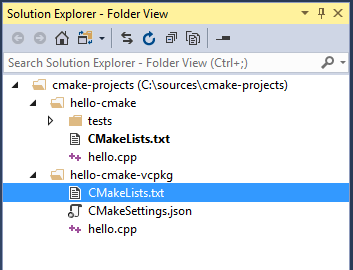

**Visual Studio 2017 version 15.7 and later**: You can also view your projects organized logically by targets. Choose **Targets view** from the dropdown in the **Solution Explorer** toolbar:

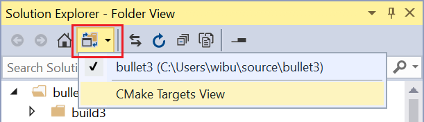

## Import an existing cache

When you import an existing CMakeCache.txt file, Visual Studio automatically extracts customized variables and creates a pre-populated [CMakeSettings.json](#cmake_settings) file based on them. The original cache is not modified in any way and can still be used from the command line or with whatever tool or IDE was used to generate it. The new CMakeSettings.json file is placed alongside the project’s root CMakeLists.txt. Visual Studio generates a new cache based the settings file.

**Visual Studio 2017 version 15.7 and later**: you can override automatic cache generation in the **Tools | Options | CMake | General** dialog.

Not everything in the cache is imported.  Properties such as the generator and the location of the compilers are replaced with defaults that are known to work well with the IDE.

### To import an existing cache

1. From the main menu, choose **File | Open | CMake**:

   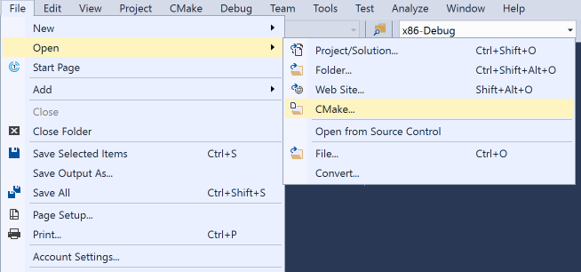

   This brings up the **Import CMake from Cache** wizard.

2. Navigate to the CMakeCache.txt file that you want to import, and then click **OK**. The **Import CMake Project from Cache** wizard appears:

   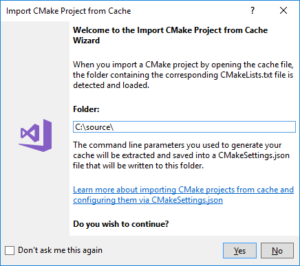

   When the wizard completes, you can see the new CMakeCache.txt file in **Solution Explorer** next to the root CMakeLists.txt file in your project.

## Building CMake projects

To build a CMake project, you have these choices:

1. Select the target in the **Debug** dropdown and press **F5**, or click the **Run** (green triangle) button. The project automatically builds first, just like a Visual Studio solution.

1. Right click on the CMakeLists.txt and select **Build** from the context menu. If you have multiple targets in your folder structure, you can choose to build all or only one specific target.

1. From the main menu, select **Build | Build Solution** (**F7** or **Ctrl+Shift+B**). Make sure that a CMake target is already selected in the **Startup Item** dropdown in the **General** toolbar.

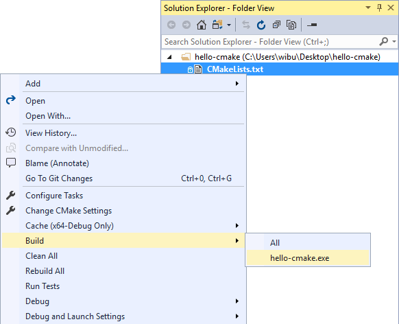

You can customize configurations and environment variables without modifying the CMakeLists.txt file by using the CMakeSettings.json file. For more information, see [Customizing CMake configurations and other settings](customizing-cmake-settings.md).

When a Visual Studio generator is selected for the active configuration, MSBuild.exe is invoked with `-m -v:minimal` arguments. To customize the build, inside the CMakeSettings.json file, you can specify additional [MSBuild command line arguments](../build/msbuild-visual-cpp-overview.md) to be passed to the build system via the `buildCommandArgs` property:

```json
"buildCommandArgs": "-m:8 -v:minimal -p:PreferredToolArchitecture=x64"
```

As you would expect, build results are shown in the **Output Window** and **Error List**.

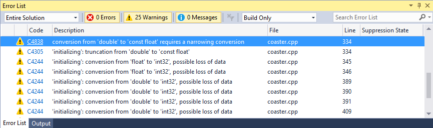

In a folder with multiple build targets, you can choose the **Build** item on the **CMake** menu or the **CMakeLists.txt** context menu to specify which CMake target to build. Pressing **Ctrl+Shift+B** in a CMake project builds the current active document.

## Debug the project

To debug a CMake project, choose the desired configuration and press **F5**, or press the **Run** button in the toolbar. If the **Run** button says "Select Startup Item", select the dropdown arrow and choose the target that you want to run. (In a CMake project, the "Current document" option is only valid for .cpp files.)

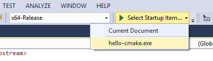

The **Run** or **F5** commands first build the project if changes have been made since the previous build.

For more information, see [Configure CMake debugging sessions](configure-cmake-debugging-sessions.md).


## Editing CMakeLists.txt files

To edit a CMakeLists.txt file, right click on the file in **Solution Explorer** and choose **Open**. If you make changes to the file, a yellow status bar appears and informs you that IntelliSense will update, and gives you an opportunity to cancel the update operation. For information about CMakeLists.txt, see the [CMake documentation](https://cmake.org/documentation/).

   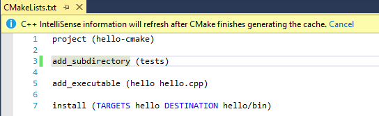

As soon as you save the file, the configuration step automatically runs again and displays information in the **Output** window. Errors and warnings are shown in the **Error List** or **Output** window. Double-click on an error in the **Error List** to navigate to the offending line in CMakeLists.txt.

   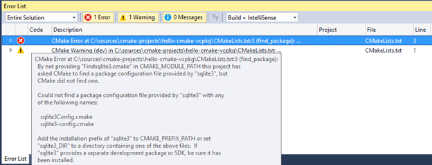


## CMake configure step

When significant changes are made to the CMakeSettings.json or to CMakeLists.txt files, Visual Studio automatically reruns the CMake configure step. If the configure step finishes without errors, the information that is collected is available in C++ IntelliSense and language services and also in build and debug operations.

When multiple CMake projects use the same CMake configuration name (for example, x86-Debug), all of them are configured and built (in their own build root folder) when that configuration is selected. You can debug the targets from all of the CMake projects that participate in that CMake configuration.

   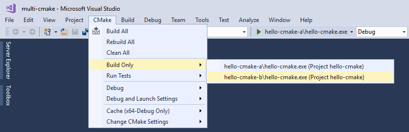

To limit builds and debug sessions to a subset of the projects in the workspace, create a new configuration with a unique name in the CMakeSettings.json file and apply it to those projects only. When that configuration is selected, the IntelliSense and build and debug commands are enabled only for those specified projects.

## Troubleshooting CMake cache errors

If you need more information about the state of the CMake cache to diagnose a problem, open the **CMake** main menu or the **CMakeLists.txt** context menu in **Solution Explorer** to run one of these commands:

- **View Cache** opens the CMakeCache.txt file from the build root folder in the editor. (Any edits you make here to CMakeCache.txt are wiped out if you clean the cache. To make changes that persist after the cache is cleaned, see [CMake settings and custom configurations](#cmake_settings) earlier in this article.)

- **Open Cache Folder** opens an Explorer window to the build root folder.

- **Clean Cache** deletes the build root folder so that the next CMake configure step starts from a clean cache.

- **Generate Cache** forces the generate step to run even if Visual Studio considers the environment up-to-date.

**Visual Studio 2017 version 15.7 and later**: Automatic cache generation can be disabled in the **Tools | Options | CMake | General** dialog.

## Single File Compilation

**Visual Studio 2017 version 15.7 and later**: To build a single file in a CMake project, right-click on the file in **Solution Explorer** and choose **Compile**. You can also build the file that is currently open in the editor by using the main CMake menu:

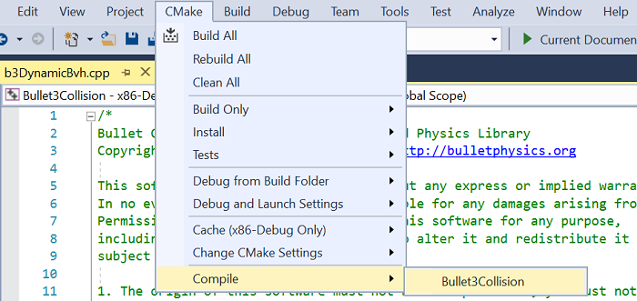

## Run CMake from the command line

If you have installed CMake from the Visual Studio Installer, you can run it from the command line by following these steps:

1. Run the appropriate vsdevcmd.bat (x86/x64). See [Building on the Command Line](../build/building-on-the-command-line.md) for more information.

1. Switch to your output folder.

1. Run CMake to build/configure your app.
