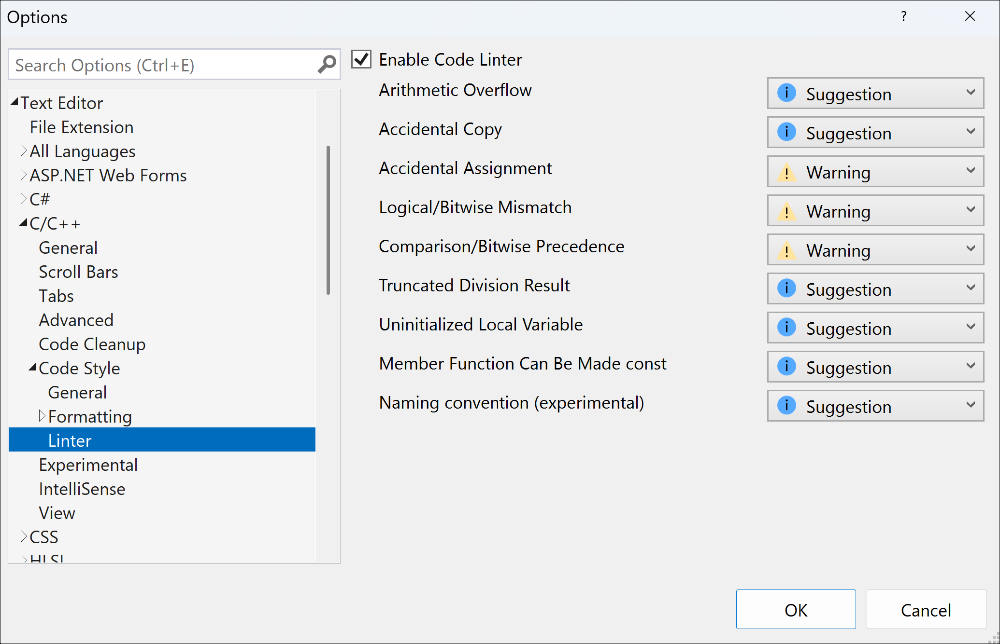

# IntelliSense code linter for C++ overview

The IntelliSense code linter for C++ helps developers find and fix common C++ problems right inside Visual Studio. It's based on the same engine that provides C++ IntelliSense, so problems are flagged as soon as you type them.

:::image type="complex" source="media/linter-demo-animation.gif" alt-text="Animation showing the C plus plus linter in action.":::
As the user types if (i = 3), a popup appears suggesting the correction i == 3, which is selected and updates the code to read if (i == 3)
:::image-end:::

## Find problems

Starting in Visual Studio 2022, the C++ Linter is enabled by default. To use it, just open a source file in the editor. The linter shows any problems it finds by annotations in the editor window and in the Error List window. In Visual Studio 2019, the C++ linter is available as an option. To enable it, follow the instructions in [Configure the linter](#configure-the-linter).

## Fix problems

Most of the linter checks have suggestions for fixing the problem. Hover over the error squiggle and choose the light bulb that pops up to see the suggestions. A preview diff of the suggested change is shown, so you can confirm the change makes sense before you apply it.

## Configure the linter

You can enable or disable the linter, or configure the severity level for each check, in the C++ Code Style options.

To change the linter options, on the menu bar, select **Tools** > **Options**. In the Options dialog, expand  **Text Editor** > **C/C++** > **Code Style** > **Linter**.

By default, many of the checks have **Suggestion** severity so the Linter results aren't intrusive while you write code. You can set the severity to **Warning** or **Error**. Individual checks can be disabled by changing their severity to **None**.

When you change the check severity level, it changes how the problem is shown in the editor window and in the Error List window. Changes take effect for newly opened files.

::: moniker range=">=msvc-170"

(The presentation in Visual Studio 2019 is slightly different, but the options are similar.)

::: moniker-end

## Known issues

::: moniker range="msvc-170"

- The **Comparison/Bitwise Precedence** check isn't available in the initial release of Visual Studio 2022, even though you can configure it in the Options dialog. It's available starting in Visual Studio 2022 version 17.1.

::: moniker-end
::: moniker range="msvc-160"

- The **Comparison/Bitwise Mismatch** check isn't available in Visual Studio 2019, even though you can configure it in the Options dialog.

::: moniker-end

## See also

[C++ Team Blog - IntelliSense Code Linter for C++](https://devblogs.microsoft.com/cppblog/intellisense-code-linter-for-cpp/)
