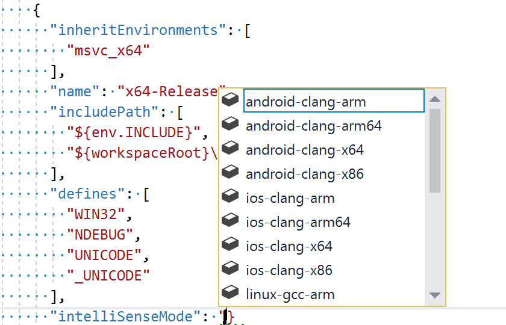

# CppProperties.json schema reference

Open Folder projects that don't use CMake can store project configuration settings in a `CppProperties.json` file. (CMake projects use a [CMakeSettings.json](customize-cmake-settings.md) file.) The Visual Studio IDE uses `CppProperties.json` for IntelliSense and code navigation. A configuration consists of name/value pairs and defines #include paths, compiler switches, and other parameters. 


## Default configurations

Visual Studio provides predefined configurations for x86 and x64 Debug and Release. By default, your project has an x86-Debug configuration in `CppProperties.json`. To add a new configuration, right click on the `CppProperties.json` file in **Solution Explorer** and choose **Add Configuration**:


The default configurations are shown here:

```json
{
  "configurations": [
    {
      "inheritEnvironments": [
        "msvc_x86"
      ],
      "name": "x86-Debug",
      "includePath": [
        "${env.INCLUDE}",
        "${workspaceRoot}\\**"
      ],
      "defines": [
        "WIN32",
        "_DEBUG",
        "UNICODE",
        "_UNICODE"
      ],
      "intelliSenseMode": "windows-msvc-x86"
    },
    {
      "inheritEnvironments": [
        "msvc_x86"
      ],
      "name": "x86-Release",
      "includePath": [
        "${env.INCLUDE}",
        "${workspaceRoot}\\**"
      ],
      "defines": [
        "WIN32",
        "NDEBUG",
        "UNICODE",
        "_UNICODE"
      ],
      "intelliSenseMode": "windows-msvc-x86"
    },
    {
      "inheritEnvironments": [
        "msvc_x64"
      ],
      "name": "x64-Debug",
      "includePath": [
        "${env.INCLUDE}",
        "${workspaceRoot}\\**"
      ],
      "defines": [
        "WIN32",
        "_DEBUG",
        "UNICODE",
        "_UNICODE"
      ],
      "intelliSenseMode": "windows-msvc-x64"
    },
    {
      "inheritEnvironments": [
        "msvc_x64"
      ],
      "name": "x64-Release",
      "includePath": [
        "${env.INCLUDE}",
        "${workspaceRoot}\\**"
      ],
      "defines": [
        "WIN32",
        "NDEBUG",
        "UNICODE",
        "_UNICODE"
      ],
      "intelliSenseMode": "windows-msvc-x64"
    }
  ]
}
```
For properties that have a set of allowable values, the code editor shows the available options when you start to type:




## Configuation properties

A configuration may have any of the following properties:

|||
|-|-|
|`name`|the configuration name that appears in the C++ configuration dropdown|
|`includePath`|the list of folders that should be specified in the include path (maps to /I for most compilers)|
|`defines`|the list of macros that should be defined (maps to /D for most compilers)|
|`compilerSwitches`|one or more additional switches that can influence IntelliSense behavior|
|`forcedInclude`|header to be automatically included in every compilation unit (maps to /FI for MSVC or -include for clang)|
|`undefines`|the list of macros to be undefined (maps to /U for MSVC)|
|`intelliSenseMode`|the IntelliSense engine to be used. You can specify the architecture specific variants for MSVC, gcc or Clang:<br/><br/>- msvc-x86 (default)<br/>- msvc-x64<br/>- msvc-arm<br/>- windows-clang-x86<br/>- windows-clang-x64<br/>- windows-clang-arm<br/>- Linux-x64<br/>- Linux-x86<br/>- Linux-arm<br/>- gccarm|

## Custom configurations


You can customize any of the default configuations in `CppProperties.json`, or create new configurations. Each will appear in the configuration dropdown:

```json
{
  "configurations": [
    {
      "name": "Windows",
      ...
    },
    {
      "name": "with EXTERNAL_CODECS",
      ...
    }
  ]
}
```

## System environment variables 

 `CppProperties.json` supports system environment variable expansion for include paths and other property values. The syntax is `${env.FOODIR}` to expand an environment variable `%FOODIR%`. The following system-defined variables are also supported:

|Variable Name|Description|
|-----------|-----------------|
|vsdev|The default Visual Studio environment|
|msvc_x86|Compile for x86 using x86 tools|
|msvc_arm|Compile for ARM using x86 tools|
|msvc_arm64|Compile for ARM64 using x86 tools|
|msvc_x86_x64|Compile for AMD64 using x86 tools|
|msvc_x64_x64|Compile for AMD64 using 64-bit tools|
|msvc_arm_x64|Compile for ARM using 64-bit tools|
|msvc_arm64_x64|Compile for ARM64 using 64-bit tools|

When the Linux workload is installed, the following environments are available for remotely targeting Linux and WSL:

|Variable Name|Description|
|-----------|-----------------|
|linux_x86|Target x86 Linux remotely|
|linux_x64|Target x64 Linux remotely|
|linux_arm|Target ARM Linux remotely|

## Custom environment variables

You can define custom environment variables in `CppProperties.json` either globally or per-configuration. The following example shows how default and custom environment variables can be declared and used. The global **environments** property declares a variable named **INCLUDE** that can be used by any configuration:

```json
{
  // The "environments" property is an array of key value pairs of the form
  // { "EnvVar1": "Value1", "EnvVar2": "Value2" }
  "environments": [
    {
      "INCLUDE": "${workspaceRoot}\src\includes"
    }
  ],

  "configurations": [
    {
      "inheritEnvironments": [
        // Inherit the MSVC 32-bit environment and toolchain.
        "msvc_x86"
      ],
      "name": "x86",
      "includePath": [
        // Use the include path defined above.
        "${env.INCLUDE}"
      ],
      "defines": [ "WIN32", "_DEBUG", "UNICODE", "_UNICODE" ],
      "intelliSenseMode": "msvc-x86"
    },
    {
      "inheritEnvironments": [
        // Inherit the MSVC 64-bit environment and toolchain.
        "msvc_x64"
      ],
      "name": "x64",
      "includePath": [
        // Use the include path defined above.
        "${env.INCLUDE}"
      ],
      "defines": [ "WIN32", "_DEBUG", "UNICODE", "_UNICODE" ],
      "intelliSenseMode": "msvc-x64"
    }
  ]
}
```
## Per-configuration environment variables

You can also define an **environments** property inside a configuration, so that it applies only to that configuration, and overrides any global variables of the same name. In the following example, the x64 configuration defines a local **INCLUDE** variable that overrides the global value:

```json
{
  "environments": [
    {
      "INCLUDE": "${workspaceRoot}\src\includes"
    }
  ],

  "configurations": [
    {
      "inheritEnvironments": [
        "msvc_x86"
      ],
      "name": "x86",
      "includePath": [
        // Use the include path defined in the global environments property.
        "${env.INCLUDE}"
      ],
      "defines": [ "WIN32", "_DEBUG", "UNICODE", "_UNICODE" ],
      "intelliSenseMode": "msvc-x86"
    },
    {
      "environments": [
        {
          // Append 64-bit specific include path to env.INCLUDE.
          "INCLUDE": "${env.INCLUDE};${workspaceRoot}\src\includes64"
        }
      ],

      "inheritEnvironments": [
        "msvc_x64"
      ],
      "name": "x64",
      "includePath": [
        // Use the include path defined in the local environments property.
        "${env.INCLUDE}"
      ],
      "defines": [ "WIN32", "_DEBUG", "UNICODE", "_UNICODE" ],
      "intelliSenseMode": "msvc-x64"
    }
  ]
}
```

All custom and default environment variables are also available in `tasks.vs.json` and `launch.vs.json`.

#### Build-in macros

You have access to the following built-in macros inside `CppProperties.json`:

|||
|-|-|
|`${workspaceRoot}`| the full path to the workspace folder|
|`${projectRoot}`| the full path to the folder where `CppProperties.json` is placed|
|`${vsInstallDir}`| the full path to the folder where the running instance of VS 2017 is installed|

For example, if your project has an include folder and also includes windows.h and other common headers from the Windows SDK, you may want to update your `CppProperties.json` configuration file with these includes:

```json
{
  "configurations": [
    {
      "name": "Windows",
      "includePath": [
        // local include folder
        "${workspaceRoot}\include",
        // Windows SDK and CRT headers
        "${env.WindowsSdkDir}\include\${env.WindowsSDKVersion}\ucrt",
        "${env.NETFXSDKDir}\include\um",
        "${env.WindowsSdkDir}\include\${env.WindowsSDKVersion}\um",
        "${env.WindowsSdkDir}\include\${env.WindowsSDKVersion}\shared",
        "${env.VCToolsInstallDir}\include"
      ]
    }
  ]
}
```

> [!Note]
> `%WindowsSdkDir%` and `%VCToolsInstallDir%` are not set as global environment variables so make sure you start devenv.exe from a "Developer Command Prompt for VS 2017" that defines these variables.

## Troubleshoot IntelliSense errors

To troubleshoot IntelliSense errors caused by missing include paths, open the **Error List** and filter its output to "IntelliSense only" and error code E1696 "cannot open source file ...".


