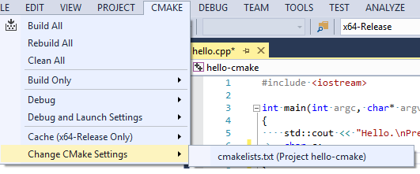

# Customizing CMake settings

By default, Visual Studio provides six default CMake configurations ("x86-Debug", "x86-Release", "x64-Debug", "x64-Release", "Linux-Debug" and "Linux-Release"). These configurations define how CMake.exe is invoked to create the CMake cache for a given project. To modify these configurations, or create a new custom configuration, choose **CMake | Change CMake Settings**, and then choose the CMakeLists.txt file that the settings apply to. The **Change CMake Settings** command is also available on the file's context menu in **Solution Explorer**. This command creates a CMakeSettings.json file in the project folder. This file is used to re-create the CMake cache file, for example after a **Clean** operation.

   

JSON IntelliSense helps you edit the CMakeSettings.json file:

   

The following example shows a sample configuration, which you can use as the starting point to create your own in CMakeSettings.json:

```json
    {
      "name": "x86-Debug",
      "generator": "Ninja",
      "configurationType": "Debug",
      "inheritEnvironments": [ "msvc_x86" ],
      "buildRoot": "${env.USERPROFILE}\\CMakeBuilds\\${workspaceHash}\\build\\${name}",
      "installRoot": "${env.USERPROFILE}\\CMakeBuilds\\${workspaceHash}\\install\\${name}",
      "cmakeCommandArgs": "",
      "buildCommandArgs": "-v",
      "ctestCommandArgs": ""
    },

```

1. **name**: the name that appears in the C++ configuration dropdown. This property value can also be used as a macro, `${name}`, to specify other property values. For an example, see the **buildRoot** definition in CMakeSettings.json.

1. **generator**: maps to the **-G** switch and specifies the generator to be used. This property can also be used as a macro, `${generator}`, to help specify other property values. Visual Studio currently supports the following CMake generators:

    - "Ninja"
    - "Visual Studio 14 2015"
    - "Visual Studio 14 2015 ARM"
    - "Visual Studio 14 2015 Win64"
    - "Visual Studio 15 2017"
    - "Visual Studio 15 2017 ARM"
    - "Visual Studio 15 2017 Win64"

    Because Ninja is designed for fast build speeds instead of flexibility and function, it is set as the default. However, some CMake projects may be unable to correctly build using Ninja. If this occurs, you can instruct CMake to generate a Visual Studio project instead.

    To specify a Visual Studio generator, open the CMakeSettings.json from the main menu by choosing **CMake | Change CMake Settings**. Delete “Ninja” and type “V”. This activates IntelliSense, which enables you to choose the generator you want.

1. **buildRoot**: maps to **-DCMAKE_BINARY_DIR** switch and specifies where the CMake cache will be created. If the folder does not exist, it is created.

1. **variables**: contains a name-value pair of CMake variables that will get passed as **-D** *_name_=_value_* to CMake. If your CMake project build instructions specify the addition of any variables directly to the CMake cache file, it is recommended that you add them here instead. The following example shows how to specify the name-value pairs:

```json
"variables": [
    {
      "name": "CMAKE_CXX_COMPILER",
      "value": "C:/Program Files (x86)/Microsoft Visual Studio/157/Enterprise/VC/Tools/MSVC/14.14.26428/bin/HostX86/x86/cl.exe"
    },
    {
      "name": "CMAKE_C_COMPILER",
      "value": "C:/Program Files (x86)/Microsoft Visual Studio/157/Enterprise/VC/Tools/MSVC/14.14.26428/bin/HostX86/x86/cl.exe"
    }
  ]
```

1. **cmakeCommandArgs**: specifies any additional switches you want to pass to CMake.exe.

1. **configurationType**: defines the build configuration type for the selected generator. Currently supported values are "Debug", "MinSizeRel", "Release", and "RelWithDebInfo".

1. **ctestCommandArgs**: specifies additional switches to pass to CTest when running tests.

1. **buildCommandArgs**: specifies additional switches to pass to the underlying build system. For example, passing -v when using the Ninja generator forces Ninja to output command lines.

## Environment variables

CMakeSettings.json also supports consuming environment variables in any of the properties mentioned above. The syntax to use is `${env.FOO}` to expand the environment variable %FOO%.
You also have access to built-in macros inside this file:

- `${workspaceRoot}` – provides the full path of the workspace folder
- `${workspaceHash}` – hash of workspace location; useful for creating a unique identifier for the current workspace (for example, to use in folder paths)
- `${projectFile}` – the full path of the root CMakeLists.txt file
- `${projectDir}` – the full path of the folder of the root CMakeLists.txt file
- `${thisFile}` – the full path of the CMakeSettings.json file
- `${name}` – the name of the configuration
- `${generator}` – the name of the CMake generator used in this configuration

## Ninja command line arguments

If targets are unspecified, builds the 'default' target (see manual).

```cmd
C:\Program Files (x86)\Microsoft Visual Studio\Preview\Enterprise>ninja -?
ninja: invalid option -- `-?'
usage: ninja [options] [targets...]
```

|Option|Description|
|--------------|------------|
| --version  | print ninja version ("1.7.1")|
|   -C DIR   | change to DIR before doing anything else|
|   -f FILE  | specify input build file (default=build.ninja)|
|   -j N     | run N jobs in parallel (default=14, derived from CPUs available)|
|   -k N     | keep going until N jobs fail (default=1)|
|   -l N     | do not start new jobs if the load average is greater than N|
|   -n       | dry run (don't run commands but act like they succeeded)|
|   -v       | show all command lines while building|
|   -d MODE  | enable debugging (use -d list to list modes)|
|   -t TOOL  | run a subtool (use -t list to list subtools). terminates toplevel options; further flags are passed to the tool|
|   -w FLAG  | adjust warnings (use -w list to list warnings)|

## Inherited environments (Visual Studio 2017 version 15.5)

CMakeSettings.json now supports inherited environments. This feature enables you to (1) inherit default environments and (2) create custom environment variables that are passed to CMake.exe when it runs.

```json
  "inheritEnvironments": [ "msvc_x64_x64" ]
```

The example above is the same as running the **Developer Command Prompt for VS 2017** with the **-arch=amd64 -host_arch=amd64** arguments.

The following table shows the default values:

|Context Name|Description|
|-----------|-----------------|
|vsdev|The default Visual Studio environment|
|msvc_x86|Compile for x86 using x86 tools|
|msvc_arm| Compile for ARM using x86 tools|
|msvc_arm64|Compile for ARM64 using x86 tools|
|msvc_x86_x64|Compile for AMD64 using x86 tools|
|msvc_x64_x64|Compile for AMD64 using 64-bit tools|
|msvc_arm_x64|Compile for ARM using 64-bit tools|
|msvc_arm64_x64|Compile for ARM64 using 64-bit tools|

### Custom environment variables

In CMakeSettings.json, you can define custom environment variables globally or per-configuration in the **environments** property. The following example defines one global variable, **BuildDir**, which is inherited in both the x86-Debug and x64-Debug configurations. Each configuration uses the variable to specify the value for the **buildRoot** property for that configuration. Note also how each configuration uses the **inheritEnvironments** property to specify a variable that applies only to that configuration.

```json
{
  // The "environments" property is an array of key value pairs of the form
  // { "EnvVar1": "Value1", "EnvVar2": "Value2" }
  "environments": [
    {
      "BuildDir": "${env.USERPROFILE}\\CMakeBuilds\\${workspaceHash}\\build",
    }
  ],

  "configurations": [
    {
      "name": "x86-Debug",
      "generator": "Ninja",
      "configurationType": "Debug",
      // Inherit the defaults for using the MSVC x86 compiler.
      "inheritEnvironments": [ "msvc_x86" ],
      "buildRoot": "${env.BuildDir}\\${name}"    },
    {
      "name": "x64-Debug",
      "generator": "Ninja",
      "configurationType": "Debug",
      // Inherit the defaults for using the MSVC x64 compiler.
      "inheritEnvironments": [ "msvc_x64" ],
      "buildRoot": "${env.BuildDir}\\${name}"
    }
  ]
}
```

In the next example, the x86-Debug configuration defines its own value for the **BuildDir** property, and this value overrides the value set by the global **BuildDir** property so that **BuildRoot** evaluates to `D:\custom-builddir\x86-Debug`.

```json
{
  "environments": [
    {
      "BuildDir": "${env.USERPROFILE}\\CMakeBuilds\\${workspaceHash}",
    }
  ],

  "configurations": [
    {
      "name": "x86-Debug",

      // The syntax for this property is the same as the global one above.
      "environments": [
        {
          // Replace the global property entirely.
          "BuildDir": "D:\\custom-builddir",
        }
      ],

      "generator": "Ninja",
      "configurationType": "Debug",
      "inheritEnvironments": [ "msvc_x86" ],
      // Evaluates to "D:\custom-builddir\x86-Debug"
      "buildRoot": "${env.BuildDir}\\${name}"
    },
    {
      "name": "x64-Debug",

      "generator": "Ninja",
      "configurationType": "Debug",
      "inheritEnvironments": [ "msvc_x64" ],
      // Since this configuration doesn’t modify BuildDir, it inherits
      // from the one defined globally.
      "buildRoot": "${env.BuildDir}\\${name}"
    }
  ]
}
```
