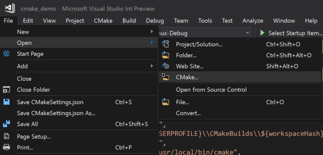
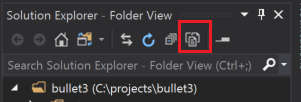
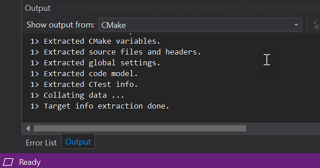
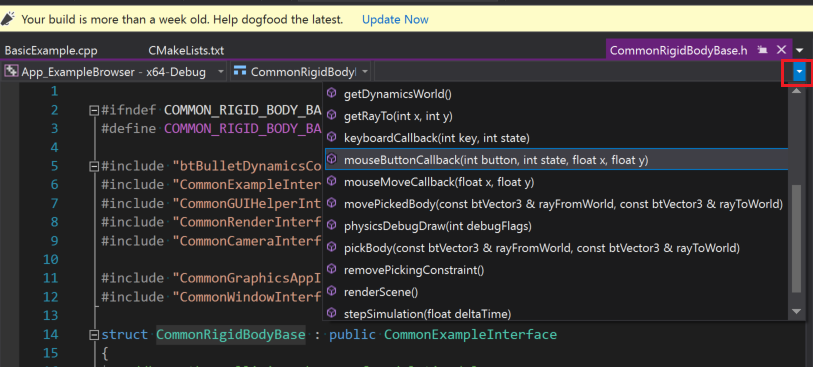
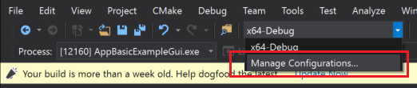
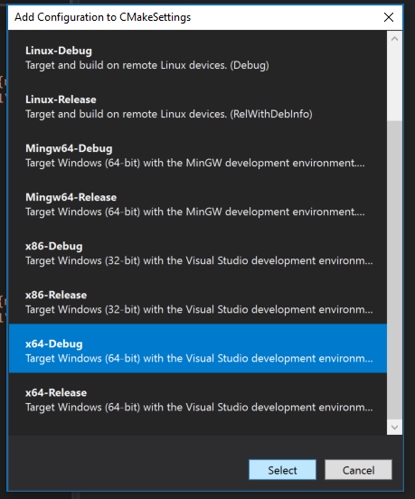
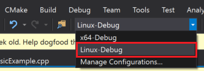

# Tutorial: Create C++ cross-platform projects in Visual Studio 

Visual Studio C and C++ development isn't just for Windows anymore. This tutorial shows how to use Visual Studio for C++ cross platform development based on CMake without having to create or generate Visual Studio projects. When you open a folder that contains a CMakeLists.txt file, Visual Studio configures IntelliSense and build settings automatically. You can quickly be editing, building, and debugging your code locally on Windows, and then switch your configuration to do the same on Linux, all from within Visual Studio.

In this tutorial, you learn how to:

> [!div class="checklist"]
> * clone an open-source CMake project from GitHub
> * open the project in Visual Studio 
> * build and debug an executable target on Windows
> * add a connection to a Linux machine
> * build and debug the same target on Linux

## Prerequisites

- Set up Visual Studio for Cross Platform C++ Development
    - First you need to have [Visual Studio installed](https://visualstudio.microsoft.com/vs/). Next, confirm that you have the **Desktop development with C++** and **Linux development with C++ workloads** installed. This minimal install is only 3 GB, depending on your download speed installation shouldn't take more than 10 minutes.
- Set up a Linux machine for Cross Platform C++ Development
    - Visual Studio doesn't require any specific distribution of Linux. The OS can be running on a physical machine, in a VM, the cloud, or the Windows Subsystem for Linux (WSL). However, for this tutorial a graphical environment is required; therefore WSL isn't recommended because it's intended primarily for command line operations.
    - The tools that Visual Studio requires on the Linux machine are: C++ compilers, GDB, ssh, and zip. On Debian based systems, you can install these dependencies as follows.
    
    ```cmd
        sudo apt install -y openssh-server build-essential gdb zip
    ```
    - Visual Studio requires that the Linux machine have a recent version of CMake that has server mode enabled (at least 3.8). Microsoft produces a universal build of CMake that you can install on any Linux distro. We recommend using this build to ensure that you have the latest features. You can get the CMake binaries from [the Microsoft fork of the CMake repo](https://github.com/Microsoft/CMake/releases) on GitHub. Go to that page and download the version that matches your system architecture on your Linux machine, then mark it as an executable:
    
    ```cmd
        wget <path to binary>
        chmod +x cmake-3.11.18033000-MSVC_2-Linux-x86_64.sh
    ```
    - You can see the options for running the script with `-–help`. We recommend that you use the `–prefix` option to specify installing in the **/usr/local** path because that is the default location where Visual Studio looks for CMake. The following example shows the Linux-x86_64 script. Change that as needed if you are using a different target platform. 
    
    ```cmd
        sudo ./cmake-3.11.18033000-MSVC_2-Linux-x86_64.sh --skip-license --prefix=/usr/local
    ```
- Git for windows installed on your Windows machine.
- A GitHub account.

## Clone an open-source CMake project from GitHub

This tutorial uses the Bullet Physics SDK on GitHub, which provides collision detection and physics simulations for a variety of different applications. It includes sample executable programs that compile and run without having to write additional code. This tutorial doesn't modify any of source code or build scripts. To start, clone the bullet3 repository from GitHub on the machine where you have Visual Studio installed. 

```cmd

git clone https://github.com/bulletphysics/bullet3.git

```

1. From the Visual Studio main menu, choose **File > Open > CMake** and navigate to the CMakeLists.txt file in the root of the bullet3 repo that you just downloaded.

    

    As soon as you open the folder, your folder structure will be visible in the **Solution Explorer**.

    

    This view shows you exactly what is on disk, not a logical or filtered view. By default, it doesn't show hidden files. 

2. Press the **Show all files** button to see all the files in the folder.

    

## Switch to targets view

When you open a folder that uses CMake, Visual Studio automatically generates the CMake cache. This operation might take a few moments, depending on the size of your project. 

1. In the **Output Window**, select **Show output from** and then choose **CMake** to monitor the status of the cache generation process. When the operation is complete, it says "Target info extraction done".

    

    After this operation completes, IntelliSense is configured, the project can build, and you can debug the application. Visual Studio can now provide a logical view of the solution based on the targets specified in the CMakeLists files. 

2. Use the **Solutions and Folders** button in the **Solution Explorer** to switch to CMake Targets View.

    

    Here is what that view looks like for the Bullet SDK:

    

    Targets view provides a more intuitive view of what is in this source base. You can see some targets are libraries and others are executables. 

3. Expand a node in CMake Targets View to see its source code files, wherever those files might be located on disk.

## Set a breakpoint, build, and run

In this step, we'll debug an example program that demonstrates the Bullet Physics library.
  
1. In **Solution Explorer**, select AppBasicExampleGui and expand it. 
1. Open the file `BasicExample.cpp`. 
1. Set a breakpoint that will be hit when you click in the running application. The click event is handled in a method within a helper class. To quickly get there:

    1. Select `CommonRigidBodyBase` that the struct `BasicExample` is derived from around line 30.
    1. Right-click and choose **Go to Definition**. Now you are in the header CommonRigidBodyBase.h. 
    1. In the browser view above, your source you should see that you are in the `CommonRigidBodyBase`. To the right, you can select members to examine. Click the drop-down and select `mouseButtonCallback` to go to the definition of that function in the header.

        

1. Place a breakpoint on the first line within this function. This will be hit when you click a mouse button within the window of the application when launched under the Visual Studio debugger.

1. To launch the application, select the launch drop-down with the play icon that says "Select Startup Item" in the toolbar. In the drop-down select AppBasicExampleGui.exe. The executable name now displays on the launch button:

    

5.  Press the launch button to build the application and necessary dependencies, then launch it with the Visual Studio debugger attached. After a few moments, the running application appears:

    

6. Move your mouse into the application window, then click a button to trigger the breakpoint. This brings Visual Studio back to the foreground with the editor showing the line where execution is paused. You will be able to inspect the application variables, objects, threads, and memory. You can step through your code interactively. You can click **Continue** to let the application resume and exit it normally or cease execution within Visual Studio using the stop button.

## Add an explicit Windows x64-Debug configuration

So far, you have been using the default **x64-Debug** configuration for Windows. Configurations are how Visual Studio understands what platform target it's going to use for CMake. The default configuration isn't represented on disk. When you explicitly add a configuration, Visual Studio creates a file called CMakeSettings.json that is populated with settings for all the configurations you specify. 

1. Add a new configuration by clicking the the Configuration drop-down in the toolbar and selecting **Manage Configurations…**

    

    The **Add Configuration to CMakeSettings** dialog will appear.

    

    This dialog shows all the configurations that are included with Visual Studio, as well as any custom configurations that you might create. If you want to continue to use the default **x64-Debug** configuration, that should be the first one you add. By adding that configuration, you will be able to switch back and forth between Windows and Linux configurations. Select **x64-Debug** and click **Select**. This creates the CMakeSettings.json file with a configuration for **x64-Debug** and switches Visual Studio to use that configuration instead of the default. You will see the configuration drop-down no longer says "(default)" as part of the name. You can use whatever names you like for your configurations by changing the name parameter directly in CMakeSettings.json.

##  Add a Linux configuration and connect to the remote machine

1. Now add a Linux configuration. Right-click the CMakeSettings.json file in the **Solution Explorer** view and select **Add Configuration**. You see the same Add Configuration to CMakeSettings dialog as before. Select **Linux-Debug** this time, then save the CMakeSettings.json file. 
2. Now select **Linux-Debug** in the configuration drop-down.

    

    If this is the first time you are connecting to a Linux system, the **Connect to Remote System** dialog will appear.

    

    If you have already added a remote connection you can open this window by navigating to **Tools > Options > Cross Platform > Connection Manager**.
 
3. Provide the connection information to your Linux machine and click **Connect**. Visual Studio adds that machine as to CMakeSettings.json as your default for **Linux-Debug**. It will also pull down the headers from your remote machine so that you get IntelliSense specific to that machine when you use it. Now Visual Studio will send your files to the remote machine, then generate the CMake cache there, and when that is done Visual Studio will be configured for using the same source base with that remote Linux machine. These steps may take some time depending on the speed of your network and power of your remote machine. You will know this is complete when the message "Target info extraction done" appears in the CMake output window.

## Set a breakpoint, build and run on Linux

Because this is a desktop application, you need to provide some additional configuration information to the debug configuration. 

1. In the CMake Targets view, right-click AppBasicExampleGui and choose **Debug and Launch Settings** to open the launch.vs.json file that is in the hidden **.vs** subfolder. This file is local to your development environment. You can move it into the root of your project if you wish to check it in and save it with your team. In this file a configuration has been added for AppBasicExampleGui. These default settings work in most cases, but because this is a desktop application you need to provide some additional information to launch the program in a way you can see it on our Linux machine. 
2. You need to know the value of the environment variable `DISPLAY` on your Linux machine, run this command to get it.

    ```cmd
    echo $DISPLAY
    ```

    In the configuration for AppBasicExampleGui there is a parameter array "pipeArgs". Within there is a line "${debuggerCommand}". This is the command that launches gdb on the remote machine. Visual Studio needs to export the display into this context before that command runs. For example, if the value of your display :1, modify that line as follows:

    ```cmd
    "export DISPLAY=:1;${debuggerCommand}",
    ```
3. Now in order to launch and debug our application, choose the **Select Startup Item** drop-down in the toolbar and choose AppBasicExampleGui. Now press that button or hit **F5**. This will build the application and its dependencies on the remote Linux machine then launch it with the Visual Studio debugger attached. On your remote Linux machine, you should see an application window appear.

4. Move your mouse into the application window, click a button, and the breakpoint will be hit. Program execution pauses, Visual Studio comes back to the foreground, and you will be at your breakpoint. You should also see a Linux Console Window appear in Visual Studio. This window provides output from the remote Linux machine, and it can also accept input for `stdin`. Like any Visual Studio window, it can be docked where you prefer to see it and its position will be persisted in future sessions.

    

5. You can inspect the application variables, objects, threads, memory, and step through your code interactively using Visual Studio. But this time you are doing all this on a remote Linux machine instead of your local Windows environment. You can click **Continue** to let the application resume and exit normally, or you can press the stop button, just as with local execution.

6. Look at the Call Stack window and view the Calls to `x11OpenGLWindow` since Visual Studio launched the application on Linux.

    

## What you learned 

In this tutorial, you have seen a code base cloned directly from GitHub, and built, run, and debugged on Windows with no modifications. This came code base, with minor configuration changes, was built, run and debugged on a remote Linux machine. 

## Next steps

Learn more about configuring  and debugging CMake projects in Visual Studio:
> [!div class="nextstepaction"]
> [CMake Tools for Visual C++](../ide/cmake-tools-for-visual-cpp.md)<br/>
> [Configure a Linux CMake project](../linux/cmake-linux-project.md)
> [Connect to your remote Linux computer](../linux/connect-to-your-remote-linux-computer.md)
> [Customize CMake build settings](customize-cmake-settings.md)
> [Configure CMake debugging sessions](configure-cmake-debugging-sessions.md)
> [Deploy, run, and debug your Linux project](../linux/deploy-run-and-debug-your-linux-project.md)
> [CMake predefined configuration reference](cmake-predefined-configuration-reference.md)
> 
