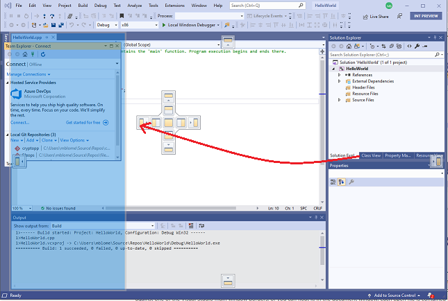
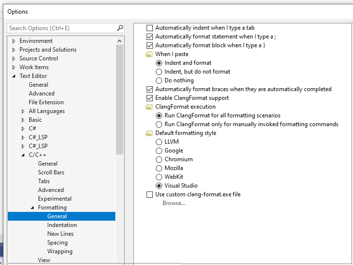
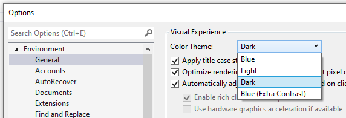
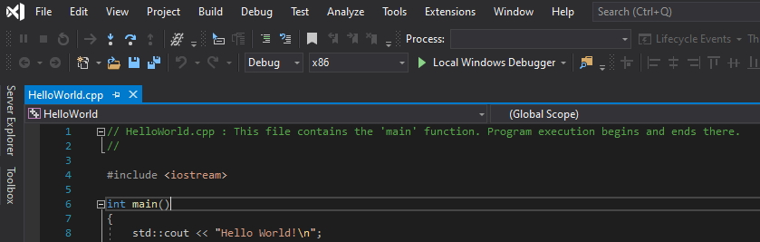
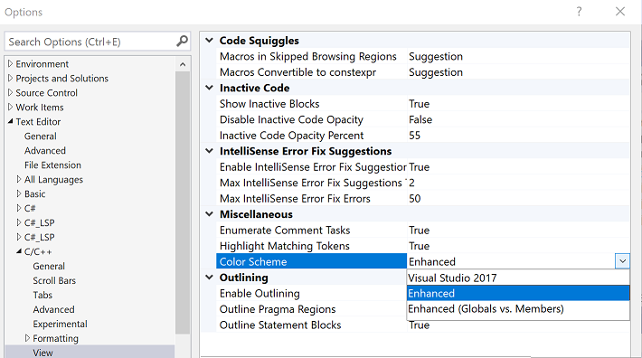
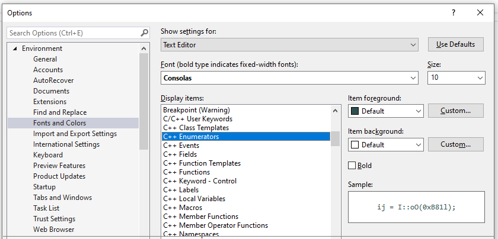
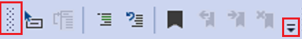
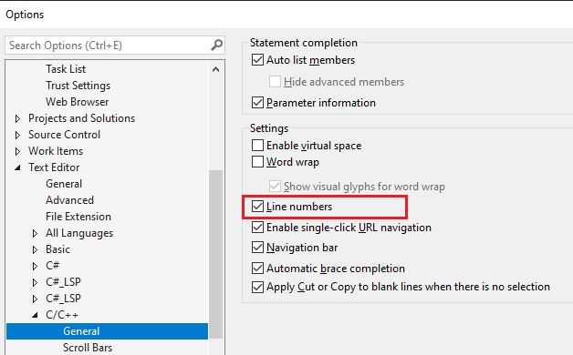

# Set your C++ coding preferences in Visual Studio

You can make your C++ coding experience more convenient, productive, and pleasurable by personalizing Visual Studio. You can:

- Customize the menus and toolbars.
- Arrange the window layout.
- Set color themes.
- Specify C++ formatting rules, including several styles of ClangFormat.
- Create custom keyboard shortcuts.

You can synchronize your preferences across multiple machines, and create and store multiple sets of preferences and share them with teammates. You can install extensions from the Visual Studio Marketplace, giving you additional options for customizing behavior. For more information, see [Personalize the Visual Studio IDE](/visualstudio/ide/personalizing-the-visual-studio-ide).

## Arrange window layout

Within the Visual Studio window, the space is divided into the main menu, the toolbar, the code editor (or document window), and tool windows (such as Solution Explorer and Error List). Some windows overlap each other in the same position. For example, Solution Explorer, Class View, Resource View, and Source Control Explorer all share the same default position. You switch among them by selecting the tabs at the bottom of the frame. To make two or more of these windows visible at the same time, just drag one of them by its title bar to a new position. You can dock it against one of the Visual Studio main window borders, or you can float it.

The following screenshot shows the **Team Explorer** window being dragged from its default position to a new, docked position on the left side of the code editor. The blue shaded area shows where the window will be placed when the mouse button is released.

In the document window, each open file is contained in a tabbed frame. You can float or lock these tabs, just like tool windows. For more information, see [Customize window layouts in Visual Studio](/visualstudio/ide/customizing-window-layouts-in-visual-studio).

To hide all the tool windows and maximize the Code Editor window, press **Alt** + **Shift** + **Enter** to toggle *full-screen mode*.

## Set C++ coding styles and formatting

You can specify many individual code formatting options, such as indentation and brace positions. To do so, go to **Tools** > **Options** > **Text Editor** > **C/C++** > **Formatting** (or type **Ctrl + Q** and search for "Formatting"). Alternatively, you can specify one of the [ClangFormat](https://clang.llvm.org/docs/ClangFormat.html) styles (or your own custom ClangFormat style).

For more information about all the formatting options, see [Options, Text Editor, C/C++, Formatting](/visualstudio/ide/reference/options-text-editor-c-cpp-formatting).

## Set the color theme

To set a light or dark background, type **Ctrl + Q** and search for "Color Theme". You can also find these by going to **Tools** > **Options** > **Environment**, and choosing **Color Theme**.

For example, here's the dark theme:

## Customize code colorization

In Visual Studio 2019, you can choose from three predefined *color schemes*. These specify how code elements are colorized in the editor. To choose a theme, go to **Tools** > **Options** > **Text Editor** > **C/C++** > **View**, and choose **Color Scheme**:

In the color scheme called **Visual Studio 2017**, most code elements are simply black. In the **Enhanced** color scheme, functions, local variables, macros, and other elements are colorized. In the **Enhanced (Globals vs. Members)** scheme, global functions and variables are colorized to contrast with class members. The default mode is **Enhanced**, and it looks like this:

Regardless of which theme or color scheme is active, you can customize the font and colors for individual code elements. To do this, go to **Tools** > **Options** > **Environment** > **Fonts and Colors** (or type **Ctrl + Q** and search for "Fonts"). Scroll down the list of display items until you see the C++ options.

Colors that you set here override the values defined for the color schemes. If you want to go back to the default colors for the color scheme, set a color back to **Default**.

## Customize the toolbars

The toolbars provide a convenient way to issue commands with a single click, rather than by using the menus or keyboard shortcuts. Visual Studio includes a standard set of toolbars. For standard C++ development, the most useful toolbars are probably Standard, Text Editor, Build, Debug, Source Control, and Compare Files. For Windows development, the Dialog Editor and Image Editor are useful for laying out dialog boxes and editing icons.

Hover over the icons in the toolbar to see which command it represents:

You can add or remove commands, or create a custom toolbar, by selecting the down-arrow. To move the toolbar to a new location, drag it by the dotted bar on the left.

.

For more information, see [How to: Customize menus and toolbars in Visual Studio](/visualstudio/ide/how-to-customize-menus-and-toolbars-in-visual-studio).

## Show or hide line numbers

You can specify whether line numbers show on the left of the editor windows. In **Options**, under **C/C++**, select **General**. In the **Settings** section, select or clear **Line numbers**, depending on your preference.

## Create keyboard shortcuts

Many commands in Visual Studio have *keyboard shortcuts*, key combinations with the Ctrl, Alt, and Shift keys. You can modify these keyboard shortcuts or create new ones of your own in Visual Studio. Go to **Tools** > **Options** > **Environment** > **Keyboard** (or type **Ctrl + Q** and search for "shortcuts"). For more information, see [Identify and customize keyboard shortcuts in Visual Studio](/visualstudio/ide/identifying-and-customizing-keyboard-shortcuts-in-visual-studio).
