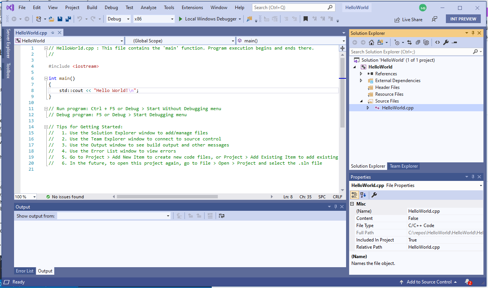

# How to set your preferences in Visual Studio

You can customize many aspects of Visual Studio to suit your personal preferences. You can create and store multiple sets of preferences; for example, you can define one window and toolbar layout and color scheme for unit testing, and another for debugging.  

## Arrange window layout

Within the Visual Studio window, the space is divided into the main menu, the toolbar, the code editor (or document window), and tool windows (**Solution Explorer**, **Error List**, and so on). The default layout is shown below: 

If you prefer to see only the code editor, press **Alt** + **Shift** + **Enter** to enter *full-screen mode*. 

Some windows overlap each other in the same position. For example, **Solution Explorer**, **Class View**, **Resource View**, and **Source Control Explorer** all share the same default position. You switch between them by clicking on the tabs at the bottom of the frame. To make two or more of these windows visible at the same time, just drag one of them by its title bar to a new position. You can dock it against one of the Visual Studio main window borders, or you can float it. In the document window, each open file is contained in a tabbed frame. You can float or lock these tabs just like tool windows. For more information, see [Customize window layouts in Visual Studio](/visualstudio/ide/customizing-window-layouts-in-visual-studio).

## Set coding styles and formatting

You can 

## Customize code colorization

## Set the color theme

## Create keyboard shortcuts