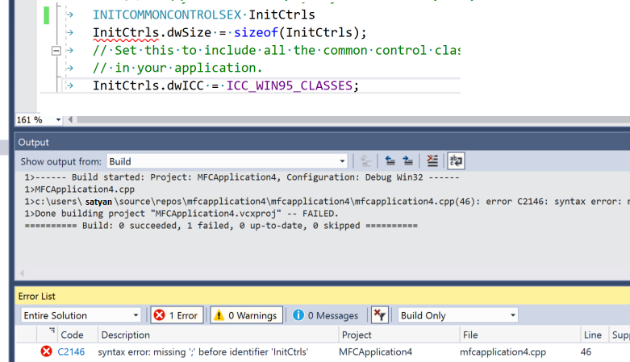
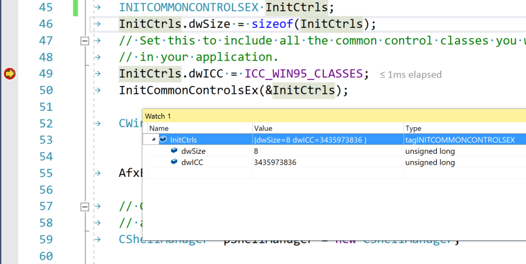

# IDE and Compiler Tools for Visual C++ Development

As part of the Visual Studio Integrated Development Environment (IDE), Microsoft Visual C++ (MSVC) shares many windows and tools in common with other languages. Many of those, including **Solution Explorer**, the code editor, and the debugger, are documented under [Visual Studio IDE](/visualstudio/ide/visual-studio-ide). Often, a shared tool or window has a slightly different set of features for C++ than for the .NET languages or JavaScript. A few windows or tools are only available in Visual Studio Professional or Visual Studio Enterprise editions.

In addition to shared tools in the Visual Studio IDE, MSVC has several tools specifically for native code development. These tools are also listed in this article. For a list of which tools are available in each edition of Visual Studio, see [Visual C++ Tools and Features in Visual Studio Editions](visual-cpp-tools-and-features-in-visual-studio-editions.md).

## Create projects

A *project* is basically a set of source code files and resources such as images or data files that are built into an executable file.

Visual Studio 2015 provides support for MSBuild projects. You can download Visual Studio extensions for other build systems such as Qt or CMake.

Visual Studio 2017 provides support for any build system or custom build tools that you wish to use, with full support for IntelliSense, browsing and debugging:

- **MSBuild** is the native build system for Visual Studio. When you select **File** > **New** > **Project** from the main menu, you see many kinds of MSBuild *project templates* that get you started quickly developing different kinds of C++ applications.

   

   In general, you should use these templates for new projects unless you have a specific reason to use CMake or another project system. Some projects have a *wizard* that guides you step-by-step through the process of creating a new project. For more information, see [Creating and managing MSBuild-based projects](../build/reference/creating-and-managing-visual-cpp-projects.md).

- **CMake** is a cross-platform build system that is integrated into the Visual Studio IDE when you install the Desktop development with C++ workload. For more information, see [CMake projects in Visual C++](../build/cmake-tools-for-visual-cpp.md).
- Any other C++ build system, including a loose collection of files, is supported via the **Open Folder** feature. You create simple JSON files to invoke your build program and configure debugging sessions. For more information, see [Open Folder projects in Visual C++](../build/non-msbuild-projects.md).

## Add to source control

Source control enables you to coordinate work among multiple developers, isolate in-progress work from production code, and backup your source code. Visual Studio supports Git and [Team Foundation Version Control \(TFVC\)](/azure/devops/repos/tfvc/) through its **Team Explorer** window.

For more information about Git integration with repos in Azure, see [Share your code with Visual Studio 2017 and Azure Repos Git](/azure/devops/repos/git/share-your-code-in-git-vs-2017). For information about Git integration with GitHub, see [GitHub Extension for Visual Studio](https://visualstudio.github.com/).

## Create user interfaces with designers

If your program has a user interface, you can use a designer to quickly populate it with controls such as buttons, list boxes and so on. When you drag a control from the toolbox window and drop it onto the design surface, Visual Studio generates the resources and code required to make it all work. You then write the code to customize the appearance and behavior.

For more information about designing a user interface for a Universal Windows Platform app, see  [Design and UI](https://developer.microsoft.com/windows/design).

For more information about creating a user interface for an MFC application, see [MFC Desktop Applications](../mfc/mfc-desktop-applications.md). For information about Win32 Windows programs, see [Windows Desktop Applications](../windows/windows-desktop-applications-cpp.md).

## Write code

After you create a project, all the project files are displayed in the **Solution Explorer** window. (A *solution* is a logical container for one or more related projects.) When you click on a .h or .cpp file in **Solution Explorer**, the file opens up in the code editor.

The code editor is a specialized word processor for C++ source code. It color-codes language keywords, method and variable names, and other elements of your code to make the code more readable and easier to understand.

For more information, see [Writing and refactoring code](writing-and-refactoring-code-cpp.md).

## Add and edit resources

The term *resource* includes things such as dialogs, icons, images, localizable strings, splash screens, database connection strings, or any arbitrary data that you want to include in the executable file.

For more information on adding and editing resources in native desktop C++ projects, see [Working with Resource Files](../windows/working-with-resource-files.md).

## Build (compile and link)

Choose **Build** > **Build Solution** on the menu bar, or enter the Ctrl+Shift+B key combination to compile and link a project. Build errors and warnings are reported in the Error List (Ctrl+\\, E). The **Output** Window (Alt+2) shows information about the build process.

For more information about MSBuild configurations, see [Working with Project Properties](../build/working-with-project-properties.md) and [Building C++ Projects in Visual Studio](../build/building-cpp-projects-in-visual-studio.md).

You can also use the compiler (cl.exe) and many other build-related standalone tools such as NMAKE and LIB directly from the command line. For more information, see [Build C/C++ code on the command line](../build/building-on-the-command-line.md) and [C/C++ Building Reference](../build/reference/c-cpp-building-reference.md).

## Debug

You can start debugging by pressing **F5**. Execution pauses on any breakpoints you have set. You can also step through code one line at a time, view the values of variables or registers, and even in some cases make changes in code and continue debugging without re-compiling. The following illustration shows a debugging session in which execution is stopped on a breakpoint. The values of the data structure members are visible in the **Watch Window**.

For more information, see [Debugging in Visual Studio](/visualstudio/debugger/debugging-in-visual-studio).

## Test

Visual Studio includes unit test frameworks for both native C++ and C++/CLI. Boost.Test, Google Test, and CTest are also supported. Run your tests from the **Test Explorer** window:

For more information, see [Verifying Code by Using Unit Tests](/visualstudio/test/unit-test-your-code) and [Write unit tests for C/C++ in Visual Studio](/visualstudio/test/writing-unit-tests-for-c-cpp).

## Analyze

Visual Studio includes static code analysis tools that can detect potential problems in your source code. These tools include an implementation of the [C++ Core Guidelines](https://github.com/isocpp/CppCoreGuidelines/blob/master/CppCoreGuidelines.md) rules checkers. For more information, see [Code analysis for C/C++ overview](/visualstudio/code-quality/code-analysis-for-c-cpp-overview).

## Deploy completed applications

You can deploy both traditional desktop applications and UWP apps to customers through the Microsoft Store. Deployment of the CRT is handled automatically behind the scenes. For more information, see [Publish Windows apps and games](/windows/uwp/publish/).

You can also deploy a native C++ desktop to another computer  For more information, see [Deploying Desktop Applications](deploying-native-desktop-applications-visual-cpp.md).

For more information about deploying a C++/CLI program, see [Deployment Guide for Developers](/dotnet/framework/deployment/deployment-guide-for-developers),

## In this section

|||
|-|-|
|[Writing and refactoring code (C++)](writing-and-refactoring-code-cpp.md)| How to use the C++ code editor to write, refactor and navigate your code.|
|[Visual C++ Tools and Features in Visual Studio Editions](visual-cpp-tools-and-features-in-visual-studio-editions.md)|Shows which features are available in the various editions of Visual Studio.|
|[C++ Open Folder projects in Visual Studio](../build/non-msbuild-projects.md).|Describes how to use any arbitrary C++ build system from Visual Studio.|
|[CMake projects in Visual C++](../build/cmake-tools-for-visual-cpp.md).|Describes how to build CMake projects in Visual Studio.|
|[Creating and managing MSBuild-based projects](../build/reference/creating-and-managing-visual-cpp-projects.md)|Provides an overview of C++ MSBuild-based projects in Visual Studio and links to other articles that explain how to create and manage them.|
|[Deploying Desktop Applications](deploying-native-desktop-applications-visual-cpp.md)|Provides an overview of deployment for C++ apps and links to other articles that describe deployment in detail.|
|[Adding Functionality with Code Wizards (C++)](adding-functionality-with-code-wizards-cpp.md)| Add classes, files, or user interface elements to a project by using wizards to guide you.|
|[XML Documentation (Visual C++)](../build/reference/xml-documentation-visual-cpp.md)| Create XML documentation for your APIs.|
|[Building C++ Projects in Visual Studio](../build/building-cpp-projects-in-visual-studio.md)|How to use the Visual Studio IDE to build projects.|

## Related Articles

|||
|-|-|
|[Building C/C++ Programs](../build/building-c-cpp-programs.md)|In-depth information about building C++ projects.|
|[Visual C++ Porting and Upgrading Guide](../porting/visual-cpp-porting-and-upgrading-guide.md)|Detailed information about how to upgrade C++ applications that were created in earlier versions of Visual Studio, and also how to migrate applications that were created by using tools other than Visual Studio.|
|[Visual C++](../visual-cpp-in-visual-studio.md)|Describes key features of Visual C++ in Visual Studio and links to the rest of the Visual C++ documentation.|
