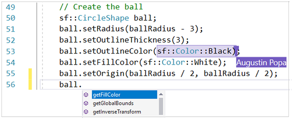
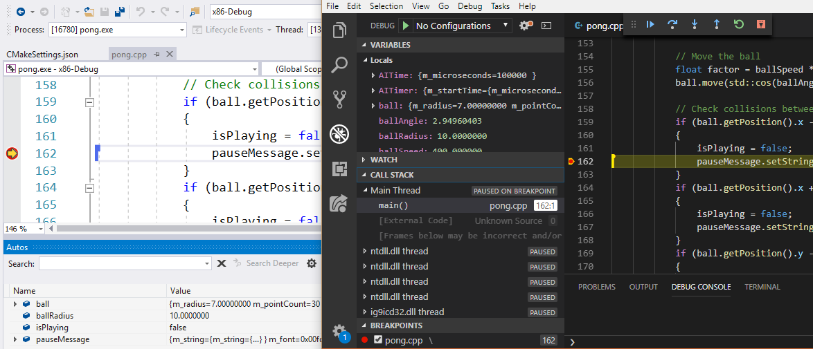
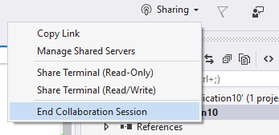

# Collaborate using Live Share for C++

In Visual Studio 2019 and Visual Studio Code, you can use **Live Share** to collaborate on C++ projects in real-time. With **Live Share** another person can edit and debug your code without having to install your project or any of its dependencies. You see each other's edits as they occur, and each edit is tagged with the name of the person who made it.

## Live Share host and guests

In a Live Share session, there's a host and one or more guests. Both host and guests can use either Visual Studio or Visual Studio Code. A Visual Studio 2019 host on Windows can share with a Visual Studio Code guest on Linux.

The host provides the guests with everything they need to be productive. Guests aren't required to have the source code, compiler, external dependencies, or even the same installed components.

The host and guests can use these IntelliSense features:

- Member List
- Parameter Help
- Quick Info
- Debugging/Breakpoints
- Find All References
- Go To Definition
- Symbol Search (Ctrl+T)
- Reference Highlighting
- Diagnostics/Errors/Squiggles

## Start and end a Live Share session

To start a Live Share session in Visual Studio, click the Share button in the top right, or go to **File** > **Start Collaboration Session**. This generates a link that you can share with your collaborators.

To end a session, select **End Collaboration Session** from the **Sharing** dropdown.

## For more information

For more information about **Live Share** in Visual Studio, see [What is Visual Studio Live Share?](/visualstudio/liveshare/). For more information about Live Share in Visual Studio Code, see [
Live Share](https://marketplace.visualstudio.com/items?itemName=ms-vsliveshare.vsliveshare).

## See Also

[Edit and refactor code (C++)](writing-and-refactoring-code-cpp.md) 
[Navigate your C++ code base in Visual Studio](navigate-code-cpp.md) 
[Read and understand C++ code](read-and-understand-code-cpp.md) 
