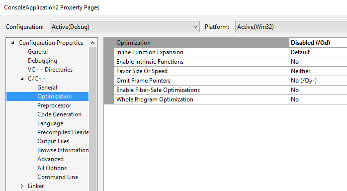

# Property Page XML rule files
The project property pages in the IDE are configured by XML files in the VCTargets folder. The exact path depends on which edition(s) of Visual Studio are installed, and the product language. For Visual Studio 2017 Enterprise Edition, in English, the path is `%ProgramFiles%\Microsoft Visual Studio\2017\Enterprise\Common7\IDE\VC\VCTargets\1033`. The XML files describe the names of the rules, the categories, and the individual properties, their data type, default values, and how they are to be displayed. When you set a property in the IDE, the new value is stored in the project file.

The only scenarios in which you need to understand the internal workings of these files and the Visual Studio IDE are (a) you want to create a custom property page, or (b) you want to customize your project properties by some means other than through the Visual Studio IDE. 

First, let's open the property pages for a project (right click on the project node in **Solution Explorer** and choose Properties):
   


Each node under **Configuration Properties** is called a Rule. A Rule sometimes represents a single tool like the compiler, but in general the term refers to something that has properties, that executes and that may produce some output. Each rule is populated from an xml file in the VCTargets folder. For example, the C/C++ rule that is shown above is populated by `cl.xml'.

As shown above, each Rule has a set of properties which are organized into categories. Each sub-node under a Rule represents a category. For example, the Optimization node under C/C++ contains all the optimization-related properties of the compiler tool. The properties and their values themselves are rendered in a grid format on the right pane.

You can open cl.xml in notepad or any XML editor (see snapshot below). You will see a root node called Rule that has the same list of properties defined under it as is displayed in the UI, along with additional metadata.

```xml  
<?xml version="1.0" encoding="utf-8"?>
<!--Copyright, Microsoft Corporation, All rights reserved.-->
<Rule Name="CL" PageTemplate="tool" DisplayName="C/C++" SwitchPrefix="/" Order="10" xmlns="http://schemas.microsoft.com/build/2009/properties" xmlns:x="http://schemas.microsoft.com/winfx/2006/xaml" xmlns:sys="clr-namespace:System;assembly=mscorlib">
  <Rule.Categories>
    <Category Name="General" DisplayName="General" />
    <Category Name="Optimization" DisplayName="Optimization" />
    <Category Name="Preprocessor" DisplayName="Preprocessor" />
    <Category Name="Code Generation" DisplayName="Code Generation" />
    <Category Name="Language" DisplayName="Language" />
    <Category Name="Precompiled Headers" DisplayName="Precompiled Headers" />
    <Category Name="Output Files" DisplayName="Output Files" />
    <Category Name="Browse Information" DisplayName="Browse Information" />
    <Category Name="Advanced" DisplayName="Advanced" />
    <Category Name="All Options" DisplayName="All Options" Subtype="Search" />
    <Category Name="Command Line" DisplayName="Command Line" Subtype="CommandLine" />
  </Rule.Categories>
...
``` 

There is one XML file corresponding to every node under Configuration Properties in the property pages UI. You can add or remove rules in the UI by including or removing locations to corresponding XML files in the project. For example, this is how Microsoft.CppBuild.targets (one level up from the 1033 folder) includes cl.xml:

```xml  
<PropertyPageSchema Condition="'$(ConfigurationType)' != 'Utility'" Include="$(VCTargetsPath)$(LangID)\cl.xml"/>

``` 
If you strip cl.xml of all data, you will end up with the following skeleton:
```xml  
<?xml version="1.0" encoding="utf-8"?>
<Rule>
  <Rule.DataSource />
  <Rule.Categories>
    <Category />
        ...
  </Rule.Categories>
  <BoolProperty />
  <EnumProperty />
  <IntProperty />
  <StringProperty />
  <StringListProperty />
</Rule>
``` 

The following section describes each major elements and some of the metadata that can be attached to them.

1. **Rule:**  Rule is generally the root node in the xml file; it can have many attributes:

```xml    
<Rule Name="CL" PageTemplate="tool" SwitchPrefix="/" Order="10"
          xmlns="http://schemas.microsoft.com/build/2009/properties"
          xmlns:x="http://schemas.microsoft.com/winfx/2006/xaml"
          xmlns:sys="clr-namespace:System;assembly=mscorlib">
  <Rule.DisplayName>
    <sys:String>C/C++</sys:String>
  </Rule.DisplayName>
```  

   a. **Name:** The Name attribute is an id for the Rule. It needs to be unique among all the property page xml files for a project.

   b. **PageTemplate:** The value of this attribute is used by the UI to choose from a collection of UI templates. The "tool" template renders the properties in a standard grid format. Other in-built values for this attribute are "debugger" and "generic". See the Debugging node and General node, respectively, to see the UI format resulting from specifying these values. The UI for "debugger" page template uses a drop-down box to switch between the properties of different debuggers whereas the "generic" template displays different property categories all in one page as opposed to having multiple category sub-nodes under the Rule node. This attribute is just a suggestion to the UI; the xml file is designed to be UI independent. A different UI might use this attribute for different purposes.

  c. **SwitchPrefix:** This is the prefix used in the command line for the switches. A value of "/" would result in switches that look like /ZI, /nologo, /W3, etc.

  d. **Order:** This is a suggestion to a prospective UI client on the relative location of this Rule compared to all other Rules in the system.

  e. **xmlns:** This is a standard XAML element. You can see three namespaces listed. These correspond to the namespaces for the XAML deserialization classes, XAML schema and system namespace, respectively.

  f. **DisplayName:** This is the name that is shown on the property page UI for the Rule node. This value is localized. We created DisplayName as a child element of Rule rather than as an attribute (like Name or SwitchPrefix) because of internal localization tool requirements. From XAML’s perspective, both are equivalent. So, you can just make it an attribute to reduce clutter or leave it as it is.

  g. **DataSource:** This is a very important property that tells the project system the location from which the property value should read from and written to, and its grouping (explained below). For cl.xml, these values are:

```xml  
       <DataSource Persistence="ProjectFile" ItemType="ClCompile" Label="" HasConfigurationCondition="true" />
```  
   - `Persistence="ProjectFile` tells the project system that all properties for the Rule should be written to the project file or the property sheet file (depending on which node was used to spawn the property pages). The other possible value is "UserFile" which will write the value to the .user file.

   - `ItemType="ClCompile"` says that the properties will be stored as ItemDefinition metadata or item metadata (the latter only if the property pages were spawned from a file node in solution explorer) of this item type. If this field is not set, then the property is written as a common property in a PropertyGroup.

   - `Label=""` indicates that when the properties are written as `ItemDefinition` metadata, the label of the parent ItemDefinitionGroup will be empty (every MSBuild element can have a Label). Visual Studio 2017 uses labeled groups to navigate the .vcxproj project file. Note that the groups that contain most Rule properties have an empty string as a label.

   - `HasConfigurationCondition="true"` tells the project system to affix a configuration condition to the value so that it takes effect only for the current project configuration (the condition could be affixed to the parent group or the value itself). For example,  open the property pages off the project node and set the value of the property **Treat Warnings As Error** under **Configuration Properties > C/C++ General** to "Yes". The following value is written to the project file. Notice the configuration condition attached to the parent ItemDefinitionGroup.

```xml  
     <ItemDefinitionGroup Condition="‘$(Configuration)|$(Platform)’==’Debug|Win32’">
        <ClCompile>
           <TreatWarningAsError>true</TreatWarningAsError>
        </ClCompile>
     </ItemDefinitionGroup>
 ```
   If this value were set in the property page for a specific file, such as stdafx.cpp, then the property value would be written under the stdafx.cpp item in the project file as shown below. Notice how the configuration condition is directly attached to the metadata itself.

 ```xml  
<ItemGroup>
   <ClCompile Include="stdafx.cpp">
      <TreatWarningAsError Condition="‘$(Configuration)|$(Platform)’==’Debug|Win32’">true</TreatWarningAsError>
   </ClCompile>
</ItemGroup>
 ```
   Another attribute of **DataSource** not listed above is **PersistedName**. You can use this attribute to represent a property in the project file using a different name. By default this attribute is set to the property’s **Name**. 

   An individual property can override its parent Rule’s DataSource. In that case,  the location for that property’s value will be different from other properties in the Rule.

   h. There are other attributes of a Rule such as Description,  SupportsFileBatching, etc that are not shown here. The full set of attributes applicable to a Rule or on any other element can be obtained by browsing the documentation for these types. Alternately, you can examine the public properties on the types in the `Microsoft.Build.Framework.XamlTypes` namespace in the `Microsoft.Build.Framework .dll` assembly.

   i. **DisplayName**, **PageTemplate**, and **Order** are UI-related properties that are present in this otherwise UI-independent data model. These properties are almost certain to be used by any UI that is used to display the property pages. **DisplayName** and **Description** are two properties that are present on almost all elements in the xml file. And these are the only two properties that are localized (localization of these strings will be explained in a later post).

2.  **Category:** A Rule can have multiple Categories. The order in which the categories are listed in the xml file is a suggestion to the UI to display the categories in the same order. For example,  the order of the categories under the C/C++ node as seen in the UI –General, Optimization, Preprocessor, …  – is the same as that in cl.xml. A sample category looks like this:

```xml  
 <Category Name="Optimization">
    <Category.DisplayName>
        <sys:String>Optimization</sys:String>
    </Category.DisplayName>
 </Category>
```
The above snippet shows the **Name** and **DisplayName** attributes that have been described before. Once again, there are other attributes a **Category** can have that are not used above. You can know about them by reading the documentation or by examining the assemblies using ildasm.exe.

3. **Properties:** This is the meat of the xml file and contains the list of all properties in this Rule. Each property can be one of five possible types shown in the XAML skeleton above. Of course, you could have only a few of those types in your file. A property has a number of attributes that allow it to be described richly. I’ll explain only the **StringProperty** here. The rest are very similar.

```xml  
<StringProperty Subtype="file" Name="ObjectFileName" Category="Output Files" Switch="Fo">
  <StringProperty.DisplayName>
    <sys:String>Object File Name</sys:String>
  </StringProperty.DisplayName>
  <StringProperty.Description>
    <sys:String>Specifies a name to override the default object file name; can be file or directory name.(/Fo[name])</sys:String>
  </StringProperty.Description>
</StringProperty>
```
Most of the attributes in the snippet have been described before. The new ones are Subtype, Category and Switch.

   a. **Subtype** is an attribute available only for **StringProperty** and **StringListProperty**; it gives contextual information. For example, the value of "file" indicates that the property represents a file path. Such contextual information is used to enhance the editing experience by providing a Windows Explorer as the property’s editor that allows the user to choose the file visually.

   b. **Category:** This declares the category under which this property falls. Try to find this property under the **Output Files** category in the UI.

   c. **Switch:** When a Rule represents a tool – such as the compiler tool in this case – most properties of the Rule are passed as switches to the tool executable during build time. The value of this attribute indicates the switch literal to be used. The property above specifies that its switch should be **Fo**. Combined with the **SwitchPrefix** attribute on the parent Rule, this property is passed to the executable as  **/Fo"Debug\"** (visible in the command line for C/C++ in the property page UI).

   Other property attributes include:

   d. **Visible:** If for some reason, you don’t want your property to show up in the property pages (but probably still available during build time), set this attribute to false.

   e. **ReadOnly:** If you want to provide a read-only view of this property’s value in the property pages, set this attribute to true.

   f. **IncludeInCommandLine:** Some properties may not need to be passed to a tool during build time. Setting this attribute to false will prevent it from being passed.


