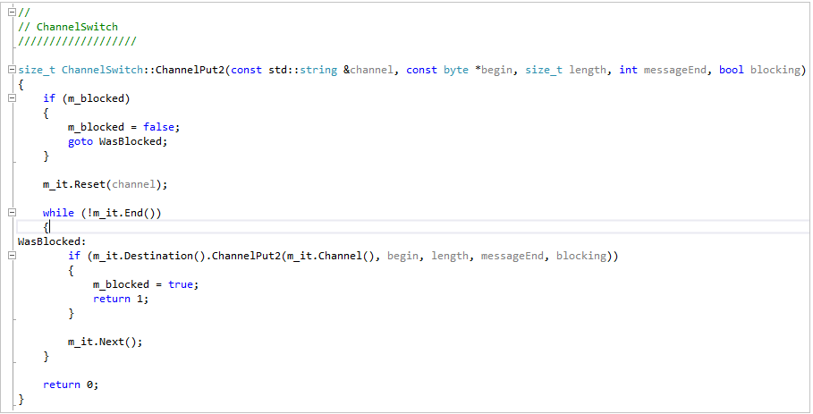
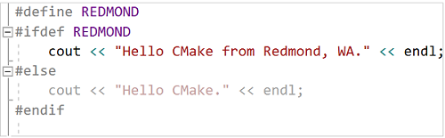
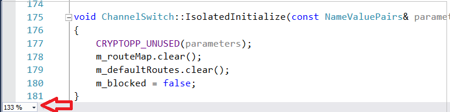
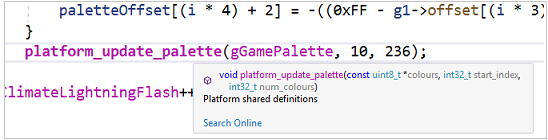
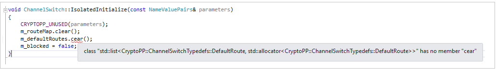
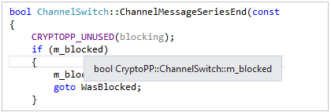
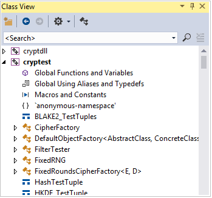

# Read and understand C++ code in Visual Studio

The C++ code editor and Visual Studio IDE provide many coding aids. Some are unique to C++, and some are essentially the same for all Visual Studio languages. For more information about the shared features, see [Writing Code in the Code and Text Editor](/visualstudio/ide/writing-code-in-the-code-and-text-editor).  

## Colorization

Visual Studio colorizes syntax elements to differentiate between types of symbols such as language keywords, type names, variable names, function parameters, string literals, and so on.

Unused code (such as code under an #if 0) is more faded in color.

You can customize the colors by typing "Fonts" in **Quick Launch**, and then choosing **Fonts and Colors**. In the **Fonts and Colors** dialog, scroll down to the C/C++ options and then choose a custom font and/or color.

## Outlining

Right-click anywhere in a source code file and choose **Outlining** to collapse or expand code blocks and/or custom regions to make it easier to browse only the code you're interested in. For more information, see [Outlining](/visualstudio/ide/outlining).

When you place your cursor in front of a curly brace, '{' or '}', the editor highlights its matching counterpart.

Other outlining options are located under **Edit** > **Outlining** in the main menu.

## Line numbers

You can add line numbers to your project by going to **Tools** > **Options** > **Text Editor** > **All Languages** > **General** or by searching for "line num" with **Quick Launch (Ctrl + Q)**. Line numbers can be set for all languages or for specific languages only, including C++.

## Scroll and zoom

You can zoom in or out in the editor by pressing the **Ctrl** key and scrolling with your mouse wheel. You can also zoom by using the zoom setting in the bottom left corner.

Scrollbar **Map Mode** enables you to quickly scroll and browse through a code file without leaving your current location. You can click anywhere on the code map to go directly to that location.

To turn on **Map Mode**, type "map" in the **Quick Launch** search box in the main toolbar and choose **Use scroll map mode**. For more information, see [How to: Track your code by customizing the scrollbar](/visualstudio/ide/how-to-track-your-code-by-customizing-the-scrollbar).

When **Map Mode** is off, the scroll bar still highlights the changes you have made in the file. Green indicates saved changes and yellow indicates unsaved changes.

## Quick Info and Parameter Info

Hover over any variable, function, or other symbol to get information about it, including the declaration, and any comments that are located just preceding it.

::: moniker range=">=msvc-160"

The **Quick Info** tooltip has a **Search Online** link. Go to **Tools** > **Options** > **Text Editor** > **C++** > **View** to specify the search provider.

If there's an error in your code, you can hover over it, and **Quick Info** will display the error message. You can also find the error message in the Error List window.

::: moniker-end

::: moniker range="<=msvc-150"

If there's an error in your code, you can hover over it, and **Quick Info** will display the error message. You can also find the error message in the **Error List** window.

::: moniker-end

When you call a function, **Parameter Info** shows the types of parameters and the order in which they're expected.

## Peek Definition

Hover over a variable or function declaration, right-click, then choose **Peek Definition** to see an inline view of its definition without navigating away from your current location. For more information, see [Peek Definition (Alt+F12)](/visualstudio/ide/how-to-view-and-edit-code-by-using-peek-definition-alt-plus-f12).

## F1 Help

Place the cursor on or just after any type, keyword or function and press **F1** to go directly to the relevant reference topic on Microsoft Learn. **F1** also works on items in the error list and in many dialog boxes.

## Class View

**Class View** displays a searchable set of trees of all code symbols and their scope and parent/child hierarchies, organized on a per-project basis. You can configure what **Class View** displays from **Class View Settings** (click the gear box icon at the top of the window).

## Generate graph of include files

Right click on a code file in your project and choose **Generate graph of include files** to see a graph of which files are included by other files.

## View Call Hierarchy

Right click on any function call and view a recursive list of all the functions that it calls, and all the functions that call it. Each function in the list can be expanded in the same way. For more information, see [Call Hierarchy](/visualstudio/ide/reference/call-hierarchy).

## See Also

[Edit and refactor code (C++)](writing-and-refactoring-code-cpp.md) 
[Navigate your C++ code base in Visual Studio](navigate-code-cpp.md) 
[Collaborate with Live Share for C++](live-share-cpp.md)
