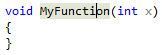

# Move Definition Location

**What:** Move a function definition to the corresponding header file.

**When:** You have a function that you want to move to a header file.

**Why:** You could manually move the function, but this feature will move it automatically, and create the header file if necessary.

**How:**

1. Place your text or mouse cursor over the function for which you want to move.

   

1. Next, do one of the following:
   * **Keyboard**
     * Press **Ctrl+.** to trigger the **Quick Actions and Refactorings** menu and select **Move Definition Location** from the context menu.
   * **Mouse**
     * Right-click and select the **Quick Actions and Refactorings** menu and select **Move Definition Location** from the context menu.

1. The function will be moved to the corresponding header file, which you'll see in a popup preview window.  If the header file doesn't exist, it will also be created and placed in the project.

   
