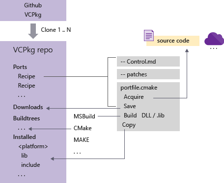
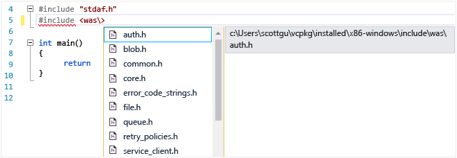

# vcpkg: C++ Package Manager for Windows 
vcpkg is a command line package manager that greatly simplifies the acquisition and installation of third-party libraries on Windows. If your project uses third-party libraries, we recommend that you use vcpkg to install them. vcpkg supports both open-source and proprietary libraries. All libraries in the vcpkg public catalog have been tested for compatibility with Visual Studio 2015 and Visual Studio 2017. As of May 2017 there are over 238 libraries in the catalog and the C++ community is adding more libraries on an ongoing basis.
The following diagram shows the basic architecture of vcpkg:
   

## Simple yet flexible
With a single command, you can download sources and build a library. vcpkg is itself an open-source project, available on GitHub. You can customize your private clone(s) in any way you like, for example by specifying different libraries, or different versions of libraries than what are found in the public catalog. You can have multiple clones of vcpkg on a single machine, each one producing custom sets of libraries and/or compilation switches, etc. Each clone is a completely self-contained, x-copyable environment with its own copy of vcpkg.exe that operates only on its own hierarchy. vcpkg is not added to any environment variables, and has no dependency on the Windows Registry or Visual Studio.

## Sources not binaries
For libraries in the public catalog, vcpkg does not download binaries, only sources. It compiles those sources using Visual Studio 2017, or Visual Studio 2015 if 2017 is not installed. In C++, it is very important that any libraries you use are complied with the same compiler, and compiler version, as the application code that links to it. By using vcpkg you eliminate or at least greatly reduce the potential for mismatched binaries and the problems they can cause. In teams that are standardized on a specific version of the Visual C++ compiler, one team member can use vcpkg to download sources and compile a set of binaries and then use the export command to zip up the binaries and headers for other team members. For more information, see Export compiled binaries and headers below. 

If you create a vcpkg clone with private libraries in the ports collection, you can add create a port that downloads prebuilt binaries and headers and write a portfile.cmake file that simply copies those files to the desired location.

## Installation
Clone the vcpkg repo from GitHub: https://github.com/Microsoft/vcpkg. You can download to any folder location you prefer.

Run the bootstrapper in the root folder: bootstrap-vcpkg.bat.
v
## Basic tasks
  
### Search the list of available libraries
To see what packages are available, at the command prompt type: `vcpkg search`

This command enumerates the control files in the vcpkg/ports subfolders. You will see a listing like this:

```cmd
ace	      6.4.3	  The ADAPTIVE Communication Environment
anax	  2.1.0-1 An open source C++ entity system. <https://github...
antlr4	  4.6-1	  ANother Tool for Language Recognition
apr	      1.5.2	  The Apache Portable Runtime (APR) is a C library ...
asio	  1.10.8  Asio is a cross-platform C++ library for network ...
assimp	  3.3.1	  The Open Asset import library
atk	      2.24.0  GNOME Accessibility Toolkit
...
```

  You can filter on a pattern, for example `vcpkg search ta`:

```cmd
botan	    2.0.1	   A cryptography library written in C++11
portaudio	19.0.6.00  PortAudio Portable Cross-platform Audio I/O API P...
taglib	    1.11.1-2   TagLib Audio Meta-Data Library

```

### Install a library on your local machine
After you get the name of a library by using the search command, you use the install command to download the library and compile it. vcpkg uses the library's portfile in the ports directory. If no triplet is specified, vcpkg will install and compile for x86-windows. If the portfile specifies dependencies, vcpkg will download and install those also. After downloading, vcpkg builds the library by using whatever build system the library uses. CMake and MSBuild projects files are preferred, but MAKE is supported along with any other build system. If vcpkg cannot find the specified build system on the local machine, it will download and install it.

```cmd
    > vcpkg install azure-storage-cpp

    The following packages will be built and installed:
      * atlmfc:x86-windows
        azure-storage-cpp:x86-windows
    Additional packages (*) will be installed to complete this operation.
```

### List the libraries already installed
After you have installed some libraries, you can use the list command to see what you have:

```cmd
> vcpkg list

boost:x86-windows	   1.64-3   Peer-reviewed portable C++ source libraries
bzip2:x86-windows	   1.0.6-1	High-quality data compressor.
cpprestsdk:x86-windows 2.9.0-2	C++11 JSON, REST, and OAuth library The C++ REST ...
openssl:x86-windows    1.0.2k-2 OpenSSL is an open source project that provides a...
websocketpp:x86-windows 0.7.0	Library that implements RFC6455 The WebSocket Pro...
zlib:x86-windows	   1.2.11	A compression library
```

### Integrate with Visual Studio
#### Per-user
Run the integrate command to configure Visual Studio to locate all vcpkg header files and binaries on a per-user basis without the need for manual editing of VC++ Directories paths. IF you have multiple clones, the clone from which you run this command becomes the new default location.

```cmd
vcpkg integrate install 
```

Now you can #include headers simply by typing the folder/header, and auto-complete will help you. No additional steps are required for linking to libs or adding project references. The following illustration shows how Visual Studio finds the azure-storage-cpp headers. vcpkg places its headers in the \installed subfolder, partitioned by target platform. The following diagram shows the list of include files in the `/was` subfolder for the library:
   

#### Per project
If you need to use a specific version of a library that is different from the version in your active vcpkg instance, you can make a new clone of vcpkg, modify the portfile for the library to obtain the version you need, and then run the install command. After that, you can use the integrate project command to create a NuGet package that references that library on a per-project basis.

### Export compiled binaries and headers
Requiring everyone on a team to download and build libraries can be inefficient. A single team member can do that work, and then use the vcpkg export command to create a zip file of the binaries and headers that can be easily shared with other team members. 

### Update installed libraries
The public catalog is kept up-to-date with the latest versions of the libraries. To determine which of your local libraries are out-of-date, use the vcpkg update command. If you choose to update your ports collection to the latest version of the public catalog, just do a git pull operation against the github repo, or create a new clone and keep the old one if it is still needed.

### Contribute new libraries
You can include any libraries you like in your private ports collection. To suggest a new library for the public catalog, 


### Remove a library
Type vcpkg remove to remove a clone and its entire hierarchy along with the property sheet that provided the integration with Visual Studio.

### Customize vcpkg
You can modify your clone of vcpkg in any way you like. You can create multiple vcpkg clones and modify the portfiles in each one to obtain specific versions of libraries or specify command-line parameters. For example, in an enterprise, one group of developers might be working on software that has one set of dependencies, and another group might have a different set. You can set up two clones of vcpkg, and modify each one to download the versions of the libraries and the compilation switches, etc, according to your needs. 

## The vcpkg folder hierarchy
All vcpkg functionality and data is completely self-contained in a single directory hierarchy; this is called an "instance". There are no registry settings or environment variables. You can have any number of instances of vcpkg on a machine and they will not interfere with each other. 

The contents of a vcpkg instance are: 
- buildtrees -- contains subfolders of sources from which each library is built
- docs -- documentation and examples
- downloads -- cached copies of the downloaded library archives. vcpkg searches here first when you run the install command .
- installed--Contains the headers and binaries for each installed library. When you integrate with VIsual Studio, you are essentially telling it add this folder to its search paths.
- packages --??
- ports -- files that describe each library in the catalog, its version, and where to download it. You can add your own ports if needed.
- scripts -- Scripts (cmake, powershell) used by vcpkg.
- toolsrc--C++ source code for vcpkg and related components
- triplets--contains the cmake settings for each supported target platform.

## Command line reference
- vcpkg search [pat]	    Search for packages available to be built
- vcpkg install <pkg>...	Install a package
- vcpkg remove <pkg>...	 Uninstall a package
- vcpkg remove --outdated	Uninstall all out-of-date packages
- vcpkg list			List installed packages
- vcpkg update			Display list of packages for updating
- vcpkg hash <file> [alg]		Hash a file by specific algorithm, default SHA512
- vcpkg integrate install		Make installed packages available user-wide. Requires admin privileges on first use
- vcpkg integrate remove		Remove user-wide integration
- vcpkg integrate project		 Generate a referencing nuget package for individual VS project use
- vcpkg export <pkg>... [opt]...  	Exports a package
- vcpkg edit <pkg>		Open up a port for editing (uses %EDITOR%, default 'code')
- vcpkg import <pkg>		Import a pre-built library
- vcpkg create <pkg> <url>	 [archivename]        Create a new package
- vcpkg owns <pat>		Search for files in installed packages
- vcpkg cache		 	List cached compiled packages
- vcpkg version			Display version information
- vcpkg contact			Display contact information to send feedback

Options:
  triplet <t>			Specify the target architecture triplet. (default: %VCPKG_DEFAULT_TRIPLET%, see 'vcpkg help triplet')

  vcpkg-root <path>		Specify the vcpkg root directory (default: %VCPKG_ROOT%)
