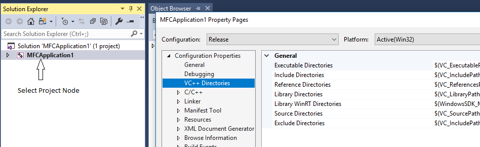
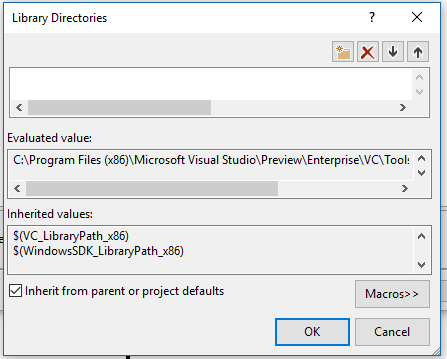
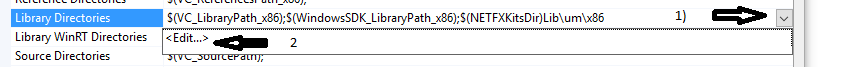
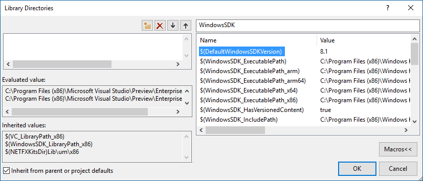

# VC++ Directories Property Page
Specifies the directories that you want Visual Studio to use to build a project. To access this property page, in **Solution Explorer**, open the shortcut menu for the project (not the solution) and choose **Properties**, and then in the left pane of the **Property Pages** dialog box, expand **Configuration Properties** and select **VC++ Directories**.  

VC++ Directories properties apply to a project, not the top-level solution node:

 

For Linux projects, see [VC++ Directories (Linux C++)](../linux/prop-pages/directories-linux.md).

  
 When you use Visual Studio to create a project, it inherits certain directories from the default values for the project type. You can override those defaults by adding a new path in the dialog. The following illustration shows the dialog for the Library paths:

 

Use this dialog to add, remove or change the search order of the paths in the currenct project. Don't try to manually set these in the project file.

As shown above, many of the inherited paths are given as macros. To examine the current value of a macro, in the right pane of the **VC++ Directories** page, select a row—for example, **Library Directories**—choose the down-arrow button on the right, choose **Edit**.

 

In the dialog box that appears, choose the **Macros** button to see the current values of the macros. You can search for partial or complete matches in the edit box. The following illustration shows all the macros that contain the string "WindowsSDK" and it also shows the current path that the macro evaluates to:

Many macros depend on the configuration type. A debug build might have different macros in effect than a release build.

For more information, see these blog posts: [VC++ Directories](http://blogs.msdn.com/b/vsproject/archive/2009/07/07/vc-directories.aspx), [Inherited Properties and Property Sheets](http://blogs.msdn.com/b/vsproject/archive/2009/06/23/inherited-properties-and-property-sheets.aspx), and [Visual Studio 2010 C++ Project Upgrade Guide](http://blogs.msdn.com/b/vcblog/archive/2010/03/02/visual-studio-2010-c-project-upgrade-guide.aspx).  
  
## Directory Types  
 You can also specify other directories, as follows.  
  
 **Executable Directories**  
 Directories in which to search for executable files. Corresponds to the **PATH** environment variable.  
  
 **Include Directories**  
 Directories in which to search for include files that are referenced in the source code. Corresponds to the **INCLUDE** environment variable.  
  
 **Reference Directories**  
 Directories in which to search for assembly and module (metadata) files that are referenced in the source code by the [#using](../preprocessor/hash-using-directive-cpp.md) directive. Corresponds to the **LIBPATH** environment variable.  
  
 **Library Directories**  
 Directories in which to search for libraries (.lib) files; this includes run-time libraries. Corresponds to the **LIB** environment variable. This setting does not apply to .obj files; to link to an .obj file, on the [Linker](../ide/linker-property-pages.md)**General** property page, select **Additional Library Dependencies** and then specify the relative path of the file.  
  
 **Source Directories**  
 Directories in which to search for source files to use for IntelliSense.  
  
 **Exclude Directories**  
 Directories not to search when checking for build dependencies.  
  
#### To specify or modify directory settings  
  
1.  In **Solution Explorer**, open the shortcut menu for the project you want to change and then choose **Properties**.  
  
2.  In the left pane of the **Property Pages** dialog box, expand **Configuration Properties** and then select **VC++ Directories**.  
  
3.  To modify one of the directory lists, select it, choose the down-arrow button on the right, and then choose **Edit**.  
  
     In the box in the dialog box that appears, you can add or remove values, and you can rearrange the order in which the values appear. You can also change whether the project inherits any settings by selecting or clearing **Inherit from parent or project defaults**.  
  
## Sharing the Settings  
 You can share project properties with other users or across multiple computers. For more information, see [Working with Project Properties](../ide/working-with-project-properties.md).  
  
