# Edit and refactor C++ code in Visual Studio

Visual Studio provides several tools to help you write, edit, and refactor your code.

## IntelliSense

IntelliSense is a powerful code completion tool that suggests symbols and code snippets for you as you type. C++ IntelliSense in Visual Studio runs in real time, analyzing your codebase as you update it and providing recommendations. As you type more characters, the list of recommended results narrows down.

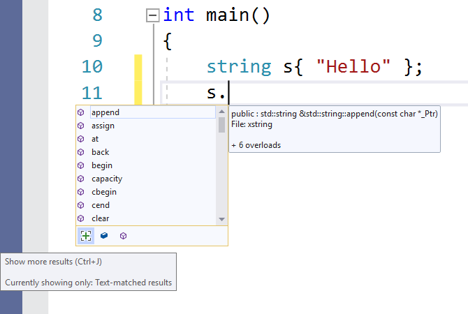

Some symbols are omitted automatically to help narrow down the results. For example, when accessing a class object's members from outside the class, you won't be able to see private members by default, or protected members (if you aren't in the context of a child class). You can adjust the filtering by using the buttons at the bottom.

After you choose the symbol from the drop-down list, you can autocomplete it with **Tab**, **Enter**, or one of the other commit characters (by default: `{ } [ ] ( ) . , : ; + - * / % & | ^ ! = ? @ # \`). To add or remove characters from this list,
search for "IntelliSense" in **Quick Launch** (Ctrl + Q) and choose the **Text Editor > C/C++ > Advanced** option. The **Member List Commit Characters** option enables you to customize the list with the changes you want.

The **Member List Filter Mode** option controls what kinds of IntelliSense autocomplete suggestions you see. By default, it's set to **Fuzzy**. In a fuzzy search, if you have a symbol called *MyAwesomeClass*, you can type "MAC" and find the class in your autocomplete suggestions. The fuzzy algorithm sets a minimum threshold that symbols must meet to show up in the list. **Smart** filtering displays all symbols containing substrings that match what you typed. **Prefix** filtering searches for strings that begin with what you typed.

For more information about C++ IntelliSense, see [Visual C++ IntelliSense](/visualstudio/ide/visual-cpp-intellisense) and [Configure a C++ project for IntelliSense](/visualstudio/ide/visual-cpp-intellisense-configuration).

## IntelliCode

IntelliCode is AI-assisted IntelliSense. It puts the most likely candidate at the top of your completion list. IntelliCode recommendations are based on thousands of open source projects on GitHub each with over 100 stars. When combined with the context of your code, the completion list is tailored to promote common practices.

When writing C++, IntelliCode will assist when using popular libraries such as the C++ Standard Library. The context of your code is used to provide the most useful recommendations first. In the following example, the `size` member function is commonly used with the `sort` function, so it's surfaced to the top of the results list.

::: moniker range=">=msvc-160"

In Visual Studio 2022 and Visual Studio 2019, IntelliCode is available as an optional component in the **C++ Desktop Development** workload. To make sure that IntelliCode is active for C++, go to **Tools** > **Options** > **IntelliCode** > **General** and set **C++ base model** to **Enabled**.

::: moniker-end

::: moniker range="msvc-150"

In Visual Studio 2017, IntelliCode is available as an extension in the Visual Studio Marketplace.

::: moniker-end

## Predictive IntelliSense (Experimental)

**Predictive IntelliSense** is an experimental feature that uses contextual awareness to limit the number of results displayed in the IntelliSense dropdown list. The algorithm applies type matching so that it shows only those results that match the expected type. In the simplest case, if you type `int x =` and invoke the IntelliSense dropdown, you will see only integers or functions returning integers. This feature is off by default because it's still in development. It works best with global symbols; member functions aren't yet supported. You can turn it on by typing "Predictive" in **Quick Launch** or by going to **Tools** > **Options** > **Text Editor** > **C/C++** > **Experimental** > **Enable Predictive IntelliSense**.

To override **Predictive IntelliSense** and show the longer list, press **Ctrl + J**. If **Predictive IntelliSense** is on, invoking **Ctrl + J** removes the Predictive filter. Pressing **Ctrl + J** again removes the accessibility filter from Member List results where relevant. The ([+]) button under the IntelliSense dropdown list does the same thing as **Ctrl + J**. Hover over the button to see tooltip information about what is being shown.

The preceding screenshot shows several buttons under the dropdown list. These enable IntelliSense Filters for different kinds of results:

- Variables and Constants
- Functions
- Types
- Macros
- Enums
- Namespaces

A button is displayed only if it's relevant to your current IntelliSense session. You typically don't see all the buttons at the same time.

## Template IntelliSense

The template bar is a UI element that appears when your cursor is on a template definition. It's useful because you can provide sample template arguments for intellisense that will appear when you edit the template body. For example, you could specify that a template argument is of type `std::vector<int>`. Then, when you use that argument in the template body, you'll see the members of `std::vector<int>`in intellisense.

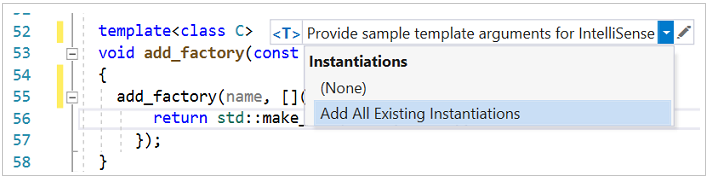

Click the **\<T>** icon to expand/collapse the **Template Bar**. Click the pencil icon or double-click the **Template Bar** to open the **Edit** window where you specify argument types for the parameters.

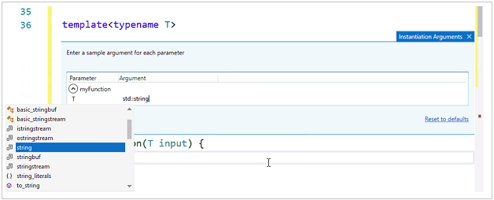

The Template Bar can auto-populate parameter types based on instantiations of the template in your code. Click on **Add All Existing Instantiations** to see a list of all concrete arguments that have been used to instantiate the template throughout your code base.

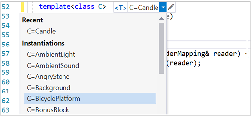

A window at the bottom of the editor shows where each instantiation was found, and what its arguments were. You can select an instantiation to go to the location in your code where that instantiation was found.

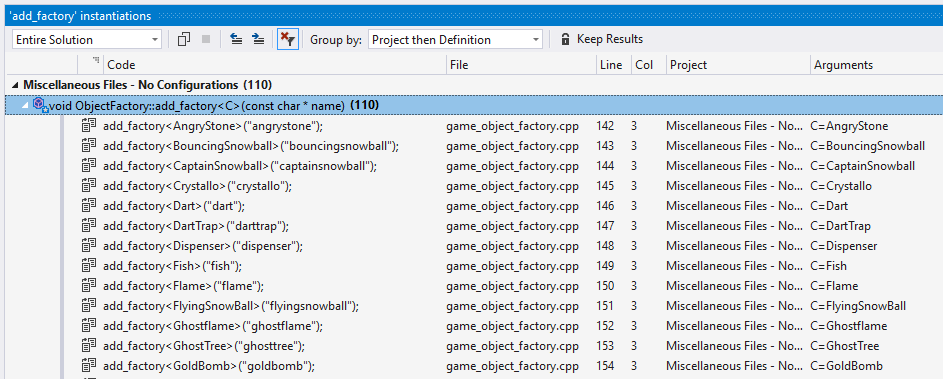

**Template Bar** information is user-specific. It's stored in the `.vs` folder and isn't committed to source control.

## Error squiggles and quick fixes

If the editor detects problems with your code, it will add colored squiggles under the problem. Red squiggles indicate code that won't compile. Green squiggles indicate other kinds of problems that might still be potentially serious. You can open the **Error List** window to get more information about the problems.

For some kinds of errors, and common coding patterns, the editor will offer a **Quick Fix** in the form of a light bulb that appears when you hover over the squiggle. Click the down arrow to see the suggestions.

In the following example, a `vector` was declared but no definition was found, so the editor offers to include the necessary header file:

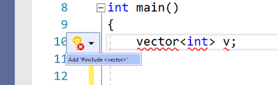

The editor also offers Quick Fixes for some refactoring opportunities. For example, if you declare a class in a header file, Visual Studio will offer to create a definition for it in a separate .cpp file.

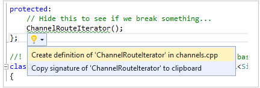

## Change tracking

Whenever you make a change to a file, a yellow bar appears on the left to indicate that unsaved changes were made. When you save the file, the bar turns green. The green and yellow bars are preserved as long as the document is open in the editor. They represent the changes that were made since you last opened the document.

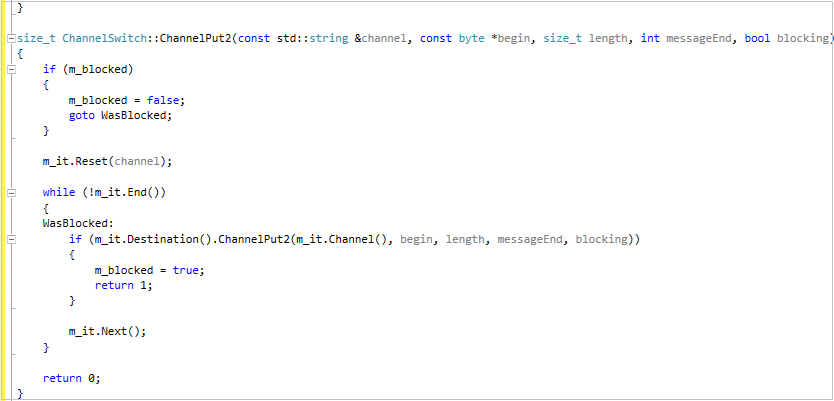

## Move code

You can move lines of code up and down by selecting them, holding down Alt, and pressing the **Up/Down** arrow keys.

## Insert snippets

A snippet is a predefined piece of source code. Right-click on a single point or on selected text and select Snippet to either insert a snippet or surround the selected text with the snippet. The following illustration shows the three steps to surround a selected statement with a for loop. The yellow highlights in the final image are editable fields that you access with the tab key. For more information, see [Code Snippets](/visualstudio/ide/code-snippets).

:::image type="complex" source="../ide/media/vs2015_cpp_surround_with.png" alt-text="Screenshot of the Insert Snippet Drop down control.":::
A function is selected. In the dropdown that appears after a right-click on the function name, Surround With... is highlighted in yellow. In the Surround With: dropdown, the snippet for a `for` loop is selected. This results in putting a for loop around the function. The loop variable and limit are shown in yellow to indicate that they are editable fields.
:::image-end:::

## Add Class

Add a new class from the **Project** menu, or from the context menu in **Solution Explorer**:

You can also use Class Wizard to modify or examine an existing class.

For more information, see [Adding Functionality with Code Wizards (C++)](../ide/adding-functionality-with-code-wizards-cpp.md).

## Refactoring

Refactorings are available under the Quick Action context menu, or by clicking on a [light bulb](/visualstudio/ide/perform-quick-actions-with-light-bulbs) in the editor.  Some are also found in the **Edit > Refactor** menu.  These features include:

- [Rename](refactoring/rename.md)
- [Extract Function](refactoring/extract-function.md)
- [Implement Pure Virtuals](refactoring/implement-pure-virtuals.md)
- [Create Declaration / Definition](refactoring/create-declaration-definition.md)
- [Move Function Definition](refactoring/move-definition-location.md)
- [Convert to Raw String Literal](refactoring/convert-to-raw-string-literal.md)
- [Change Signature](refactoring/change-signature.md)

## Code style enforcement with ClangFormat and EditorConfig

Visual Studio 2017 and later comes with built-in support for [ClangFormat](https://clang.llvm.org/docs/ClangFormat.html), a popular code-formatting utility for C++ based on Clang/LLVM. Type "ClangFormat" into [Quick Launch](/visualstudio/ide/reference/quick-launch-environment-options-dialog-box) to set it to use one of these common formats:

- LLVM
- Google
- Chromium
- Mozilla
- WebKit
- Visual Studio

You can also provide your own `.clang-format` or `_clang-format` file to apply custom rules to all code files at the same level or below.

The files are easily shareable via source control, so you can enforce coding conventions across your whole development team.

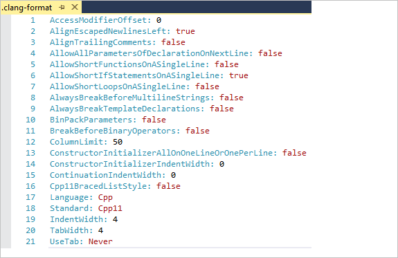

Visual Studio 2017 and later also supports [EditorConfig](https://editorconfig.org/), which works in a similar way. ClangFormat, however, has more style options than EditorConfig, including rules that are specific to C++. With **EditorConfig**, you create **.editorconfig** files and place them in different folders of your codebase to specify code styles for those folders and their subfolders. An **.editorconfig** file supersedes any other **.editorconfig** files in parent folders and overwrites any formatting settings configured via **Tools** > **Options**. You can set rules for tabs vs. spaces, indent size, and more. For more information, see [Create portable, custom editor settings with EditorConfig](/visualstudio/ide/create-portable-custom-editor-options).

## Other formatting options

The **Quick Launch** search box provides the fastest way to find a setting or tool. It's located on the main menu. Just start typing and the auto-completion list will filter the results.

To set formatting options such as indents, brace completion, and colorization, type "C++ Formatting" into the **Quick Launch** window.

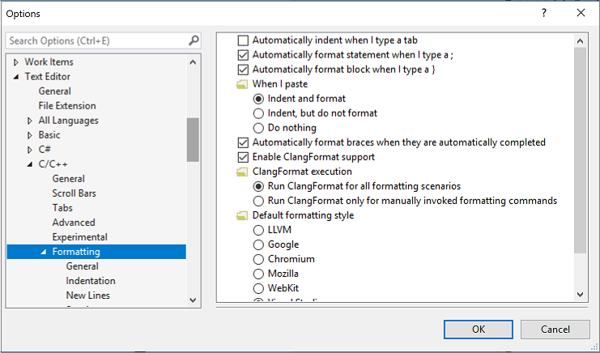

Other formatting options are found under **Edit** > **Advanced** in the main menu.

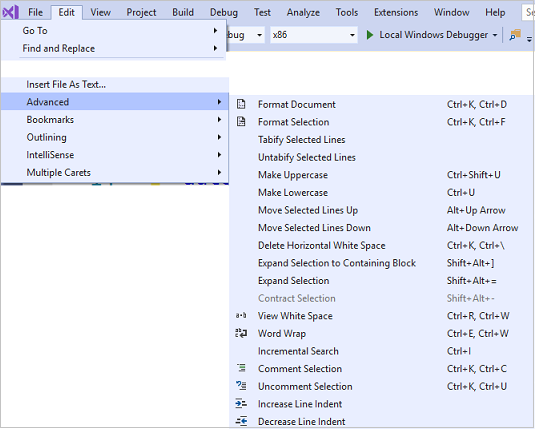

Options for enabling and configuring C++-specific editing features are located under **Tools** > **Options** > **Text Editor** > **C/C++**. After choosing which option you want to set, you can get more help by pressing **F1** when the dialog is in focus. For general code formatting options, type `Editor C++` into **Quick Launch**.

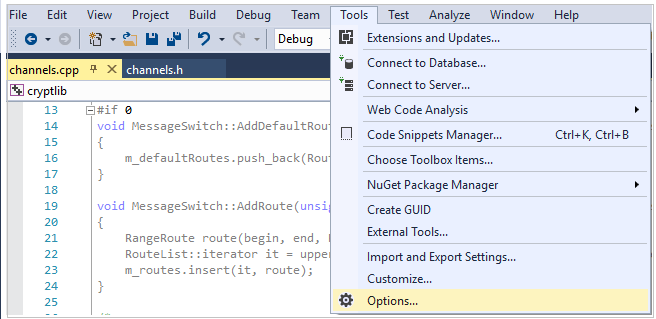

Experimental features, which may or may not be included in a future version of Visual Studio, are found in the [Text Editor C++ Experimental](/visualstudio/ide/reference/options-text-editor-c-cpp-experimental) dialog. In Visual Studio 2017 and later you can enable **Predictive IntelliSense** in this dialog.

## See Also

[Read and understand C++ code](read-and-understand-code-cpp.md) 
[Navigate your C++ code base in Visual Studio](navigate-code-cpp.md) 
[Collaborate with Live Share for C++](live-share-cpp.md)
