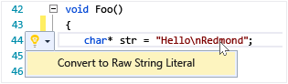

# Writing and refactoring code (C++)
The Visual C++ code editor and IDE provide many coding aids. Some are unique to C++, and some are essentially the same for all Visual Studio languages. Options for enabling and configuring these features are located in the **Text Editor C++ Advanced** dialog (**Tools &#124; Options &#124; Text Editor &#124; C/C++ &#124; Advanced** or type "C++ Advanced" in **Quick Launch**). After choosing which option you want to set, you can get more help by pressing **F1** when the dialog is in focus. For general code formatting options, type `Editor C++` into **QuickLaunch**.  
  
## Adding new code  
 After creating a project, you can start coding in the files that were generated for you. To add new files, right-click on the project node in Solution Explorer and choose **Add &#124; New**.  
  
 To set formatting options such as indents, brace completion, and colorization, type `C++ Formatting` into the **QuickLaunch** window.  
  
### IntelliSense  
 IntelliSense is the name for a set of features that provide inline information about members, types, and function overloads. The following illustration shows the member list drop-down that appears as you type. You can press the tab key to enter the selected item text into your code file.  
  
   
  
 For complete information see [Visual C++ Intellisense](/visual-studio/ide/visual-cpp-intellisense).  
  
### Insert Snippets  
 A snippet is a predefined piece of source code. Right-click on a single point or on selected text to either insert a snippet or surround the selected text with the snippet. The following illustration shows the three steps to surround a selected statement with a for loop. The yellow highlights in the final image are editable fields that you access with the tab key. For more information, see [Code Snippets](/visual-studio/ide/code-snippets).  
  
   
  
### Add Class  
 Add a new class from the **Project** menu by using the Class Wizard.  
  
   
  
### Class Wizard  
 Modify or examine an existing class, or add a new class, using the Class Wizard. For more information, see [Adding Functionality with Code Wizards (C++)](../ide/adding-functionality-with-code-wizards-cpp.md).  
  
   
  
## Refactoring  
 Refactorings are available under the Quick Action context menu item, or by clicking on a [light bulb](/visual-studio/ide/perform-quick-actions-with-light-bulbs) in the editor.  
  
### Rename  
 Rename a type or function or variable wherever it is used in the specified scope. In the following illustration, the `Eat` method will be renamed to `Devour` in both the derived and base class.  
  
   
  
### Quick Action: Move Definition Location  
 Move one or more function definitions into the header file that has the same name as the code file. A new header is created if it doesn't already exist. The resulting definition(s) is/are shown inline in a peek window.  
  
   
  
### Quick Action: Create Declaration / Definition  
 Create one or more definitions in the associated code file for the selected header declaration(s).  
  
   
  
### Quick Action: Implement all pure virtuals for a class  
 Quickly generate empty implementation stubs for all inherited virtual functions in a class. To implement only the virtual functions in a particular base class, simply highlight the base class in the derived class declaration.  
  
   
  
### Convert to raw string literal  
 When you place the cursor over a string literal, you can right click and choose **Quick Actions &#124; Convert to raw string literal** to convert an ordinary string into a C++ 11 raw string literal.  
  
   
  
### Extract Function (Visual Studio extension)  
 Use the extract function feature (available as an [extension on the Visual Studio gallery](https://visualstudiogallery.msdn.microsoft.com/a081dc8c-c805-4589-9b8b-c2c309a05789)) to move a section of code into its own function and replace the code with a call to that function.  
  
   
  
## Navigate and understand  
  
### QuickInfo  
 Hover over a variable to see its type information. QuickInfo  
  
   
  
### Open document (Navigate to header)  
 Right click on the header name in an `#include` directive and open the header file.  
  
   
  
### Peek Definition  
 Hover over a variable or function declaration, right-click, then choose **Peek Definition** to see an inline view of its definition. For more information, see [Peek Definition (Alt+F12)](../Topic/How%20to:%20View%20and%20Edit%20Code%20by%20Using%20Peek%20Definition%20\(Alt+F12\).md).  
  
   
  
### Go To Definition  
 Hover over a variable or function declaration, right-click, then choose **Go To Definition** to open the document where the object is defined.  
  
### View Call Hierarchy  
 Right click on any function call and view a resursive list of all the functions that it calls, and all the functions that call it. Each function in the list can be expanded in the same way. For more information, see [Call Hierarchy](/visual-studio/ide/reference/call-hierarchy).  
  
   
  
### Toggle Header / Code File  
 Right-click and choose Toggle Header / Code File to switch back and forth between a header file and its associated code file.  
  
### Outlining  
 Right-click anywhere in a source code file and choose **Outlining** to collapse or expand definitions and/or custom regions to make it easier to browse only the parts you are interested in. For more information, see [Outlining](/visual-studio/ide/outlining).  
  
   
  
### Scroll bar map mode  
 Scrollbar map mode enables you to quickly scroll and browse through a code file without actually leaving your current location. Or click anywhere on the code map to go directly to that location.  
  
   
  
### Generate graph of include files  
 Right click on a code file in your project and choose **Generate graph of include files** to see a graph of which files are included by other files.  
  
   
  
### F1 Help  
 Place the cursor on or just after any type, keyword or function and press F1 to go directly to the relevant MSDN reference topic. F1 also works on items in the error list, and in many dialog boxes.  
  
### Quick Launch  
 To easily navigate to any window or tool in Visual Studio, simply type its name in the Quick Launch window in the upper right corner of the UI. The auto-completion list will filter as you type.  
  
 