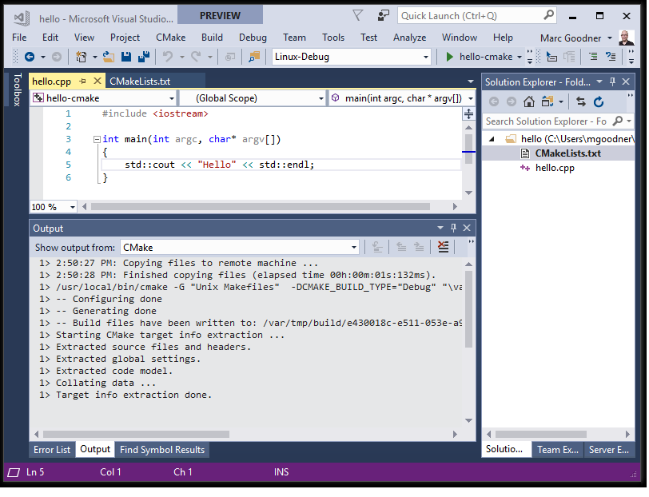

# Create and configure a Linux CMake project

::: moniker range="vs-2015"

Linux support is available in Visual Studio 2017 and later.

::: moniker-end

::: moniker range="vs-2019"

To create a new Linux CMake project in Visual Studio 2019:

1. Select **File > New Project** in Visual Studio, or press **Ctrl + Shift + N**.
1. Set the **Language** to **C++** and search for "CMake". Then choose **Next**. Enter a **Name** and **Location**, and choose **Create**.

Visual Studio creates a minimal CMakeLists.txt file with only the name of the executable and the minimum CMake version required. You can manually edit this file however you like; Visual Studio will never overwrite your changes. You can specify CMake command-line arguments and environment variables by right-clicking on the root CMakeLists.txt file in **Solution Explorer** and choosing **CMake settings for project**. To specify options for debugging, right-click on the project node and choose **Debug and launch settings**.

::: moniker-end

When you open a folder that contains an existing CMake project, Visual Studio uses variables in the CMake cache to configure IntelliSense and builds automatically. Local configuration and debugging settings are stored in JSON files that can optionally be shared with others who are using Visual Studio.

Visual Studio does not modify the CMakeLists.txt files, so that others working on the same project can continue to use whatever tools they are already using. Visual Studio does regenerate the cache when you save edits to CMakeLists.txt or in some cases to CMakeSettings.json. But if you are using an **Existing Cache** configuration, then Visual Studio does not modify the cache.

For general information about CMake support in Visual Studio, see [CMake projects in Visual Studio](../build/cmake-projects-in-visual-studio.md). Read that first before continuing here.

## Before you begin

First, make sure you have the **Linux development with C++** workload installed, including the CMake component. See [Install the C++ Linux workload in Visual Studio](download-install-and-setup-the-linux-development-workload.md). 

On the Linux system, make sure that the following are installed: 

- gcc
- gdb
- rsync
- zip 

::: moniker range="vs-2019"

Linux support for CMake projects requires a recent version of CMake to be installed on the target machine. Often, the version offered by a distribution’s default package manager is not recent enough to support all the features that are required by Visual Studio. Visual Studio 2019 detects whether a recent version of CMake is installed on the Linux system. If none is found, Visual Studio shows an info-bar at the top of the editor pane that offers to install it for you from [https://github.com/Microsoft/CMake/releases](https://github.com/Microsoft/CMake/releases).

The CMake support in Visual Studio requires the server mode support that was introduced in CMake 3.8. In Visual Studio 2019, version 3.14 or later is recommended.

::: moniker-end

::: moniker range="vs-2017"

The CMake support in Visual Studio requires the server mode support that was introduced in CMake 3.8. For a Microsoft-provided CMake variant, download the latest prebuilt binaries at [https://github.com/Microsoft/CMake/releases](https://github.com/Microsoft/CMake/releases).

The binaries will be installed to `~/.vs/cmake`. After deploying the binaries, your project will automatically regenerate. Note that if the CMake specified by the `cmakeExecutable` field in `CMakeSettings.json` is invalid (doesn't exist or is an unsupported version) and the prebuilt binaries are present Visual Studio will ignore `cmakeExecutable` and use the prebuilt binaries.

:::moniker-end

## Open a folder

To get started, choose **File** > **Open** > **Folder** from the main menu or else type `devenv.exe <foldername>` on the command line. The folder you open should have a CMakeLists.txt file in it, along with your source code.
The following example shows a simple CMakeLists.txt file and .cpp file:

```cpp
// hello.cpp

#include <iostream>

int main(int argc, char* argv[])
{
    std::cout << "Hello from Linux CMake" << std::endl;
}
```

CMakeLists.txt:

```cmd
cmake_minimum_required(VERSION 3.8)
project (hello-cmake)
add_executable(hello-cmake hello.cpp)
```

## Choose a Linux target

As soon as you open the folder, Visual Studio parses the CMakeLists.txt file and specifies a Windows target of **x86-Debug**. To target a remote Linux system, change the project settings to **Linux-Debug** or **Linux-Release**. (See [Configure CMake settings for Linux](#configure_cmake_linux) below.)

::: moniker range="vs-2019"

To target Windows Subsystem for Linux, click on **Manage Configurations** in the in the configuration dropdown in the main toolbar. Then press the **Add Configuration** button and choose **WSL-Debug** or **WSL-Release** if using GCC, or the Clang variants if using the Clang/LLVM toolset. 

**Visual Studio 2019 version 16.1** When targeting WSL, no copying of sources or headers is necessary because the compiler on Linux has direct access to the Windows file system where your source files are located. (In Windows version 1903 and later, Windows applications likewise can access the Linux header files directly, but Visual Studio does not yet take advantage of this capability).

::: moniker-end

For remote targets, Visual Studio by default chooses the first remote system in the list under **Tools** > **Options** > **Cross Platform** > **Connection Manager**. If no remote connections are found, you are prompted to create one. For more information, see [Connect to your remote Linux computer](connect-to-your-remote-linux-computer.md).

If you specify a remote Linux target, your source is copied to the remote system.

After you select a target, CMake runs automatically on the Linux system to generate the CMake cache for your project. 



To provide IntelliSense support for headers on remote Linux systems, Visual Studio automatically copies them from the Linux machine to a directory on your local Windows machine. For more information, see [IntelliSense for remote headers](configure-a-linux-project.md#remote_intellisense).

## <a name="debug_cmake_project"></a> Debug the CMake project

To debug your code on the specified debug target system, set a breakpoint, select the CMake target as the startup item in the toolbar menu next to the project setting, and choose **&#x23f5; Start** on the toolbar, or press F5.

To customize your program’s command line arguments, press the **Switch Targets** button at the top of **Solution Explorer** and then choose **Targets View**. Then right-click on the target and select **Debug and Launch Settings**. This opens or creates a launch.vs.json configuration file that contains information about your program. To specify the location for source files, add a **sourceFileMap** property to the file, as shown in this example:

```json
"MIMode": "gdb",
"externalConsole": true,
"sourceFileMap": {
"c/Users/USER/source/repos/CMAKEPROJECTNAME": "C:\\Users\\USER\\source\\repos\\CMAKEPROJECTNAME"
},
"remoteMachineName": "${debugInfo.remoteMachineName}",
```

To specify additional arguments, add them in the `args` JSON array. For more information, see [Open Folder projects for C++](../build/open-folder-projects-cpp.md) and [Configure CMake debugging sessions](../build/configure-cmake-debugging-sessions.md).

## <a name="configure_cmake_linux"></a> Configure CMake settings for Linux

A CMakeSettings.json file in a CMake Linux project can specify all the properties listed in [Customize CMake settings](../build/customize-cmake-settings.md), plus additional properties that control the build settings on the remote Linux machine. 

::: moniker range="vs-2019"

To change the default CMake settings in Visual Studio 2019, from the main toolbar, open the **Configuration** drop down and choose **Manage Configurations**. 


This brings up the **CMake Settings Editor** which you can use to edit the `CMakeSettings.json` file in your root project folder. You can also open the file directly by clicking the **Edit JSON** button in the editor. For more information, see [Customize CMake Settings](../build/customize-cmake-settings.md).

::: moniker-end

::: moniker range="vs-2017"

To change the default CMake settings in Visual Studio 2017, choose **CMake | Change CMake Settings | CMakeLists.txt** from the main menu, or right-click CMakeSettings.txt in **Solution Explorer** and choose **Change CMake Settings**. Visual Studio then creates a new `CMakeSettings.json` file in your root project folder. You can open the file using the **CMake Settings** editor or modify the file directly. For more information, see [Customize CMake settings](../build/customize-cmake-settings.md).

The following example shows the default configuration for Linux-Debug in Visual Studio 2017 (and Visual Studio 2019 version 16.0) based on the previous code example:

```json
{
      "name": "Linux-Debug",
      "generator": "Unix Makefiles",
      "remoteMachineName": "${defaultRemoteMachineName}",
      "configurationType": "Debug",
      "remoteCMakeListsRoot": "/var/tmp/src/${workspaceHash}/${name}",
      "cmakeExecutable": "/usr/local/bin/cmake",
      "buildRoot": "${env.LOCALAPPDATA}\\CMakeBuilds\\${workspaceHash}\\build\\${name}",
      "installRoot": "${env.LOCALAPPDATA}\\CMakeBuilds\\${workspaceHash}\\install\\${name}",
      "remoteBuildRoot": "/var/tmp/build/${workspaceHash}/build/${name}",
      "remoteInstallRoot": "/var/tmp/build/${workspaceHash}/install/${name}",
      "remoteCopySources": true,
      "remoteCopySourcesOutputVerbosity": "Normal",
      "remoteCopySourcesConcurrentCopies": "10",
      "remoteCopySourcesMethod": "rsync",
      "remoteCopySourcesExclusionList": [".vs", ".git"],
      "rsyncCommandArgs" : "-t --delete --delete-excluded",
      "remoteCopyBuildOutput" : "false",
      "cmakeCommandArgs": "",
      "buildCommandArgs": "",
      "ctestCommandArgs": "",
      "inheritEnvironments": [ "linux-x64" ]
}
```

::: moniker-end

::: moniker range="vs-2019"

 The default Linux-Debug configuration in Visual Studio 2019 version 16.1 and later is as shown here:

```json
{
      "name": "Linux-Debug",
      "generator": "Unix Makefiles",
      "configurationType": "Debug",
      "cmakeExecutable": "/usr/bin/cmake",
      "remoteCopySourcesExclusionList": [ ".vs", ".git", "out" ],
      "cmakeCommandArgs": "",
      "buildCommandArgs": "",
      "ctestCommandArgs": "",
      "inheritEnvironments": [ "linux_x64" ],
      "remoteMachineName": "${defaultRemoteMachineName}",
      "remoteCMakeListsRoot": "$HOME/.vs/${projectDirName}/${workspaceHash}/src",
      "remoteBuildRoot": "$HOME/.vs/${projectDirName}/${workspaceHash}/out/build/${name}",
      "remoteInstallRoot": "$HOME/.vs/${projectDirName}/${workspaceHash}/out/install/${name}",
      "remoteCopySources": true,
      "rsyncCommandArgs": "-t --delete --delete-excluded",
      "remoteCopyBuildOutput": false,
      "remoteCopySourcesMethod": "rsync",
      "addressSanitizerRuntimeFlags": "detect_leaks=0",
      "variables": []
    }
  ]
}
```
::: moniker-end

For more information about these settings, see [CMakeSettings.json reference](../build/cmakesettings-reference.md).


## Optional Settings

You can use the following optional settings for more control:

```json
{
      "remotePrebuildCommand": "",
      "remotePreGenerateCommand": "",
      "remotePostbuildCommand": "",
}
```

These options allow you to run commands on the Linux system before and after building, and before CMake generation. The values can be any command that is valid on the remote system. The output is piped back to Visual Studio.


## See also

[Working with Project Properties](../build/working-with-project-properties.md)<br/>
[CMake Projects in Visual Studio](../build/cmake-projects-in-visual-studio.md)<br/>
[Connect to your remote Linux computer](connect-to-your-remote-linux-computer.md)<br/>
[Customize CMake settings](../build/customize-cmake-settings.md)<br/>
[Configure CMake debugging sessions](../build/configure-cmake-debugging-sessions.md)<br/>
[Deploy, run, and debug your Linux project](deploy-run-and-debug-your-linux-project.md)<br/>
[CMake predefined configuration reference](../build/cmake-predefined-configuration-reference.md)<br/>
