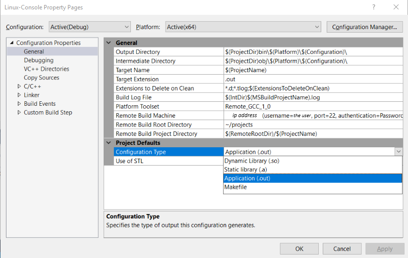
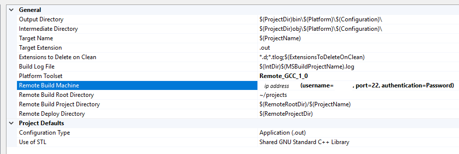
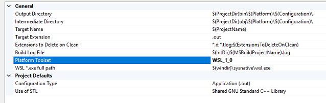
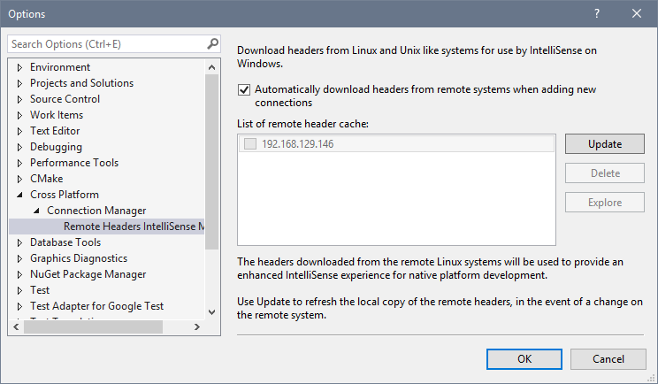
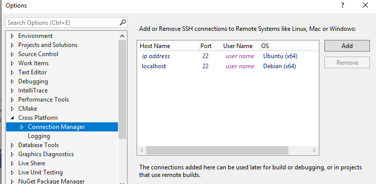

# Configure a Linux MSBuild C++ project in Visual Studio

::: moniker range="msvc-140"

Linux support is available in Visual Studio 2017 and later.

::: moniker-end

This topic describes how to configure a MSBuild-based Linux project as described in [Create a Linux MSBuild C++ project in Visual Studio](create-a-new-linux-project.md). For Linux CMake projects, see [Configure a Linux CMake project](cmake-linux-project.md).

You can configure a Linux project to target a physical Linux machine, a virtual machine, or the [Windows Subsystem for Linux](/windows/wsl/about) (WSL).

::: moniker range=">=msvc-160"

**Visual Studio 2019 version 16.1** and later:

- When you target WSL, you can avoid the copy operations needed to build and get IntelliSense that are required when you target a remote Linux system.

- You can specify separate Linux targets for building and debugging.

::: moniker-end

## General settings

To view configuration options, select the **Project > Properties** menu, or right-click on the project in **Solution Explorer** and select **Properties** from the context menu. The **General** settings appear.



By default, an executable (.out) is built. To build a static or dynamic library, or to use an existing Makefile, use the **Configuration Type** setting.

If you're building for Windows Subsystem for Linux (WSL), WSL Version 1 is limited to 64 parallel compilation processes. This is governed by the **Max Parallel Compilation Jobs** setting in **Configuration properties > C/C++ > General**.

Regardless of the WSL version you are using, if you intend to use more than 64 parallel compilation processes, we recommend that you build with Ninja--which generally will be faster and more reliable. To build with Ninja, use the **Enable Incremental Build** setting in **Configuration properties > General**.

For more information about the settings in the property pages, see [Linux Project Property Page Reference](prop-pages-linux.md).

## Remote settings

To change settings related to the remote Linux computer, configure the remote settings that appear under [General](prop-pages/general-linux.md).

- To specify a remote target Linux computer, use the **Remote Build Machine** entry. This will allow you to select one of the connections created previously. To create a new entry, see the [Connecting to Your Remote Linux Computer](connect-to-your-remote-linux-computer.md) section.

   

   ::: moniker range=">=msvc-160"

   **Visual Studio 2019 version 16.7** and later: To target Windows Subsystem for Linux (WSL), set the **Platform Toolset** drop-down to **GCC for Windows Subsystem for Linux**. The other remote options will disappear and the path to the default WSL shell will appear in their place:

   

   If you have side-by-side WSL installations, you can specify a different path here. For more information about managing multiple distros, see [Manage and configure Windows Subsystem for Linux](/windows/wsl/wsl-config#set-a-default-distribution).

   You can specify a different target for debugging on the **Configuration Properties** > **Debugging** page.

   ::: moniker-end

- The **Remote Build Root Directory** determines the root location of where the project is built on the remote Linux computer. This will default to **~/projects** unless changed.

- The **Remote Build Project Directory** is where this specific project will be built on the remote Linux computer. This will default to **$(RemoteRootDir)/$(ProjectName)**, which will expand to a directory named after the current project, under the root directory set above.

> [!NOTE]
> To change the default C and C++ compilers, or the Linker and Archiver used to build the project, use the appropriate entries in the **C/C++ > General** section and the **Linker > General** section. You can specify a certain version of GCC or Clang, for example. For more information, see [C/C++ Properties (Linux C++)](prop-pages/c-cpp-linux.md) and [Linker Properties (Linux C++)](prop-pages/linker-linux.md).

## Copy sources (remote systems only)

::: moniker range=">=msvc-160"

> [!NOTE]
> This section doesn't apply when targeting WSL.

::: moniker-end

When building on remote systems, the source files on your development PC are copied to the Linux computer and compiled there. By default, all sources in the Visual Studio project are copied to the locations set in the settings above. However, additional sources can also be added to the list, or copying sources can be turned off entirely, which is the default for a Makefile project.

- **Sources to copy** determines which sources are copied to the remote computer. By default, the **\@(SourcesToCopyRemotely)** defaults to all source code files in the project, but doesn't include any asset/resource files, such as images.

- **Copy sources** can be turned on and off to enable and disable the copying of source files to the remote computer.

- **Additional sources to copy** allows you to add additional source files, which will be copied to the remote system. You can specify a semi-colon delimited list, or you can use the **:=** syntax to specify a local and remote name to use:

`C:\Projects\ConsoleApplication1\MyFile.cpp:=~/projects/ConsoleApplication1/ADifferentName.cpp;C:\Projects\ConsoleApplication1\MyFile2.cpp:=~/projects/ConsoleApplication1/ADifferentName2.cpp;`

## Build events

Since all compilation is happening on a remote computer (or WSL), several additional Build Events have been added to the Build Events section in Project Properties. These are **Remote Pre-Build Event**, **Remote Pre-Link Event**, and **Remote Post-Build Event**, and will occur on the remote computer before or after the individual steps in the process.


## <a name="remote_intellisense"></a> IntelliSense for headers on remote systems

When you add a new connection in **Connection Manager**, Visual Studio automatically detects the include directories for the compiler on the remote system. Visual Studio then zips up and copies those files to a directory on your local Windows machine. After that, whenever you use that connection in a Visual Studio or CMake project, the headers in those directories are used to provide IntelliSense.

> [!NOTE]
> In Visual Studio 2019 version 16.5 and later, the remote header copy has been optimized. Headers are now copied on-demand when opening a Linux project or configuring CMake for a Linux target. The copy occurs in the background on a per-project basis, based on the project's specified compilers. For more information, see [Improvements to Accuracy and Performance of Linux IntelliSense](https://devblogs.microsoft.com/cppblog/improvements-to-accuracy-and-performance-of-linux-intellisense/).

This functionality depends on the Linux machine having zip installed. You can install zip by using this apt-get command:

```cmd
sudo apt install zip
```

To manage your header cache, navigate to **Tools > Options, Cross Platform > Connection Manager > Remote Headers IntelliSense Manager**. To update the header cache after making changes on your Linux machine, select the remote connection and then select **Update**. Select **Delete** to remove the headers without deleting the connection itself. Select **Explore** to open the local directory in **File Explorer**. Treat this folder as read-only. To download headers for an existing connection that was created before Visual Studio 2017 version 15.3, select the connection and then select **Download**.

::: moniker range="msvc-150"



::: moniker-end

::: moniker range=">=msvc-160"



You can enable logging to help troubleshoot problems:


::: moniker-end

## <a name="locale"></a> Linux target locale

Visual Studio language settings aren't propagated to Linux targets because Visual Studio doesn't manage or configure installed packages. Messages shown in the **Output** window, such as build errors, are shown using the language and locale of the Linux target. You'll need to configure your Linux targets for the desired locale.

## See also

[Set compiler and build properties](../build/working-with-project-properties.md)<br/>
[C++ General Properties (Linux C++)](prop-pages/general-linux.md)<br/>
[VC++ Directories (Linux C++)](prop-pages/directories-linux.md)<br/>
[Copy Sources Project Properties (Linux C++)](prop-pages/copy-sources-project.md)<br/>
[Build Event Properties (Linux C++)](prop-pages/build-events-linux.md)
