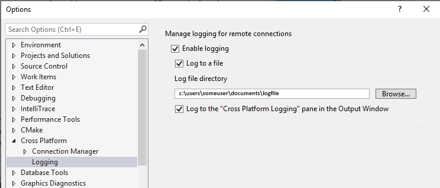
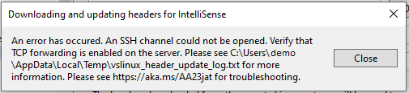

# Connect to your target Linux system in Visual Studio

::: moniker range="msvc-140"

Linux support is available in Visual Studio 2017 and later.

::: moniker-end

::: moniker range="msvc-150"

You can configure a Linux project to target a remote machine or the Windows Subsystem for Linux (WSL). For both remote machines and for WSL, you need to set up a remote connection in Visual Studio 2017.

::: moniker-end

::: moniker range="msvc-160"

You can configure a Linux project to target a remote machine or the Windows Subsystem for Linux (WSL). For a remote machine, you need to set up a remote connection in Visual Studio. To connect to WSL, skip ahead to the [Connect to WSL](#connect-to-wsl) section.

::: moniker-end

::: moniker range=">=msvc-150"

When using a remote connection, Visual Studio builds C++ Linux projects on the remote machine. It doesn't matter if it's a physical machine, a VM in the cloud, or WSL.
To build the project, Visual Studio copies the source code to your remote Linux computer. Then, the code gets compiled based on Visual Studio settings.

::: moniker-end

::: moniker range="msvc-160"

> [!NOTE]
> Visual Studio 2019 version 16.5 and later also supports secure, Federal Information Processing Standard (FIPS) 140-2 compliant cryptographic connections to Linux systems for remote development. To use a FIPS-compliant connection, follow the steps in [Set up FIPS-compliant secure remote Linux development](set-up-fips-compliant-secure-remote-linux-development.md) instead.

::: moniker-end

::: moniker range=">=msvc-150"

## Set up the SSH server on the remote system

If ssh isn't already set up and running on your Linux system, follow these steps to install it. The examples in this article use Ubuntu 18.04 LTS with OpenSSH server version 7.6. However, the instructions should be the same for any distro using a moderately recent version of OpenSSH.

1. On the Linux system, install and start the OpenSSH server:

   ```bash
   sudo apt install openssh-server
   sudo service ssh start
   ```

1. If you’d like the ssh server to start automatically when the system boots, enable it using systemctl:

   ```bash
   sudo systemctl enable ssh
   ```

## Set up the remote connection

1. In Visual Studio, choose **Tools > Options** on the menu bar to open the **Options** dialog. Then select **Cross Platform > Connection Manager** to open the Connection Manager dialog.

   If you haven't set up a connection in Visual Studio before, when you build your project for the first time, Visual Studio opens the Connection Manager dialog for you.

1. In the Connection Manager dialog, choose the **Add** button to add a new connection.

   

   In either scenario, the **Connect to Remote System** window is displayed.

   

1. Enter the following information:

   | Entry | Description
   | ----- | ---
   | **Host Name**           | Name or IP address of your target device
   | **Port**                | Port that the SSH service is running on, typically 22
   | **User name**           | User to authenticate as
   | **Authentication type** | Password and Private Key are both supported
   | **Password**            | Password for the entered user name
   | **Private key file**    | Private key file created for ssh connection
   | **Passphrase**          | Passphrase used with private key selected above

   You can use either a password or a key file and passphrase for authentication. For many development scenarios, password authentication is sufficient, but key files are more secure. If you already have a key pair, it's possible to reuse it. Currently Visual Studio only supports RSA and DSA keys for remote connections.

1. Choose the **Connect** button to attempt a connection to the remote computer.

   If the connection succeeds, Visual Studio configures IntelliSense to use the remote headers. For more information, see [IntelliSense for headers on remote systems](configure-a-linux-project.md#remote_intellisense).

   If the connection fails, the entry boxes that need to be changed are outlined in red.

   

   If you use key files for authentication, make sure the target machine's SSH server is running and configured properly.

   ::: moniker-end

   ::: moniker range="msvc-160"

## Logging for remote connections

   You can enable logging to help troubleshoot connection problems. On the menu bar, select **Tools > Options**. In the **Options** dialog, select **Cross Platform > Logging**:

   

   Logs include connections, all commands sent to the remote machine (their text, exit code and execution time), and all output from Visual Studio to the shell. Logging works for any cross-platform CMake project or MSBuild-based Linux project in Visual Studio.

   You can configure the output to go to a file or to the **Cross Platform Logging** pane in the Output window. For MSBuild-based Linux projects, MSBuild commands sent to the remote machine aren't routed to the **Output Window** because they're emitted out-of-process. Instead, they're logged to a file, with a prefix of "msbuild_".

## Command-line utility for the Connection Manager  

**Visual Studio 2019 version 16.5 or later**: ConnectionManager.exe is a command-line utility to manage remote development connections outside of Visual Studio. It's useful for tasks such as provisioning a new development machine. Or, you can use it to set up Visual Studio for continuous integration. For examples and a complete reference to the ConnectionManager command, see [ConnectionManager reference](connectionmanager-reference.md).  

::: moniker-end

::: moniker range=">=msvc-150"

## TCP Port Forwarding

Visual Studio's Linux support has a dependency on TCP port forwarding. **Rsync** and **gdbserver** are affected if TCP port forwarding is disabled on your remote system. If you're impacted by this dependency, you can upvote this [suggestion ticket](https://developercommunity2.visualstudio.com/t/shDonshshtsh-shrelysh-s/840265?space=62) on Developer Community.

rsync is used by both MSBuild-based Linux projects and CMake projects to [copy headers from your remote system to Windows for use by IntelliSense](configure-a-linux-project.md#remote_intellisense). When you can't enable TCP port forwarding, disable the automatic download of remote headers. To disable it, use **Tools > Options > Cross Platform > Connection Manager > Remote Headers IntelliSense Manager**. If the remote system doesn't have TCP port forwarding enabled, you'll see this error when the download of remote headers for IntelliSense begins:



rsync is also used by Visual Studio's CMake support to copy source files to the remote system. If you can't enable TCP port forwarding, you can use sftp as your remote copy sources method. sftp is often slower than rsync, but doesn't have a dependency on TCP port forwarding. You can manage your remote copy sources method with the **remoteCopySourcesMethod** property in the [CMake Settings Editor](../build/cmakesettings-reference.md#additional-settings-for-cmake-linux-projects). If TCP port forwarding is disabled on your remote system, you'll see an error in the CMake output window the first time it invokes rsync.


gdbserver can be used for debugging on embedded devices. If you can't enable TCP port forwarding, then you must use gdb for all remote debugging scenarios. gdb is used by default when debugging projects on a remote system.

## Connect to WSL

::: moniker-end

::: moniker range="msvc-150"

In Visual Studio 2017, you use the same steps to connect to WSL as you use for a remote Linux machine. Use **localhost** for the **Host Name**.

::: moniker-end

::: moniker range="msvc-160"

Visual Studio 2019 version 16.1 added native support for using C++ with the [Windows Subsystem for Linux (WSL)](/windows/wsl/about). That means you can build and debug on your local WSL installation directly. You no longer need to add a remote connection or configure SSH. You can find details on [how to install WSL](/windows/wsl/install-win10) here.

To configure your WSL installation to work with Visual Studio, you need the following tools installed: gcc or clang, gdb, make, ninja-build (only required for CMake projects using Visual Studio 2019 version 16.6 or later), rsync, and zip. You can install them on distros that use apt by using this command, which also installs the g++ compiler:

```bash
sudo apt install g++ gdb make ninja-build rsync zip
```

For more information, see [Download, install, and set up the Linux workload](download-install-and-setup-the-linux-development-workload.md).

To configure an MSBuild project for WSL, see [Configure a Linux project](configure-a-linux-project.md). To configure a CMake project for WSL, see [Configure a Linux CMake project](cmake-linux-project.md). To follow step-by-step instructions for creating a simple console application with WSL, check out this introductory blog post on [C++ with Visual Studio 2019 and the Windows Subsystem for Linux (WSL)](https://devblogs.microsoft.com/cppblog/c-with-visual-studio-2019-and-windows-subsystem-for-linux-wsl/).

::: moniker-end

## See Also

[Configure a Linux project](configure-a-linux-project.md)\
[Configure a Linux CMake project](cmake-linux-project.md)\
[Deploy, run, and debug your Linux project](deploy-run-and-debug-your-linux-project.md)\
[Configure CMake debugging sessions](../build/configure-cmake-debugging-sessions.md)
