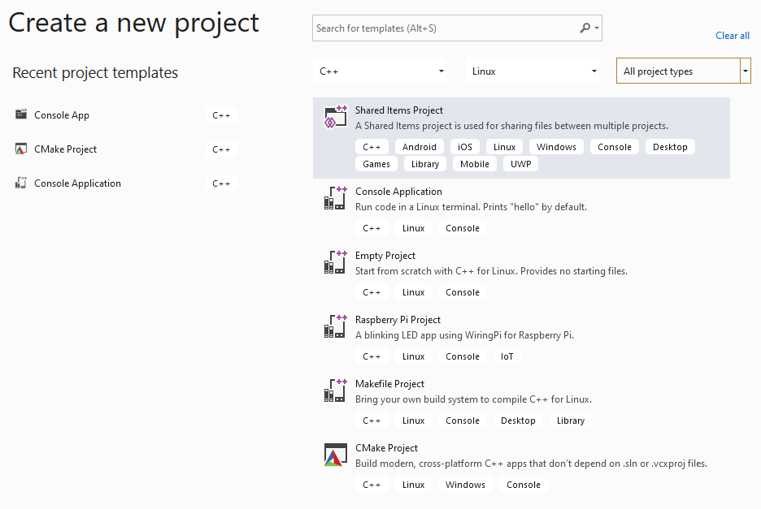

# Create a Linux MSBuild C++ project in Visual Studio

::: moniker range="msvc-140"

Linux projects are available in Visual Studio 2017 and later.

::: moniker-end

::: moniker range="msvc-150"

First, make sure you have the **Linux Development Workload** for Visual Studio installed. For more information, see [Download, install, and setup the Linux workload](download-install-and-setup-the-linux-development-workload.md).

For cross-platform compilation, we recommend using CMake. CMake support is more complete in Visual Studio 2019. If CMake isn't an option, and you have an existing Windows Visual Studio solution that you would like to extend to compile for Linux, you can add a Visual Studio Linux project to the Windows solution, along with a **Shared Items** project. Put the code that is shared between both platforms in the Shared Items project, and add a reference to that project from the Windows and Linux projects.

## To create a new Linux project

To create a new Linux project in Visual Studio 2017, follow these steps:

1. Select **File > New Project** in Visual Studio, or press **Ctrl + Shift + N**.
1. Select the **Visual C++ > Cross Platform > Linux** node, and then select the project type to create. Enter a **Name** and **Location**, and choose **OK**.

   | Project Type | Description |
   | ------------ | --- |
   | **Blink (Raspberry)** | Project targeted for a Raspberry Pi device, with sample code that blinks an LED |
   | **Console Application (Linux)** | Project targeted for any Linux computer, with sample code that outputs text to the console |
   | **Empty Project (Linux)** | Project targeted for any Linux computer, with no sample code |
   | **Makefile Project (Linux)** | Project targeted for any Linux computer, built using a standard Makefile build system |

::: moniker-end

::: moniker range=">=msvc-160"

First, make sure you have the **Linux Development Workload** for Visual Studio installed. For more information, see [Download, install, and set up the Linux workload](download-install-and-setup-the-linux-development-workload.md).

When you create a new C++ project for Linux in Visual Studio, you can choose to create a Visual Studio project or a CMake project. This article describes how to create a Visual Studio project. In general, for new projects that might include open-source code or you intend to compile for cross-platform development, we recommend you use CMake with Visual Studio. With a CMake project, you can build and debug the same project on both Windows and Linux. For more information, see [Create and configure a Linux CMake Project](cmake-linux-project.md).

If you have an existing Windows Visual Studio solution that you would like to extend to compile for Linux, and CMake isn't an option, then you can add a Visual Studio Linux project to the Windows solution, along with a **Shared Items** project. Put the code that is shared between both platforms in the Shared Items project, and add a reference to that project from the Windows and Linux projects.

## Create a new Linux project

To create a new Linux project in Visual Studio, follow these steps:

1. Select **File > New Project** in Visual Studio, or press **Ctrl + Shift + N**. The Create a new project dialog appears.
1. In the **Search for templates** textbox, enter **Linux** to list the available templates for Linux projects.
1. Select the project type to create, for example **Console Application**, and then choose **Next**. Enter a **Name** and **Location**, and choose **Create**.

   

   | Project Type | Description |
   | ------------ | --- |
   | **Raspberry Pi project** | Project targeted for a Raspberry Pi device, with sample code that blinks an LED |
   | **Console Application** | Project targeted for any Linux computer, with sample code that outputs text to the console |
   | **Empty Project** | Project targeted for any Linux computer, with no sample code |
   | **Makefile Project** | Project targeted for any Linux computer, built using a standard Makefile build system |
   | **CMake Project** | Project targeted for any Linux computer, built using the CMake build system |

::: moniker-end

## Next steps

[Configure a Linux MSBuild project](configure-a-linux-project.md)
