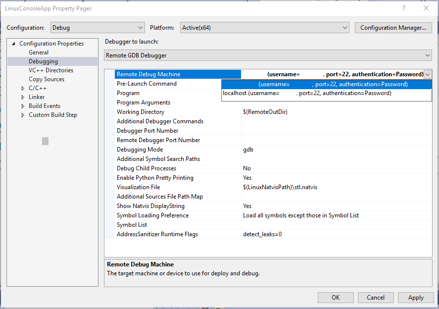
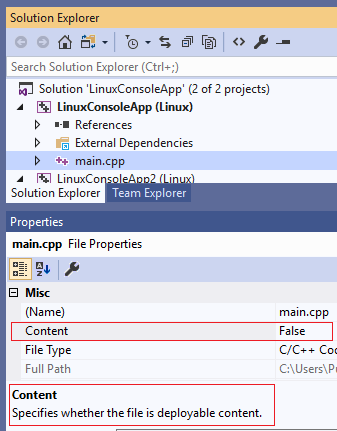

# Deploy, run, and debug your Linux project

::: moniker range="vs-2015"

Linux support is available in Visual Studio 2017 and later.

::: moniker-end

Once you have created a Linux C++ project in Visual Studio and you have connected to the project using the [Linux Connection Manager](connect-to-your-remote-linux-computer.md), you can run and debug the project. You compile, execute, and debug the code on the remote target.

::: moniker range="vs-2019"

**Visual Studio 2019 version 16.1** You can target different Linux systems for debugging and building. For example, you can cross-compile on x64 and deploy to an ARM device when targeting IoT scenarios. For more information, see [Specify different machines for building and debugging](#separate_build_debug) later in this article.

::: moniker-end

There are several ways to interact with and debug your Linux project.

- Debug using traditional Visual Studio features, such as breakpoints, watch windows, and hovering over a variable. Using these methods, you may debug as you normally would for other project types.

- View output from the target computer in the Linux Console window. You can also use the console to send input to the target computer.

## Debug your Linux project

1. Select debugging mode in the **Debugging** property page.

   ::: moniker range="vs-2019"

   GDB is used to debug applications running on Linux. When debugging on a remote system (not WSL) GDB can run in two different modes, which can be selected from the **Debugging Mode** option in the project's **Debugging** property page:

   

   ::: moniker-end

   ::: moniker range="vs-2017"

   GDB is used to debug applications running on Linux. GDB can run in two different modes, which can be selected from the **Debugging Mode** option in the project's **Debugging** property page:

   

   ::: moniker-end


   - In **gdbserver** mode, GDB is run locally, which connects to gdbserver on the remote system.  Note that this is the only mode that the Linux Console window supports.

   - In **gdb** mode, the Visual Studio debugger drives GDB on the remote system. This is a better option if the local version of GDB is not compatible with the version installed on the target computer. |

   > [!NOTE]
   > If you are unable to hit breakpoints in gdbserver debugging mode, try gdb mode. gdb must first be [installed](download-install-and-setup-the-linux-development-workload.md) on the remote target.

1. Select the remote target using the standard **Debug** toolbar in Visual Studio.

   When the remote target is available, you will see it listed by either name or IP address.

   

   If you have not yet connected to the remote target, you will see an instruction to use [Linux Connection Manager](connect-to-your-remote-linux-computer.md) to connect to the remote target.

   

1. Set a breakpoint by clicking in the left gutter of some code that you know will execute.

   A red dot appears on the line of code where you set the breakpoint.

1. Press **F5** (or **Debug > Start Debugging**) to start debugging.

   When you start debugging, the application is compiled on the remote target before it starts. Any compilation errors will appear in the **Error List** window.

   If there are no errors, the app will start and the debugger will pause at the breakpoint.

   

   Now, you can interact with the application in its current state, view variables, and step through code by pressing command keys such as **F10** or **F11**.

1. If you want to use the Linux Console to interact with your app, select **Debug > Linux Console**.

   

   This console will display any console output from the target computer as well as take input and send it to the target computer.

   

## Configure other debugging options (MSBuild-based projects)

- Command-line arguments can be passed to the executable using the **Program Arguments** item in the project's **Debugging** property page.

   

- Specific debugger options can be passed to GDB using the **Additional Debugger Commands** entry.  For example, you might want to ignore SIGILL (illegal instruction) signals.  You could use the **handle** command to achieve this by adding the following to the **Additional Debugger Commands** entry as shown above:

   `handle SIGILL nostop noprint`

## Configure other debugging options (CMake projects)

You can specify additional command-line arguments for a CMake project in the launch.vs.json file. For more information, see [Debug the CMake project](cmake-linux-project.md#debug_cmake_project)

## Debug with Attach to Process

The [Debugging](prop-pages/debugging-linux.md) property page for Visual Studio projects, and the **Launch.vs.json** settings for CMake projects, have settings that enable you to attach to a running process. If you require additional control beyond what is provided in those settings, you can place a file named `Microsoft.MIEngine.Options.xml` in the root of your solution or workspace. Here is a simple example:

```xml
<?xml version="1.0" encoding="utf-8"?>
<SupplementalLaunchOptions>
    <AttachOptions>
      <AttachOptionsForConnection AdditionalSOLibSearchPath="/home/user/solibs">
        <ServerOptions MIDebuggerPath="C:\Program Files (x86)\Microsoft Visual Studio\Preview\Enterprise\Common7\IDE\VC\Linux\bin\gdb\7.9\x86_64-linux-gnu-gdb.exe"
ExePath="C:\temp\ConsoleApplication17\ConsoleApplication17\bin\x64\Debug\ConsoleApplication17.out"/>
        <SetupCommands>
          <Command IgnoreFailures="true">-enable-pretty-printing</Command>
        </SetupCommands>
      </AttachOptionsForConnection>
    </AttachOptions>
</SupplementalLaunchOptions>
```

The **AttachOptionsForConnection** has most of the attributes you might need. The example above shows how to specify a location to search for additional .so libraries. The child element **ServerOptions** enables attaching to the remote process with gdbserver instead. To do that you need to specify a local gdb client (the one shipped in Visual Studio 2017 is shown above) and a local copy of the binary with symbols. The **SetupCommands** element enables you to pass commands directly to gdb. You can find all the options available in the [LaunchOptions.xsd schema](https://github.com/Microsoft/MIEngine/blob/master/src/MICore/LaunchOptions.xsd) on GitHub.

::: moniker range="vs-2019"

## <a name="separate_build_debug"></a> Specify different machines for building and debugging

In Visual Studio 2019 version 16.1 You can separate your remote build machine from your remote debug machine for both MSBuild-based Linux projects and CMake projects that target a remote Linux machine. For example, you can now cross-compile on x64 and deploy to an ARM device when targeting IoT scenarios.

### MSBuild-based projects

By default, the remote debug machine is the same as the remote build machine (**Configuration Properties** > **General** > **Remote Build Machine**). To specify a new remote debug machine, right-click on the project in **Solution Explorer** and go to **Configuration Properties** > **Debugging** > **Remote Debug Machine**.  



The drop-down menu for **Remote Debug Machine** is populated with all established remote connections. To add a new remote connection, navigate to **Tools** > **Options** > **Cross Platform** > **Connection Manager** or search for "Connection Manager" in **Quick Launch**. You can also specify a new remote deploy directory in the project’s Property Pages (**Configuration Properties** > **General** > **Remote Deploy Directory**).

By default, only the files necessary for the process to debug will be deployed to the remote debug machine. You can use **Solution Explorer** to configure which source files will be deployed to the remote debug machine. When you click on a source file, you will see a preview of its File Properties directly below the Solution Explorer.



The **Content** property specifies whether the file will be deployed to the remote debug machine. You can disable deployment entirely by navigating to **Property Pages** > **Configuration Manager** and unchecking **Deploy** for the desired configuration.

In some cases, you may require more control over your project’s deployment. For example, some files that you want to deploy might be outside of your solution or you want to customize your remote deploy directory per file ordirectory. In these cases, append the following code block(s) to your .vcxproj file and replace "example.cpp" with the actual file names:

```xml

<ItemGroup>
   <RemoteDeploy Include="__example.cpp">
<!-- This is the source Linux machine, can be empty if DeploymentType is LocalRemote -->
      <SourceMachine>$(RemoteTarget)</SourceMachine>
      <TargetMachine>$(RemoteDebuggingTarget)</TargetMachine>
      <SourcePath>~/example.cpp</SourcePath>
      <TargetPath>~/example.cpp</TargetPath>
<!-- DeploymentType can be LocalRemote, in which case SourceMachine will be empty and SourcePath is a local file on Windows -->
      <DeploymentType>RemoteRemote</DeploymentType>
<!-- Indicates whether the deployment contains executables -->
      <Executable>true</Executable>
   </RemoteDeploy>
</ItemGroup>
```

### CMake projects

For CMake projects that target a remote Linux machine, you can specify a new remote debug machine in launch.vs.json. By default, the value of "remoteMachineName" is synchronized with the "remoteMachineName" property in CMakeSettings.json, which corresponds to your remote build machine. These properties no longer need to match, and the value of "remoteMachineName" in launch.vs.json will dictate which remote machine is used for deploy and debug.


IntelliSense will suggest all a list of all established remote connections. You can add a new remote connection by navigating to **Tools** > **Options** > **Cross Platform** > **Connection Manager** or searching for "Connection Manager" in **Quick Launch**.

If you want complete control over your deployment, you can append the following code block(s) to the launch.vs.json file. Remember to replace the placeholder values with real values:

```json

"disableDeploy": false,
"deployDirectory": "~\foo",
"deploy" : [
   {
      "sourceMachine": "127.0.0.1 (username=example1, port=22, authentication=Password)",
      "targetMachine": "192.0.0.1 (username=example2, port=22, authentication=Password)",
      "sourcePath": "~/example.cpp",
      "targetPath": "~/example.cpp",
      "executable": "false"
   }
]

```
::: moniker-end

## Next steps

- To debug ARM devices on Linux, see this blog post: [Debugging an embedded ARM device in Visual Studio](https://blogs.msdn.microsoft.com/vcblog/2018/01/10/debugging-an-embedded-arm-device-in-visual-studio/).

## See also

[C++ Debugging Properties (Linux C++)](prop-pages/debugging-linux.md)
