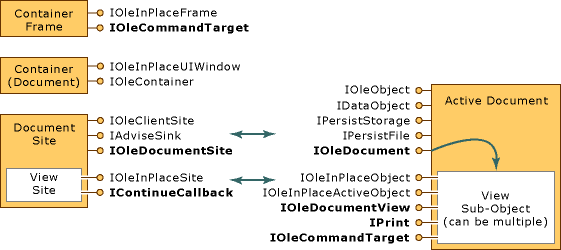

# Active Document Containers

An active document container, such as Microsoft Office Binder or Internet Explorer, allows you to work with several documents of different application types within a single frame (instead of forcing you to create and use multiple application frames for each document type).

MFC provides full support for active document containers in the `COleDocObjectItem` class. You can use the MFC Application Wizard to create an active document container by selecting the **Active document container** check box on the **Compound Document Support** page of the MFC Application Wizard. For more information, see [Creating an Active Document Container Application](creating-an-active-document-container-application.md).

For more information about active document containers, see:

- [Container Requirements](#container_requirements)

- [Document Site Objects](#document_site_objects)

- [View Site Objects](#view_site_objects)

- [Frame Object](#frame_object)

- [Help Menu Merging](help-menu-merging.md)

- [Programmatic Printing](programmatic-printing.md)

- [Command Targets](message-handling-and-command-targets.md)

## <a name="container_requirements"></a> Container Requirements

Active document support in an active document container implies more than just interface implementations: it also requires knowledge of using the interfaces of a contained object. The same applies to active document extensions, where the container must also know how to use those extension interfaces on the active documents themselves.

An active document container that integrates active documents must:

- Be capable of handling object storage through the `IPersistStorage` interface, that is, it must provide an `IStorage` instance to each active document.

- Support the basic embedding features of OLE documents, necessitating "site" objects (one per document or embedding) that implement `IOleClientSite` and `IAdviseSink`.

- Support in-place activation of embedded objects or active documents. The container's site objects must implement `IOleInPlaceSite` and the container's frame object must provide `IOleInPlaceFrame`.

- Support the active documents' extensions by implementing `IOleDocumentSite` to provide the mechanism for the container to talk to the document. Optionally, the container can implement the active document interfaces `IOleCommandTarget` and `IContinueCallback` to pick up simple commands such as printing or saving.

The frame object, the view objects, and the container object can optionally implement `IOleCommandTarget` to support the dispatch of certain commands, as discussed in [Command Targets](message-handling-and-command-targets.md). View and container objects can also optionally implement `IPrint` and `IContinueCallback`, to support programmatic printing, as discussed in [Programmatic Printing](programmatic-printing.md).

The following figure shows the conceptual relationships between a container and its components (at left), and the active document and its views (at right). The active document manages storage and data, and the view displays or optionally prints that data. Interfaces in bold are those required for active document participation; those bold and italic are optional. All other interfaces are required.



A document that supports only a single view can implement both the view and document components (that is, their corresponding interfaces) on a single concrete class. In addition, a container site that only supports one view at a time can combine the document site and the view site into a single concrete site class. The container's frame object, however, must remain distinct, and the container's document component is merely included here to give a complete picture of the architecture; it is not affected by the active document containment architecture.

## <a name="document_site_objects"></a> Document Site Objects

In the active document containment architecture, a document site is the same as a client site object in OLE Documents with the addition of the `IOleDocument` interface:

```cpp
interface IOleDocumentSite : IUnknown
{
    HRESULT ActivateMe(IOleDocumentView *pViewToActivate);
}
```

The document site is conceptually the container for one or more "view site" objects. Each view site object is associated with individual view objects of the document managed by the document site. If the container only supports a single view per document site, then it can implement the document site and the view site with a single concrete class.

## <a name="view_site_objects"></a> View Site Objects

A container's view site object manages the display space for a particular view of a document. In addition to supporting the standard `IOleInPlaceSite` interface, a view site also generally implements `IContinueCallback` for programmatic printing control. (Note that the view object never queries for `IContinueCallback` so it can actually be implemented on any object the container desires.)

A container that supports multiple views must be able to create multiple view site objects within the document site. This provides each view with separate activation and deactivation services as provided through `IOleInPlaceSite`.

## <a name="frame_object"></a> Frame Object

The container's frame object is, for the most part, the same frame that is used for in-place activation in OLE Documents, that is, the one that handles menu and toolbar negotiation. A view object has access to this frame object through `IOleInPlaceSite::GetWindowContext`, which also provides access to the container object representing the container document (which can handle pane-level toolbar negotiation and contained object enumeration).

An active document container can augment the frame by adding `IOleCommandTarget`. This allows it to receive commands that originate in the active document's user interface in the same way that this interface can allow a container to send the same commands (such as **File New**, **Open**, **Save As**, **Print**; **Edit Copy**, **Paste**, **Undo**, and others) to an active document. For more information, see [Command Targets](message-handling-and-command-targets.md).

## See also

[Active Document Containment](active-document-containment.md)
