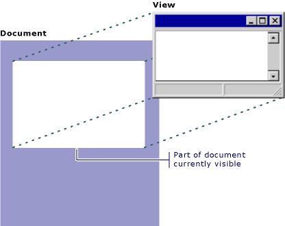

# Document/View Architecture

By default, the MFC Application Wizard creates an application skeleton with a document class and a view class. MFC separates data management into these two classes. The document stores the data and manages printing the data and coordinates updating multiple views of the data. The view displays the data and manages user interaction with it, including selection and editing.

In this model, an MFC document object reads and writes data to persistent storage. The document may also provide an interface to the data wherever it resides (such as in a database). A separate view object manages data display, from rendering the data in a window to user selection and editing of data. The view obtains display data from the document and communicates back to the document any data changes.

While you can easily override or ignore the document/view separation, there are compelling reasons to follow this model in most cases. One of the best is when you need multiple views of the same document, such as both a spreadsheet and a chart view. The document/view model lets a separate view object represent each view of the data, while code common to all views (such as a calculation engine) can reside in the document. The document also takes on the task of updating all views whenever the data changes.

The MFC document/view architecture makes it easy to support multiple views, multiple document types, splitter windows, and other valuable user-interface features.

The parts of the MFC framework most visible both to the user and to you, the programmer, are the document and view. Most of your work in developing an application with the framework goes into writing your document and view classes. This article family describes:

- The purposes of documents and views and how they interact in the framework.

- What you must do to implement them.

At the heart of document/view are four key classes:

The [CDocument](reference/cdocument-class.md) (or [COleDocument](reference/coledocument-class.md)) class supports objects used to store or control your program's data and provides the basic functionality for programmer-defined document classes. A document represents the unit of data that the user typically opens with the Open command on the File menu and saves with the Save command on the File menu.

The [CView](reference/cview-class.md) (or one of its many derived classes) provides the basic functionality for programmer-defined view classes. A view is attached to a document and acts as an intermediary between the document and the user: the view renders an image of the document on the screen and interprets user input as operations upon the document. The view also renders the image for both printing and print preview.

[CFrameWnd](reference/cframewnd-class.md) (or one of its variations) supports objects that provides the frame around one or more views of a document.

[CDocTemplate](reference/cdoctemplate-class.md) (or [CSingleDocTemplate](reference/csingledoctemplate-class.md) or [CMultiDocTemplate](reference/cmultidoctemplate-class.md)) supports an object that coordinates one or more existing documents of a given type and manages creating the correct document, view, and frame window objects for that type.

The following figure shows the relationship between a document and its view.

  
Document and View

The document/view implementation in the class library separates the data itself from its display and from user operations on the data. All changes to the data are managed through the document class. The view calls this interface to access and update the data.

Documents, their associated views, and the frame windows that frame the views are created by a document template. The document template is responsible for creating and managing all documents of one document type.

## What do you want to know more about

- [A portrait of the document/view architecture](a-portrait-of-the-document-view-architecture.md)

- [Advantages of the document/view architecture](advantages-of-the-document-view-architecture.md)

- [Document and view classes created by the Application Wizard](document-and-view-classes-created-by-the-mfc-application-wizard.md)

- [Alternatives to the document/view architecture](alternatives-to-the-document-view-architecture.md)

- [Adding Multiple Views to a Single Document](adding-multiple-views-to-a-single-document.md)

- [Using Documents](using-documents.md)

- [Using Views](using-views.md)

- [Multiple Document Types, Views, and Frame Windows](multiple-document-types-views-and-frame-windows.md)

- [Initializing and cleaning up documents and views](initializing-and-cleaning-up-documents-and-views.md)

- [Initialize your own additions to document & view classes](creating-new-documents-windows-and-views.md)

- [Using database classes with documents and views](../data/mfc-using-database-classes-with-documents-and-views.md)

- [Using database classes without documents and views](../data/mfc-using-database-classes-without-documents-and-views.md)

- [Samples](../overview/visual-cpp-samples.md)

## See also

[User Interface Elements](user-interface-elements-mfc.md) 
[Windows](windows.md) 
[Frame Windows](frame-windows.md) 
[Document Templates and the Document/View Creation Process](document-templates-and-the-document-view-creation-process.md) 
[Document/View Creation](document-view-creation.md) 
[Creating New Documents, Windows, and Views](creating-new-documents-windows-and-views.md)
