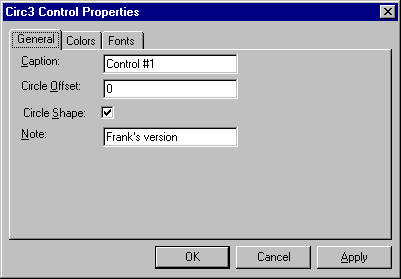

# MFC ActiveX Controls: Property Pages
Property pages allow an ActiveX control user to view and change ActiveX control properties. These properties are accessed by invoking a control properties dialog box, which contains one or more property pages that provide a customized, graphical interface for viewing and editing the control properties.  
  
 ActiveX control property pages are displayed in two ways:  
  
-   When the control's Properties verb (**OLEIVERB_PROPERTIES**) is invoked, the control opens a modal property dialog box that contains the control's property pages.  
  
-   The container can display its own modeless dialog box that shows the property pages of the selected control.  
  
 The properties dialog box (illustrated in the following figure) consists of an area for displaying the current property page, tabs for switching between property pages, and a collection of buttons that perform common tasks such as closing the property page dialog, canceling any changes made, or immediately applying any changes to the ActiveX control.  
  
   
Properties Dialog Box  
  
 This article covers topics related to using property pages in an ActiveX control. These include:  
  
-   [Implementing the default property page for an ActiveX control](#_core_implementing_the_default_property_page)  
  
-   [Adding controls to a property page](#_core_adding_controls_to_a_property_page)  
  
-   [Customizing the DoDataExchange function](#_core_customizing_the_dodataexchange_function)  
  
 For more information on using property pages in an ActiveX control, see the following articles:  
  
-   [MFC ActiveX Controls: Adding Another Custom Property Page](../mfc/mfc-activex-controls-adding-another-custom-property-page.md)  
  
-   [MFC ActiveX Controls: Using Stock Property Pages](../mfc/mfc-activex-controls-using-stock-property-pages.md)  
  
 For information on using property sheets in an MFC application other than an ActiveX control, see [Property Sheets](../mfc/property-sheets-mfc.md).  
  
##   Implementing the Default Property Page  
 If you use the ActiveX Control Wizard to create your control project, the ActiveX Control Wizard provides a default property page class for the control derived from [COlePropertyPage Class](../mfc/reference/colepropertypage-class.md). Initially, this property page is blank, but you can add any dialog box control or set of controls to it. Because the ActiveX Control Wizard creates only one property page class by default, additional property page classes (also derived from `COlePropertyPage`) must be created using Class View. For more information on this procedure, see [MFC ActiveX Controls: Adding Another Custom Property Page](../mfc/mfc-activex-controls-adding-another-custom-property-page.md).  
  
 Implementing a property page (in this case, the default) is a three-step process:  
  
#### To implement a property page  
  
1.  Add a `COlePropertyPage`-derived class to the control project. If the project was created using the ActiveX Control Wizard (as in this case), the default property page class already exists.  
  
2.  Use the dialog editor to add any controls to the property page template.  
  
3.  Customize the `DoDataExchange` function of the `COlePropertyPage`-derived class to exchange values between the property page control and the ActiveX control.  
  
 For example purposes, the following procedures use a simple control (named "Sample"). Sample was created using the ActiveX Control Wizard and contains only the stock Caption property.  
  
##   Adding Controls to a Property Page  
  
#### To add controls to a property page  
  
1.  With your control project open, open Resource View.  
  
2.  Double-click the **Dialog** directory icon.  
  
3.  Open the **IDD_PROPPAGE_SAMPLE** dialog box.  
  
     The ActiveX Control Wizard appends the name of the project to the end of the dialog ID, in this case, Sample.  
  
4.  Drag and drop the selected control from the Toolbox onto the dialog box area.  
  
5.  For this example, a text label control "Caption :" and an edit box control with an **IDC_CAPTION** identifier are sufficient.  
  
6.  Click **Save** on the Toolbar to save your changes.  
  
 Now that the user interface has been modified, you need to link the edit box with the Caption property. This is done in the following section by editing the `CSamplePropPage::DoDataExchange` function.  
  
##   Customizing the DoDataExchange Function  
 Your property page [CWnd::DoDataExchange](../mfc/reference/cwnd-class.md#cwnd__dodataexchange) function allows you to link property page values with the actual values of properties in the control. To establish links, you must map the appropriate property page fields to their respective control properties.  
  
 These mappings are implemented using the property page **DDP_** functions. The **DDP_** functions work like the **DDX_** functions used in standard MFC dialogs, with one exception. In addition to the reference to a member variable, **DDP_** functions take the name of the control property. The following is a typical entry in the `DoDataExchange` function for a property page.  
  
 [!code-cpp[NVC_MFC_AxUI#31](../mfc/codesnippet/cpp/mfc-activex-controls-property-pages_1.cpp)]  
  
 This function associates the property page's `m_caption` member variable with the Caption, using the `DDP_TEXT` function.  
  
 After you have the property page control inserted, you need to establish a link between the property page control, `IDC_CAPTION`, and the actual control property, Caption, using the **DDP_Text** function as described above.  
  
 [Property Pages](../mfc/reference/property-pages-mfc.md) are available for other dialog control types, such as check boxes, radio buttons, and list boxes. The table below lists the entire set of property page **DDP_** functions and their purposes:  
  
### Property Page Functions  
  
|Function name|Use this function to link|  
|-------------------|-------------------------------|  
|`DDP_CBIndex`|The selected string's index in a combo box with a control property.|  
|`DDP_CBString`|The selected string in a combo box with a control property. The selected string can begin with the same letters as the property's value but need not match it fully.|  
|`DDP_CBStringExact`|The selected string in a combo box with a control property. The selected string and the property's string value must match exactly.|  
|`DDP_Check`|A check box with a control property.|  
|`DDP_LBIndex`|The selected string's index in a list box with a control property.|  
|`DDP_LBString`|The selected string in a list box with a control property. The selected string can begin with the same letters as the property's value but need not match it fully.|  
|`DDP_LBStringExact`|The selected string in a list box with a control property. The selected string and the property's string value must match exactly.|  
|`DDP_Radio`|A radio button with a control property.|  
|**DDP_Text**|Text with a control property.|  
  
## See Also  
 [MFC ActiveX Controls](../mfc/mfc-activex-controls.md)   
 [COlePropertyPage Class](../mfc/reference/colepropertypage-class.md)
