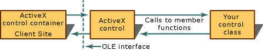
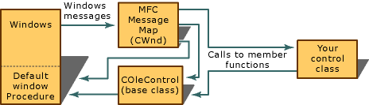

# MFC ActiveX Controls

An ActiveX control is a reusable software component based on the Component Object Model (COM) that supports a wide variety of OLE functionality and can be customized to fit many software needs.

>[!IMPORTANT]
> ActiveX is a legacy technology that should not be used for new development. For more information, see [ActiveX Controls](activex-controls.md).

ActiveX controls are designed for use both in ordinary ActiveX control containers and on the Internet, in World Wide Web pages. You can create ActiveX controls either with MFC, described here, or with the [Active Template Library (ATL)](../atl/active-template-library-atl-concepts.md).

An ActiveX control can draw itself in its own window, respond to events (such as mouse clicks), and be managed through an interface that includes properties and methods similar to those in Automation objects.

These controls can be developed for many uses, such as database access, data monitoring, or graphing. Besides their portability, ActiveX controls support features previously not available to ActiveX controls, such as compatibility with existing OLE containers and the ability to integrate their menus with the OLE container menus. In addition, an ActiveX control fully supports Automation, which allows the control to expose read\write properties and a set of methods that can be called by the control user.

You can create windowless ActiveX controls and controls that only create a window when they become active. Windowless controls speed up the display of your application and make it possible to have transparent and nonrectangular controls. You can also load ActiveX control properties asynchronously.

An ActiveX control is implemented as an in-process server (typically a small object) that can be used in any OLE container. Note that the full functionality of an ActiveX control is available only when used within an OLE container designed to be aware of ActiveX controls. See [Port ActiveX Controls to Other Applications](containers-for-activex-controls.md) for a list of containers that support ActiveX controls. This container type, hereafter called a "control container," can operate an ActiveX control by using the control's properties and methods, and receives notifications from the ActiveX control in the form of events. The following figure demonstrates this interaction.

  
Interaction Between an ActiveX Control Container and a Windowed ActiveX Control

For some recent information on optimizing your ActiveX controls, see [MFC ActiveX Controls: Optimization](mfc-activex-controls-optimization.md).

To create an MFC ActiveX control, see [Create an ActiveX control project](reference/mfc-activex-control-wizard.md).

For more information, see:

- [ActiveX Control Containers](activex-control-containers.md)

- [Active Documents](active-documents.md)

- [Understanding ActiveX Controls](/windows/win32/com/activex-controls)

- [Upgrading an Existing ActiveX Control to be Used on the Internet](upgrading-an-existing-activex-control.md)

##  Basic Components of an ActiveX Control

An ActiveX control uses several programmatic elements to interact efficiently with a control container and with the user. These are class [COleControl](reference/colecontrol-class.md), a set of event-firing functions, and a dispatch map.

Every ActiveX control object you develop inherits a powerful set of features from its MFC base class, `COleControl`. These features include in-place activation, and Automation logic. `COleControl` can provide the control object with the same functionality as an MFC window object, plus the ability to fire events. `COleControl` can also provide [windowless controls](providing-windowless-activation.md), which rely on their container for help with some of the functionality a window provides (mouse capture, keyboard focus, scrolling), but offer much faster display.

Because the control class derives from `COleControl`, it inherits the capability to send, or "fire," messages, called events, to the control container when certain conditions are met. These events are used to notify the control container when something important happens in the control. You can send additional information about an event to the control container by attaching parameters to the event. For more information about ActiveX control events, see the article [MFC ActiveX Controls: Events](mfc-activex-controls-events.md).

The final element is a dispatch map, which is used to expose a set of functions (called methods) and attributes (called properties) to the control user. Properties allow the control container or the control user to manipulate the control in various ways. The user can change the appearance of the control, change certain values of the control, or make requests of the control, such as accessing a specific piece of data that the control maintains. This interface is determined by the control developer and is defined using **Class View**. For more information on ActiveX control methods and properties, see the articles [MFC ActiveX Controls: Methods](mfc-activex-controls-methods.md) and [Properties](mfc-activex-controls-properties.md).

##  Interaction Between Controls with Windows and ActiveX Control Containers

When a control is used within a control container, it uses two mechanisms to communicate: it exposes properties and methods, and it fires events. The following figure demonstrates how these two mechanisms are implemented.

  
Communication Between an ActiveX Control Container and an ActiveX Control

The previous figure also illustrates how other OLE interfaces (besides automation and events) are handled by controls.

All of a control's communication with the container is performed by `COleControl`. To handle some of the container's requests, `COleControl` will call member functions that are implemented in the control class. All methods and some properties are handled in this way. Your control's class can also initiate communication with the container by calling member functions of `COleControl`. Events are fired in this manner.

##  Active and Inactive States of an ActiveX Control

A control has two basic states: active and inactive. Traditionally, these states were distinguished by whether the control had a window. An active control had a window; an inactive control did not. With the introduction of windowless activation, this distinction is no longer universal, but still applies to many controls.

When a [windowless control](providing-windowless-activation.md) goes active, it invokes mouse capture, keyboard focus, scrolling, and other window services from its container. You can also [provide mouse interaction to inactive controls](providing-mouse-interaction-while-inactive.md), as well as create controls that [wait until activated to create a window](turning-off-the-activate-when-visible-option.md).

When a control with a window becomes active, it is able to interact fully with the control container, the user, and Windows. The figure below demonstrates the paths of communication between the ActiveX control, the control container, and the operating system.

  
Windows Message Processing in a Windowed ActiveX Control (When Active)

##  Serialization

The ability to serialize data, sometimes referred to as persistence, allows the control to write the value of its properties to persistent storage. Controls can then be recreated by reading the object's state from the storage.

Note that a control is not responsible for obtaining access to the storage medium. Instead, the control's container is responsible for providing the control with a storage medium to use at the appropriate times. For more information on serialization, see the article [MFC ActiveX Controls: Serializing](mfc-activex-controls-serializing.md). For information on optimizing serialization, see [Optimizing Persistence and Initialization](optimizing-persistence-and-initialization.md) in ActiveX Controls: Optimization.

##  Installing ActiveX Control Classes and Tools

When you install Visual C++, the MFC ActiveX control classes and retail and debug ActiveX control run-time DLLs are automatically installed if ActiveX controls are selected in Setup (they are selected by default).

By default, the ActiveX control classes and tools are installed in the following subdirectories under \Program Files\Microsoft Visual Studio .NET:

- **\Common7\Tools**

   Contains the Test Container files (TstCon32.exe, as well as its Help files).

- **\Vc7\atlmfc\include**

   Contains the include files needed to develop ActiveX controls with MFC

- **\Vc7\atlmfc\src\mfc**

   Contains the source code for specific ActiveX control classes in MFC

- **\Vc7\atlmfc\lib**

   Contains the libraries required to develop ActiveX controls with MFC

There are also samples for MFC ActiveX controls. For more information about these samples, see [Controls Samples: MFC-Based ActiveX Controls](../overview/visual-cpp-samples.md)

## See also

[User Interface Elements](user-interface-elements-mfc.md)
