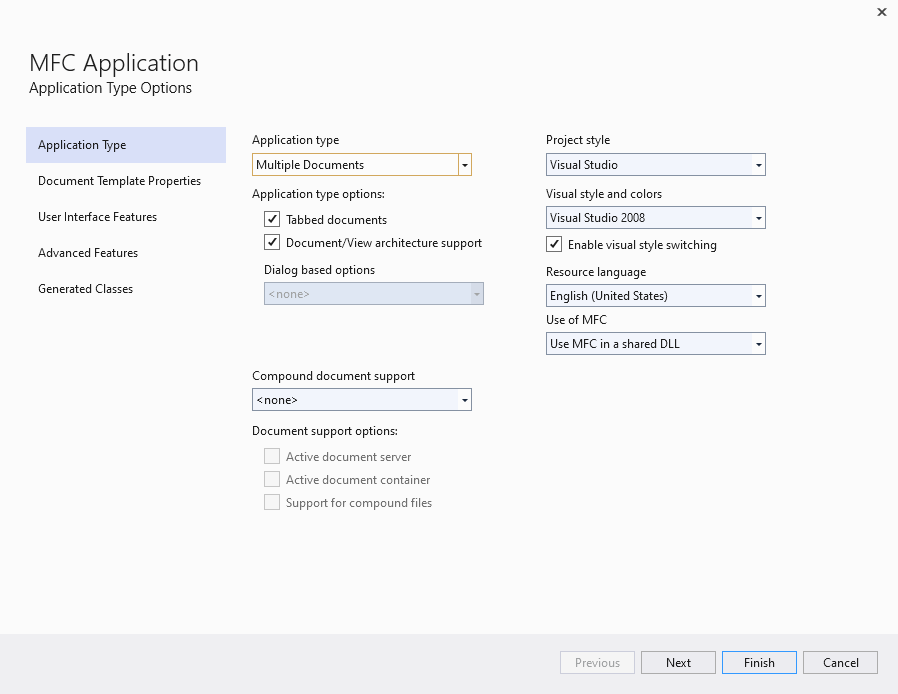
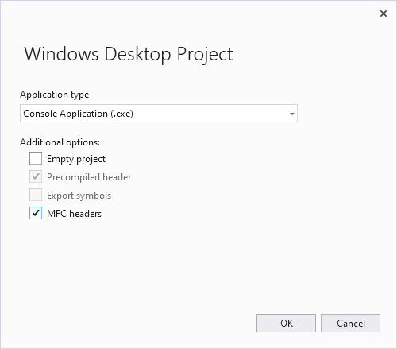
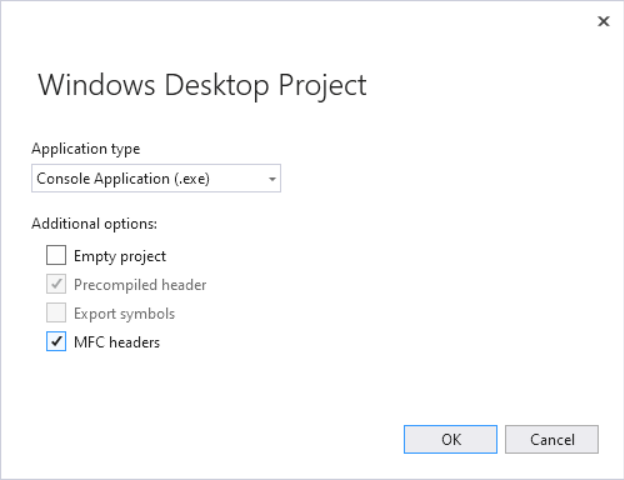
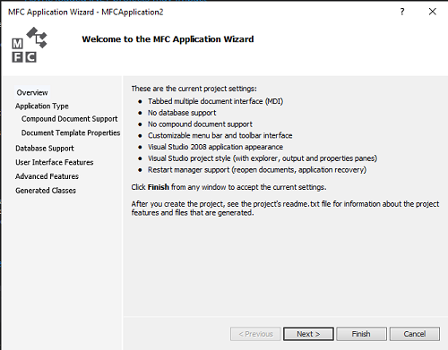

# Creating an MFC Application

An MFC application is an executable application for Windows that is based on the Microsoft Foundation Class (MFC) Library. MFC executables generally fall into five types: standard Windows applications, dialog boxes, forms-based applications, Explorer-style applications, and Web browser-style applications. For more information, see:

- [Using the Classes to Write Windows Applications](../../mfc/using-the-classes-to-write-applications-for-windows.md)

- [Creating and Displaying Dialog Boxes](../../mfc/creating-and-displaying-dialog-boxes.md)

- [Creating a Forms-Based MFC Application](../../mfc/reference/creating-a-forms-based-mfc-application.md)

- [Creating a File Explorer-Style MFC Application](../../mfc/reference/creating-a-file-explorer-style-mfc-application.md)

- [Creating a Web Browser-Style MFC Application](../../mfc/reference/creating-a-web-browser-style-mfc-application.md)

The MFC Application Wizard generates the appropriate classes and files for any of these types of applications, depending on the options you select in the wizard.

The easiest way to create an MFC application is to use the MFC Application Wizard (**MFC App project** in Visual Studio 2019). To create an MFC console application (a command-line program that uses MFC libraries but runs in the console window), use the Windows Desktop Wizard and choose the **Console Application** and **MFC Headers** options.

::: moniker range=">=msvc-160"

## To create an MFC forms or dialog-based application

1. From the main menu, choose **File** > **New** > **Project**.
1. Enter "MFC" into the search box and then choose **MFC App** from the result list.
1. Modify the defaults as needed, then press **Create** to open the **MFC Application Wizard**.
1. Modify the configuration values as needed, then press **Finish**.

For more information, see [Creating a Forms-Based MFC Application](creating-a-forms-based-mfc-application.md).

## To create an MFC console application

An MFC console application is a command-line program that uses MFC libraries but runs in the console window.

1. From the main menu, choose **File** > **New** > **Project**.
1. Enter "Desktop" into the search box and then choose **Windows Desktop Wizard** from the result list.
1. Modify the project name as needed, then press **Next** to open the **Windows Desktop Wizard**.
1. Check the **MFC Headers** box and set other values as needed, then press **Finish**.

::: moniker-end

::: moniker range="=msvc-150"

## To create an MFC forms or dialog-based application

1. From the main menu, choose **File** > **New** > **Project**.
1. Under the **Installed** templates, choose **Visual C++** > **MFC/ATL**. If you don't see these, use the Visual Studio Installer to add them.
1. Choose **MFC Application** from the center pane.
1. Modify the configuration values as needed, then press **Finish**.

For more information, see [Creating a Forms-Based MFC Application](creating-a-forms-based-mfc-application.md).

## To create an MFC console application

An MFC console application is a command-line program that uses MFC libraries but runs in the console window.

1. From the main menu, choose **File** > **New** > **Project**.
1. Under the **Installed** templates, choose **Visual C++** > **Windows Desktop**.
1. Choose **Windows Desktop Wizard** from the center pane.
1. Modify the project name as needed, then press **OK** to open the **Windows Desktop Wizard**.
1. Check the **MFC Headers** box and set other values as needed, then press **Finish**.

::: moniker-end

::: moniker range="=msvc-140"

## To create an MFC forms or dialog-based application

1. From the main menu, choose **File** > **New** > **Project**.
1. Under the **Installed** templates, choose **Visual C++** > **MFC**.
1. Choose **MFC Application** from the center pane.
1. Click **Next** to start the **MFC Application Wizard**.

For more information, see [Creating a Forms-Based MFC Application](creating-a-forms-based-mfc-application.md).

## To create an MFC console application

An MFC console application is a command-line program that uses MFC libraries but runs in the console window.

1. From the main menu, choose **File** > **New** > **Project**.
1. Under the **Installed** templates, choose **Visual C++** > **Win32**.
1. Choose **Win32 Console Application** from the center pane.
1. Modify the project name as needed, then press **OK**.
1. On the second page of the wizard, check the **Add common headers for MFC** box and set other values as needed, then press **Finish**.

::: moniker-end

Once your project is created, you can view the files created in **Solution Explorer**. For more information about the files the wizard creates for your project, see the project-generated file ReadMe.txt. For more information about the file types, see [File Types Created for Visual Studio C++ projects](../../build/reference/file-types-created-for-visual-cpp-projects.md).

## See also

[Adding Functionality with Code Wizards](../../ide/adding-functionality-with-code-wizards-cpp.md) 
[Property Pages](../../build/reference/property-pages-visual-cpp.md)
