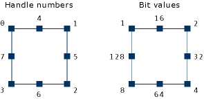

# CRectTracker Class
Allows an item to be displayed, moved, and resized in different fashions.  
  
## Syntax  
  
```  
class CRectTracker  
```  
  
## Members  
  
### Public Constructors  
  
|Name|Description|  
|----------|-----------------|  
|[CRectTracker::CRectTracker](#crecttracker__crecttracker)|Constructs a `CRectTracker` object.|  
  
### Public Methods  
  
|Name|Description|  
|----------|-----------------|  
|[CRectTracker::AdjustRect](#crecttracker__adjustrect)|Called when the rectangle is resized.|  
|[CRectTracker::Draw](#crecttracker__draw)|Renders the rectangle.|  
|[CRectTracker::DrawTrackerRect](#crecttracker__drawtrackerrect)|Called when drawing the border of a `CRectTracker` object.|  
|[CRectTracker::GetHandleMask](#crecttracker__gethandlemask)|Called to get the mask of a `CRectTracker`item's resize handles.|  
|[CRectTracker::GetTrueRect](#crecttracker__gettruerect)|Returns width and height of rectangle, including resize handles.|  
|[CRectTracker::HitTest](#crecttracker__hittest)|Returns the current position of the cursor related to the `CRectTracker` object.|  
|[CRectTracker::NormalizeHit](#crecttracker__normalizehit)|Normalizes a hit-test code.|  
|[CRectTracker::OnChangedRect](#crecttracker__onchangedrect)|Called when the rectangle has been resized or moved.|  
|[CRectTracker::SetCursor](#crecttracker__setcursor)|Sets the cursor, depending on its position over the rectangle.|  
|[CRectTracker::Track](#crecttracker__track)|Allows the user to manipulate the rectangle.|  
|[CRectTracker::TrackRubberBand](#crecttracker__trackrubberband)|Allows the user to "rubber-band" the selection.|  
  
### Public Data Members  
  
|Name|Description|  
|----------|-----------------|  
|[CRectTracker::m_nHandleSize](#crecttracker__m_nhandlesize)|Determines size of resize handles.|  
|[CRectTracker::m_nStyle](#crecttracker__m_nstyle)|Current style(s) of the tracker.|  
|[CRectTracker::m_rect](#crecttracker__m_rect)|Current position (in pixels) of the rectangle.|  
|[CRectTracker::m_sizeMin](#crecttracker__m_sizemin)|Determines minimum rectangle width and height.|  
  
## Remarks  
 `CRectTracker` does not have a base class.  
  
 Although the `CRectTracker` class is designed to allow the user to interact with OLE items by using a graphical interface, its use is not restricted to OLE-enabled applications. It can be used anywhere such a user interface is required.  
  
 `CRectTracker` borders can be solid or dotted lines. The item can be given a hatched border or overlaid with a hatched pattern to indicate different states of the item. You can place eight resize handles on either the outside or the inside border of the item. (For an explanation of the resize handles, see [GetHandleMask](#crecttracker__gethandlemask).) Finally, a `CRectTracker` allows you to change the orientation of an item during resizing.  
  
 To use `CRectTracker`, construct a `CRectTracker` object and specify which display states are initialized. You can then use this interface to give the user visual feedback on the current status of the OLE item associated with the `CRectTracker` object.  
  
 For more information on using `CRectTracker`, see the article [Trackers](../../mfc/trackers.md).  
  
## Inheritance Hierarchy  
 `CRectTracker`  
  
## Requirements  
 **Header:** afxext.h  
  
##  <a name="crecttracker__adjustrect"></a>  CRectTracker::AdjustRect  
 Called by the framework when the tracking rectangle is resized by using a resize handle.  
  
```  
virtual void AdjustRect(
    int nHandle,  
    LPRECT lpRect);
```  
  
### Parameters  
 `nHandle`  
 Index of handle used.  
  
 `lpRect`  
 Pointer to the current size of the rectangle. (The size of a rectangle is given by its height and width.)  
  
### Remarks  
 The default behavior of this function allows the rectangle's orientation to change only when `Track` and `TrackRubberBand` are called with inverting allowed.  
  
 Override this function to control the adjustment of the tracking rectangle during a dragging operation. One method is to adjust the coordinates specified by `lpRect` before returning.  
  
 Special features that are not directly supported by `CRectTracker`, such as snap-to-grid or keep-aspect-ratio, can be implemented by overriding this function.  
  
##  <a name="crecttracker__crecttracker"></a>  CRectTracker::CRectTracker  
 Creates and initializes a `CRectTracker` object.  
  
```  
CRectTracker();

 
CRectTracker(
    LPCRECT lpSrcRect,  
    UINT nStyle);
```  
  
### Parameters  
 `lpSrcRect`  
 The coordinates of the rectangle object.  
  
 `nStyle`  
 Specifies the style of the `CRectTracker` object. The following styles are supported:  
  
- **CRectTracker::solidLine** Use a solid line for the rectangle border.  
  
- **CRectTracker::dottedLine** Use a dotted line for the rectangle border.  
  
- **CRectTracker::hatchedBorder** Use a hatched pattern for the rectangle border.  
  
- **CRectTracker::resizeInside** Resize handles located inside the rectangle.  
  
- **CRectTracker::resizeOutside** Resize handles located outside the rectangle.  
  
- **CRectTracker::hatchInside** Hatched pattern covers the entire rectangle.  
  
### Remarks  
 The default constructor initializes the `CRectTracker` object with the values from `lpSrcRect` and initializes other sizes to system defaults. If the object is created with no parameters, the `m_rect` and `m_nStyle` data members are uninitialized.  
  
##  <a name="crecttracker__draw"></a>  CRectTracker::Draw  
 Call this function to draw the rectangle's outer lines and inner region.  
  
```  
void Draw(CDC* pDC) const;

 
```  
  
### Parameters  
 `pDC`  
 Pointer to the device context on which to draw.  
  
### Remarks  
 The style of the tracker determines how the drawing is done. See the constructor for `CRectTracker` for more information on the styles available.  
  
##  <a name="crecttracker__drawtrackerrect"></a>  CRectTracker::DrawTrackerRect  
 Called by the framework whenever the position of the tracker has changed while inside the `Track` or `TrackRubberBand` member function.  
  
```  
virtual void DrawTrackerRect(
    LPCRECT lpRect,  
    CWnd* pWndClipTo,  
    CDC* pDC,  
    CWnd* pWnd);
```  
  
### Parameters  
 `lpRect`  
 Pointer to the `RECT` that contains the rectangle to draw.  
  
 `pWndClipTo`  
 Pointer to the window to use in clipping the rectangle.  
  
 `pDC`  
 Pointer to the device context on which to draw.  
  
 `pWnd`  
 Pointer to the window on which the drawing will occur.  
  
### Remarks  
 The default implementation makes a call to `CDC::DrawFocusRect`, which draws a dotted rectangle.  
  
 Override this function to provide different feedback during the tracking operation.  
  
##  <a name="crecttracker__gethandlemask"></a>  CRectTracker::GetHandleMask  
 The framework calls this member function to retrieve the mask for a rectangle's resize handles.  
  
```  
virtual UINT GetHandleMask() const;

 
```  
  
### Return Value  
 The mask of a `CRectTracker` item's resize handles.  
  
### Remarks  
 The resize handles appear on the sides and corners of the rectangle and allow the user to control the shape and size of the rectangle.  
  
 A rectangle has 8 resize handles numbered 0–7. Each resize handle is represented by a bit in the mask; the value of that bit is 2^ *n*, where *n* is the resize handle number. Bits 0–3 correspond to the corner resize handles, starting at the top left moving clockwise. Bits 4–7 correspond to the side resize handles starting at the top moving clockwise. The following illustration shows a rectangle's resize handles and their corresponding resize handle numbers and values:  
  
   
  
 The default implementation of **GetHandleMask** returns the mask of the bits so that the resize handles appear. If the single bit is on, the corresponding resize handle will be drawn.  
  
 Override this member function to hide or show the indicated resize handles.  
  
##  <a name="crecttracker__gettruerect"></a>  CRectTracker::GetTrueRect  
 Call this function to retrieve the coordinates of the rectangle.  
  
```  
void GetTrueRect(LPRECT lpTrueRect) const;

 
```  
  
### Parameters  
 `lpTrueRect`  
 Pointer to the `RECT` structure that will contain the device coordinates of the `CRectTracker` object.  
  
### Remarks  
 The dimensions of the rectangle include the height and width of any resize handles located on the outer border. Upon returning, `lpTrueRect` is always a normalized rectangle in device coordinates.  
  
##  <a name="crecttracker__hittest"></a>  CRectTracker::HitTest  
 Call this function to find out whether the user has grabbed a resize handle.  
  
```  
int HitTest(CPoint point) const;

 
```  
  
### Parameters  
 `point`  
 The point, in device coordinates, to test.  
  
### Return Value  
 The value returned is based on the enumerated type **CRectTracker::TrackerHit** and can have one of the following values:  
  
- **CRectTracker::hitNothing** –1  
  
- **CRectTracker::hitTopLeft** 0  
  
- **CRectTracker::hitTopRight** 1  
  
- **CRectTracker::hitBottomRight** 2  
  
- **CRectTracker::hitBottomLeft** 3  
  
- **CRectTracker::hitTop** 4  
  
- **CRectTracker::hitRight** 5  
  
- **CRectTracker::hitBottom** 6  
  
- **CRectTracker::hitLeft** 7  
  
- **CRectTracker::hitMiddle** 8  
  
##  <a name="crecttracker__m_nhandlesize"></a>  CRectTracker::m_nHandleSize  
 The size, in pixels, of the `CRectTracker` resize handles.  
  
```  
int m_nHandleSize;  
```  
  
### Remarks  
 Initialized with the default system value.  
  
##  <a name="crecttracker__m_rect"></a>  CRectTracker::m_rect  
 The current position of the rectangle in client coordinates (pixels).  
  
```  
CRect m_rect;  
```  
  
##  <a name="crecttracker__m_sizemin"></a>  CRectTracker::m_sizeMin  
 The minimum size of the rectangle.  
  
```  
CSize m_sizeMin;  
```  
  
### Remarks  
 Both default values, **cx** and **cy**, are calculated from the default system value for the border width. This data member is used only by the `AdjustRect` member function.  
  
##  <a name="crecttracker__m_nstyle"></a>  CRectTracker::m_nStyle  
 Current style of the rectangle.  
  
```  
UINT m_nStyle;  
```  
  
### Remarks  
 See [CRectTracker::CRectTracker](#crecttracker__crecttracker) for a list of possible styles.  
  
##  <a name="crecttracker__normalizehit"></a>  CRectTracker::NormalizeHit  
 Call this function to convert a potentially inverted handle.  
  
```  
int NormalizeHit(int nHandle) const;

 
```  
  
### Parameters  
 `nHandle`  
 Handle selected by the user.  
  
### Return Value  
 The index of the normalized handle.  
  
### Remarks  
 When `CRectTracker::Track` or `CRectTracker::TrackRubberBand` is called with inverting allowed, it is possible for the rectangle to be inverted on the x-axis, the y-axis, or both. When this happens, `HitTest` will return handles that are also inverted with respect to the rectangle. This is inappropriate for drawing cursor feedback because the feedback depends on the screen position of the rectangle, not the portion of the rectangle data structure that will be modified.  
  
##  <a name="crecttracker__onchangedrect"></a>  CRectTracker::OnChangedRect  
 Called by the framework whenever the tracker rectangle has changed during a call to `Track`.  
  
```  
virtual void OnChangedRect(const CRect& rectOld);
```  
  
### Parameters  
 *rectOld*  
 Contains the old device coordinates of the `CRectTracker` object.  
  
### Remarks  
 At the time this function is called, all feedback drawn with `DrawTrackerRect` has been removed. The default implementation of this function does nothing.  
  
 Override this function when you want to perform any actions after the rectangle has been resized.  
  
##  <a name="crecttracker__setcursor"></a>  CRectTracker::SetCursor  
 Call this function to change the cursor shape while it is over the `CRectTracker` object's region.  
  
```  
BOOL SetCursor(
    CWnd* pWnd,  
    UINT nHitTest) const;

 
```  
  
### Parameters  
 `pWnd`  
 Points to the window that currently contains the cursor.  
  
 `nHitTest`  
 Results of the previous hit test, from the `WM_SETCURSOR` message.  
  
### Return Value  
 Nonzero if the previous hit was over the tracker rectangle; otherwise 0.  
  
### Remarks  
 Call this function from inside the function of your window that handles the `WM_SETCURSOR` message (typically `OnSetCursor`).  
  
##  <a name="crecttracker__track"></a>  CRectTracker::Track  
 Call this function to display the user interface for resizing the rectangle.  
  
```  
BOOL Track(
    CWnd* pWnd,  
    CPoint point,  
    BOOL bAllowInvert = FALSE,  
    CWnd* pWndClipTo = NULL);
```  
  
### Parameters  
 `pWnd`  
 The window object that contains the rectangle.  
  
 `point`  
 Device coordinates of the current mouse position relative to the client area.  
  
 `bAllowInvert`  
 If **TRUE**, the rectangle can be inverted along the x-axis or y-axis; otherwise **FALSE**.  
  
 `pWndClipTo`  
 The window that drawing operations will be clipped to. If **NULL**, `pWnd` is used as the clipping rectangle.  
  
### Return Value  
 If the ESC key is pressed, the tracking process is halted, the rectangle stored in the tracker is not altered, and 0 is returned. If the change is committed, by moving the mouse and releasing the left mouse button, the new position and/or size is recorded in the tracker's rectangle and nonzero is returned.  
  
### Remarks  
 This is usually called from inside the function of your application that handles the `WM_LBUTTONDOWN` message (typically `OnLButtonDown`).  
  
 This function will capture the mouse until the user releases the left mouse button, presses the ESC key, or presses the right mouse button. As the user moves the mouse cursor, the feedback is updated by calling `DrawTrackerRect` and `OnChangedRect`.  
  
 If `bAllowInvert` is **TRUE**, the tracking rectangle can be inverted on either the x-axis or y-axis.  
  
##  <a name="crecttracker__trackrubberband"></a>  CRectTracker::TrackRubberBand  
 Call this function to do rubber-band selection.  
  
```  
BOOL TrackRubberBand(
    CWnd* pWnd,  
    CPoint point,  
    BOOL bAllowInvert = TRUE);
```  
  
### Parameters  
 `pWnd`  
 The window object that contains the rectangle.  
  
 `point`  
 Device coordinates of the current mouse position relative to the client area.  
  
 `bAllowInvert`  
 If **TRUE,** the rectangle can be inverted along the x-axis or y-axis; otherwise **FALSE**.  
  
### Return Value  
 Nonzero if the mouse has moved and the rectangle is not empty; otherwise 0.  
  
### Remarks  
 It is usually called from inside the function of your application that handles the `WM_LBUTTONDOWN` message (typically `OnLButtonDown`).  
  
 This function will capture the mouse until the user releases the left mouse button, presses the ESC key, or presses the right mouse button. As the user moves the mouse cursor, the feedback is updated by calling `DrawTrackerRect` and `OnChangedRect`.  
  
 Tracking is performed with a rubber-band-type selection from the lower-right handle. If inverting is allowed, the rectangle can be sized by dragging either up and to the left or down and to the right.  
  
## See Also  
 [MFC Sample TRACKER](../../visual-cpp-samples.md)   
 [MFC Sample DRAWCLI](../../visual-cpp-samples.md)   
 [Hierarchy Chart](../../mfc/hierarchy-chart.md)   
 [COleResizeBar Class](../../mfc/reference/coleresizebar-class.md)   
 [CRect Class](../../atl-mfc-shared/reference/crect-class.md)
