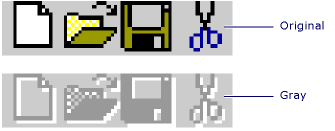
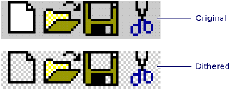

# Gray and Dithered Bitmap Functions

**Gray Bitmap Functions**

MFC provides two functions for giving a bitmap the appearance of a disabled control.



|Name|Description|
|-|-|
|[AfxDrawGrayBitmap](#afxdrawgraybitmap)|Draws a gray version of a bitmap.|
|[AfxGetGrayBitmap](#afxgetgraybitmap)|Copies a gray version of a bitmap.|

**Dithered Bitmap Functions**

MFC also provides two functions for replacing a bitmap's background with a dithered pattern.



|Name|Description|
|-|-|
|[AfxDrawDitheredBitmap](#afxdrawditheredbitmap)|Draws a bitmap with a dithered background.|
|[AfxGetDitheredBitmap](#afxgetditheredbitmap)|Copies a bitmap with a dithered background.|

## <a name="afxdrawgraybitmap"></a> AfxDrawGrayBitmap

Draws a gray version of a bitmap.

```cpp
void AFXAPI AfxDrawGrayBitmap(
    CDC* pDC,
    int x,
    int y,
    const CBitmap& rSrc,
    COLORREF crBackground);
```

### Parameters

*pDC*<br/>
Points to the destination DC.

*x*<br/>
The destination x-coordinate.

*y*<br/>
The destination y-coordinate.

*rSrc*<br/>
The source bitmap.

*crBackground*<br/>
The new background color (typically gray, such as COLOR_MENU).

### Remarks

A bitmap drawn with `AfxDrawGrayBitmap` will have the appearance of a disabled control.


### Example

[!code-cpp[NVC_MFCDocView#191](../../mfc/codesnippet/cpp/gray-and-dithered-bitmap-functions_1.cpp)]

### Requirements

**Header:** afxwin.h

## <a name="afxgetgraybitmap"></a> AfxGetGrayBitmap

Copies a gray version of a bitmap.

```cpp
void AFXAPI AfxGetGrayBitmap(
    const CBitmap& rSrc,
    CBitmap* pDest,
    COLORREF crBackground);
```

### Parameters

*rSrc*<br/>
The source bitmap.

*pDest*<br/>
The destination bitmap.

*crBackground*<br/>
The new background color (typically gray, such as COLOR_MENU).

### Remarks

A bitmap copied with `AfxGetGrayBitmap` will have the appearance of a disabled control.


### Example

[!code-cpp[NVC_MFCDocView#193](../../mfc/codesnippet/cpp/gray-and-dithered-bitmap-functions_2.cpp)]

### Requirements

**Header:** afxwin.h

## <a name="afxdrawditheredbitmap"></a> AfxDrawDitheredBitmap

Draws a bitmap, replacing its background with a dithered (checker) pattern.

```cpp
void AFXAPI AfxDrawDitheredBitmap(
    CDC* pDC,
    int x,
    int y,
    const CBitmap& rSrc,
    COLORREF cr1  ,
    COLORREF cr2);
```

### Parameters

*pDC*<br/>
Points to the destination DC.

*x*<br/>
The destination x-coordinate.

*y*<br/>
The destination y-coordinate.

*rSrc*<br/>
The source bitmap.

*cr1*<br/>
One of the two dither colors, typically white.

*cr2*<br/>
The other dither color, typically light gray (COLOR_MENU).

### Remarks

The source bitmap is drawn on the destination DC with a two-color (*cr1* and *cr2*) checkered pattern replacing the bitmap's background. The background of the source bitmap is defined as its white pixels and all pixels matching the color of the pixel in the upper-left corner of the bitmap.


### Example

[!code-cpp[NVC_MFCDocView#190](../../mfc/codesnippet/cpp/gray-and-dithered-bitmap-functions_3.cpp)]

### Requirements

**Header:** afxwin.h

## <a name="afxgetditheredbitmap"></a> AfxGetDitheredBitmap

Copies a bitmap, replacing its background with a dithered (checker) pattern.

```cpp
void AFXAPI AfxGetDitheredBitmap(
    const CBitmap& rSrc,
    CBitmap* pDest,
    COLORREF cr1  ,
    COLORREF cr2);
```

### Parameters

*rSrc*<br/>
The source bitmap.

*pDest*<br/>
The destination bitmap.

*cr1*<br/>
One of the two dither colors, typically white.

*cr2*<br/>
The other dither color, typically light gray (COLOR_MENU).

### Remarks

The source bitmap is copied to the destination bitmap with a two-color (*cr1* and *cr2*) checkered pattern replacing the source bitmap's background. The background of the source bitmap is defined as its white pixels and all pixels matching the color of the pixel in the upper-left corner of the bitmap.


### Example

[!code-cpp[NVC_MFCDocView#192](../../mfc/codesnippet/cpp/gray-and-dithered-bitmap-functions_4.cpp)]

### Requirements

**Header:** afxwin.h

## See also

[Macros and Globals](../../mfc/reference/mfc-macros-and-globals.md)
