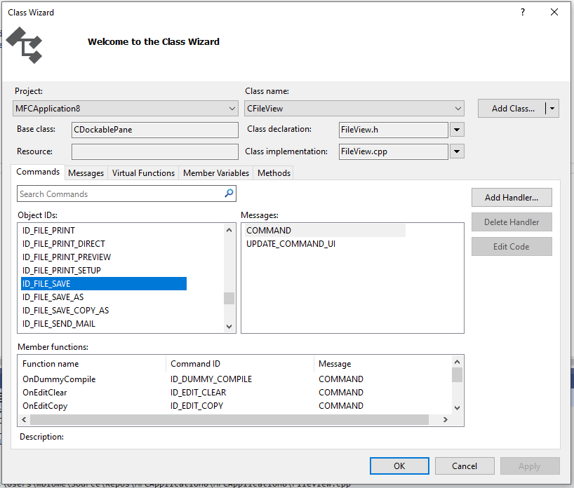

# MFC Class Wizard

Use the **Class Wizard** to create new MFC classes, or add messages and message handlers to existing classes in your project.

There are three ways to open the **Class Wizard**:

- On the **Project** menu, choose **Class Wizard**.
- Type **Ctrl** > **Shift** > **X**.
- In **Class View**, right-click on a class or the project node and choose **Class Wizard**.

## UIElement List

- **Project**

   The name of a project in your solution.

   You can select other projects in your solution from the drop-down list box.

- **Class name**

   The name of a class in your project.

   When you select a class in the **Class name** list, data from the class populates the controls in the **MFC Class Wizard**. When you change the value of a control, data in the selected class is affected.

- **Add Class**

   Lets you add a new class to your MFC project.

- **Base class**

   The base class of the class that is displayed in **Class name**.

- **Class declaration**

   The class in which the **Class name** class is declared.

   The **Class declaration** box is displayed only if the name in it differs from the name in **Class implementation**.

- **Resource**

   The ID of the resource in **Class name**, if any. Otherwise, the **Resource** box is empty.

- **Class implementation**

   The name of the file that contains the implementation of the class in **Class name**.

   You can select a different implementation file by clicking the arrow. The following table lists the available options.

   |Option|Description|
   |------------|-----------------|
   |**Open File**|Exits the class wizard and opens the current class implementation file.|
   |**Open Containing Folder**|Opens the folder that contains the current class implementation file.|
   |**Copy Full Path to Clipboard**|Copies the path of the current implementation file to the Clipboard.|

- **Commands**

   Lets you add, delete, edit, or search for a command and its message handler.

   To add a handler, select **Add Handler**, or double-click an item in the **Object IDs** list or **Messages** list. The resulting function name, ID, and message are displayed in the **Member functions** list.

   To delete a handler, select an item in the **Member functions** list and then select **Delete Handler**.

   To modify a handler, double-click the corresponding item in the **Member functions** list. Or, select an item in the list box and then select **Edit Code**.

- **Messages**

   Lets you add, delete, edit, or search for a message and its message handler.

   To add a handler, select **Add Handler**, or double-click an item in the **Messages** list.

   To add a custom message, select **Add Custom Message** or press the Enter key, and then specify values in the **Add Custom Message** dialog box. In that dialog box, you can also select **Registered Message** to handle a window message that is guaranteed to be unique throughout the operating system.

- **Virtual Functions**

   Lets you add, delete, edit, or search for a virtual function, or an overridden virtual function.

- **Member Variables**

   Lets you add, delete, edit, or search for a member variable.

- **Methods**

   Lets you add, delete, or search for a method, and also go to the definition or declaration of a method.

   To add a method, select **Add Method**, and then specify values in the **Add Method** dialog box.

   To delete a method, select an item in the **Methods** list and then select **Delete Method**.

   To display a declaration, select an item in the **Methods** list and then select **Go to Declaration.**

   To display a definition, double-click an item in the **Methods** list. Or, select an item in the **Methods** list and then select the **Go to Definition** button.

## See also

[Adding a Class](../../ide/adding-a-class-visual-cpp.md)
