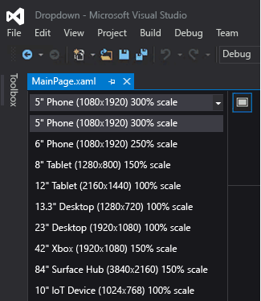
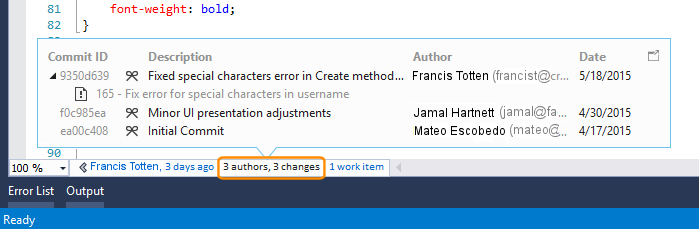
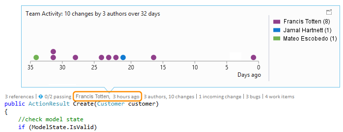
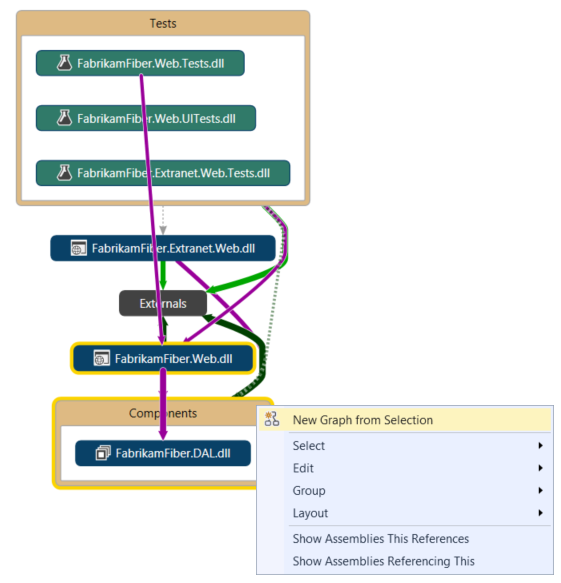

# What&#39;s New in Visual Studio &quot;15&quot; RC
Welcome to Visual Studio "15", an integrated suite of developer productivity tools, cloud services, and extensions that enable you and your team to create great apps and games for the web, for Windows Store, for the desktop, for Android, and for iOS.  
  
This page highlights some of the most important features that are new in the release candidate (RC) of Visual Studio "15". For a complete list of what’s new in Visual Studio 2015, see the [Release Notes](https://go.microsoft.com/fwlink/?linkid=780582).  
  
 To find out more about the many improvements and new features in Visual Studio ALM, see [What's new for Application Lifecycle Management in Visual Studio 2015](http://msdn.microsoft.com/en-us/54b98a53-6083-4303-869a-8063d8fae938).  
  
## A new setup experience  
 [!INCLUDE[downloadvs](../misc/includes/downloadvs_md.md)]  
  
 The Visual Studio "15" setup experience has been redesigned so that you can decide what to install, when. For more information, see 
  
## Sign in across multiple accounts  
 With Visual Studio 2015, the new streamlined sign-in experience is designed to greatly simplify your access to online resources, even when you have multiple Visual Studio accounts. After you sign-in to Visual Studio, you are automatically signed in to all instances of Visual Studio 2015 and Blend on your machine. Signing in automatically starts roaming your settings for you. In Visual Studio 2015, your account is shared across features so, as long as you have a good token, you can access your Visual Studio Team Services account(s) from **Team Explorer**, and resources and websites from your Microsoft Azure subscription in Server Explorer. You’ll also see your Azure resources in the New Project Dialog for Application Insights projects, and you’ll see your Azure Mobile, Azure Storage, [Microsoft Office 365](http://msdn.microsoft.com/office/aa905340.aspx) and [Saleforce.com developer](https://developer.salesforce.com/) accounts in the new **Add a Connected Service** dialog.  
  
 You can work with multiple user accounts in Visual Studio by adding them as you go or through the new Account Manager. Then, you can switch between those accounts on the fly when connecting to services or accessing online resources. Visual Studio remembers the accounts you add so you can use them from any instance of Visual Studio or Blend. Visual Studio will also roam the list of accounts (though we won’t roam your valuable credentials) with your Personalization account so you can quickly start working with one of those accounts on another device. Of course, you can remove accounts from the Account Settings dialog at any time. To get started, see [Work with multiple user accounts](/visual-studio/ide/work-with-multiple-user-accounts).  
  
   
  
## Choose your target platform(s)  
 Visual Studio 2015 supports cross-platform mobile device development. You can write apps and games that target iOS, Android, and Windows and share a common code base, all from within the Visual Studio IDE. You’ll see all these new project types in the File, New Project dialog.  
  
 And—of course—support for classic desktop applications is better than ever, with lots of improvements to languages, libraries, and tools.  
  
### Cross-platform mobile apps in C# with Xamarin for Visual Studio  
 Xamarin is a mobile framework that enables you to write code in C# that binds natively to iOS and Android APIs. Microsoft has partnered closely with Xamarin on their release of Xamarin for Visual Studio, an extension that enables you to develop for Android, iOS, and Windows Phone in a single solution with shared code. With Xamarin, you’ll use one  language and one code base with minimal deltas between the platforms.  Xamarin for Visual Studio is supported on Visual Studio 2010 and later. The starter edition of Xamarin is  is included in Visual Studio 2015. To get started, see [Build apps with native UI using Xamarin in Visual Studio](/visual-studio/cross-platform/build-apps-with-native-ui-using-xamarin-in-visual-studio).  
  
### Cross-platform mobile apps in HTML/JavaScript with Apache Cordova  
 Visual Studio Tools for Apache Cordova is the result of close collaboration between Microsoft and the open source Apache Cordova community. The tools enable cross-platform mobile development using HTML, CSS, and JavaScript (or Typescript). You can target Android, iOS, and Windows with a single code base and enjoy the richness of the Visual Studio IDE including JavaScript IntelliSense, the DOM Explorer, JavaScript Console, breakpoints, watches, locals, Just My Code, and more.  With Visual Studio Tools for Apache Cordova, your apps have access to native device capabilities on all platforms through plugins that provide a common JavaScript API. To get started, see [Get Started with Visual Studio Tools for Apache Cordova](../Topic/Get%20Started%20with%20Visual%20Studio%20Tools%20for%20Apache%20Cordova1.md).  
  
### Cross-platform mobile games in C# with Unity  
 Unity is a widely-used platform for multiplatform 2D and 3D game development. You can write your game in C# and run it natively on Android, iOS, Windows Phone, and many other platforms. Visual Studio Tools for Unity is an extension that integrates Unity with the Visual Studio IDE. With this extension, you get all the features of the Visual Studio IDE and debugger, in addition to productivity features that are designed for Unity developers. Visual Studio Tools for Unity 2.0 Preview 2 adds support for Visual Studio 2015, in addition to a number of new features, such as better visualization for objects in the Locals and Watch windows. Microsoft has recently acquired SyntaxTree, the creators of Visual Studio Tools for Unity. To download Visual Studio Tools for Unity 2.0 Preview 2, and for more information about Visual Studio Tools for Unity, see [Visual Studio Tools for Unity 2.0](http://Aka.ms/vstu).  
  
### Cross-platform apps and libraries for native C++  
 C++ is a language available natively across most mobile devices. You can use it to write cross-platform shared code libraries that can be built for multiple mobile platform targets. You can even create whole mobile apps in C++. Visual C++ gives you the tools to edit, build, deploy, and debug your cross-platform code. In addition to templates for Windows apps, you can create projects from templates for Android Native Activity apps, iOS apps, or shared code library projects for multiple platforms that include Xamarin hybrid apps. Platform-specific IntelliSense enables you to explore APIs and generate correct code for Android, iOS, or Windows targets. You can configure your build for x86 or ARM native platforms, and deploy your code to an iOS simulator or to iOS devices on a network-attached Mac, to directly attached Android devices, or use the performant Microsoft Visual Studio Emulator for Android for testing. You can set breakpoints, watch variables, view the stack and step through C++ code in the Visual Studio debugger. You can share all except the most platform-specific code across multiple app platforms, and build for them all with one solution in Visual Studio.  
  
 To get started on cross-platform C++, see [Build cross-platform mobile apps with Visual C++](../misc/build-cross-platform-mobile-apps-with-visual-cpp.md)  
  
### Universal Windows apps for any Windows 10 device  
 With the Universal Windows Platform and our one Windows core, you can run the same app on any Windows 10 device from phones to desktops. Create these Universal Windows apps with Visual Studio 2015 and the Universal Windows App Development tools.  
  
   
  
 Run your app on a Windows 10 phone, a Windows 10 desktop, or an Xbox. It’s the same app package! With the introduction of the Windows 10 single, unified core, one app package can run across all platforms. Several platforms have Extension SDKs that you can add to your app to take advantage of platform specific behaviors. For example, an extension SDK for mobile handles the back button being pressed on a Windows phone. If you reference an Extension SDK in your project, then just add runtime checks to test if that SDK is available on that platform. That’s how you can have the same app package for each platform!  
  
 Use C#, Visual Basic, C++ or JavaScript to create these [Universal Windows apps](http://msdn.microsoft.com/library/dn975273.aspx).  
  
### Web  
 ASP.NET 5 is a major update to MVC, WebAPI and SignalR, and runs on Windows, Mac, and Linux.  ASP.NET 5 has been designed from the ground up to provide you with a lean and composable .NET stack for building modern cloud-based apps. The Visual Studio 2015 tooling is more closely integrated with popular web development tools such as Bower and Grunt. To get started, see the many blog posts on the  [NET Web Development and Tools Blog](http://blogs.msdn.com/b/webdev/).  
  
### Classic desktop and Windows Store  
 Visual Studio 2015 continues to support classic desktop and Windows Store development. As Windows evolves, Visual Studio will evolve along with it.  In Visual Studio 2015, the libraries and languages for .NET as well as C++ have made significant advances that are applicable to all versions of Windows.  
  
#### The .NET Framework  
 The Microsoft [!INCLUDE[net_v46](../misc/includes/net_v46_md.md)] offers about 150 new APIs and 50 updated APIs to enable more scenarios. For example, more collections now implement <xref:System.Collections.Generic.IReadOnlyCollection%601> making them easier to use. In addition, ASP.NET 5, mentioned previously, offers a lean .NET platform for building modern cloud-based apps.  
  
 Windows Store apps written in C# that target the .NET Framework can now take advantage of .NET Native, which compiles apps to native code rather than IL, and [!INCLUDE[net_v46](../misc/includes/net_v46_md.md)] also adds RyuJIT, a 64-bit Just-In-Time (JIT) compiler.  
  
 The new C# and VB compilers ("Roslyn") significantly speed up compile times and provide comprehensive code analysis APIs. Visual Studio 2015 takes advantage of Roslyn to provide more refactorings including inline rename, analyzers, and quick fixes.  
  
 The C# and Visual Basic languages both contain many smallish improvements in the core language and in IDE support. These improvements all add up to make your .NET coding experience even more intuitive, convenient, and productive.  
  
 For more information, see [What's New](../Topic/What's%20New%20in%20the%20.NET%20Framework.md) and the [.NET Blog](http://blogs.msdn.com/b/dotnet/).  
  
#### C++  
 Visual C++ provides significant advances in C++11/14 language conformance, support for cross-platform mobile device development, support for resumable functions and await (currently planned for standardization in C++17), improvements and bug fixes in the C Runtime Library (CRT) and C++ standard library (STL) implementations, resizeable dialogs in MFC, new compiler optimizations, better build performance, new diagnostics capabilities and new productivity tools in the code editor.  
  
 For more information, see [What's New for Visual C++](../top/what-s-new-for-visual-cpp-in-visual-studio-2015.md) and the [Visual C++ Blog](http://blogs.msdn.com/b/vcblog/).  
  
## Device Preview menu bar  
 In Universal Windows Platform projects, the device preview menu bar enables you to see how your XAML-based UI will render on various screen sizes.  
  
   
  
## Visual Studio Graphics Diagnostics  
 Since Visual Studio 2013, Visual Studio Graphics Diagnostics has added many new features, including Frame Analysis, Windows Phone support, shader edit & apply, and command line capture tools. It has also added support for debugging DirectX12 apps. For more information, see [Visual Studio Graphics Diagnostics](/visual-studio/debugger/visual-studio-graphics-diagnostics).  
  
## Connect to Services  
 Visual Studio 2015 makes it easier than ever to connect your app to services.  The new Add Connected Service wizard configures your project, adds the necessary authentication support, and downloads the necessary NuGet packages to get you started coding against your service quickly and painlessly. The Add Connected Service wizard also integrates with the new Account Manager to make it easy to work with multiple user accounts and subscriptions. In Visual Studio 2015, support for the following services is provided out of the box (assuming that you have an account):  
  
1.  Azure Mobile Services  
  
2.  Azure Storage  
  
3.  Office 365 (mail, contacts, calendars, files, users & groups)  
  
4.  Salesforce  
  
 New services will be added on an ongoing basis, and you can discover those by clicking the “Find new services link” in the wizard.  
  
   
  
## Design your UI  
 The Blend experience for designing XAML user interfaces has been significantly enhanced. Blend has been completely redesigned to provide a more intuitive UI, more powerful XAML editing capabilities including IntelliSense, and better integration with Visual Studio. For more information, see [Designing XAML in Visual Studio and Blend for Visual Studio](/visual-studio/designers/designing-xaml-in-visual-studio).  
  
## Cross-platform debugging support  
 You can use Visual Studio to create and debug native mobile apps that run on Windows, iOS, and Android devices. Use the [Visual Studio Emulator for Android](http://blogs.msdn.com/b/visualstudioalm/archive/2014/11/12/introducing-visual-studio-s-emulator-for-android.aspx), or connect a device and debug your code directly in Visual Studio.  
  
-   **JavaScript / Cordova**. Use the [Visual Studio Tools for Apache Cordova](http://msdn.microsoft.com/library/dn879821\(v=vs.140\).aspx) to build native apps for Windows, iOS, and Android with JavaScript.  
  
     [Debug Your App](../Topic/Debug%20Your%20App%20Built%20with%20Visual%20Studio%20Tools%20for%20Apache%20Cordova.md) in the MSDN Library is a detailed look at Visual Studio debugging support for Cordova.  
  
-   **C# / Xamarin**. Use [Xamarin](http://msdn.microsoft.com/library/dn879698\(v=vs.140\).aspx) to build native apps for Windows, iOS, and Android in Visual Studio with C#.  
  
     [Debugging](http://developer.xamarin.com/guides/ios/deployment,_testing,_and_metrics/debugging_in_xamarin_ios/) (iOS) and [Debug on Device](http://developer.xamarin.com/guides/android/deployment,_testing,_and_metrics/debugging_with_xamarin_android/) in the [Xamarin developer guides](http://developer.xamarin.com/guides) describe the debugging experience.  
  
-   **C++ / Android**. Use the [Visual C++ for Cross-Platform Mobile Development](http://msdnstage.redmond.corp.microsoft.com/library/dn872463\(v=vs.140\).aspx) templates along with third-party tools like the [Android NDK](https://developer.android.com/tools/sdk/ndk/index.html) to create native apps for Windows and Android.  
  
## Debugging and Diagnostics  
 For information about what’s new in debugging, see [What’s New for the Debugger in Visual Studio 2015](/visual-studio/debugger/what’s-new-for-the-debugger-in-visual-studio-2015).  
  
 For information about what’s new in diagnostics, see [What's New in Profiling Tools](/visual-studio/profiling/what-s-new-in-profiling-tools).  
  
 The following are new or improved tools that perform different types of diagnosis and analysis on your code:  
  
### PerfTips  
 PerfTips display the execution time of methods during debugging, enabling you to quickly spot bottlenecks without having to invoke the profiler. To get started, see [PerfTips: Performance Information at-a-glance while Debugging with Visual Studio](http://blogs.msdn.com/b/visualstudioalm/archive/2014/08/18/perftips-performance-information-at-a-glance-while-debugging-with-visual-studio.aspx)  
  
### Error List  
 The error list now supports filtering on any column. It also shows a live view of errors, warnings, and code analysis across your entire C# or Visual Basic solution as you type, even when a code change produces thousands of warnings. The new Error List is back-compatible with existing usage. For more information, see [Error List Window](/visual-studio/ide/reference/error-list-window).  
  
### GPU Usage Tool  
 The GPU Usage Tool helps you collect and analyze GPU usage data in DirectX apps and games and troubleshoot whether performance bottlenecks are originating in the CPU or GPU. To get started with the tool, see the [Visual C++ team blog post](http://blogs.msdn.com/b/vcblog/archive/2014/09/05/gpu-usage-tool-in-visual-studio-2013-update-4-ctp1.aspx).  
  
## Live code analysis (light bulbs)  
 The new Roslyn compiler for C# and Visual Basic not only provides faster compile times—it also enables completely new scenarios such as live code analysis, which provide rich and customizable feedback and suggestions directly inside the code editor as you type. In Visual Studio 2015, light bulbs display in the left margin (when using the keyboard) or a tool tip (when hovering over an error with the mouse). The light bulb tells in real time that the compiler (possibly using a custom rule set) has detected an issue in your code and also has a suggestion for how to fix the issue. When you see a light bulb, click on it for actionable suggestions.  
  
   
  
## Enjoy these additional IDE improvements  
  
### Synchronized Settings (Roaming Settings)  
 Visual Studio 2013 introduced Synchronized Settings for some of the most commonly configured settings such as Text Editor, Keybindings, Theme & Fonts & Colors, Startup, and Environment Aliases.  Visual Studio 2015 improves on this experience by synchronizing more of your settings and synchronizing settings across Visual Studio family of applications like Professional, Enterprise, Express SKUs, and Blend. When you sign into Visual Studio 2015 for the first time with the same account as you used in Visual Studio 2013, you will see your synchronized settings applied from Visual Studio 2013. You can access your settings by typing “sync” in **Quick Launch**, or navigating to **Tools > Options > Environment > Synchronized Settings**.  
  
### Automatic Extension Updates  
 Your installed Visual Studio extensions will now be automatically updated when a new version is available on the Visual Studio Gallery. See [Finding and Using Visual Studio Extensions](/visual-studio/ide/finding-and-using-visual-studio-extensions) for details on how you can customize automatic extension updates.  
  
### Title Case Menus  
 You spoke, we listened. Visual Studio menus are once again title-case by default. However if you happen to like the ALL CAPS style, you can set it on start up or in the **Tools > Options > General** property page:  
  
   
  
### High Resolution Images and Touch Support  
 The Visual Studio IDE now has true high resolution images on denser displays (in areas like menus, context menus, tool window command bars, and in some projects in Solution Explorer). And on a touch-screen in the Visual Studio code editor window, you can now use gestures such as touch and hold, pinch, tap and so on to zoom, scroll, select text, and invoke context menus.  
  
   
  
### Custom Layouts  
 You can create store and roam custom window layouts. For example, you can define one preferred layout for use on your desktop machine, and different layout for use on a laptop or small screen device. Or you may prefer one layout for a UI project and another for a database project. Key bindings enable you to rapidly switch between layouts. These layouts are available on any instance of Visual Studio when you are signed in. For more information, see [Create custom window layouts](../misc/create-custom-window-layouts.md).  
  
   
  
### Notification Hub  
 The UI for the notification hub has been streamlined to make it easier to scan quickly. Additional kinds of notifications have been added including performance issues, rendering issues, and crashes, and you can now tell Visual Studio to stop showing a notification. For more information, see [Visual Studio Notifications](/visual-studio/ide/visual-studio-notifications).  
  
### CodeLens: Find what happened to your code (Enterprise and Professional editions only)  
 Stay focused on your work while you find information about your code - without leaving the editor. You can review changes and other history for work items, bugs, code reviews, and so on for code that’s stored in Visual Studio Team Services (VSTS) or in Team Foundation Server (TFS).  
  
 In Visual Studio Enterprise and Visual Studio Professional, you can now:  
  
-   Get history for an entire code file in the Visual Studio editor.  
  
       
  
-   See a graph that shows the people who changed your code. This can help you find patterns in your team's changes and assess their impact.  
  
       
  
-   Easily see when your code was last changed.  
  
-   Find changes in other branches that affect your code.  
  
 See [CodeLens](/visual-studio/ide/find-code-changes-and-other-history-with-codelens).  
  
### Design and modeling tools (Enterprise edition only)  
 **Code maps and dependency graphs**  
  
 In Visual Studio Enterprise, when you want to understand specific dependencies in your code, visualize them by creating code maps. You can then navigate these relationships by using the map, which appears next to your code. Code maps can also help you keep track of your place in the code while you work or debug code, so you'll read less code while you learn more about your code’s design.  
  
 In this release, we made the shortcut menus for code elements and links much easier to use by grouping commands into sections related to selecting, editing, managing groups, and changing the layout of group contents. Notice also that test projects are displayed in a different style from other projects, and that we updated the icons for elements on the map to more appropriate versions.  
  
   
  
 Other improvements include:  
  
-   **Improved top-down diagrams**. For medium to large Visual Studio solutions, you can now use a simplified Architecture menu to get a more useful code maps for your solution. The assemblies of your solution are grouped by the solution folders, so you can see them in context and leverage the effort you've put in structuring the solution. You'll immediately see project and assembly references, and then the link types appear. In addition, the assemblies external to your solution are grouped in a more compact way.  
  
-   **Test Projects are styled differently and can be filtered**. You can now more easily and quickly identify test projects on map because they are styled differently. They can also be filtered out so that you can focus on the application’s working code.  
  
-   **Simplified external dependency links**. Dependency links no longer represent the inheritance from System.Object, System.ValueType, System.Enum, and System.Delegate, which makes it easier to see external dependencies in your code map.  
  
-   **'Drill-in into dependency links' takes filters into account**. You get a useful, clear diagram when expanding it to understand the contributions to a dependency link. The diagram is less cluttered, and it takes into account the link filtering options you’ve selected.  
  
-   **Code elements are added to a code map with their context**. Because diagrams now appear with their context (up to the assembly and solution folder that you can filter out if required), you get more useful diagrams when dragging and dropping code elements from Solution Explorer, Class View, Object Browser; or when selecting elements in Solution Explorer and choosing Show on Code Map.  
  
-   **Get reactive code maps more quickly**. Drag and drop operations produce an immediate result, and the links between nodes are created much more quickly, without affecting subsequent user-initiated operations such as expanding a node or requesting more nodes. When you create code maps without building the solution, all the corner cases—such as when assemblies are not built—are now processed.  
  
-   **Skip rebuilding your solution.** Provides better performance when creating and editing diagrams.  
  
-   **Filter code element nodes and groups**. You can quickly unclutter your maps by showing or hiding code elements based on their category, as well as by grouping code elements by solution folders, assemblies, namespaces, project folders, and types.  
  
-   **Filter relationships to make diagrams easier to read**. Link filtering now also applies to cross group links, which makes working with the filter window less intrusive than it was in previous releases.  
  
-   **Create diagrams from the Class View and Object Browser**. Drag and drop files and assemblies into a new or an existing map from the Class View and Object Browser windows.  
  
 See [Map dependencies across your solutions](/visual-studio/modeling/map-dependencies-across-your-solutions).  
  
 **Other design and modeling changes in this release:**  
  
-   **Layer diagrams**. Update these diagrams using Class View and Object Browser. To meet software design requirements, use layer diagrams to describe the desired dependencies for your software. Keep code consistent with this design by finding code that doesn’t meet these constraints, and by validating future code with this baseline.  
  
-   **UML diagrams**. You can no longer create UML class diagrams and sequence diagrams from code. But you still create these diagrams using new UML elements.  
  
-   **Architecture Explorer**. You can no longer use Architecture Explorer to create diagrams. But you can still use Solution Explorer.  
  
## Visual Studio Extensibility Tools  
 It’s never been easier to install the Visual Studio Extensibility Tools (VS SDK and templates) as they are now included as an optional component during setup.  The Extensibility Tools allow developers to write extensions to customize and add features to Visual Studio. For more information about Visual Studio extensibility, see [Visual Studio SDK](/visual-studio/extensibility/visual-studio-sdk)  
  
 If you’d like to include the Extensibility Tools with your custom installation, you can find them under **Features / Common Tools / Visual Studio Extensibility Tools**.  You can also install the Extensibility Tools at a later time by opening the **New Project** dialog and selecting the **Install Visual Studio Extensibility Tools** item under **Visual C# / Extensibility**.  
  
## Please give feedback  
 Why send feedback to the Visual Studio team? Because we take customer feedback seriously. In fact, we review each piece of feedback that comes into our feedback system. Your feedback drives a lot of what we do.  
  
### Send a smile  
 Telling us what you like helps us understand when we meet or exceed your expectations. When we are designing and implementing new features, we use data about the features you like to help with our design decisions. So, if you like a feature in Visual Studio, do tell us about it. It’s easy and you can do it directly from within the IDE.  
  
 Just click the yellow smiley face on the title bar, tell us what you liked then click the **Send a smile** button.  
  
 That’s it! We’ll route your feedback to the correct team where they’ll pat themselves on the back then quickly begin thinking of ways to delight you even more.  
  
### Send a frown  
 Hearing where we need to make improvements in the product helps us to manage our backlog by focusing first on the things that are most important to our customers. If there is something that’s bugging you, tell us about it by using the **Send a Frown** feature from directly within the IDE. We’ve made this a super simple process too:  
  
 Click the yellow smiley face on the title bar, then click **Send a Frown**. Tell us what you did not like then click the Send a frown button. For more information, see [Talk to Us](/visual-studio/ide/talk-to-us).  
  
### Report crashes, hangs and performance issues  
 Sometimes, a quick note in a frown just isn’t enough to convey the full impact of something that you do not like. For the times when you have a hang, crash or performance issue, you can easily share repro steps, crash dumps and trace files by using the dialog that’s displayed after you send a frown.  
  
 First, send a frown as described above. On the dialog that pops up, you can tag your feedback with either one of the default tags or create your own tag. Tags help us route your feedback to the appropriate feature team. In the **Choose a category** drop down list, select the option that represents the issue you’re reporting then follow the steps to reproduce the issue. Detailed steps on how to use Visual Studio to report feedback are also available. For more information, see [Visual Studio Send a Smile Instructions](../Topic/Visual%20Studio%20Send%20a%20Smile%20Instructions.md).  
  
### Track your issue in Connect  
 If you’d like to track the status of your Visual Studio 2015 feedback, go to [Connect](http://connect.microsoft.com/) and report the bug there. After reporting the bug, you’ll be able to return to Connect to track its status.  
  
## See Also  
 [Build cross-platform apps with Apache Cordova](../Topic/Build%20cross-platform%20apps%20with%20Visual%20Studio%20Tools%20for%20Apache%20Cordova.md)   
 [Build apps with native UI using Xamarin in Visual Studio](/visual-studio/cross-platform/build-apps-with-native-ui-using-xamarin-in-visual-studio)   
 [Build cross-platform mobile apps with Visual C++](../misc/build-cross-platform-mobile-apps-with-visual-cpp.md)   
 [Generate unit tests for your code with IntelliTest](/visual-studio/test/generate-unit-tests-for-your-code-with-intellitest)   
 [Work with multiple user accounts](/visual-studio/ide/work-with-multiple-user-accounts)   
 [Create custom window layouts](../misc/create-custom-window-layouts.md)   
 [Perform quick actions with light bulbs](/visual-studio/ide/perform-quick-actions-with-light-bulbs)   
 [What's new for Application Lifecycle Management in Visual Studio 2015](http://msdn.microsoft.com/en-us/54b98a53-6083-4303-869a-8063d8fae938)

  
