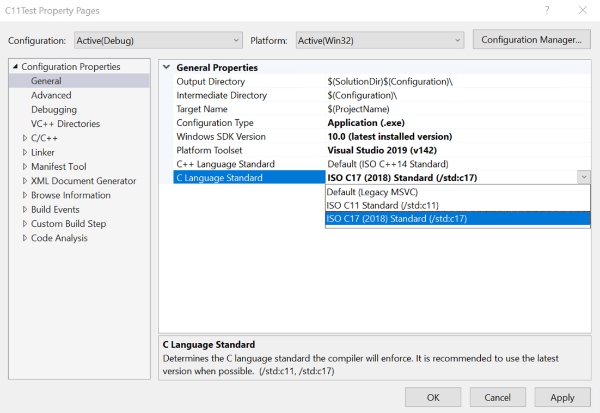

# Install C11 and C17 support in Visual Studio

::: moniker range="<=msvc-150"

Support for C11 and C17 standards requires Visual Studio 2019 version 16.8 or later. To see the documentation for this version, set the Visual Studio **Version** selector control for this article to Visual Studio 2019. It's found at the top of the table of contents on this page.

::: moniker-end

::: moniker range=">=msvc-160"

Support for C11 and C17 standards is available in Visual Studio 2019 version 16.8 and later. Support requires an updated Universal C Runtime (UCRT) and Windows SDK version to work properly with the conforming preprocessor ([`/Zc:preprocessor`](../build/reference/zc-preprocessor.md)).

Windows SDK releases correspond with Windows OS releases. C11 and C17 support requires Windows SDK 10.0.20348.0 (version 2104) or later. The Windows SDK is an installable option in the **Individual Components** tab in the Visual Studio Installer. You can follow these steps to set up the latest SDK and build C11 or C17 code in Visual Studio or at the command line.

## Prerequisites

Visual Studio 2019 version 16.8 or later and Windows SDK 10.0.20348.0 (version 2104) or later installed and running on your computer. We recommend you use the latest version available for the best support.

- If Visual Studio isn't installed yet, see [Install C++ support in Visual Studio](../build/vscpp-step-0-installation.md) for installation instructions. In the install, include the **Desktop development with C++** workload. Then, open the Individual Components tab. Select Windows 10 SDK (10.0.20348.0) or later, or the latest Windows 11 SDK.

- If Visual Studio is already installed, but you don't have the required Windows SDK, open the Visual Studio Installer. Choose **Modify** next to your version of Visual Studio to install the selected components. Open the Individual Components tab. Select Windows 10 SDK (10.0.20348.0) or later, or the latest Windows 11 SDK. Choose **Modify** to install the selected components.

When installation completes, open Visual Studio.

## Configure C11 or C17 mode in Visual Studio

In Visual Studio, open a new or existing C project, then open your project's **Property Pages** dialog.

Set the project to use the Windows SDK you just installed. On the **Configuration Properties** > **General** page, set the **Windows SDK Version** property either to **10.0 (latest installed version)**, or to the specific SDK version you installed.

You'll also see a C-specific option: **C Language Standard**. Set this property to **ISO C11 Standard (`/std:c11`)** or **ISO C17 (2018) Standard (`/std:c17`)**.  

The C++ Language Standard property is used when the language is C++. It's the default when the file extension is *`.cpp`*. The C Language Standard property version is used when the language is C. It's the default when the file extension is *`.c`*. To build using C11 or C17, put your source code in a *`.c`* file, or set the code to compile as C. You can set this property for your project on the **Configuration Properties** > **C/C++** > **Advanced** page. Set the **Compile As** property to **Compile as C code (/TC)**.

Congratulations, you've set up everything you need to build C11 and C17 code in Visual Studio!

## See also

[`/std` (Specify language standard version)](../build/reference/std-specify-language-standard-version.md)

::: moniker-end
