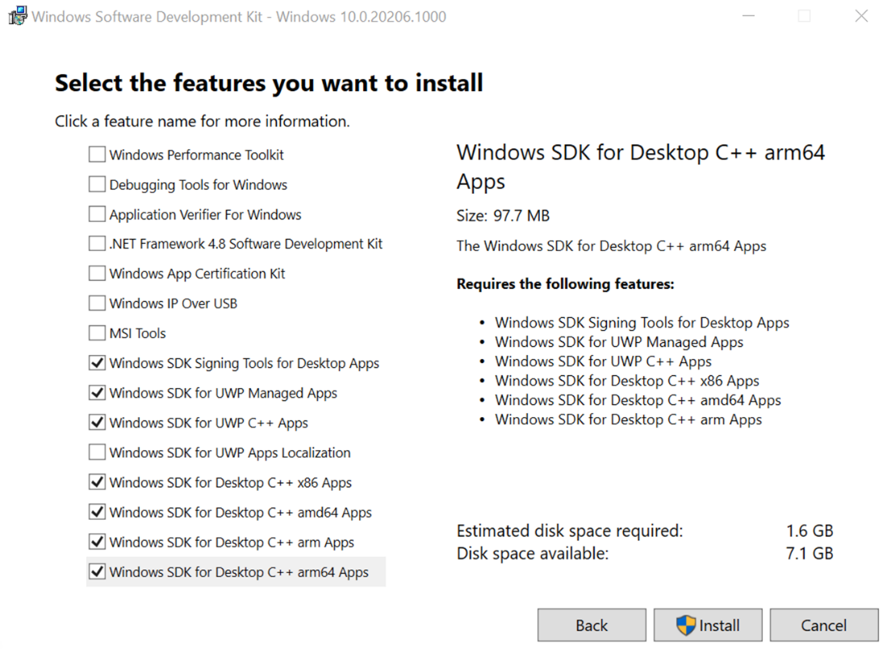

# Install C11 and C17 support in Visual Studio

::: moniker range="<=msvc-150"

Support for C11 and C17 standards requires Visual Studio 2019 version 16.8 or later. To see the documentation for this version, set the Visual Studio **Version** selector control for this article to Visual Studio 2019. It's found at the top of the table of contents on this page.

::: moniker-end

::: moniker range="msvc-160"

Support for C11 and C17 standards is available starting in Visual Studio 2019 version 16.8. Support requires an updated Universal C Runtime (UCRT) and the latest Windows SDK updates, to work properly with the conforming preprocessor ([`/Zc:preprocessor`](../build/reference/zc-preprocessor.md)).

Windows SDK releases correspond with Windows OS releases. C11 and C17 support requires Windows SDK 10.0.20348.0 (version 2104) or later. Normally, the Windows SDK is an installable option in the Individual Components tab in the Visual Studio Installer. That's the recommended way to update the SDK for use with Visual Studio. However, at the time of writing, the latest Windows SDK isn't available in the Visual Studio Installer. You can follow these steps to set up the latest SDK and build C11 or C17 code in Visual Studio or at the command line.

## Prerequisites

- Visual Studio 2019 version 16.8 or later installed and running on your computer. We recommend you use the latest version available for the best support. If Visual Studio isn't installed yet, see [Install C++ support in Visual Studio](../build/vscpp-step-0-installation.md) for installation instructions. In the install, include the **Desktop development with C++** workload.

## Step 1: Download the Windows 10 SDK

You can download the latest Windows 10 SDK from the [Windows 10 SDK](https://developer.microsoft.com/windows/downloads/windows-10-sdk/) page. If you see a message that says "We are sorry, the page you requested cannot be found," try changing the locale in the URL to *en-us*.

Choose **Download the installer** under Windows 10 SDK version 2104 and Server development to begin the download. Later versions of the Windows SDK will also work.

When the download completes, open the folder for the downloaded file. It's usually your Downloads folder, and the file is typically named *`winsdksetup.exe`*. Right-click on the file to open the file's **Properties** dialog box. On the **General** tab, in the **Security** section, check the **Unblock** checkbox. Choose **OK** to save your changes.

## Step 2: Install the Windows 10 SDK

Run *`winsdksetup.exe`* to start the installation.

On the **Specify Location** page, select **Install the Windows Software Development Kit - \<version> to this computer**, and then choose **Next**. On the **Windows Kits Privacy** page, select whether to allow Microsoft to collect insights for the Windows 10 Kits, then choose **Next**. Choose **Accept** to accept the license agreement. On the **Select the features you want to install** page, select these features:  

- Windows SDK Signing Tools for Desktop Apps

- Windows SDK for UWP Managed Apps

- Windows SDK for UWP C++ Apps

- Windows SDK for Desktop C++ x86 Apps (if you plan to build for x86)

- Windows SDK for Desktop C++ amd64 Apps (if you plan to build for x64)

- Windows SDK for Desktop C++ arm Apps (if you plan to build for ARM)

- Windows SDK for Desktop C++ arm64 Apps (if you plan to build for ARM64)

Choose **Install** to install the selected SDK components. The SDK takes a couple of minutes to complete installation. When it completes, open Visual Studio.

## Step 3: Configuring C11 or C17 mode in Visual Studio

In Visual Studio, open a new or existing C project, then open your project's **Property Pages** dialog.

Set the project to use the Windows 10 SDK you just installed. On the **Configuration Properties** > **General** page, set the **Windows SDK Version** property either to **10.0 (latest installed version)**, or to the specific SDK version you installed.

You'll also see a C-specific option: **C Language Standard**. Set this property to **ISO C11 Standard (`/std:c11`)** or **ISO C17 (2018) Standard (`/std:c17`)**.  

The C++ Language Standard property is used when the language is C++. It's the default when the file extension is *`.cpp`*. The C Language Standard property version is used when the language is C. It's the default when the file extension is *`.c`*. To build using C11 or C17, put your source code in a *`.c`* file, or set the code to compile as C. You can set this property for your project on the **Configuration Properties** > **C/C++** > **Advanced** page. Set the **Compile As** property to **Compile as C code (/TC)**.

Congratulations, you've set up everything you need to build C11 and C17 code in Visual Studio!

## See also

[`/std` (Specify language standard version)](../build/reference/std-specify-language-standard-version.md)

::: moniker-end
