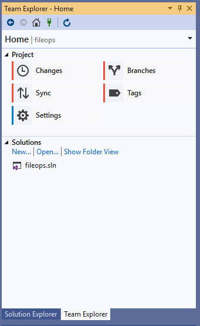
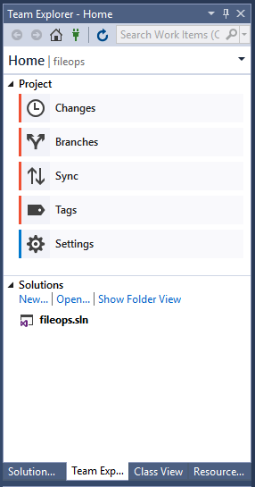
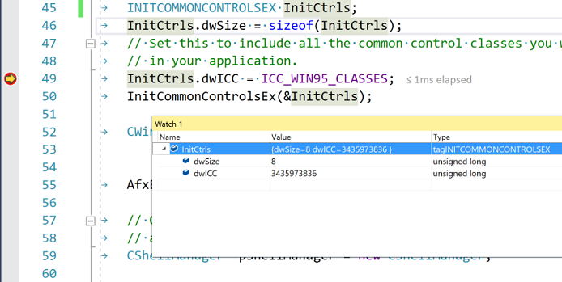

# Overview of C++ development in Visual Studio

As part of the Visual Studio Integrated Development Environment (IDE), Microsoft C++ (MSVC) shares many windows and tools in common with other languages. Many of those, including **Solution Explorer**, the code editor, and the debugger, are documented under [Visual Studio IDE](/visualstudio/get-started/visual-studio-ide). Often, a shared tool or window has a slightly different set of features for C++ than for other languages. A few windows or tools are only available in Visual Studio Professional or Visual Studio Enterprise editions.

In addition to shared tools in the Visual Studio IDE, MSVC has several tools specifically for native code development. These tools are also listed in this article. For a list of which tools are available in each edition of Visual Studio, see [C++ Tools and Features in Visual Studio Editions](visual-cpp-tools-and-features-in-visual-studio-editions.md).

## Create projects

A *project* is basically a set of source code files and resources such as images or data files that are built into an executable program or library.

Visual Studio provides support for any project system or custom build tools that you wish to use, with full support for IntelliSense, browsing and debugging:

- **MSBuild** is the native project system for Visual Studio. When you select **File** > **New** > **Project** from the main menu, you see many kinds of MSBuild *project templates* that get you started quickly developing different kinds of C++ applications.

   ::: moniker range=">=msvc-160"

   

   ::: moniker-end

   ::: moniker range="<=msvc-150"

   

   ::: moniker-end

   In general, you should use these templates for new projects unless you are using existing CMake projects, or you are using another project system. For more information, see [Creating and managing MSBuild-based projects](../build/creating-and-managing-visual-cpp-projects.md).

- **CMake** is a cross-platform build system that is integrated into the Visual Studio IDE when you install the Desktop development with C++ workload. You can use the CMake project template for new projects, or simply open a folder with a CMakeLists.txt file. For more information, see [CMake projects in Visual Studio](../build/cmake-projects-in-visual-studio.md).

- Any other C++ build system, including a loose collection of files, is supported via the **Open Folder** feature. You create simple JSON files to invoke your build program and configure debugging sessions. For more information, see [Open Folder projects for C++](../build/open-folder-projects-cpp.md).

## Add to source control

Source control enables you to coordinate work among multiple developers, isolate in-progress work from production code, and backup your source code. Visual Studio supports Git and [Team Foundation Version Control \(TFVC\)](/azure/devops/repos/tfvc/) through its **Team Explorer** window.

::: moniker range=">=msvc-160"

::: moniker-end

::: moniker range="<=msvc-150"

::: moniker-end

For more information about Git integration with repos in Azure, see [Share your code with Azure Repos and Visual Studio](/azure/devops/repos/git/share-your-code-in-git-vs). For information about Git integration with GitHub, see [Visual Studio and GitHub: Better together](https://visualstudio.github.com/).

## Obtain libraries

Use the [vcpkg](https://vcpkg.io/) package manager to obtain and install third-party libraries. Over 1700 open-source library packages are currently available in the catalog.

## Create user interfaces with designers

If your program has a user interface, you can use a designer to quickly populate it with controls such as buttons, list boxes and so on. When you drag a control from the toolbox window and drop it onto the design surface, Visual Studio generates the resources and code required to make it all work. You then write the code to customize the appearance and behavior.

For more information about designing a user interface for a Universal Windows Platform app, see [Design and UI](https://developer.microsoft.com/windows/design).

For more information about creating a user interface for an MFC application, see [MFC Desktop Applications](../mfc/mfc-desktop-applications.md). For information about Win32 Windows programs, see [Windows Desktop Applications](../windows/desktop-applications-visual-cpp.md).

## Write code

After you create a project, all the project files are displayed in the **Solution Explorer** window. (A *solution* is a logical container for one or more related projects.) When you click on a .h or .cpp file in **Solution Explorer**, the file opens up in the code editor.

The code editor is a specialized word processor for C++ source code. It color-codes language keywords, method and variable names, and other elements of your code to make the code more readable and easier to understand. It also provides tools for refactoring code, navigating between different files, and understanding how the code is structured. For more information, see [Writing and refactoring code](../ide/writing-and-refactoring-code-cpp.md).

## Add and edit resources

A Windows program or DLL usually includes some *resources*, such as dialogs, icons, images, localizable strings, splash screens, database connection strings, or any arbitrary data. Visual Studio includes tools for adding and editing resources. For more information, see [Working with Resource Files](../windows/working-with-resource-files.md).

## Build (compile and link)

Choose **Build** > **Build Solution** on the menu bar, or enter the **Ctrl+Shift+B** key combination to compile and link a project. Build errors and warnings are reported in the Error List (**Ctrl+\\, E**). The **Output** Window (**Alt+2**) shows information about the build process.

For more information about configuring builds, see [Working with Project Properties](../build/working-with-project-properties.md) and [Projects and build systems](../build/projects-and-build-systems-cpp.md).

You can also use the compiler (cl.exe) and many other build-related standalone tools such as NMAKE and LIB directly from the command line. For more information, see [Build C/C++ code on the command line](../build/building-on-the-command-line.md) and [C/C++ Building Reference](../build/reference/c-cpp-building-reference.md).

## Debug

You can start debugging by pressing **F5**. Execution pauses on any breakpoints you have set (by pressing **F9**). You can also step through code one line at a time (**F10**), view the values of variables or registers, and even in some cases make changes in code and continue debugging without re-compiling. The following illustration shows a debugging session in which execution is stopped on a breakpoint. The values of the data structure members are visible in the **Watch Window**.

For more information, see [Debugging in Visual Studio](/visualstudio/debugger/debugging-in-visual-studio).

## Test

Visual Studio includes the Microsoft Unit Test Framework for C++, as well as support for Boost.Test, Google Test, and CTest. Run your tests from the **Test Explorer** window:

For more information, see [Verifying Code by Using Unit Tests](/visualstudio/test/unit-test-your-code) and [Write unit tests for C/C++ in Visual Studio](/visualstudio/test/writing-unit-tests-for-c-cpp).

## Analyze

Visual Studio includes static code analysis tools that can detect potential problems in your source code. These tools include an implementation of the [C++ Core Guidelines](https://github.com/isocpp/CppCoreGuidelines/blob/master/CppCoreGuidelines.md) rules checkers. For more information, see [Code analysis for C/C++ overview](../code-quality/code-analysis-for-c-cpp-overview.md).

## Deploy completed applications

You can deploy both traditional desktop applications and UWP apps to customers through the Microsoft Store. Deployment of the CRT is handled automatically behind the scenes. For more information, see [Publish Windows apps and games](/windows/uwp/publish/).

You can also deploy a native C++ desktop to another computer. For more information, see [Deploying Desktop Applications](../windows/deploying-native-desktop-applications-visual-cpp.md).

For more information about deploying a C++/CLI program, see [Deployment Guide for Developers](/dotnet/framework/deployment/deployment-guide-for-developers),

## Next steps

Explore Visual Studio further by following along with one of these introductory articles:

> [!div class="nextstepaction"]
> [Learn to use the code editor](/visualstudio/get-started/tutorial-editor)

> [!div class="nextstepaction"]
> [Learn about projects and solutions](/visualstudio/get-started/tutorial-projects-solutions)
