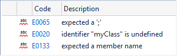
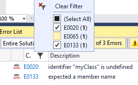
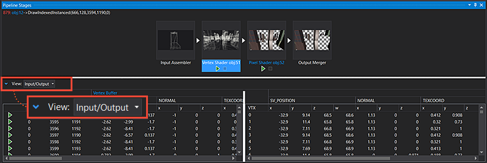
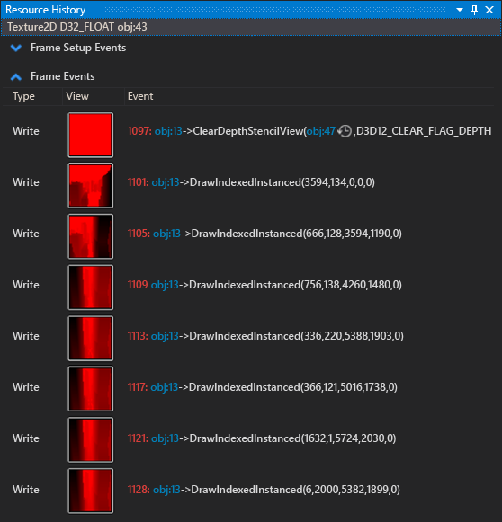
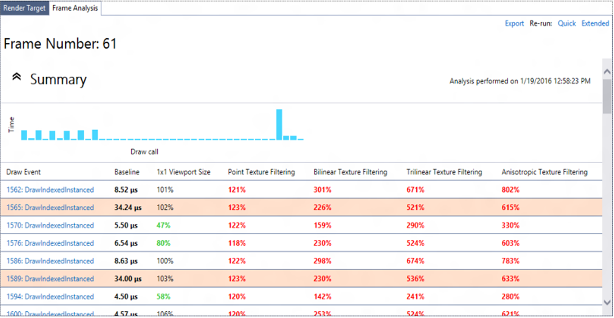
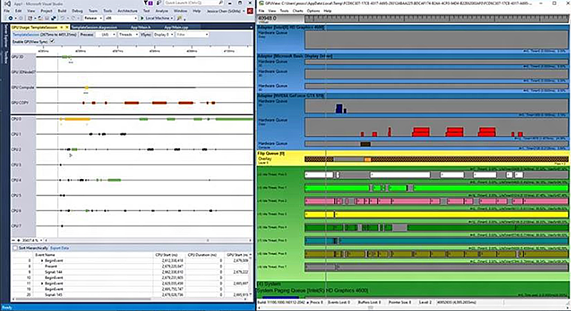

# What's new for C++ in Visual Studio 2017

Visual Studio 2017 brings many updates and fixes to the C++ environment. We've fixed over 250 bugs and reported issues in the compiler and tools. Many were submitted by customers through the [Report a Problem and Provide a Suggestion](/visualstudio/ide/how-to-report-a-problem-with-visual-studio?view=vs-2017&preserve-view=true) options under **Send Feedback**. Thank you for reporting bugs!

For more information on what's new in all of Visual Studio, see [What's new in Visual Studio 2017](/visualstudio/ide/whats-new-visual-studio-2017?view=vs-2017&preserve-view=true). For information on what's new for C++ in Visual Studio 2019, see [What's new for C++ in Visual Studio 2019](what-s-new-for-visual-cpp-in-visual-studio.md?preserve-view=true&view=msvc-160). For information on what's new for C++ in Visual Studio 2015 and earlier versions, see [Visual C++ What's New 2003 through 2015](../porting/visual-cpp-what-s-new-2003-through-2015.md). For information about what's new in the C++ docs, see [Microsoft C++ docs: What's new](whats-new-cpp-docs.md).

## Visual Studio 2017 C++ compiler

### C++ conformance improvements

We've updated the C++ compiler and standard library in this release with enhanced support for C++11 and C++14 features. It also includes preliminary support for certain features expected to be in the C++17 standard. For detailed information, see [C++ Conformance Improvements in Visual Studio 2017](cpp-conformance-improvements.md).

##### Visual Studio 2017 version 15.5

The compiler supports about 75% of the features that are new in C++17, including structured bindings, **`constexpr`** lambdas, `if constexpr`, inline variables, fold expressions, and adding **`noexcept`** to the type system. These features are available under the **`/std:c++17`** option. For more information, see [C++ Conformance Improvements in Visual Studio 2017](cpp-conformance-improvements.md)

##### Visual Studio 2017 version 15.7

The MSVC compiler toolset in Visual Studio version 15.7 now conforms with the C++ Standard. For more information, see [Announcing: MSVC Conforms to the C++ Standard](https://devblogs.microsoft.com/cppblog/announcing-msvc-conforms-to-the-c-standard/) and [Microsoft C/C++ language conformance](./visual-cpp-language-conformance.md).

##### Visual Studio 2017 version 15.8

The [`/experimental:preprocessor`](../build/reference/experimental-preprocessor.md) compiler switch enables the new experimental MSVC preprocessor that will eventually conform to all applicable C and C++ standards. For more information, see [MSVC new preprocessor overview](../preprocessor/preprocessor-experimental-overview.md).

### New compiler options

- [`/permissive-`](../build/reference/permissive-standards-conformance.md): Enable all strict standards conformance compiler options and disable most Microsoft-specific compiler extensions (but not `__declspec(dllimport)`, for example). This option is on by default in Visual Studio 2017 version 15.5.  The **`/permissive-`** conformance mode includes support for two-phase name lookup. For more information, see [C++ Conformance Improvements in Visual Studio](cpp-conformance-improvements.md).

- [`/diagnostics`](../build/reference/diagnostics-compiler-diagnostic-options.md): Enables display of the diagnostic error or warning location three different ways: just the line number, the line number and column, or the line number and column, with a caret under the offending line of code.

- [`/debug:fastlink`](../build/reference/debug-generate-debug-info.md): Enable up to 30% faster incremental link times (vs. Visual Studio 2015) by not copying all debug information into the PDB file. The PDB file instead points to the debug information for the object and library files used to create the executable. See [Faster C++ build cycle in VS "15" with `/Debug:fastlink`](https://devblogs.microsoft.com/cppblog/faster-c-build-cycle-in-vs-15-with-debugfastlink/) and [Recommendations to speed C++ builds in Visual Studio](https://devblogs.microsoft.com/cppblog/recommendations-to-speed-c-builds-in-visual-studio/).

- Visual Studio 2017 allows using [`/sdl`](../build/reference/sdl-enable-additional-security-checks.md) with [`/await`](../build/reference/await-enable-coroutine-support.md). We removed the [`/RTC`](../build/reference/rtc-run-time-error-checks.md) limitation with Coroutines.

##### Visual Studio 2017 version 15.3

- [`/std:c++14` and `/std:c++latest`](../build/reference/std-specify-language-standard-version.md): These compiler options enable you to opt in to specific versions of the ISO C++ programming language in a project. Most of the new draft standard features are guarded by the **`/std:c++latest`** option.

- [`/std:c++17`](../build/reference/std-specify-language-standard-version.md) enables the set of C++17 features implemented by the compiler. This option disables compiler and standard library support for features after C++17: ones that are changed or new in later versions of the Working Draft, and defect updates of the C++ Standard. To enable those features, use **`/std:c++latest`**.

### Codegen, security, diagnostics, and versioning

This release brings several improvements in optimization, code generation, toolset versioning, and diagnostics. Some notable improvements include:

- Improved code generation of loops: Support for automatic vectorization of division of constant integers, better identification of memset patterns.
- Improved code security: Improved emission of buffer overrun compiler diagnostics, and [`/guard:cf`](../build/reference/guard-enable-control-flow-guard.md) now guards switch statements that generate jump tables.
- Versioning: The value of the built-in preprocessor macro **\_MSC\_VER** is now being monotonically updated at every Visual C++ toolset update. For more information, see [Visual C++ Compiler Version](https://devblogs.microsoft.com/cppblog/visual-c-compiler-version/).
- New toolset layout: The compiler and related build tools have a new location and directory structure on your development machine. The new layout enables side-by-side installations of multiple versions of the compiler. For more information, see [Compiler Tools Layout in Visual Studio 2017](https://devblogs.microsoft.com/cppblog/compiler-tools-layout-in-visual-studio-15/).
- Improved diagnostics: The output window now shows the column where an error occurs. For more information, see [C++ compiler diagnostics improvements in VS "15" Preview 5](https://devblogs.microsoft.com/cppblog/c-compiler-diagnostics-improvements-in-vs-15-rc/).
- When using coroutines, the experimental keyword **yield** (available under the **`/await`** option) has been removed. Your code should be updated to use `co_yield` instead. For more information, see [`yield` keyword to become `co_yield` in VS 2017](https://devblogs.microsoft.com/cppblog/yield-keyword-to-become-co_yield-in-vs-2017/).

##### Visual Studio 2017 version 15.3

Additional improvements to diagnostics in the compiler. For more information, see [Diagnostic Improvements in Visual Studio 2017 15.3.0](https://devblogs.microsoft.com/cppblog/diagnostic-improvements-in-vs2017-15-3-0/).

##### Visual Studio 2017 version 15.5

Visual C++ runtime performance continues to improve through better generated code quality. Now you can just recompile your code, and your app runs faster. Some of the compiler optimizations are brand new, such as the vectorization of conditional scalar stores, the combining of calls `sin(x)` and `cos(x)` into a new `sincos(x)`, and the elimination of redundant instructions from the SSA optimizer. Other compiler optimizations are improvements to existing functionality, such as: vectorizer heuristics for conditional expressions, better loop optimizations, and float min/max codegen. The linker has a new and faster **`/OPT:ICF`** implementation, which can result in up to 9% link-time speedups, and there are other perf fixes in incremental linking. For more information, see [/OPT (Optimizations)](../build/reference/opt-optimizations.md) and [/INCREMENTAL (Link Incrementally)](../build/reference/incremental-link-incrementally.md).

The Microsoft C++ compiler supports Intel's AVX-512. It has Vector Length instructions that bring new functions in AVX-512 to 128-bit and 256-bit wide registers.

The [`/Zc:noexceptTypes-`](../build/reference/zc-noexcepttypes.md) option can be used to revert to the C++14 version of **`noexcept`** while using C++17 mode in general. This option enables you to update your source code to conform to C++17 without having to rewrite all your `throw()` code at the same time. For more information, see [Dynamic exception specification removal and noexcept](cpp-conformance-improvements-2017.md#noexcept_removal).

##### Visual Studio 2017 version 15.7

- New compiler switch [/Qspectre](../build/reference/qspectre.md) to help mitigate against speculative execution side-channel attacks. For more information, see [Spectre mitigations in MSVC](https://devblogs.microsoft.com/cppblog/spectre-mitigations-in-msvc/).
- New diagnostic warning for Spectre mitigation. For more information, see [Spectre diagnostic in Visual Studio 2017 Version 15.7 Preview 4](https://devblogs.microsoft.com/cppblog/spectre-diagnostic-in-visual-studio-2017-version-15-7-preview-4/).
- A new value for /Zc, **`/Zc:__cplusplus`**, enables correct reporting of the C++ standard support. For example, when the switch is set and the compiler is in **`/std:c++17`** mode the value expands to **`201703L`**. For more information, see [MSVC now correctly reports __cplusplus](https://devblogs.microsoft.com/cppblog/msvc-now-correctly-reports-__cplusplus/).

## C++ standard library

### Correctness Improvements

##### Visual Studio 2017 RTM (version 15.0)

- Minor `basic_string` `_ITERATOR_DEBUG_LEVEL != 0` diagnostics improvements. When an IDL check gets tripped in string machinery, it will now report the specific behavior that caused the trip. For example, instead of "string iterator not dereferencable" you'll get "cannot dereference string iterator because it is out of range (e.g. an end iterator)".
- Fixed the `std::promise` move assignment operator, which previously could cause code to block forever.
- Fixed compiler errors with the `atomic<T*>` implicit conversion to `T*`.
- `pointer_traits<Ptr>` now correctly detects `Ptr::rebind<U>`.
- Fixed a missing **`const`** qualifier in the `move_iterator` subtraction operator.
- Fixed silent bad codegen for stateful user-defined allocators requesting `propagate_on_container_copy_assignment` and `propagate_on_container_move_assignment`.
- `atomic<T>` now tolerates overloaded `operator&()`.
- Slightly improved compiler diagnostics for incorrect `bind()` calls.

There are more standard library improvements in Visual Studio 2017 RTM. For a complete list, see the C++ Team Blog entry [Standard Library Fixes In VS 2017 RTM](https://devblogs.microsoft.com/cppblog/stl-fixes-in-vs-2017-rtm/).

##### Visual Studio 2017 version 15.3

- Standard library containers now clamp their `max_size()` to `numeric_limits<difference_type>::max()` rather than the `max()` of `size_type`. This change ensures that the result of `distance()` on iterators from that container is representable in the return type of `distance()`.
- Fixed missing specialization `auto_ptr<void>`.
- The `for_each_n()`, `generate_n()`, and `search_n()` algorithms previously failed to compile if the length argument wasn't an integral type. They now attempt to convert non-integral lengths to the iterators' `difference_type`.
- `normal_distribution<float>` no longer emits warnings inside the standard library about narrowing from double to float.
- Fixed some `basic_string` operations that used `npos` instead of `max_size()` when checking for maximum size overflow.
- `condition_variable::wait_for(lock, relative_time, predicate)` would wait for the entire relative time if there was a spurious wake. Now it waits for only a single interval of the relative time.
- `future::get()` now invalidates the `future`, as the standard requires.
- `iterator_traits<void *>` used to be a hard error because it attempted to form `void&`; it now cleanly becomes an empty struct to allow use of `iterator_traits` in "is iterator" SFINAE conditions.
- Some warnings reported by Clang **`-Wsystem-headers`** were fixed.
- Also fixed "exception specification in declaration does not match previous declaration" reported by Clang **`-Wmicrosoft-exception-spec`**.
- Also fixed mem-initializer-list ordering warnings reported by Clang and C1XX.
- The unordered containers didn't swap their hash functions or predicates when the containers themselves were swapped. Now they do.
- Many container swap operations are now marked **`noexcept`** (as our standard library never intends to throw an exception when detecting the non-`propagate_on_container_swap` non-equal-allocator undefined behavior condition).
- Many `vector<bool>` operations are now marked **`noexcept`**.
- The standard library will now enforce matching allocator `value_type` (in C++17 mode) with an opt-out escape hatch.
- Fixed some conditions where self-range-insert into `basic_string` would scramble the strings contents. (Note: self-range-insert into vectors is still prohibited by the Standard.)
- `basic_string::shrink_to_fit()` is no longer affected by the allocator's `propagate_on_container_swap`.
- `std::decay` now handles abominable function types, that is, function types that are cv-qualified, ref-qualified, or both.
- Changed include directives to use proper case sensitivity and forward slashes, improving portability.
- Fixed warning C4061 "enumerator '*enumerator*' in switch of enum '*enumeration*' is not explicitly handled by a case label". This warning is off-by-default and was fixed as an exception to the standard library's general policy for warnings. (The standard library is **`/W4`** clean, but doesn't attempt to be **`/Wall`** clean. Many off-by-default warnings are unusually noisy, and aren't intended to be used on a regular basis.)
- Improved `std::list` debug checks. List iterators now check `operator->()`, and `list::unique()` now marks iterators as invalidated.
- Fixed uses-allocator metaprogramming in `tuple`.

##### Visual Studio 2017 version 15.5

- `std::partition` now calls the predicate `N` times instead of `N + 1` times, as the standard requires.
- Attempts to avoid magic statics in version 15.3 have been repaired in version 15.5.
- `std::atomic<T>` no longer requires `T` to be default constructible.
- Heap algorithms that take logarithmic time behave differently when iterator debugging is enabled. They no longer do a linear time assertion that the input is in fact a heap.
- `__declspec(allocator)` is now guarded for C1XX only, to prevent warnings from Clang, which doesn't understand this declspec.
- `basic_string::npos` is now available as a compile time constant.
- `std::allocator` in C++17 mode now properly handles allocation of over-aligned types, that is, types whose alignment is greater than `max_align_t`, unless disabled by **`/Zc:alignedNew-`**.  For example, vectors of objects with 16-byte or 32-byte alignment are now properly aligned for SSE and AVX instructions.

### Conformance improvements

- We added \<any\>, \<string_view\>, `apply()`, `make_from_tuple()`.
- Added \<optional\>, \<variant\>, `shared_ptr::weak_type`, and \<cstdalign\>.
- Enabled C++14 **`constexpr`** in `min(initializer_list)`, `max(initializer_list)`, and `minmax(initializer_list)`, and `min_element()`, `max_element()`, and `minmax_element()`.

For more information, see [Microsoft C/C++ language conformance](./visual-cpp-language-conformance.md).

##### Visual Studio 2017 version 15.3

- Several additional C++17 features have been implemented. For more information, see [Microsoft C++ language conformance table](cpp-conformance-improvements-2017.md#improvements_153).
- Implemented P0602R0 "variant and optional should propagate copy/move triviality".
- The standard library now officially tolerates dynamic RTTI being disabled via the [/GR-](../build/reference/gr-enable-run-time-type-information.md) option. Both `dynamic_pointer_cast()` and `rethrow_if_nested()` inherently require **`dynamic_cast`**, so the standard library now marks them as `=delete` under **`/GR-`**.
- Even when dynamic RTTI has been disabled via **`/GR-`**, "static RTTI" in the form of `typeid(SomeType)` is still available, and powers several standard library components. The standard library now supports disabling this feature too, via **`/D_HAS_STATIC_RTTI=0`**. This flag also disables `std::any`, the `target()` and `target_type()` member functions of `std::function`, and the `get_deleter()` friend member function of `std::shared_ptr` and `std::weak_ptr`.
- The standard library now uses C++14 **`constexpr`** unconditionally, instead of conditionally defined macros.
- The standard library now uses alias templates internally.
- The standard library now uses **`nullptr`** internally, instead of `nullptr_t{}`. (Internal usage of NULL has been eradicated. Internal usage of 0-as-null is being cleaned up gradually.)
- The standard library now uses `std::move()` internally, instead of stylistically misusing `std::forward()`.
- Changed `static_assert(false, "message")` to `#error message`. This change improves compiler diagnostics because `#error` immediately stops compilation.
- The standard library no longer marks functions as `__declspec(dllimport)`. Modern linker technology no longer requires it.
- Extracted SFINAE to default template arguments, which reduced clutter compared to return types and function argument types.
- Debug checks in \<random\> now use the standard library's usual machinery, instead of the internal function `_Rng_abort()`, which called `fputs()` to `stderr`. This function's implementation has been kept for binary compatibility. We'll remove it in the next binary-incompatible version of the standard library.

##### Visual Studio 2017 version 15.5

- Several standard library features have been added, deprecated, or removed per the C++17 standard. For more information, see [C++ conformance improvements in Visual Studio](cpp-conformance-improvements-2017.md#improvements_155).
- Experimental support for the following parallel algorithms:
  - `all_of`
  - `any_of`
  - `for_each`
  - `for_each_n`
  - `none_of`
  - `reduce`
  - `replace`
  - `replace_if`
  - `sort`
- The signatures for the following parallel algorithms are added but not parallelized at this time. Profiling showed no benefit in parallelizing algorithms that only move or permute elements:
  - `copy`
  - `copy_n`
  - `fill`
  - `fill_n`
  - `move`
  - `reverse`
  - `reverse_copy`
  - `rotate`
  - `rotate_copy`
  - `swap_ranges`

##### Visual Studio 2017 version 15.6

- `<memory_resource>`
- Library Fundamentals V1
- Deleting `polymorphic_allocator` assignment
- Improving class template argument deduction

##### Visual Studio 2017 version 15.7

- Support for parallel algorithms is no longer experimental
- A new implementation of `<filesystem>`
- Elementary string conversions (partial)
- `std::launder()`
- `std::byte`
- `hypot(x,y,z)`
- Avoiding unnecessary decay
- Mathematical special functions
- `constexpr char_traits`
- Deduction guides for the standard library

For more information, see [Microsoft C/C++ language conformance](./visual-cpp-language-conformance.md).

### Performance and throughput fixes

- Made `basic_string::find(char)` overloads only call `traits::find` once. Previously, it was implemented as a general string search for a string of length 1.
- `basic_string::operator==` now checks the string's size before comparing the strings' contents.
- Removed control coupling in `basic_string`, which was difficult for the compiler optimizer to analyze. For all short strings, calling `reserve` still has a nonzero cost to do nothing.
- `std::vector` has been overhauled for correctness and performance: aliasing during insert and emplace operations is now correctly handled as required by the Standard, the strong exception guarantee is now provided when required by the Standard via `move_if_noexcept()` and other logic, and insert and emplace do fewer element operations.
- The C++ standard library now avoids dereferencing null fancy pointers.
- Improved `weak_ptr::lock()` performance.
- To increase compiler throughput, C++ standard library headers now avoid including declarations for unnecessary compiler intrinsics.
- Improved the performance of `std::string` and `std::wstring` move constructors by more than three times.

##### Visual Studio 2017 version 15.3

- Worked around interactions with **`noexcept`**, which prevented inlining the `std::atomic` implementation into functions that use Structured Exception Handling (SEH).
- Changed the standard library's internal `_Deallocate()` function to optimize into smaller code, allowing it to be inlined into more places.
- Changed `std::try_lock()` to use pack expansion instead of recursion.
- Improved the `std::lock()` deadlock avoidance algorithm to use `lock()` operations instead of spinning on `try_lock()` on all the locks.
- Enabled the Named Return Value Optimization in `system_category::message()`.
- `conjunction` and `disjunction` now instantiate `N + 1` types, instead of `2N + 2` types.
- `std::function` no longer instantiates allocator support machinery for each type-erased callable, improving throughput and reducing .obj size in programs that pass many distinct lambdas to `std::function`.
- `allocator_traits<std::allocator>` contains manually inlined `std::allocator` operations, reducing code size in code that interacts with `std::allocator` through `allocator_traits` only (that is, in most code).
- The C++11 minimal allocator interface is now handled by the standard library calling `allocator_traits` directly, instead of wrapping the allocator in an internal class `_Wrap_alloc`. This change reduces the code size generated for allocator support, improves the optimizer's ability to reason about standard library containers in some cases, and provides a better debugging experience (as now you see your allocator type, rather than `_Wrap_alloc<your_allocator_type>` in the debugger).
- Removed metaprogramming for customized `allocator::reference`, which allocators aren't allowed to customize. (Allocators can make containers use fancy pointers but not fancy references.)
- The compiler front end was taught to unwrap debug iterators in range-based for loops, improving the performance of debug builds.
- The `basic_string` internal shrink path for `shrink_to_fit()` and `reserve()` is no longer in the path of reallocating operations, reducing code size for all mutating members.
- The `basic_string` internal grow path is no longer in the path of `shrink_to_fit()`.
- The `basic_string` mutating operations are now factored into non-allocating fast path and allocating slow path functions, making it more likely for the common no-reallocate case to be inlined into callers.
- The `basic_string` mutating operations now construct reallocated buffers in the preferred state rather than resizing in place. For example, an insert at the beginning of a string now moves the content after the insertion exactly once. It's moved either down or to the newly allocated buffer. It's no longer moved twice in the reallocating case, first to the newly allocated buffer and then down.
- Operations calling the C standard library in \<string\> now cache the `errno` address to remove repeated interaction with TLS.
- Simplified the `is_pointer` implementation.
- Finished changing function-based Expression SFINAE to **`struct`** and `void_t`-based.
- Standard library algorithms now avoid postincrementing iterators.
- Fixed truncation warnings when using 32-bit allocators on 64-bit systems.
- `std::vector` move assignment is now more efficient in the non-POCMA non-equal-allocator case, by reusing the buffer when possible.

##### Visual Studio 2017 version 15.5

- `basic_string<char16_t>` now engages the same `memcmp`, `memcpy`, and similar optimizations that `basic_string<wchar_t>` engages.
- An optimizer limitation that prevented function pointers from being inlined, exposed by our "avoid copying functions" work in Visual Studio 2015 Update 3, has been worked around, restoring performance of `lower_bound(iter, iter, function pointer)`.
- The overhead of iterator debugging's order verification of inputs to `includes`, `set_difference`, `set_symmetric_difference`, and `set_union` was reduced by unwrapping iterators before checking order.
- `std::inplace_merge` now skips over elements that are already in position.
- Constructing `std::random_device` no longer constructs and then destroys a `std::string`.
- `std::equal` and `std::partition` had a jump-threading optimization pass that saves an iterator comparison.
- When `std::reverse` is passed pointers to trivially copyable `T`, it will now dispatch to a handwritten vectorized implementation.
- `std::fill`, `std::equal`, and `std::lexicographical_compare` were taught how to dispatch to `memset` and `memcmp` for `std::byte` and `gsl::byte` (and other char-like enums and enum classes). Since `std::copy` dispatches using `is_trivially_copyable`, it didn't need any changes.
- The standard library no longer contains empty-braces destructors whose only behavior was to make types non-trivially-destructible.

## Other libraries

### Open-source library support

**Vcpkg** is an open-source command-line tool that greatly simplifies the process of acquiring and building open-source C++ static libs and DLLS in Visual Studio. For more information, see [vcpkg](https://vcpkg.io/).

### CPPRest SDK 2.9.0

##### Visual Studio 2017 version 15.5

The CPPRestSDK, a cross-platform web API for C++, has been updated to version 2.9.0. For more information, see [CppRestSDK 2.9.0 is available on GitHub](https://devblogs.microsoft.com/cppblog/cpprestsdk-2-9-0-is-available-on-github/).

### ATL

##### Visual Studio 2017 version 15.5

- Yet another set of name-lookup conformance fixes
- Existing move constructors and move assignment operators are now properly marked as non-throwing
- Unsuppress valid warning C4640 about thread safe init of local statics in atlstr.h
- Thread-safe initialization of local statics was automatically turned off in the XP toolset when using ATL to build a DLL. Now it's not. You can add **`/Zc:threadSafeInit-`** in your Project settings if you don't want thread-safe initialization.

### Visual C++ runtime

- New header "cfguard.h" for Control Flow Guard symbols.

## Visual Studio 2017 C++ IDE

- Configuration change performance is now better for C++ native projects and much better for C++/CLI projects. When a solution configuration is activated for the first time, it will now be faster, and all later activations of this solution configuration will be almost instantaneous.

##### Visual Studio 2017 version 15.3

- Several project and code wizards have been rewritten in the signature dialog style.
- **Add Class** now launches the Add Class wizard directly. All of the other items that were previously here are now available under **Add > New Item**.
- Win32 projects are now under the **Windows Desktop** category in the **New Project** dialog.
- The **Windows Console** and **Desktop Application** templates now create the projects without displaying a wizard. There's a new **Windows Desktop Wizard** under the same category that displays the same options as the old **Win32 Console Application** wizard.

##### Visual Studio 2017 version 15.5

Several C++ operations that use the IntelliSense engine for refactoring and code navigation run much faster. The following numbers are based on the Visual Studio Chromium solution with 3500 projects:

| Feature | Performance Improvement |
|--|--|
| Rename | 5.3x |
| Change Signature | 4.5x |
| Find All References | 4.7x |

C++ now supports Ctrl+Click **Go To Definition**, making mouse navigation to definitions easy. The Structure Visualizer from the Productivity Power Tools pack is now also included in the product by default.

## IntelliSense

- The new SQLite-based database engine is now being used by default. The new engine speeds up database operations like **Go To Definition** and **Find All References**. It significantly improves initial solution parse time. The setting has moved to **Tools > Options > Text Editor > C/C++ > Advanced**. (It was formerly under ...C/C++ > Experimental.)

- We've improved IntelliSense performance on projects and files not using precompiled headers - an Automatic Precompiled Header will be created for headers in the current file.

- We've added error filtering and help for IntelliSense errors in the error list. Clicking on the error column now allows for filtering. Also, clicking on the specific errors or pressing F1 will launch an online search for the error message.

  

  

- Added the ability to filter Member List items by kind.

  

- Added a new experimental Predictive IntelliSense feature that provides contextually aware filtering of what appears in the Member List. For more information, see [C++ IntelliSense Improvements - Predictive IntelliSense & Filtering](https://devblogs.microsoft.com/cppblog/c-intellisense-improvements-predictive-intellisense-filtering/).
- **Find All References** (Shift+F12) now helps you get around easily, even in complex codebases. It provides advanced grouping, filtering, sorting, searching within results, and (for some languages) colorization, so you can get a clear understanding of your references. For C++, the new UI includes information about whether we're reading from or writing to a variable.
- The Dot-to-Arrow IntelliSense feature has been moved from experimental to advanced, and is now enabled by default. The editor features **Expand Scopes** and **Expand Precedence** have also been moved from experimental to advanced.
- The experimental refactoring features **Change Signature** and **Extract Function** are now available by default.
- Added an experimental 'Faster project load' feature for C++ projects. The next time you open a C++ project it will load faster, and the time after that it will load *much* faster!
- Some of these features are common to other languages, and some are specific to C++. For more information about these new features, see [Announcing Visual Studio "15" Preview 5](https://devblogs.microsoft.com/visualstudio/announcing-visual-studio-15-preview-5/).

##### Visual Studio 2017 version 15.7

- Support added for ClangFormat. For more information, see [ClangFormat Support in Visual Studio 2017](https://devblogs.microsoft.com/cppblog/clangformat-support-in-visual-studio-2017-15-7-preview-1/).

## Non-MSBuild projects with Open Folder

Visual Studio 2017 introduces the **Open Folder** feature. It enables you to code, build, and debug in a folder containing source code without the need to create any solutions or projects. Now it's much simpler to get started with Visual Studio, even if your project isn't an MSBuild-based project. **Open Folder** gives you access to powerful code understanding, editing, building, and debugging capabilities. They're the same ones that Visual Studio already provides for MSBuild projects. For more information, see [Open Folder projects for C++](../build/open-folder-projects-cpp.md).

- Improvements to the Open Folder experience. You can customize the experience through these .json files:
  - CppProperties.json to customize the IntelliSense and browsing experience.
  - Tasks.json to customize the build steps.
  - Launch.json to customize the debugging experience.

##### Visual Studio 2017 version 15.3

- Improved support for alternative compilers and build environments such as MinGW and Cygwin. For more information, see [Using MinGW and Cygwin with Visual C++ and Open Folder](https://devblogs.microsoft.com/cppblog/using-mingw-and-cygwin-with-visual-cpp-and-open-folder/).
- Added support to define global and configuration-specific environment variables in CppProperties.json and CMakeSettings.json. These environment variables can be consumed by debug configurations defined in launch.vs.json and tasks in tasks.vs.json. For more information, see [Customizing your Environment with Visual C++ and Open Folder](https://devblogs.microsoft.com/cppblog/customizing-your-environment-with-visual-c-and-open-folder/).
- Improved support for CMake's Ninja generator, including the ability to easily target 64-bit platforms.

## CMake support via Open Folder

Visual Studio 2017 introduces support for using CMake projects without converting to MSBuild project files (.vcxproj). For more information, see [CMake projects in Visual Studio](../build/cmake-projects-in-visual-studio.md). Opening CMake projects with **Open Folder** automatically configures the environment for C++ editing, building, and debugging.

- C++ IntelliSense works without the need to create a CppProperties.json file in the root folder. We've also added a new dropdown to allow users to easily switch between configurations provided by CMake and CppProperties.json files.

- Further configuration is supported via a CMakeSettings.json file that sits in the same folder as the CMakeLists.txt file.

  

##### Visual Studio 2017 version 15.3

- Support added for the CMake Ninja generator.

##### Visual Studio 2017 version 15.4

- Support added for importing existing CMake caches.

##### Visual Studio 2017 version 15.5

- Support added for CMake 3.11, code analysis in CMake projects, Targets view in Solution Explorer, options for cache generation, and single file compilation. For more information, see [CMake Support in Visual Studio](https://devblogs.microsoft.com/cppblog/cmake-support-in-visual-studio-targets-view-single-file-compilation-and-cache-generation-settings/) and [CMake projects in Visual Studio](../build/cmake-projects-in-visual-studio.md).

## Windows desktop development

We now provide a more granular installation experience for installing the original C++ workload. We have added selectable components that enable you to install just the tools that you need. The indicated installation sizes for the components listed in the installer UI are incorrect, and underestimate the total size.

To successfully create Win32 projects in the C++ desktop workload, you must install both a toolset and a Windows SDK. Install the recommended (selected) components **VC++ 2017 v141 toolset (x86, x64)** and **Windows 10 SDK (10.0.nnnnn)** to make sure it works. If the necessary tools aren't installed, projects won't be created successfully, and the wizard will stop responding.

##### Visual Studio 2017 version 15.5

The Visual C++ Build tools (previously available as a standalone product) are now included as a workload in the Visual Studio Installer. This workload installs only the tools required to build C++ projects without installing the Visual Studio IDE. Both the v140 and v141 toolsets are included. The v141 toolset contains the latest improvements in Visual Studio 2017 version 15.5. For more information, see [Visual Studio Build Tools now include the VS2017 and VS2015 MSVC Toolsets](https://devblogs.microsoft.com/cppblog/visual-studio-build-tools-now-include-the-vs2017-and-vs2015-msvc-toolsets/).

## Linux development with C++

The popular extension [Visual C++ for Linux Development](https://marketplace.visualstudio.com/items?itemName=VisualCppDevLabs.VisualCforLinuxDevelopment) is now part of Visual Studio. This installation provides everything you need to develop and debug C++ applications running on a Linux environment.

##### Visual Studio 2017 version 15.2

Improvements have been made in cross-platform code sharing and type visualization. For more information, see [Linux C++ improvements for cross-platform code sharing and type visualization](https://devblogs.microsoft.com/cppblog/linux-cross-platform-and-type-visualization/).

##### Visual Studio 2017 version 15.5

- The Linux workload has added support for **rsync** as an alternative to **sftp** for synchronizing files to remote Linux machines.
- Support is added for cross compilation targeting ARM microcontrollers. To enable it in the installation, choose the **Linux development with C++** workload and select the option for **Embedded and IoT Development**. This option adds the ARM GCC cross compilation tools and Make to your installation. For more information, see [ARM GCC Cross Compilation in Visual Studio](https://devblogs.microsoft.com/cppblog/arm-gcc-cross-compilation-in-visual-studio/).
- Support added for CMake. You can now work on your existing CMake code base without having to convert it to a Visual Studio project. For more information, see [Configure a Linux CMake Project](../linux/cmake-linux-project.md).
- Support added for running remote tasks. This capability allows you to run any command on a remote system that is defined in Visual Studio's Connection Manager. Remote tasks also provide the capability to copy files to the remote system.
For more information, see [Configure a Linux CMake Project](../linux/cmake-linux-project.md).

##### Visual Studio 2017 version 15.7

- Various improvements to Linux workload scenarios. For more information, see [Linux C++ Workload improvements to the Project System, Linux Console Window, rsync and Attach to Process](https://devblogs.microsoft.com/cppblog/linux-c-workload-improvements-to-the-project-system-linux-console-window-rsync-and-attach-to-process/).
- IntelliSense for headers on remote Linux connections. For more information, see [IntelliSense for Remote Linux Headers](https://devblogs.microsoft.com/cppblog/intellisense-for-remote-linux-headers/) and [Configure a Linux CMake Project](../linux/cmake-linux-project.md).

## Game development with C++

Use the full power of C++ to build professional games powered by DirectX or Cocos2d.

## Mobile development with C++ for Android and iOS

You can now create and debug mobile apps using Visual Studio that can target Android and iOS.

## Universal Windows Apps

C++ comes as an optional component for the Universal Windows App workload. Currently, you must upgrade C++ projects manually. You can open a v140-targeted Universal Windows Platform project in Visual Studio 2017. However, you need to select the v141 platform toolset in the project property pages if you don't have Visual Studio 2015 installed.

## New options for C++ on Universal Windows Platform (UWP)

You now have new options for writing and packaging C++ applications for the Universal Windows Platform and the Windows Store:
The Desktop Bridge infrastructure lets you package your existing desktop application or COM object for deployment through the Windows Store. Or, for deployment through your existing channels via side-loading. New capabilities in Windows 10 enable you to add UWP functionality to your desktop application in various ways. For more information, see [Desktop Bridge](/windows/uwp/porting/desktop-to-uwp-root).

##### Visual Studio 2017 version 15.5

A **Windows Application Packaging Project** project template is added, which greatly simplifies packaging of desktop applications with Desktop Bridge. It's available under **File | New | Project | Installed | Visual C++ | Universal Windows Platform**. For more information, see [Package an app by using Visual Studio (Desktop Bridge)](/windows/uwp/porting/desktop-to-uwp-packaging-dot-net).

When writing new code, you can now use C++/WinRT, a standard C++ language projection for the Windows Runtime implemented solely in header files. It allows you to consume and author Windows Runtime APIs using any standards-conformant C++ compiler. C++/WinRT is designed to provide C++ developers with first-class access to the modern Windows API. For more information, see [C++/WinRT](/windows/uwp/cpp-and-winrt-apis/).

Starting in build 17025 of the Windows SDK Insider Preview, C++/WinRT is included in the Windows SDK. For more information, see [C++/WinRT is now included the Windows SDK](https://devblogs.microsoft.com/cppblog/cppwinrt-is-now-included-the-windows-sdk/).

## The Clang/C2 platform toolset

The Clang/C2 toolset that ships with Visual Studio 2017 now supports the **`/bigobj`** switch, which is crucial for building large projects. It also includes several important bug fixes, both in the compiler front-end and back-end.

## C++ code analysis

The C++ Core Checkers for enforcing the [C++ Core Guidelines](https://github.com/isocpp/CppCoreGuidelines) are now distributed with Visual Studio. Enable the checkers in the **Code Analysis Extensions** page in the project's property pages. The extensions are then included when you run code analysis. For more information, see [Using the C++ Core Guidelines checkers](../code-quality/using-the-cpp-core-guidelines-checkers.md).

##### Visual Studio 2017 version 15.3

- Support added for rules related to resource management.

##### Visual Studio 2017 version 15.5

- New C++ Core Guidelines checks cover smart pointer correctness, correct use of global initializers, and flagging uses of constructs like **`goto`** and bad casts.

- Some warning numbers you may find in 15.3 are no longer available in 15.5. These warnings were replaced with more specific checks.

##### Visual Studio 2017 version 15.6

- Support added for single-file analysis, and improvements in analysis run-time performance. For more information, see [C++ Static Analysis Improvements for Visual Studio 2017 15.6 Preview 2](https://devblogs.microsoft.com/cppblog/c-static-analysis-improvements-for-visual-studio-2017-15-6-preview-2/)

##### Visual Studio 2017 version 15.7

- Support added for [`/analyze:ruleset`](../build/reference/analyze-code-analysis.md), which lets you specify the code analysis rules to run.
- Support added for additional C++ Core Guidelines rules.  For more information, see [Using the C++ Core Guidelines checkers](../code-quality/using-the-cpp-core-guidelines-checkers.md).

## Unit testing in Visual Studio 2017

##### Visual Studio 2017 version 15.5

Google Test Adapter and Boost.Test Adapter are now available as components of the **Desktop Development with C++** workload. They're integrated with **Test Explorer**. CTest support is added for CMake projects (using Open Folder), although full integration with **Test Explorer** isn't available yet. For more information, see [Writing unit tests for C/C++](/visualstudio/test/writing-unit-tests-for-c-cpp).

##### Visual Studio 2017 version 15.6

- Support added for `Boost.Test` dynamic library support.
- A `Boost.Test` item template is now available in the IDE.

For more information, see [`Boost.Test` Unit Testing: Dynamic Library support and New Item Template](https://devblogs.microsoft.com/cppblog/boost-test-unit-testing-dynamic-library-support-and-new-item-template/).

##### Visual Studio 2017 version 15.7

[CodeLens](/visualstudio/ide/find-code-changes-and-other-history-with-codelens) support added for C++ unit test projects. For more information, see [Announcing CodeLens for C++ Unit Testing](https://devblogs.microsoft.com/cppblog/announcing-codelens-for-c-unit-testing/).

## Visual Studio graphics diagnostics

Visual Studio Graphics Diagnostics tools: You can use them to record and analyze rendering and performance problems in Direct3D apps. Use them on apps that run locally on your Windows PC, in a Windows device emulator, or on a remote PC or device.

- **Input & Output for Vertex and Geometry shaders:** The ability to view input and output of vertex shaders and geometry shaders has been one of the most requested features. It's now supported in the tools. Select the VS or GS stage in the Pipeline Stages view to start inspecting its input and output in the table below.

  

- **Search and filter in the object table:** Provides a quick and easy way to find the resources you're looking for.

  

- **Resource History:** This new view provides a streamlined way of seeing the entire modification history of a resource as it was used during the rendering of a captured frame. To invoke the history for any resource, click the clock icon next to any resource hyperlink.

  

  It displays the new **Resource History** tool window, populated with the change history of the resource.

  

  You can capture frames with full call stack capturing enabled. That lets you quickly deduce the context of each change event, and inspect it within your Visual Studio project. Set the full stack capture option in the Visual Studio **Tools > Options** dialog under **Graphics Diagnostics**.

- **API Statistics:** View a high-level summary of API usage in your frame. It's handy for discovering calls you may not realize you're making at all, or calls you're making too often. This window is available via **View > API Statistics** in Visual Studio Graphics Analyzer.

  

- **Memory Statistics:** View how much memory the driver allocates for the resources you create in the frame. This window is available via **View > Memory Statistics** in **Visual Studio Graphics Analyzer**. To copy data to a CSV file for viewing in a spreadsheet, right-click and choose **Copy All**.

  

- **Frame Validation:** The new errors and warnings list provides an easy way to navigate your event list based on potential issues detected by the Direct3D debug layer. Click **View > Frame Validation** in Visual Studio Graphics Analyzer to open the window. Then click **Run Validation** to start the analysis. It can take several minutes to complete, depending on the frame's complexity.

  

- **Frame Analysis for D3D12:** Use Frame Analysis to analyze draw-call performance with directed "what-if" experiments. Switch to the Frame Analysis tab and run analysis to view the report.

  

- **GPU Usage Improvements:** Open traces can be taken via the Visual Studio GPU Usage profiler with either GPU View or the Windows Performance Analyzer (WPA) tool for more detailed analysis. If you have the Windows Performance Toolkit installed, there are two hyperlinks: one for WPA and another for GPU View, at the bottom right of the session overview.

  

  Traces you open in GPU View via this link support synchronized VS and GPU View timeline zooming and panning. A checkbox in VS controls whether synchronization is enabled or not.

  
