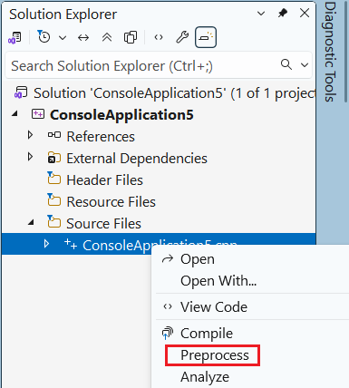

# What's new for MSVC Build Tools

Version 14.50 brings many updates and fixes to the Microsoft C++ compiler and other build tools.

- For more information on what's new in all of Visual Studio, see [What's new in Visual Studio](/visualstudio/ide/whats-new-visual-studio).

## What's new for MSVC Build Tools version 14.50

* Introduced in Visual Studio 2026 version 18.0 released November 2025.

Visual Studio 2026 version 18.0 ships with the v145 platform toolset for MSBuild C++ projects and Microsoft C++ (MSVC) Build Tools version 14.50, which offers the best conformance, build performance, and runtime performance story yet. To access to all the new language features, build with `/std:c++latest`, or use `/std:c++23preview` if you want to be restricted to features up to C++23.

MSVC Build Tools version 14.50 preserves binary compatibility with code built with MSVC tools shipped in Visual Studio 2015 or later. 

| For detailed information about | See |
|---|---|
| What's new for C++ developers | [What’s New for C++ Developers in Visual Studio 2026 version 18.0](https://devblogs.microsoft.com/cppblog/whats-new-for-cpp-developers-in-visual-studio-2026-version-18-0) |
| Standard Library (STL) improvements | [STL Changelog MSVC Build Tools 14.50](https://github.com/microsoft/STL/wiki/Changelog#msvc-build-tools-1450) |
| C++ language updates | [C++ Language Updates in MSVC Build Tools v14.50](https://devblogs.microsoft.com/cppblog/c-language-updates-in-msvc-build-tools-v14-50/) |
| C++ language conformance improvements | [C++ Conformance improvements, behavior changes, and bug fixes in Visual Studio 2022 17.14](cpp-conformance-improvements.md#improvements_1714) | 

**A quick highlight of some of the new features in MSVC Build Tools version 14.50 and Visual Studio 2026 version 18.0:**

**C++ language enhancements**

- C++20 is the default for new Console App, Windows Desktop Application, Dynamic-Link Library, and Static Library C++ projects. 
- C++23 preprocessing directive `#warning` allows you to generate a diagnostic message without stopping translation like `#error` does. For more information, see [`#warning` directive](/cpp/preprocessor/hash-warning-directive-c-cpp).
- Easily set debugger command line arguments for any C++ project using the toolbar for `.vcxproj`, CMake, and Unreal Engine projects. This feature is no longer tied to the Game Development with C++ workload, and is available to all C++ developers without installing any other workloads or components. For more information, see [Pass command-line arguments](/visualstudio/debugger/getting-started-with-the-debugger-cpp?view=visualstudio&preserve-view=true).

**Standard Library enhancements**

- `<regex>` addressed several issues, enhancing both reliability and speed. [LWG-2503](https://cplusplus.github.io/LWG/issue2503) added a multiline option to `syntax_option_type`. This is a `regex` behavioral change. By default, `_REGEX_LEGACY_MULTILINE_MODE` is 0, which requests Standard behavior. Set `_REGEX_LEGACY_MULTILINE_MODE` to 1 to request legacy behavior. For more information, see [STL Changelog](https://github.com/microsoft/STL/wiki/Changelog#msvc-build-tools-1450-insiders).
- Added and improved vectorized implementations of many types and functions.

**GitHub Copilot enhancements**

- Copilot Chat allows you to use natural language to get answers to questions (Ask mode) or even implement changes for you automatically (Agent Mode).
- Copilot Chat is smarter with improved context for everyday tasks. Expect better results when searching your codebase and referencing specific lines in your code.
- A **Copilot Actions** option was added to the right-click context menu in the Visual Studio editor. Use it to quickly bring a specific file or lines of code you select to the attention of Copilot Chat. You can then ask Copilot to explain what the code does, make optimizations, generate comments, unit tests, and so on.
- Better AI code completions for C++. GitHub Copilot uses context from relevant files to improve inline autocomplete for C++. GitHub Copilot includes other relevant files as context which reduces hallucinations while offering more relevant and accurate suggestions.

**Build enhancements**

- Visual Studio 2026 now includes CMake 4.1.2 by default. CMake also includes a Visual Studio 2026 generator and modern SLNX projects, so you can build Visual Studio C++ projects directly from CMake.
- Added IncrediBuild support for Visual Studio 2026, including the latest IncrediBuild engine and updated extension. Includes the latest version of the IncrediBuild engine and an updated extension that works with Visual Studio 2016 version 18.0. 
- Compiler backend runtime performance improvements. Up to 6% as measured on Unreal Engine's City Sample RenderThread. For more information, see [Why you should upgrade your C++ build tools](https://devblogs.microsoft.com/cppblog/upgrading-c-projects-to-visual-studio-2026/#why-you-should-upgrade-your-c++-build-tools).
- The Visual Studio setup assistant can help you retarget your projects, so they build with the latest MSVC Build Tools. For more information, see [Retarget your projects with the setup assistant](https://devblogs.microsoft.com/cppblog/upgrading-c-projects-to-visual-studio-2026/#retarget-your-projects-with-the-setup-assistant).

**Code analysis enhancements**

- Clang-Tidy code analysis improvements provide enhanced configuration options for faster builds and custom workflows.
    - Code analysis has new configuration options: You can now allocate more processors to run code analysis as part of your build, speeding up your development workflow. Plus, you can add custom arguments to the command line used to invoke `clang-tidy`, giving you complete control over your analysis setup.
    - Access the new options from **Project Properties** > **Code Analysis** > **Clang-Tidy**: .
- AddressSanitizer support for ARM64 Builds (Preview): For some time, the MSVC Build Tools have supported building projects that target x64 and x86 with [AddressSanitizer](https://learn.microsoft.com/cpp/sanitizers/asan?view=msvc-170), which allows you to identify hard-to-find bugs with zero false positives at runtime and increase memory safety. You can now use AddressSanitizer to target ARM64. This feature is in preview.

**Productivity enhancements**

- Generate preprocessed output for any C++ file. In Visual Studio, right-click a C++ file to instantly generate its preprocessed output, making it easy to debug macros and includes, and see errors immediately.  
- Inline post-return values: The Visual Studio debugger now shows the actual return values of functions. This provides real-time visibility into function behavior without stepping into code or setting up watches, making it faster to catch logic issues or unexpected results. 

**Other**

- In the Visual Studio installer, the C++ Linux workload is renamed to "Linux, Mac, and embedded development with C++".

**Deprecations**

- The minimum supported operating systems for the MSVC Build Tools version 14.50 are Windows 10 or Windows Server 2016. 
- MSVC Build Tools version 14.50 no longer targets:
    
    - Windows 7 / Windows Server 2008 R2
    - Windows 8 / Windows Server 2012
    - Windows 8.1 / Windows Server 2012 R2
    
    To build applications using the latest C++ tools, your target platform must be Windows 10 or Windows Server 2016 (or later). These changes allow for better performance, enhanced security, and alignment with the most recent Windows platform capabilities.

- The `/await` switch is deprecated, no longer receives support, and will be removed in a future release. Use Standard C++ coroutines, available by default in C++20 or later. For projects in earlier language modes, consider using `/await:strict` to maintain compatibility until the switch is removed.

The mobile development and embedded and IoT development tools are no longer supported. The mobile development with C++ workload and Android NDK component in the Visual Studio installer are no longer supported and will be removed in a future Visual Studio update. This impacts tooling support for iOS and Android development, including new projects, building, and debugging.

**The following features have been removed and are no longer available:**

- C++AMP
- ARM32 toolchain: if you still need to build for ARM32, use an older version of the MSVC Build Tools. For more information, see [Side-by-side Minor Version MSVC Toolsets in Visual Studio 2019](https://devblogs.microsoft.com/cppblog/side-by-side-minor-version-msvc-toolsets-in-visual-studio-2019/).
- `/DEBUG:FASTLINK` compiler switch. Use [`/DEBUG:FULL`](https://learn.microsoft.com/cpp/build/reference/debug-generate-debug-info) for improved debugging support.

## Feedback and suggestions

We'd love to hear from you! You can [Report a Problem or Suggest a Feature](/visualstudio/ide/how-to-report-a-problem-with-visual-studio) by using the Send Feedback icon in the upper right-hand corner of either the installer or the Visual Studio IDE, or from **Help** > **Send Feedback**. You can track your issues by using [Visual Studio Developer Community](https://developercommunity.visualstudio.com/), where you add comments or find solutions. You can also get free installation help through our [Live Chat support](https://visualstudio.microsoft.com/vs/support/#talktous).

## Blogs

Take advantage of the insights and recommendations available in the [Microsoft Developer Blogs](https://devblogs.microsoft.com/) site to stay up to date on all new releases. The blogs include deep dive posts on a broad range of features. The [C++ Team Blog](https://devblogs.microsoft.com/cppblog) and the [Visual Studio Blog](https://devblogs.microsoft.com/visualstudio) are of particular interest.