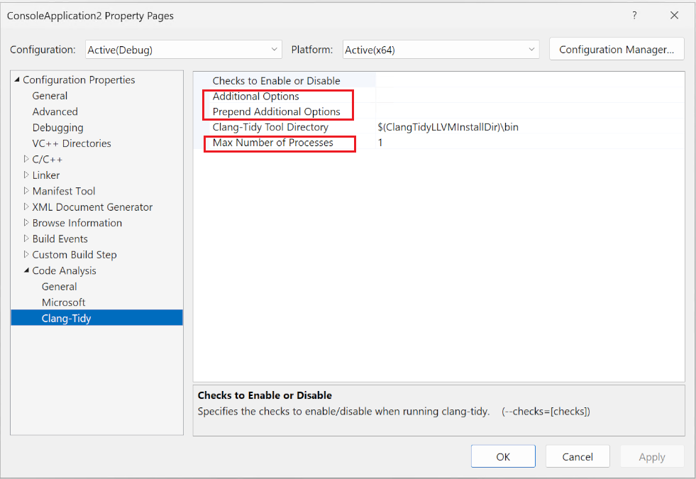
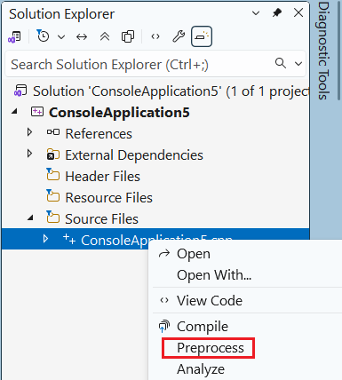

# What's new for MSVC Build Tools

Version 14.51 brings many updates and fixes to the Microsoft C++ compiler and other build tools.

- For more information about what's new in all of Visual Studio, see [Visual Studio 2026 release notes](/visualstudio/releases/2026/release-notes).

## What's new for MSVC Build Tools version 14.51

* Introduced in Visual Studio 2026 version 18.6 released May 2026.

Visual Studio 2026 version 18.6 ships with the v145 platform toolset for MSBuild C++ projects and Microsoft C++ (MSVC) Build Tools version 14.51. To access all the new language features, build with `/std:c++latest`. Or, if you want to be restricted to features up to C++23, use `/std:c++23preview`.

MSVC Build Tools version 14.51 preserves binary compatibility with code built with MSVC tools shipped in Visual Studio 2015 or later. For more information about binary compatibility, see [C++ binary compatibility between Visual Studio versions](/cpp/porting/binary-compat-2015-2017).

| For detailed information about | See |
|---|---|
| What's new for C++ developers | [MSVC Build Tools version 14.51 Release Candidate Now Available](https://devblogs.microsoft.com/cppblog/msvc-build-tools-version-14-51-release-candidate-now-available/) |
| Standard Library (STL) improvements | [STL Changelog MSVC Build Tools 14.51](https://github.com/microsoft/STL/wiki/Changelog#msvc-build-tools-1451) |
| C++ language conformance improvements | [C/C++ Conformance improvements, behavior changes, and bug fixes in Microsoft C++ (MSVC) Build Tools](msvc-conformance-improvements.md) |

Here's a quick highlight of some of the new features in MSVC Build Tools version 14.51:

### C++ language enhancements

- More C++23 and C++20 features and conformance issue fixes. For full C++23 details, see [C++23 Support in MSVC Build Tools 14.51](https://devblogs.microsoft.com/cppblog/c23-support-in-msvc-build-tools-14-51).
- Multiple fixes to `consteval` function handling, including support for constexpr `new`/`delete` in modules. The `/experimental:constevalVfuncVtable` behavior is now enabled by default.
- Added support for C language features: `_Atomic` qualifier and `__typeof__` for function types.
- Fixed incorrect diagnostics for C99 flexible array members.
- MSVC now generates IFC files according to [version 0.44](https://github.com/microsoft/ifc-spec/releases/tag/0.44) of the [IFC specification](https://github.com/microsoft/ifc-spec).
- Improved parser error recovery.

## C language enhancements

Added `_Atomic` qualifier support and added `__typeof__` support for function types.
Fixed [C4319](/cpp/error-messages/compiler-warnings/compiler-warning-level-1-c4319) not being emitted when compiling C code.

### Standard Library enhancements

- Added new C++23 headers: `<flat_map>` ([P0429R9](https://wg21.link/P0429R9)) and `<flat_set>` ([P1222R4](https://wg21.link/P1222R4)).
- **Massive `<regex>` overhaul:** Fixed long-standing correctness and performance problems. The implementation includes significant performance improvements.
- **ARM64 NEON vectorization:** First release shipping NEON-vectorized STL algorithms for ARM64/ARM64EC. Previously, only x64/x86 received SIMD optimizations with SSE4.2 and AVX2. Vectorized implementations are now available for algorithms including `swap_ranges()`, `rotate()`, `reverse()`, `min_element()`, `max_element()`, `find()`, `count()`, and more.
- Implemented 18 Library Working Group (LWG) issue resolutions, including fixes for duration conversion overflow, `construct_at` array support, and `optional` const overloads.
- Optimized integer-to-string conversions by printing digits in pairs. The Standard Template Library is now optimized for speed instead of size.
- Added type traits to detect references binding to temporaries ([P2255R2](https://wg21.link/P2255R2)).
- Added explicit lifetime management support ([P2590R2](https://wg21.link/P2590R2)).
- Enhanced debugger visualizations, including a `c_str()` intrinsic function for `basic_string` that enables conditional breakpoints.

### Build enhancements

- **Arm SVE support:** First Arm Scalable Vector Extension (SVE) support in MSVC, including frontend type support, intrinsic lowering, callee-saved register unwinding, and DIA SDK support.
- **Sample-based PGO:** Preview support for sample-based profile guided optimizations. For more information, see [Use Sample Profile Guided Optimization (SPGO) to improve C++ performance](../build/sample-profile-guided-optimization.md).
- The C++ backend optimizer improves code generation, including better inlining, loop optimizations, and pattern matching.
- **Experimental support for x64 Unwind Version 3 MASM directives**. For more information, see [Unwind Version 3 directives (experimental)](../assembler/masm/directives-reference.md#x64-unwind-version-3-experimental)
- **Intel APX preview:** Preview support for Intel Advanced Performance Extensions. For more information, see [/feature (x64)](../build/reference/feature-x64.md), [`[[msvc::enable(feature:APX)]]`](../cpp/attributes.md#msvcenablefeatureapx), and [`[[msvc::disable(feature:APX)]]`](../cpp/attributes.md#msvcdisablefeatureapx).
- Enabled debug info pruning to reduce PDB sizes.

### Deprecations

- The following experimental coroutine headers are now deprecated: `<experimental/coroutine>`, `<experimental/generator>`, and `<experimental/resumable>`. Transition to standard C++20 coroutines using the `<coroutine>` header.

### Removed features

The following long-deprecated non-Standard features have been removed:

- **TR1** including the `std::tr1` namespace, old `array::assign()`, and old `<random>` engines and distributions. Deprecated since VS 2017 15.5 (December 2017).
- **`_ALLOW_RTCc_IN_STL`** macro removed. The Standard Template Library doesn't support the `/RTCc` compiler option, but `/RTCs` and `/RTCu`/`/RTC1` remain supported.
- **`<hash_map>` and `<hash_set>`**. Deprecated since VS 2015 (July 2015).
- **`<experimental/filesystem>`**. Deprecated since VS 2019 16.3 (September 2019).
- **`stdext::checked_array_iterator` and `stdext::unchecked_array_iterator`**. Deprecated since VS 2022 17.8 (November 2023) for C++17 and later.
- **`basic_istream::ipfx()`/`isfx()` and `basic_ostream::opfx()`/`osfx()`**. Deprecated since VS 2022 17.9 (February 2024) for C++17 and later.
- **`locale::empty()`**. Deprecated since VS 2022 17.14 (May 2025).

## What's new for MSVC Build Tools version 14.50

* Introduced in Visual Studio 2026 version 18.0 released November 2025.

Visual Studio 2026 version 18.0 ships with the v145 platform toolset for MSBuild C++ projects and Microsoft C++ (MSVC) Build Tools version 14.50, which offers the best conformance, build performance, and runtime performance story yet. To access all the new language features, build with `/std:c++latest`. Or, if you want to be restricted to features up to C++23, use `/std:c++23preview`.

MSVC Build Tools version 14.50 preserves binary compatibility with code built with MSVC tools shipped in Visual Studio 2015 or later. For more information about binary compatibility, see [C++ binary compatibility between Visual Studio versions](/cpp/porting/binary-compat-2015-2017).

| For detailed information about | See |
|---|---|
| What's new for C++ developers | [What’s New for C++ Developers in Visual Studio 2026 version 18.0](https://devblogs.microsoft.com/cppblog/whats-new-for-cpp-developers-in-visual-studio-2026-version-18-0) |
| C++ Standard Library (STL) improvements | [STL Changelog MSVC Build Tools 14.50](https://github.com/microsoft/STL/wiki/Changelog#msvc-build-tools-1450) |
| C++ language updates | [C++ Language Updates in MSVC Build Tools v14.50](https://devblogs.microsoft.com/cppblog/c-language-updates-in-msvc-build-tools-v14-50/) |
| C++ language conformance improvements | [C/C++ Conformance improvements, behavior changes, and bug fixes in Microsoft C++ (MSVC) Build Tools](msvc-conformance-improvements.md) | 

Here's a quick highlight of some of the new features in MSVC Build Tools version 14.50 and Visual Studio 2026 version 18.0:

### C++ language enhancements

- C++20 is the default for new Console App, Windows Desktop Application, Dynamic-Link Library, and Static Library C++ projects. 
- C++23 preprocessing directive `#warning` allows you to generate a diagnostic message without stopping translation as `#error` does. For more information, see [`#warning` directive](/cpp/preprocessor/hash-warning-directive-c-cpp).
- Easily set debugger command-line arguments for any C++ project using the toolbar for `.vcxproj`, CMake, and Unreal Engine projects. This feature is no longer tied to the Game Development with C++ workload, and is available to all C++ developers without installing any other workloads or components. For more information, see [Pass command-line arguments](/visualstudio/debugger/getting-started-with-the-debugger-cpp?view=visualstudio&preserve-view=true).

### Standard Library enhancements

- Enhanced `<regex>` reliability and speed. [LWG-2503](https://cplusplus.github.io/LWG/issue2503) added a multiline option to `syntax_option_type`. This is a `regex` behavioral change. By default, `_REGEX_LEGACY_MULTILINE_MODE` is 0, which requests Standard behavior. Set `_REGEX_LEGACY_MULTILINE_MODE` to 1 to request legacy behavior. For more information, see [STL Changelog](https://github.com/microsoft/STL/wiki/Changelog#msvc-build-tools-1450).
- Added and improved vectorized implementations of many types and functions.

### GitHub Copilot enhancements

- Copilot Chat allows you to use natural language to get answers to questions (Ask mode) or even implement changes for you automatically (Agent Mode).
- Copilot Chat is smarter with improved context for everyday tasks. Expect better results when searching your codebase and referencing specific lines in your code.
- A **Copilot Actions** option was added to the right-click context menu in the Visual Studio editor. Use it to quickly bring a specific file or lines of code you select to the attention of Copilot Chat. You can then ask Copilot to explain what the code does, make optimizations, generate comments, generate unit tests, and more.
- Better AI code completions for C++. GitHub Copilot uses context from relevant files to improve inline autocomplete for C++. GitHub Copilot includes other relevant files as context, which reduces hallucinations while offering more relevant and accurate suggestions.
- For more information, see [New GitHub Copilot capabilities for C++ developers: Upgrade MSVC, improve build performance, and refactor C++ code](https://devblogs.microsoft.com/cppblog/new-github-copilot-capabilities-for-c-developers-upgrade-msvc-improve-build-performance-and-refactor-c-code/).

### Build enhancements

- Visual Studio 2026 now includes CMake 4.1.1 by default. CMake also includes a Visual Studio 2026 generator and supports modern SLNX projects, so you can build Visual Studio C++ projects directly from CMake.
- Includes the latest version of the IncrediBuild engine and an updated extension that works with Visual Studio 2026 version 18.0. 
- Compiler backend runtime performance improvements. Compared to Visual Studio version 17.14, there's up to a 6% improvement on Unreal Engine's City Sample RenderThread and up to +3% improvements on Unreal Engine's City Sample GameThread benchmark. For more information, see [Why you should upgrade your C++ build tools](https://devblogs.microsoft.com/cppblog/upgrading-c-projects-to-visual-studio-2026/#why-you-should-upgrade-your-c++-build-tools).
- The Visual Studio setup assistant can help you retarget your projects to build with the latest MSVC Build Tools. For more information, see [Retarget your projects with the setup assistant](https://devblogs.microsoft.com/cppblog/upgrading-c-projects-to-visual-studio-2026/#retarget-your-projects-with-the-setup-assistant).

### Code analysis enhancements

- Clang-Tidy code analysis improvements provide enhanced configuration options for faster builds and custom workflows:
    - Code analysis has new configuration options. You can now allocate more processors to run code analysis as part of your build, speeding up your development workflow.
    - You can add custom arguments to the command line used to invoke `clang-tidy`, giving you complete control over your analysis setup.
    - Access the new options from **Project Properties** > **Code Analysis** > **Clang-Tidy**:

- AddressSanitizer support for ARM64 Builds (Preview): For some time, the MSVC Build Tools supported building projects that target x64 and x86 with [AddressSanitizer](/cpp/sanitizers/asan), which allows you to identify hard-to-find memory safety issues with zero false positives at runtime and increase memory safety. Now you can use AddressSanitizer to target ARM64. This feature is in preview.

### Productivity enhancements

- Generate preprocessed output for a C++ file. In Visual Studio, right-click a C++ file to instantly generate its preprocessed output, making it easy to debug macros and includes, and see errors immediately:  
- The Visual Studio debugger now shows the return values of functions inline. This provides real-time visibility into function behavior without stepping into code or setting up watches, making it faster to catch logic issues or unexpected results: 

### Other changes

- In the Visual Studio installer, the *C++ Linux* workload is renamed *Linux, Mac, and embedded development with C++*.

### Deprecations

- The minimum supported target operating systems for the MSVC Build Tools version 14.50 are Windows 10 or Windows Server 2016. 
- MSVC Build Tools version 14.50 no longer targets:
    
    - Windows 7 / Windows Server 2008 R2
    - Windows 8 / Windows Server 2012
    - Windows 8.1 / Windows Server 2012 R2
    
    These changes allow for better performance, enhanced security, and alignment with the most recent Windows platform capabilities.

The MSVC compiler switch [`/await`](/cpp/build/reference/await-enable-coroutine-support) is deprecated and will be removed in a future release. This switch enabled an early draft implementation of C++ coroutines using the `<experimental/coroutine>` header. Developers should transition to standard C++ coroutines by using the `<coroutine>` header available in C++20 and later. For C++14/17 projects, use `/await:strict` (which isn't being deprecated) to access the standard `<coroutine>` header without enabling other C++20 features.

The Mobile development with C++ workload for iOS and Android, as well as the Embedded and IoT tools (RTOS Viewer, Serial Monitor, Peripheral Viewer, and ST Project Import), are no longer supported and will be removed in a future update. The Android NDKs included in the Mobile development with C++ workload remain supported. This impacts tooling support for iOS and Android development, including new projects, building, and debugging.

### Removed features

- C++AMP
- ARM32 toolchain: if you still need to build for ARM32, use an older version of the MSVC Build Tools. For more information, see [Side-by-side Minor Version MSVC Toolsets in Visual Studio 2019](https://devblogs.microsoft.com/cppblog/side-by-side-minor-version-msvc-toolsets-in-visual-studio-2019/).
- `/DEBUG:FASTLINK` linker switch. Use [`/DEBUG:FULL`](/cpp/build/reference/debug-generate-debug-info) for improved debugging support.

## Feedback and suggestions

We'd love to hear from you! You can [Report a Problem or Suggest a Feature](/visualstudio/ide/how-to-report-a-problem-with-visual-studio) by using the Send Feedback icon in the upper right-hand corner of either the installer or the Visual Studio IDE, or from **Help** > **Send Feedback**. You can track your issues by using [Visual Studio Developer Community](https://developercommunity.visualstudio.com/), where you add comments or find solutions. You can also get free installation help through our [Live Chat support](https://visualstudio.microsoft.com/vs/support/#talktous).

## Blogs

Stay up to date on all new releases by taking advantage of the insights and recommendations available in at [Microsoft Developer Blogs](https://devblogs.microsoft.com/). The blogs include deep dive posts on a broad range of features.

The [C++ Team Blog](https://devblogs.microsoft.com/cppblog) and the [Visual Studio Blog](https://devblogs.microsoft.com/visualstudio) are of particular interest.
