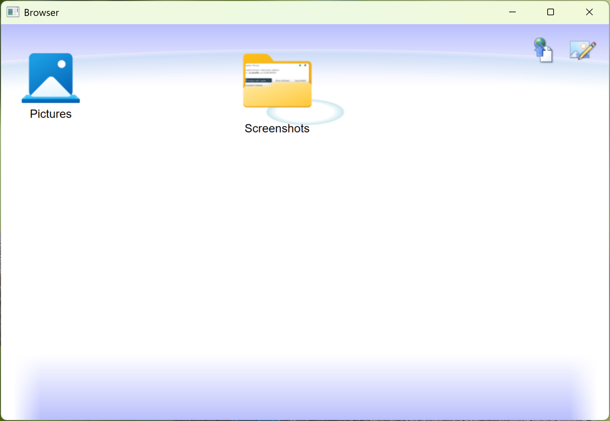
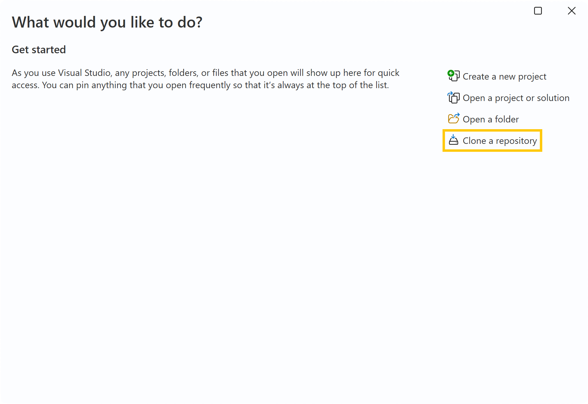
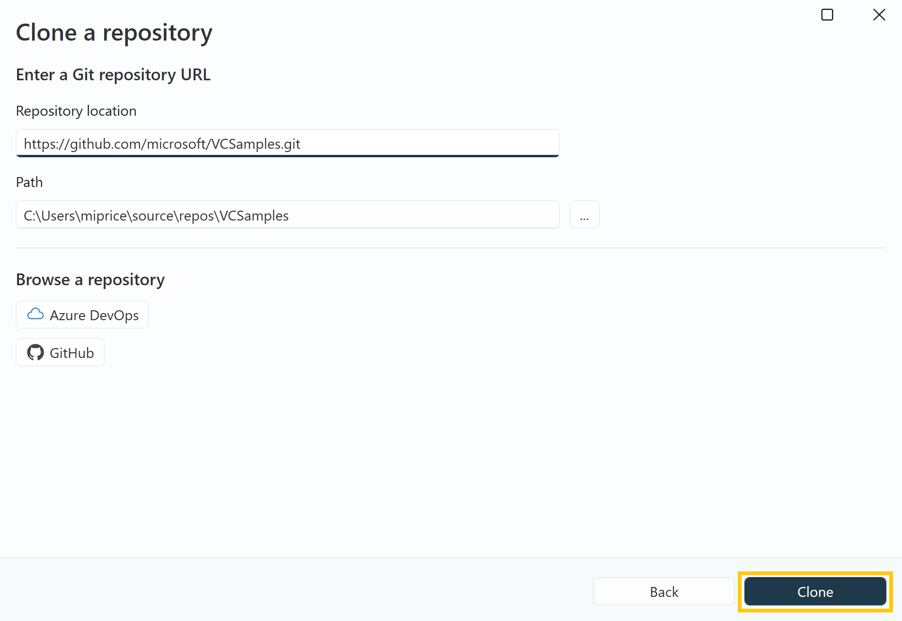
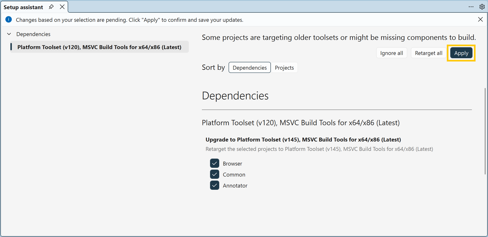
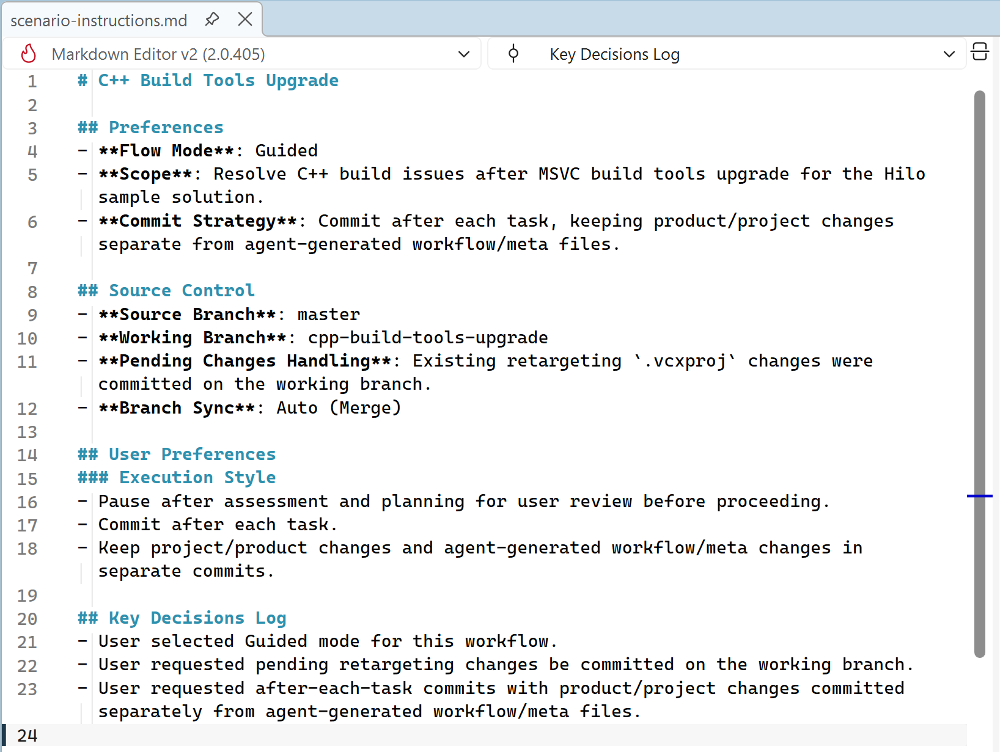
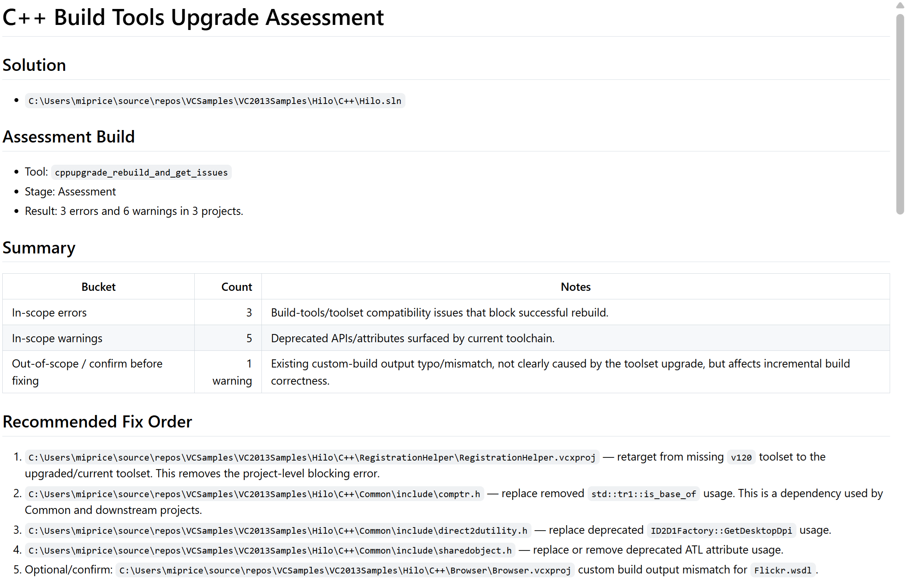
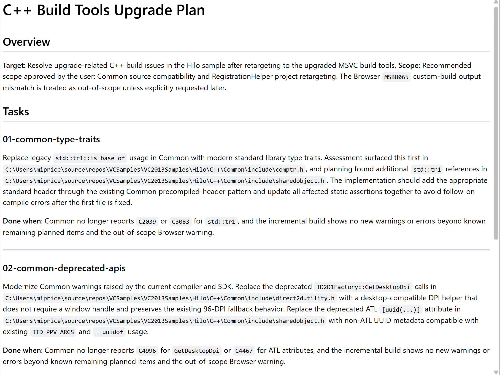
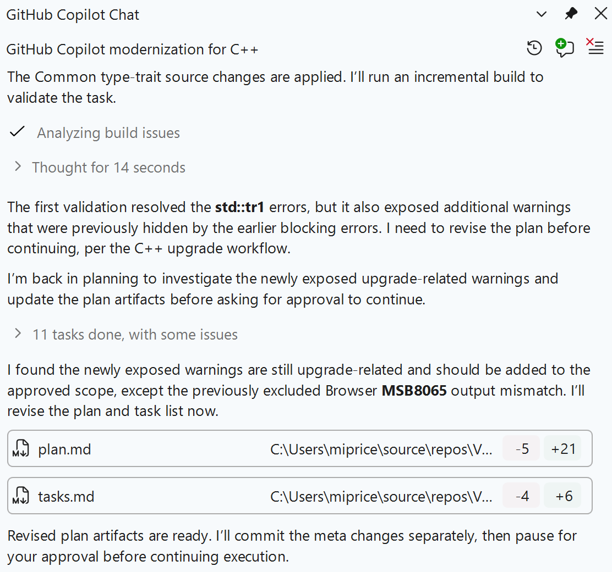
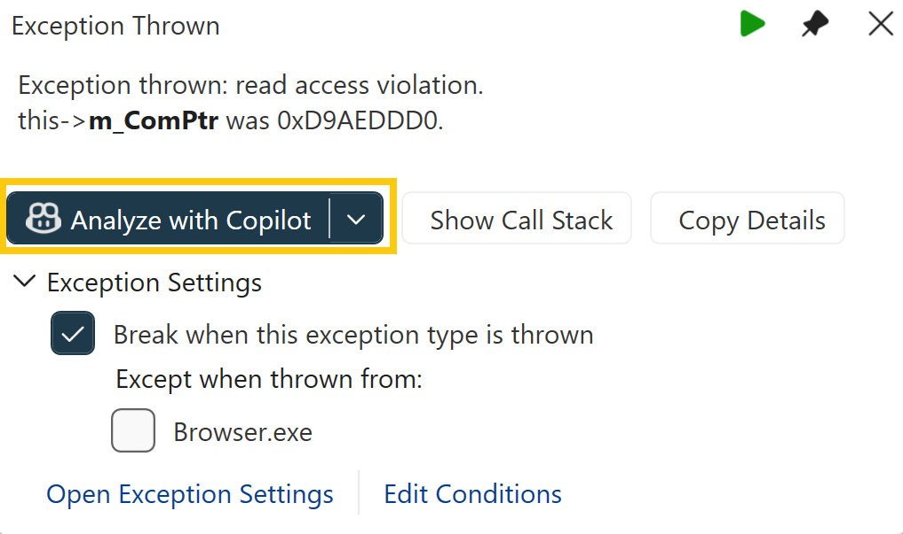

# Walkthrough: Upgrading Microsoft C++ (MSVC) Build Tools for the Hilo sample project

This walkthrough shows how to use GitHub Copilot to modernize the Hilo sample project by upgrading it to the latest MSVC Build Tools. You'll use the modernization agent to identify and resolve issues, then use the Debugger agent to fix a runtime problem.

## About Hilo

Hilo was a sample project developed by Microsoft in 2012 to demonstrate creating applications targeting Windows 8 using "modern" C++, XAML, and the Windows Runtime. The Hilo application is a photo browsing application that also includes annotation and sharing features. We stopped updating the sample in 2015 and archived the source code for this sample and other previously shipped C++ samples in the [VCSamples GitHub repository](https://github.com/microsoft/VCSamples).

## Modernization challenges

There are several issues that the agent discovers and resolves after upgrading Hilo to use a newer MSVC Build Tools version. Here are the issues when building with Microsoft C++ (MSVC) Build Tools version 14.51.

- The `std::tr1::is_base_of` class template is used in several places, but is no longer available in MSVC's C++ standard library since `is_base_of` class template was promoted to be a part of the full standard. This is a blocking error.
- The `ID2D1Factory::GetDesktopDpi` function is deprecated.
- The`[uuid(_string_)]`syntax for ATL attributes on types is deprecated.
- There's a project that the Setup Assistant fails to upgrade. If you don't have the v120 MSVC Build Tools installed (which is likely), then this is a blocking error.
- There's a pointer truncation in window handling code that causes a runtime memory access exception.

There are a few other warnings that may not be strictly related to the upgrade, but that the agent can optionally fix. These warnings include:

- Narrowing warnings around multi-byte character strings and wide character strings.
- A typo in the name of an output file in a custom build step.

## Setup

### Install development tools

In order to complete this walkthrough, you need to follow the [installation directions for the GitHub Copilot modernization agent for C++](./install.md).

### Clone the repository

Open Visual Studio and from the Start Window select **Clone a repository**. If the Start Window didn't appear, you can open it via **File** > **Start Window**.

For repository location, enter: **https://github.com/microsoft/VCSamples.git**. Choose an appropriate path on your system to clone the repository to and click the **Clone** button

## Start the upgrade

### Load Hilo.sln in Visual Studio

After you clone the repository, load the solution file at the `<repo-root>/VC2013Samples/Hilo/C++/Hilo.sln`. We're using the version that shipped with Visual Studio 2013 for this walkthrough.

### Use the Setup Assistant to upgrade project files

If you don't have the v120 tools installed, Visual Studio should launch the Setup assistant window to guide you through dealing with the missing components. When you see this window, you should choose to **Retarget all** and click **Apply**. If the window doesn't appear, you can open it from the file menu by clicking **Project** > **Retarget solution**.

### Launch the Copilot modernization agent

After the Setup assistant has retargets the project, you should receive an infobar message with a link to start the modernization agent. Clicking the `Run GitHub Copilot modernization for C++` link starts the upgrade process.

If the infobar doesn't appear, you can launch the agent by right clicking the solution in the **Solution Explorer** and clicking **Modernize**. If you go that route, you can start the upgrade by sending the prompt `I just updated MSVC Build Tools. Resolve any upgrade issues.` to Copilot Chat.

## Working with the agent

### How to interact with the agent to get the best results

The .NET modernization agent shares the same underlying interaction model as the C++ agent. The [Work with the modernization agent](/dotnet/core/porting/github-copilot-app-modernization/working-with-agent) documentation for .NET covers the general patterns in detail. Keep in mind that the examples and scenarios in that article are .NET-specific and don't apply directly to C++.

For C++ upgrades, a few more tips can help the agent perform well:

- **Be specific about scope.** Rather than asking the agent to upgrade everything at once, tell it which projects, libraries, or diagnostics to focus on. For example: _"Fix the C4996 deprecation warnings in the `NetworkClient` project."_
- **Describe the diagnostics you expect the agent to fix.** If you know the specific warning or error codes introduced by the toolset upgrade, tell the agent upfront. These additional instructions help the agent prioritize and avoids time being spent on unrelated issues.
- **Make sure C/C++ code editing tools are enabled.** Verify the required tools are available in your setup before starting. For details, see [C/C++ code editing tools](/visualstudio/ide/copilot-agent-mode#c-code-editing-tools).
- **Encode coding conventions using custom instructions.** Encode guidelines such as naming conventions, preferred APIs, or patterns to avoid, in [custom instructions](https://docs.github.com/copilot/customizing-copilot/adding-custom-instructions-for-github-copilot). The agent reads and follows these instructions throughout the upgrade. Useful C++ examples include conventions like _"Prefer `auto` where the type is obvious"_ and _"Follow Rule of Zero (or Rule of Three/Five where resource ownership requires it)."_

## Expected behaviors

> [!NOTE]
> Due to the nature of LLM-based AI agents, the steps that the agent takes and the output it produces may differ from what is shown here.

### Pre-assessment

The agent first determines the environment that it's running in, such as your source control system, and to understand its goal. In our case, it detects that you're trying to upgrade your project to use the latest MSVC and initializes the appropriate scenario. It creates a `scenario.md` file and a `scenario-instructions.md` file to contain metadata about the scenario.

These files contain information such as whether the agent should operate in **Automatic** or **Guided** mode, what the strategy for making commits is, and other information that affects _how_ the agent should proceed. If you express any preferences later on during the operation of the agent, the agent may add those preferences to the `scenario-instructions.md` file.

### Assessment

After initialization, the agent does an assessment of the project by doing a clean rebuild of the project and inspecting the build output for errors and warnings. Using that information, and context the agent collects from the repository, it produces an `assessment.md` file that describes the issues that it found and whether or not it considers them to be in-scope or out-of-scope for the upgrade task.

If the agent is operating in **Guided** mode, the agent stops here and requests your review of the assessment. Make any desired changes by prompting the agent or by editing the Markdown file directly, and then to continue on to the _Planning_ stage. If the agent is operating in **Automatic** mode, the agent continues on to the next stage automatically. If you want to change something, you need to stop the agent by pressing the cancel button, make the changes, and resume the agent by typing the prompt _"Resume"_ in the Copilot chat window.

The assessment identifies several of the issues mentioned earlier in the walkthrough. Some issues don't appear until later since they're hidden by existing errors. Don't worry, they're discovered later on. If you'd like for the agent to pause to get your approval for any late-discovered issues, you can specify those instructions in your `scenario-instructions.md` file.

### Planning

Once the agent starts the Planning stage, it does a deeper analysis of the in-scope issues and proposes possible solutions in a generated `plan.md` file. It also generates a `tasks.md` file that provides more structured steps and instructions for executing the plan.

Like with Assessment, what the agent does depends on if it's operating in **Guided** or **Automatic** mode. If running in **Guided** mode, the agent gives you the opportunity to direct it to fix issues in certain ways or even to ask it to come up with alternative options with more detailed descriptions of trade-offs. You can also specify other constraints such as coding conventions or special validation steps for some issues.

### Execution

After you approve the plan (or once Planning is completed in **Automatic** mode), the agent moves to the Execution stage. Here, it begins handling the tasks that it has in front of it, adapting to new information discovered while executing. With careful observation, you'll see that the agent discovers the previously hidden issues and adjusts its plan accordingly.

The end result of the Execution stage is a series of commits to your repository that resolve the in-scope issues, and a project that can now build successfully. However, a clean compilation is just one of the steps towards upgrading your project. It also needs to run correctly.

## Use the Debugger agent to resolve runtime issues

### Launch the Browser

In the **Solution Explorer**, right-click the **Browser** project and click **Set as startup project**. Then launch a debugger session of the Hilo Browser by pressing **F5** or selecting **Debug** > **Start Debugging** from the file menu.

The debugging session should almost immediately break on an unhandled memory access exception.

:::image type="content" source="../media/walkthrough-hilo-exception.png" alt-text="Screenshot of the memory read access exception when first launching the Hilo browser." lightbox="../media/walkthrough-hilo-exception.png":::

### Examine memory read access exception

We're going to use the Debugger agent to analyze this exception and implement a fix. Click on the **Analyze with Copilot** button on the exception information window to launch the Debugger agent.

The Debugger agent uses debug and program state information to determine the root cause of runtime errors and then analyzes the source code to implement a solution. In this case, the agent identifies that the invalid memory access is due to an improper cast operation that truncated a 64-bit pointer to only 32 bits. That pointer is now invalid and points at an invalid memory location, which causes the exception. It proposes a different method of getting the correct type and avoids the truncation.

### Apply changes

Accept the changes it suggests, stop the debugging session by pressing *Shift + F5**, and then start a new session by pressing **F5**. The project is recompiled with the change and Visual Studio launches the updated application. You should now see the Hilo Browser window appear.

If you spend time exploring the application, you may discover more runtime issues. We leave any other issues as exercises for the reader. Just remember to use your new agentic tools to get to your end goal faster.

## Summary

This walkthrough demonstrated how GitHub Copilot agents can significantly accelerate the modernization of older C++ projects. The modernization agent and debugger agent can work together to streamline the upgrade process from initial assessment through runtime validation.

### Key benefits

- **Automated problem detection**: The agents systematically identify breaking changes, deprecations, and compatibility issues that arise from upgrades.
- **Intelligent solutions**: Rather than requiring manual fixes, the agents analyze code context and propose appropriate solutions tailored to your codebase.
- **Efficiency**: What might take days or weeks of manual work is completed in hours, with the agent handling both build errors and runtime issues.
- **Guided or automatic modes**: Choose between hands-on guidance or fully automated execution based on your comfort level and project requirements.
- **Learning and adaptation**: The agents discover hidden issues as they progress and adjust their approach accordingly, ensuring comprehensive coverage.

## Related content

- [GitHub Copilot modernization for C++ overview](./overview.md)
- [Install GitHub Copilot modernization for C++](./install.md)
- [Troubleshoot GitHub Copilot modernization for C++](./troubleshooting.md)
- [FAQ](./faq.md)
