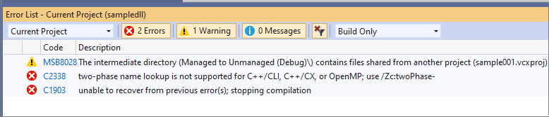
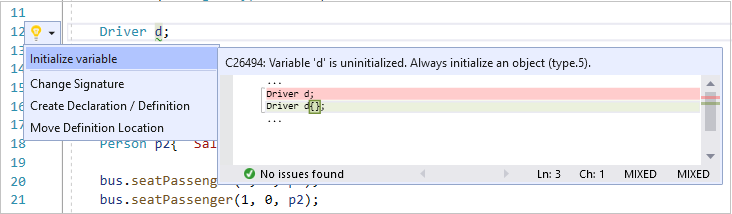
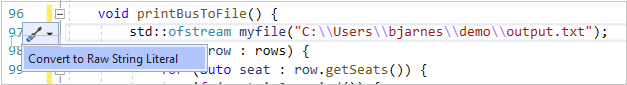

# Visual Studio IDE tools for upgrading C++ code

Visual Studio helps you upgrade legacy C++ code with compiler options, code analysis warnings, and editor features such as Quick Fixes, Quick Info, and the enhanced scroll bar. The term "legacy code" refers to any of these categories:

- Code that was formerly allowed by the Microsoft C++ (MSVC) compiler but never conformed to the C++ standard.

   To upgrade older non-conforming MSVC code, turn on the [`/permissive-`](../build/reference/permissive-standards-conformance.md) compiler option. All instances of non-conforming usages are underlined with red squiggles in the code editor. The error messages in the **Error List** window include a recommendation for how to fix the error. Click on the error code to go to its help page in the documentation. If fixing all the errors at once is impractical, you can upgrade non-conforming code in stages by turning on the **`/permissive-`** option, fixing some errors, then turning the option off again. The code will compile with the new improvements, and you can go back and fix the remaining issues at a later time. See the [`/permissive-`](../build/reference/permissive-standards-conformance.md) page for examples of non-conforming MSVC code.

- Code that was permitted in an earlier version of the C++ standard but has been deprecated or removed in a later version.

   To upgrade to a newer language standard, set the [C++ Language Standard](../build/reference/std-specify-language-standard-version.md) option to the desired standard and fix any compile errors that are raised. In general, we recommend setting the language standard to [`/std:c++17`](../build/reference/std-specify-language-standard-version.md) or [`/std:c++20`](../build/reference/std-specify-language-standard-version.md). The errors raised when upgrading to a newer standard are not related to the errors raised when using the **`/permissive-`** option.

- Code that conforms to all versions of the standard but is no longer considered best practice in modern C++.

   To identify code where changes are recommended, run [Code analysis](../code-quality/code-analysis-for-c-cpp-overview.md).

## Open and convert a legacy project

If your legacy projects are based on an older version of Visual Studio, you can still load them in a newer version and work on it there while maintaining backwards compatibility with the older version. When you are ready to permanently move to the new version of Visual Studio, you can retarget your projects. This will enable you to use the latest build tools and project features in the IDE, but you will no longer be able to load the retargeted projects in the older version of Visual Studio.

To retarget projects to the Visual Studio 2026 format, you can use the setup assistant which appears the first time you open a solution containing older projects. You can also access it by right-clicking the solution in **Solution Explorer** and selecting **Retarget solution**.

The setup assistant then gives you the choice to either stay on the older version and install any missing build tools or Windows SDKs necessary to build, or retarget the projects to upgrade them. You can make retargeting selections for each project in the solution or select **Retarget all** > **Apply** to upgrade.

For more information, see [Upgrade C++ projects from earlier versions of Visual Studio](upgrading-projects-from-earlier-versions-of-visual-cpp.md).

## Error List

After you set the desired C++ Language Standard and any other compiler options (**Project** > **Properties** > **General**), press **Ctrl+Shift+B** to compile your project. You can expect to see some errors and warnings in the form of red squiggles in various places in the code. The errors also appear in the **Error List**. For more information about an specific error, click on the error code to go to the help page in the documentation. Error codes that begin with a "C" are compiler errors. Codes that begin with "MSB" are MSBuild errors that indicate a problem with the project configuration.

## Document Health Indicator

The document health indicator at the bottom of the editor shows the number of errors and warnings in the current document, and enables you to navigate directly from one warning/error to the next.

In many cases, you can find more information about a specific error in the documentation on the Visual Studio change history and conformance improvements.

- [C++ conformance improvements](../overview/cpp-conformance-improvements.md)
- [Visual C++ Change History 2003 - 2015](visual-cpp-change-history-2003-2015.md)
- [Overview of potential upgrade issues](overview-of-potential-upgrade-issues-visual-cpp.md)

## Use code analysis to modernize your code

When upgrading, we recommend that you run code analysis on your project so that the code, conforms at a minimum to the Microsoft Native Recommended Rules. These rules are a combination of rules defined by Microsoft and a subset of the [C++ Core Guidelines](https://isocpp.github.io/CppCoreGuidelines/CppCoreGuidelines). By conforming to these you will greatly reduce or eliminate common sources of bugs, and at the same time make your code more readable and therefore easier to maintain. Code Analysis using the Microsoft Native Recommended Rules is enabled by default. You can enable additional rules under **Project** > **Properties** > **Code Analysis**. Code that violates one of the rules is flagged as a warning and is underlined with a green squiggle in the code editor. Hover over the squiggle to see a **QuickInfo** tooltip that describes the issue.

Click on the filter icon in the **Code** column to choose which warnings are displayed.

Code analysis errors and warnings also appear in the **Error List** just like compiler errors.

You can change which rules are active, and create custom rulesets. For more information about using Code Analysis, see [Code analysis for C/C++ overview](../code-quality/code-analysis-for-c-cpp-overview.md).

## Use Quick Actions to modernize code

The code editor provides Quick Actions for some common recommendations. When the light bulb icon is displayed, you can click on it to see the available Quick Actions.

### Convert macros to constexpr functions

The following image shows the use of macro called `AVERAGE`, which has the default semantic colorization. The image also shows the QuickInfo tooltip that is displayed when the mouse cursor hovers over it:

Because the use of macros is discouraged in modern C++, Visual Studio makes it easy to convert macros to **`constexpr`** functions:

1. Right-click on `AVERAGE` and choose **Go to Definition**.
2. Click on the screwdriver icon and choose **Convert macro to constexpr**

   

The macro is converted as shown below:

And the call to `AVERAGE` is now colorized as a function call, and the Quick Info tooltip shows the deduced type of the function:

### Initialize variables

Uninitialized variables can hold random values that lead to serious bugs. Code analysis flags these instances, and the editor provides a Quick Action:

### Convert to raw string literal

Raw string literals are less error-prone and more convenient to type than strings with embedded escape characters. Right-click on a string and choose **Quick Actions** to convert it to a raw string literal.

The string is converted to: `R"(C:\Users\bjarnes\demo\output.txt)"`.
