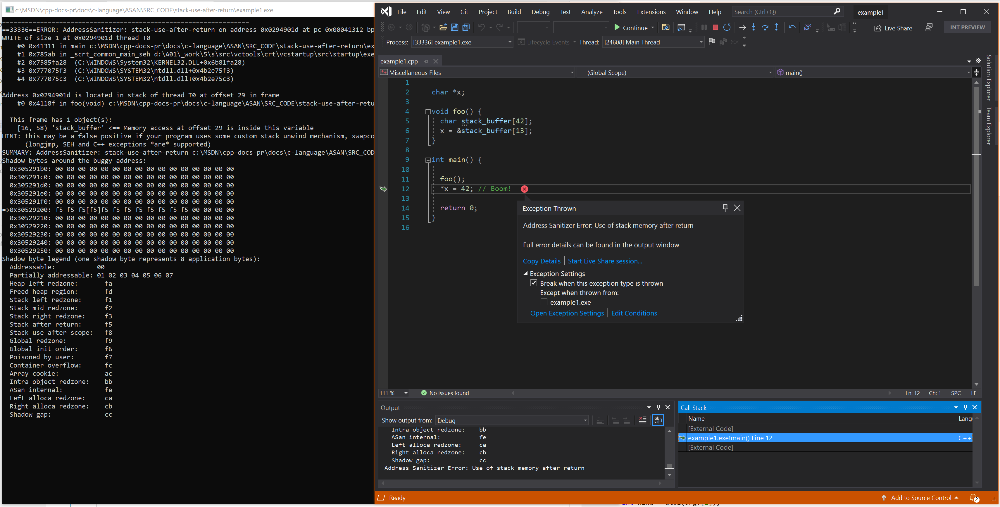

# Error: `stack-use-after-return`

> Address Sanitizer Error: Use of stack memory after return

This functionality requires code generation that's activated by an extra compiler option, [`/fsanitize-address-use-after-return`](../build/reference/fsanitize.md), and by setting the environment variable `ASAN_OPTIONS=detect_stack_use_after_return=1`.

Consider the [Clang summary](https://github.com/google/sanitizers/wiki/AddressSanitizerUseAfterReturn) of the algorithm that supports use after return, and the larger performance costs.

> [!IMPORTANT]
> If you create an object file using the extra compiler option **`/fsanitize-address-use-after-return`**, the code generated by the compiler makes a runtime decision about how to allocate a stack frame. If the environment variable `ASAN_OPTIONS` isn't set to `detect_stack_use_after_return`, the code is still slower than using [`/fsanitize=address`](../build/reference/fsanitize.md) by itself. It's slower because there's still additional overhead from some stack frames that allocate space for parts of a frame by using `alloca()`. It's best to delete these object files when you're finished processing use-after-return errors.

Examples sourced from [LLVM compiler-rt test suite](https://github.com/llvm/llvm-project/tree/main/compiler-rt/test/asan/TestCases).

## Example - Simple C

```cpp
// example1.cpp
// stack-use-after-return error
char* x;

void foo() {
    char stack_buffer[42];
    x = &stack_buffer[13];
}

int main() {

    foo();
    *x = 42; // Boom!

    return 0;
}
```

To build and test this example, run these commands in a Visual Studio 2019 version 16.9 or later [developer command prompt](../build/building-on-the-command-line.md#developer_command_prompt_shortcuts):

```cmd
cl example1.cpp /fsanitize=address /fsanitize-address-use-after-return /Zi
set ASAN_OPTIONS=detect_stack_use_after_return=1
devenv /debugexe example1.exe
```

### Resulting error - Simple C



## Example - C++ and templates

```cpp
// example2.cpp
// stack-use-after-return error
#include <stdlib.h>

enum ReadOrWrite { Read = 0, Write = 1 };

struct S32 {
    char x[32];
};

template<class T>
T* LeakStack() {
    T t[100];
    static volatile T* x;
    x = &t[0];
    return (T*)x;
}

template<class T>
void StackUseAfterReturn(int Idx, ReadOrWrite w) {
    static T sink;
    T* t = LeakStack<T>();
    if (w)
        t[100 + Idx] = T();
    else
        sink = t[100 + Idx];
}

int main(int argc, char* argv[]) {

    if (argc != 2) return 1;
    int kind = atoi(argv[1]);

    switch (kind) {
    case 1: StackUseAfterReturn<char>(0, Read); break;
    case 2: StackUseAfterReturn<S32>(0, Write); break;
    }
    return 0;
}
```

To build and test this example, run these commands in a Visual Studio 2019 version 16.9 or later [developer command prompt](../build/building-on-the-command-line.md#developer_command_prompt_shortcuts):

```cmd
cl example2.cpp /fsanitize=address /fsanitize-address-use-after-return /Zi
set ASAN_OPTIONS=detect_stack_use_after_return=1
devenv /debugexe example2.exe 1
```

### Resulting error - C++ and templates


## See also

[AddressSanitizer overview](./asan.md)\
[AddressSanitizer known issues](./asan-known-issues.md)\
[AddressSanitizer build and language reference](./asan-building.md)\
[AddressSanitizer runtime reference](./asan-runtime.md)\
[AddressSanitizer shadow bytes](./asan-shadow-bytes.md)\
[AddressSanitizer cloud or distributed testing](./asan-offline-crash-dumps.md)\
[AddressSanitizer debugger integration](./asan-debugger-integration.md)\
[AddressSanitizer error examples](./asan-error-examples.md)
