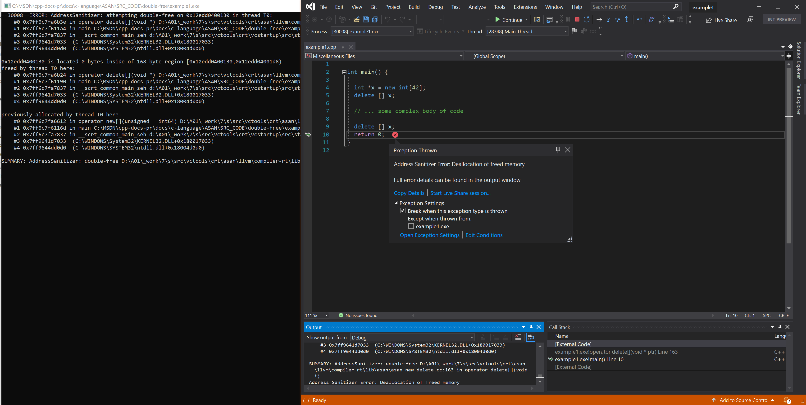

# Double free

In `C`, you can call `free()` erroneously. In `C++`, you can call `delete` more than once. In the following examples, we show errors with `delete`, `free()` and `HeapCreate()`. Sourced from [LLVM compiler-rt test suite](https://github.com/llvm/llvm-project/tree/main/compiler-rt/test/asan/TestCases).

## Example C++ - double operator delete

```cpp

int main() {

  int *x = new int[42];
  delete [] x;

  // ... some complex body of code

  delete [] x;
  return 0;
}

```

From a **Developer Command Prompt**:
```
 cl example1.cpp /fsanitize=address /Zi
 devenv /debugexe example1.exe
```

## Resulting error - double operator delete



## Example 'C' - double fre()

```cpp

#include <stdlib.h>
#include <string.h>

int main(int argc, char **argv) {

  char *x = (char*)malloc(10 * sizeof(char));
  memset(x, 0, 10);
  int res = x[argc];
  free(x);

  // ... some complex body of code

  free(x + argc - 1);  // Boom!
  return res;
}

```

From a **Developer Command Prompt**:
```
 cl example2.cpp /fsanitize=address /Zi
 devenv /debugexe example2.exe
```

## Resulting error - double free()


## Example - Windows HeapCreate() double free

```cpp
#include <Windows.h>
#include <stdio.h>


int main() {
    void* newHeap = HeapCreate(0, 0, 0);
    void* newAlloc = HeapAlloc(newHeap, 0, 100);

    HeapFree(newHeap, 0, newAlloc);
    HeapFree(newHeap, 0, newAlloc);
    printf("failure\n");
    return 1;
}
```

From a **Developer Command Prompt**:
```
 cl example3.cpp /fsanitize=address /Zi
 devenv /debugexe example3.exe
```

## Resulting error - Windows HeapCreate() double free


