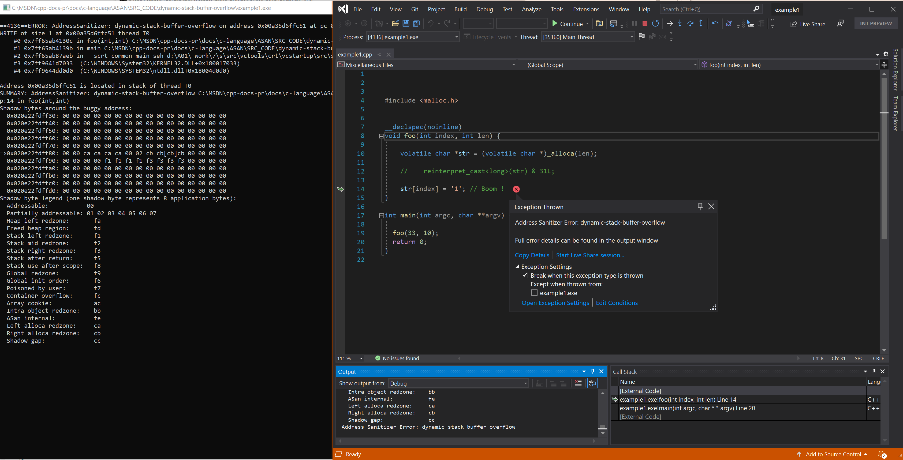
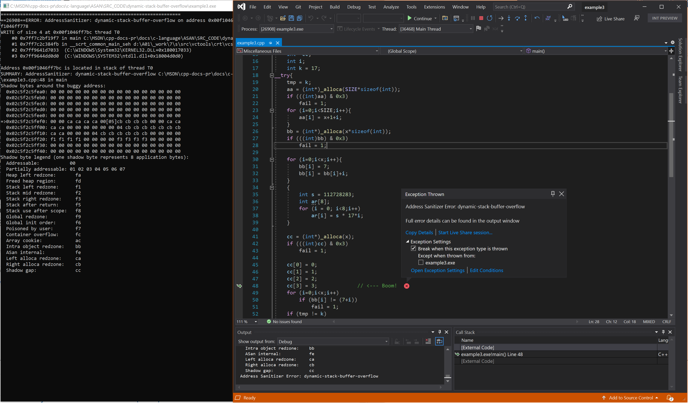

# `alloca` - dynamic-stack-overflow

This example shows the error that results from a buffer access outside the bounds of a stack-allocated object. Example sourced from [LLVM compiler-rt test suite](https://github.com/llvm/llvm-project/tree/main/compiler-rt/test/asan/TestCases).

## Example - `alloca` overflow (right)

```cpp
// example1.cpp
#include <malloc.h>

__declspec(noinline)
void foo(int index, int len) {

    volatile char *str = (volatile char *)_alloca(len);

    //    reinterpret_cast<long>(str) & 31L;

    str[index] = '1'; // Boom !
}

int main(int argc, char **argv) {

    foo(33, 10);
    return 0;
}
```

To build and test this example, run these commands in a [developer command prompt](../build/building-on-the-command-line.md#developer_command_prompt_shortcuts):

```cmd
cl example1.cpp /fsanitize=address /Zi
devenv /debugexe example1.exe
```

### Resulting error



## Example - `alloca` overflow (left)

```cpp
// example2.cpp
#include <malloc.h>

__declspec(noinline)
void foo(int index, int len) {

    volatile char *str = (volatile char *)_alloca(len);

    str[index] = '1';  // Boom!
}

int main(int argc, char **argv) {
    foo(-1, 10);
    return 0;
}
```

To build and test this example, run these commands in a [developer command prompt](../build/building-on-the-command-line.md#developer_command_prompt_shortcuts):

```cmd
cl example2.cpp /fsanitize=address /Zi
devenv /debugexe example2.exe
```

### Resulting error - `alloca` overflow (left)


## Example - several calls to `alloca`

```cpp
// example3.cpp
#include <stdio.h>
#include <stdlib.h>
#include <malloc.h>

#define SIZE 7
extern void nothing();
int x=13,*aa,*bb,y=0;
int fail = 0;
int tmp;

int main()
{
    int* cc;
    int i;
    int k = 17;
    __try {
        tmp = k;
        aa = (int*)_alloca(SIZE * sizeof(int));
        if (((int)aa) & 0x3)
            fail = 1;
        for (i = 0; i < SIZE; i++) {
            aa[i] = x + 1 + i;
        }
        bb = (int*)_alloca(x * sizeof(int));
        if (((int)bb) & 0x3)
            fail = 1;

        for (i = 0; i < x; i++) {
            bb[i] = 7;
            bb[i] = bb[i] + i;
        }
        {
            int s = 112728283;
            int ar[8];
            for (i = 0; i < 8; i++)
                ar[i] = s * 17 * i;
        }

        cc = (int*)_alloca(x);
        if (((int)cc) & 0x3)
            fail = 1;

        cc[0] = 0;
        cc[1] = 1;
        cc[2] = 2;
        cc[3] = 3;             // <--- Boom!
        for (i = 0; i < x; i++)
            if (bb[i] != (7 + i))
                fail = 1;
        if (tmp != k)
            fail = 1;
        if (fail) {
            printf("fail\n");
            exit(7);
        }
        printf("%d\n", (*cc) / y);
        printf("fail\n");
        exit(7);
    }
    __except (1)
    {
        for (i = 0; i < SIZE; i++)
            if (aa[i] != (x + i + 1))
                fail = 1;
        if (fail) {
            printf("fail\n");
            exit(7);
        }
        printf("pass\n");
        exit(0);
    }
}
```

To build and test this example, run these commands in a [developer command prompt](../build/building-on-the-command-line.md#developer_command_prompt_shortcuts):

```cmd
cl example3.cpp /fsanitize=address /Zi
devenv /debugexe example3.exe
```

### Resulting error - several calls to alloca


